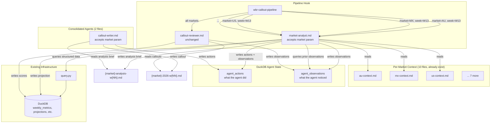
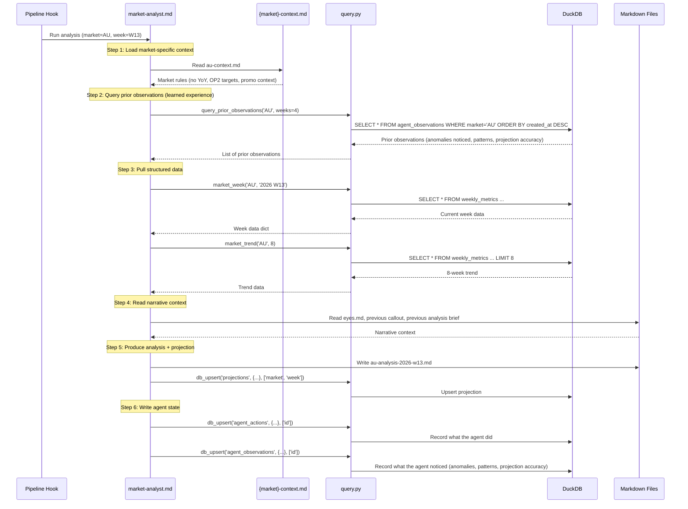
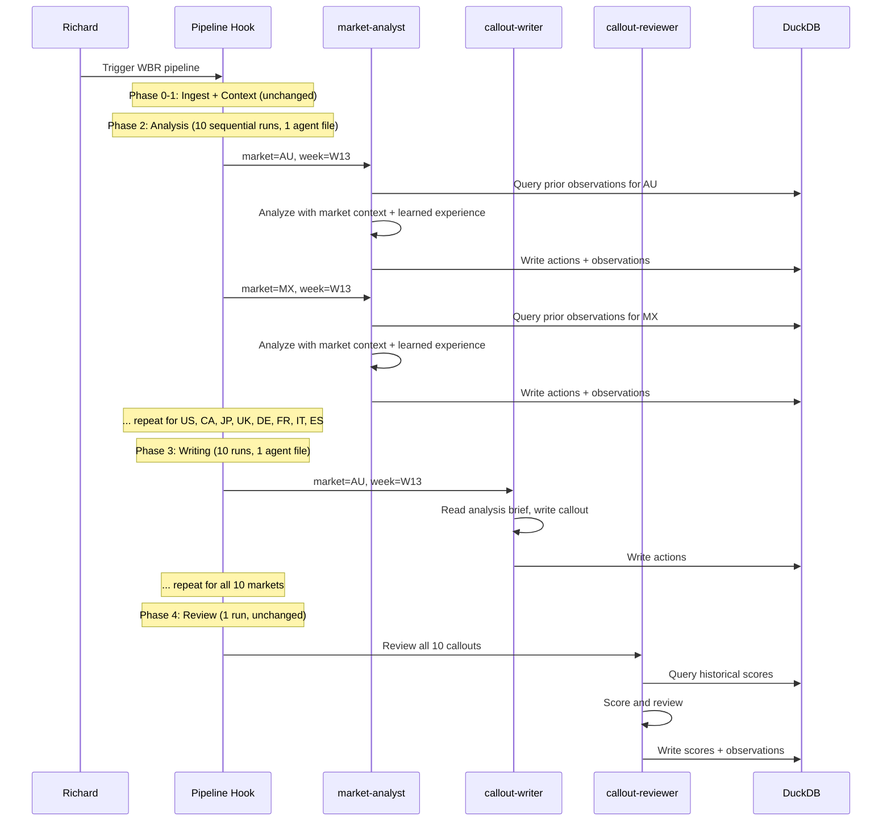

# Design Document: Agent Consolidation and Pipeline Framework

## Overview

This system has multiple distinct agent pipelines — WBR callouts (weekly), MBR reports (monthly), wiki articles (on-demand), system maintenance (daily/on-demand), and future pipelines (testing reports, campaign audits, meeting prep). Today these pipelines share infrastructure (DuckDB, the bridge, per-market context files, parquet exports) but have no shared framework. Each pipeline was built independently, with its own dispatch pattern, its own state management (or none), and no common registration or observability layer.

This design covers three things:

**Part 1 (WBR Callout Consolidation):** The WBR callout pipeline currently uses 7 agent files (3 analysts + 3 writers + 1 reviewer) where the 3 analysts and 3 writers are nearly identical — they differ only in which markets they process and a handful of market-specific context lines (MX has ie%CCP, AU has no YoY, EU5 has cross-market patterns, US has Walmart competition, JP has MHLW loss). This duplication means every pipeline improvement requires editing 6 files instead of 2, and market-specific knowledge is hardcoded into agent prompts instead of living in queryable, editable context files. Consolidate 7 agent files into 3 (1 parameterized analyst + 1 parameterized writer + 1 reviewer).

**Part 2 (Agent State Wiring):** Wire the Phase B agent state tables so ALL agents — not just callout agents — build memory across sessions. The consolidated agents accept a market parameter and read `{market}-context.md` for market-specific rules at runtime. After each run, agents write their actions and observations to DuckDB. At the start of each run, agents query prior observations — the agent's "learned experience" lives in the data, not the prompt. This is pipeline-agnostic infrastructure.

**Part 3 (Pipeline Framework Architecture):** Design the shared infrastructure layer that all pipelines plug into: a pipeline registry, pipeline-agnostic agent state functions, a `report_type` parameter on the analyst agent so the same analyst can produce WBR callouts OR MBR reports, wiki pipeline wiring into agent state, and the MBR pipeline as a "designed but not yet built" component.

This embodies Richard's design principles: subtraction before addition (7 files → 3, shared infrastructure instead of per-pipeline duplication), structural over cosmetic (changing the default agent access pattern from hardcoded knowledge to runtime injection), and reduce decisions not options (the pipeline hook decides which markets to run; the agent just processes what it's given).

## Architecture

### Multi-Pipeline View

The system has 5 pipeline categories that share a common infrastructure layer. Each pipeline has different agents, triggers, output formats, and market scope — but they all plug into the same DuckDB data layer, agent state tables, per-market context files, bridge, and parquet exports.

```mermaid
graph TD
    subgraph "Shared Infrastructure Layer"
        DB[(DuckDB<br/>weekly_metrics, monthly_metrics,<br/>projections, callout_scores, etc.)]
        AS[(Agent State<br/>agent_actions, agent_observations)]
        QH[query.py<br/>+ log_agent_action<br/>+ log_agent_observation<br/>+ query_prior_observations]
        CTX[Per-Market Context Files<br/>10 × {market}-context.md]
        BR[Bridge<br/>Google Sheets/Docs<br/>cross-environment comms]
        PQ[Parquet Exports<br/>~/shared/tools/data/exports/]
    end

    subgraph "Pipeline Registry"
        REG[pipeline_registry.py<br/>register, list, get_config]
    end

    subgraph "WBR Callout Pipeline (weekly)"
        WBR_HOOK[wbr-callout-pipeline hook]
        WBR_AN[market-analyst<br/>report_type=wbr]
        WBR_WR[callout-writer]
        WBR_REV[callout-reviewer]
        WBR_HOOK --> WBR_AN --> WBR_WR --> WBR_REV
    end

    subgraph "MBR Pipeline (monthly, designed not built)"
        MBR_HOOK[mbr-pipeline hook]
        MBR_AN[market-analyst<br/>report_type=mbr]
        MBR_WR[mbr-writer]
        MBR_REV[mbr-reviewer]
        MBR_HOOK --> MBR_AN --> MBR_WR --> MBR_REV
    end

    subgraph "Wiki Pipeline (on-demand)"
        WIKI_ED[wiki-editor<br/>orchestrator]
        WIKI_RES[wiki-researcher]
        WIKI_WR[wiki-writer]
        WIKI_CR[wiki-critic]
        WIKI_LIB[wiki-librarian]
        WIKI_CON[wiki-concierge]
        WIKI_ED --> WIKI_RES --> WIKI_WR --> WIKI_CR
        WIKI_CR -->|publish| WIKI_LIB
        WIKI_CR -->|revise| WIKI_WR
        WIKI_CON -.->|search| WIKI_ED
    end

    subgraph "System Maintenance (daily/on-demand)"
        MR[morning-routine hook]
        LOOP[run-the-loop hook]
        KARP[karpathy agent]
        MR -.-> AS
        LOOP -.-> AS
        KARP -.-> AS
    end

    subgraph "Future Pipelines"
        FUT_TEST[Testing Report Pipeline]
        FUT_CAMP[Campaign Audit Pipeline]
        FUT_MEET[Meeting Prep Pipeline]
    end

    WBR_AN --> QH
    WBR_AN --> CTX
    WBR_AN --> AS
    MBR_AN --> QH
    MBR_AN --> CTX
    MBR_AN --> AS
    WIKI_ED --> AS
    WIKI_CR --> AS
    QH --> DB
    QH --> AS
    REG --> WBR_HOOK
    REG --> MBR_HOOK
    REG --> WIKI_ED
    REG --> MR
    DB --> PQ
    PQ --> BR
```

### WBR Callout Pipeline (Part 1 — detailed)

The consolidated architecture replaces region-specific agents with parameterized agents that receive market identity at invocation time. Market-specific knowledge is externalized into per-market context files that already exist. Agent state flows through DuckDB tables that already exist in schema but have no consumers.




## Sequence Diagrams

### Consolidated Analyst Run (Single Market)



### Full Pipeline Flow (Post-Consolidation)



## Components and Interfaces

### Component 1: Parameterized Market Analyst (`market-analyst.md`)

**Purpose**: Single agent file that replaces `abix-analyst.md`, `najp-analyst.md`, and `eu5-analyst.md`. Accepts a market parameter and reads market-specific rules from `{market}-context.md` at runtime.

**Interface**:
The agent is invoked with two parameters passed via the pipeline hook prompt:
- `market`: One of AU, MX, US, CA, JP, UK, DE, FR, IT, ES
- `week`: ISO week string (e.g., "W13")

**Responsibilities**:
- Data freshness check via DuckDB
- Query prior observations for the given market (learned experience)
- Pull structured metrics from DuckDB (trend, current week, monthly, projections, anomalies)
- Read `{market}-context.md` for market-specific rules and narrative context
- Read narrative context (eyes.md, previous callout, previous analysis brief, callout-principles.md)
- Produce analysis brief with registration drivers, trend context, YoY assessment, monthly projection, flags
- Write projection to DuckDB
- Write agent actions and observations to DuckDB

**What moves out of the agent prompt**:
- Market-specific analysis rules (MX ie%CCP, AU no YoY, JP MHLW, US Walmart, EU5 cross-market) → already in `{market}-context.md`
- Region-specific market lists (AU+MX, US+CA+JP, UK+DE+FR+IT+ES) → pipeline hook decides
- Hardcoded source agent name in projection writes → uses `market-analyst` uniformly

**What stays in the agent prompt**:
- Generic analysis workflow (data freshness → structured data → narrative context → analysis → projection → state write)
- Output format template (analysis brief structure)
- Analytical methodology (registration drivers, trend context, anomaly detection)
- DuckDB query patterns and `db_upsert` patterns
- Agent state write protocol

### Component 2: Parameterized Callout Writer (`callout-writer.md`)

**Purpose**: Single agent file that replaces `abix-callout-writer.md`, `najp-callout-writer.md`, and `eu5-callout-writer.md`. Accepts a market parameter and reads market-specific writing rules from `{market}-context.md`.

**Interface**:
Invoked with `market` and `week` parameters.

**Responsibilities**:
- Read the analysis brief produced by the analyst
- Read `{market}-context.md` for market-specific writing rules (headline format variations, ie%CCP inclusion, YoY availability)
- Read callout-principles.md for universal style rules
- Read previous week's callout for continuity
- Write callout draft (100-120 words prose + supplementary section)
- Write agent actions to DuckDB

**What moves out of the agent prompt**:
- Market-specific writing rules (MX ie%CCP in headline, AU no YoY paragraph, EU5 cross-market references) → `{market}-context.md`
- Region-specific market lists → pipeline hook decides
- Hardcoded analyst agent name references → generic "the analyst agent"

**What stays in the agent prompt**:
- Universal callout structure (headline, WoW paragraph, YoY paragraph, Note)
- Style rules from callout-principles.md (word count, formatting, tone)
- What makes a good callout / what to avoid
- File location patterns
- Supplementary section structure

### Component 3: Enhanced Per-Market Context Files (`{market}-context.md`)

**Purpose**: Already exist for all 10 markets. Need to be extended with structured sections that the consolidated agents can parse reliably.

**New sections to add** (appended to existing context files):

```markdown
## Agent Configuration
- markets: [AU]  (or [UK, DE, FR, IT, ES] for EU5 regional summary)
- has_yoy: false  (AU launched June 2025)
- has_ieccp: false
- headline_extras: []
- regional_summary: false
- spend_strategy: OP2 registration targets, cut wasted spend
- projection_notes: No fixed CPA target, bias toward efficiency

## Analysis Focus
- Post-promo stabilization pattern (W8 onward)
- Polaris URL migration impact
- No ie%CCP tracking
```

**Responsibilities**:
- Store all market-specific knowledge that differs between agents
- Provide structured fields the agent can parse (has_yoy, has_ieccp, etc.)
- Provide narrative context (competitive landscape, seasonal patterns, strategic notes)
- Editable by Richard without touching agent prompts

### Component 4: Agent State Writer (additions to `query.py`)

**Purpose**: Convenience functions for agents to write actions and observations to DuckDB, and query prior observations.

**New Interface**:
```python
def log_agent_action(
    agent: str,
    action_type: str,
    market: str,
    week: str,
    description: str,
    output_summary: str = None,
    confidence: float = None,
    db_path: str = None
) -> int:
    """Write an agent action to the agent_actions table. Returns the action ID."""

def log_agent_observation(
    agent: str,
    observation_type: str,
    market: str,
    week: str,
    content: str,
    severity: str = 'info',
    db_path: str = None
) -> int:
    """Write an agent observation to agent_observations. Returns the observation ID."""

def query_prior_observations(
    market: str,
    weeks: int = 4,
    observation_type: str = None,
    db_path: str = None
) -> list[dict]:
    """Query recent observations for a market. This is the agent's learned experience."""
```

**Responsibilities**:
- Abstract DuckDB writes behind simple function calls
- Auto-generate IDs via sequences
- Provide the `query_prior_observations()` function that gives agents memory across sessions
- Filter by market, recency, and optionally observation type

### Component 5: Updated Pipeline Hook (`wbr-callout-pipeline.kiro.hook`)

**Purpose**: Updated to invoke the consolidated agents instead of region-specific ones. The hook now explicitly passes market parameters.

**Key changes**:
- Phase 2 (Analysis): 10 sequential `market-analyst` invocations instead of 4 region-specific invocations
- Phase 3 (Writing): 10 sequential `callout-writer` invocations instead of 4 region-specific invocations
- Phase 4 (Review): Unchanged — `callout-reviewer` already handles all 10 markets
- The hook decides market ordering (AU and MX first for depth), the agent just processes what it's given

### Component 6: Updated Routing Directory (`soul.md`)

**Purpose**: Update the Agent Routing Directory to reference consolidated agents instead of region-specific ones.

**Changes**:
- Replace 3 analyst routing entries with 1 `market-analyst` entry
- Replace 3 writer routing entries with 1 `callout-writer` entry
- Simplify routing rules: any "Write W__ callouts" request → `market-analyst` → `callout-writer`


## Data Models

### Agent State Tables (Phase B — existing schema, no consumers yet)

These tables already exist in `init_db.py`. This feature wires them up as consumers.

#### `agent_actions` — Audit Trail

```sql
CREATE TABLE IF NOT EXISTS agent_actions (
    id INTEGER PRIMARY KEY,          -- auto from agent_actions_seq
    agent VARCHAR,                   -- 'market-analyst', 'callout-writer', 'callout-reviewer'
    action_type VARCHAR,             -- 'analysis', 'projection', 'callout_write', 'review', 'score'
    market VARCHAR,                  -- 'AU', 'MX', etc.
    week VARCHAR,                    -- '2026 W13'
    description TEXT,                -- human-readable summary of what was done
    input_summary TEXT,              -- what data the agent consumed
    output_summary TEXT,             -- what files/records the agent produced
    confidence DOUBLE,               -- agent's self-assessed confidence (0-1)
    requires_human_review BOOLEAN,   -- flagged for Richard's attention
    reviewed_by_human BOOLEAN,       -- Richard has reviewed
    human_feedback TEXT,             -- Richard's feedback if reviewed
    created_at TIMESTAMP DEFAULT current_timestamp
)
```

**Write pattern**: One row per agent invocation per market. The analyst writes one action per market it analyzes. The writer writes one action per callout produced. The reviewer writes one action for the full review.

#### `agent_observations` — Learned Experience

```sql
CREATE TABLE IF NOT EXISTS agent_observations (
    id INTEGER PRIMARY KEY,          -- auto from agent_observations_seq
    agent VARCHAR,                   -- which agent made the observation
    observation_type VARCHAR,        -- 'anomaly', 'pattern', 'projection_accuracy',
                                     -- 'narrative_thread', 'data_quality', 'competitive'
    market VARCHAR,                  -- which market this observation is about
    week VARCHAR,                    -- when the observation was made
    content TEXT,                    -- the observation itself (natural language)
    severity VARCHAR,                -- 'info', 'warning', 'critical'
    acted_on BOOLEAN,                -- whether a subsequent agent acted on this
    acted_on_by VARCHAR,             -- which agent acted on it
    created_at TIMESTAMP DEFAULT current_timestamp
)
```

**Write pattern**: Multiple rows per agent run. The analyst writes observations for each notable finding: anomalies detected, patterns identified, projection accuracy vs prior week's projection, narrative threads that continued or broke. The reviewer writes observations about quality trends and recurring issues.

**Read pattern**: At the start of each analyst run, query the last 4 weeks of observations for the target market. This gives the agent context about what it noticed before — without bloating the agent prompt with historical knowledge.

### Per-Market Context File Structure

Existing `{market}-context.md` files need a new `## Agent Configuration` section. This is the structured data the consolidated agent parses to know how to behave for each market.

```markdown
## Agent Configuration
markets: [AU]
has_yoy: false
has_ieccp: false
headline_extras: []
regional_summary: false
spend_strategy: OP2 registration targets, cut wasted spend
projection_notes: No fixed CPA target, bias toward efficiency
```

| Field | Type | Description | Example Values |
|-------|------|-------------|----------------|
| `markets` | list | Markets this context file covers | `[AU]`, `[UK, DE, FR, IT, ES]` |
| `has_yoy` | bool | Whether YoY data exists for this market | `true` (most), `false` (AU) |
| `has_ieccp` | bool | Whether ie%CCP tracking applies | `true` (MX only), `false` (all others) |
| `headline_extras` | list | Extra metrics to include in headline | `[ie%CCP]` (MX), `[]` (others) |
| `regional_summary` | bool | Whether to produce a regional summary file | `true` (EU5 markets), `false` (others) |
| `spend_strategy` | string | How to determine recommended spend | Market-specific strategy description |
| `projection_notes` | string | Market-specific projection methodology notes | Varies by market |

### File Inventory: Before and After

| Before (7 agent files) | After (3 agent files) | Status |
|------------------------|----------------------|--------|
| `abix-analyst.md` | `market-analyst.md` | Consolidated |
| `najp-analyst.md` | `market-analyst.md` | Consolidated |
| `eu5-analyst.md` | `market-analyst.md` | Consolidated |
| `abix-callout-writer.md` | `callout-writer.md` | Consolidated |
| `najp-callout-writer.md` | `callout-writer.md` | Consolidated |
| `eu5-callout-writer.md` | `callout-writer.md` | Consolidated |
| `callout-reviewer.md` | `callout-reviewer.md` | Unchanged |

Old files are deleted after consolidation is verified working.


## Key Functions with Formal Specifications

### Function 1: `log_agent_action()`

```python
def log_agent_action(
    agent: str,
    action_type: str,
    market: str,
    week: str,
    description: str,
    output_summary: str = None,
    confidence: float = None,
    db_path: str = None
) -> int:
    """Write an agent action to the agent_actions table."""
    path = db_path or DB_PATH
    _check_db_exists(path)
    con = duckdb.connect(path)
    try:
        next_id = con.execute("SELECT nextval('agent_actions_seq')").fetchone()[0]
        con.execute("""
            INSERT INTO agent_actions (id, agent, action_type, market, week,
                                       description, output_summary, confidence)
            VALUES (?, ?, ?, ?, ?, ?, ?, ?)
        """, [next_id, agent, action_type, market, week,
              description, output_summary, confidence])
        return next_id
    finally:
        con.close()
```

**Preconditions:**
- `agent` is one of: 'market-analyst', 'callout-writer', 'callout-reviewer'
- `action_type` is one of: 'analysis', 'projection', 'callout_write', 'review', 'score'
- `market` is a valid 2-letter market code (AU, MX, US, CA, JP, UK, DE, FR, IT, ES)
- `week` matches pattern '2026 WNN'
- `description` is non-empty

**Postconditions:**
- A new row exists in `agent_actions` with a unique auto-incremented ID
- `created_at` is set to current timestamp
- Returns the integer ID of the new row
- Database connection is closed

### Function 2: `log_agent_observation()`

```python
def log_agent_observation(
    agent: str,
    observation_type: str,
    market: str,
    week: str,
    content: str,
    severity: str = 'info',
    db_path: str = None
) -> int:
    """Write an agent observation to agent_observations."""
    path = db_path or DB_PATH
    _check_db_exists(path)
    con = duckdb.connect(path)
    try:
        next_id = con.execute("SELECT nextval('agent_observations_seq')").fetchone()[0]
        con.execute("""
            INSERT INTO agent_observations (id, agent, observation_type, market,
                                            week, content, severity)
            VALUES (?, ?, ?, ?, ?, ?, ?)
        """, [next_id, agent, observation_type, market, week, content, severity])
        return next_id
    finally:
        con.close()
```

**Preconditions:**
- `observation_type` is one of: 'anomaly', 'pattern', 'projection_accuracy', 'narrative_thread', 'data_quality', 'competitive'
- `severity` is one of: 'info', 'warning', 'critical'
- `content` is non-empty natural language description
- `market` is a valid market code

**Postconditions:**
- A new row exists in `agent_observations` with unique auto-incremented ID
- `acted_on` defaults to false
- Returns the integer ID of the new row
- Database connection is closed

### Function 3: `query_prior_observations()`

```python
def query_prior_observations(
    market: str,
    weeks: int = 4,
    observation_type: str = None,
    db_path: str = None
) -> list[dict]:
    """Query recent observations for a market. This is the agent's learned experience.
    
    Returns observations from the last N weeks for the given market,
    ordered most recent first. Optionally filter by observation type.
    """
    path = db_path or DB_PATH
    _check_db_exists(path)
    
    sql = """
        SELECT * FROM agent_observations
        WHERE market = ?
        AND created_at >= current_timestamp - INTERVAL ? DAY
    """
    params = [market, weeks * 7]
    
    if observation_type:
        sql += " AND observation_type = ?"
        params.append(observation_type)
    
    sql += " ORDER BY created_at DESC"
    
    con = duckdb.connect(path, read_only=True)
    try:
        result = con.execute(sql, params)
        columns = [desc[0] for desc in result.description]
        rows = result.fetchall()
        return [dict(zip(columns, row)) for row in rows]
    finally:
        con.close()
```

**Preconditions:**
- `market` is a valid market code
- `weeks` is a positive integer (default 4)
- Database exists and `agent_observations` table exists

**Postconditions:**
- Returns list of 0+ observation dicts, ordered most-recent-first
- Only observations for the specified market within the time window are returned
- If `observation_type` is specified, only matching types are returned
- Read-only connection — no side effects on the database
- Database connection is closed

**Loop Invariants:** N/A (single query)


## Algorithmic Pseudocode

### Consolidated Analyst Agent Workflow

```pascal
ALGORITHM analyzeMarket(market, week)
INPUT: market code (e.g., 'AU'), ISO week (e.g., 'W13')
OUTPUT: analysis brief markdown file, projection in DuckDB, agent state records

BEGIN
  // Step 1: Load market-specific configuration
  config ← READ("{market}-context.md")
  PARSE config.agent_configuration INTO has_yoy, has_ieccp, headline_extras,
        regional_summary, spend_strategy, projection_notes

  // Step 2: Query learned experience (prior observations)
  prior_obs ← query_prior_observations(market, weeks=4)
  // prior_obs contains: anomalies noticed before, patterns identified,
  // projection accuracy from prior weeks, narrative threads

  // Step 3: Data freshness check
  latest ← db("SELECT MAX(week) FROM weekly_metrics WHERE market = ?", [market])
  IF latest < week THEN
    FLAG "Data not yet ingested for {market} {week}"
    STOP
  END IF

  // Step 4: Pull structured data from DuckDB
  current ← market_week(market, week)
  trend ← market_trend(market, 8)
  monthly ← market_month(market, current_month)
  prior_projection ← projection(market, previous_week)
  anomalies ← db("SELECT * FROM anomalies WHERE market=? AND week=?", [market, week])

  // Step 5: Read narrative context
  READ eyes.md, previous callout, previous analysis brief, callout-principles.md
  READ {market}-context.md narrative sections (competitive, seasonal, strategic)

  // Step 6: Analyze (generic workflow, market-specific rules from config)
  reg_drivers ← analyzeRegistrationDrivers(current, trend)
  trend_context ← analyzeTrendContext(current, trend, config)

  IF config.has_yoy THEN
    yoy ← analyzeYoY(current, trend)
  ELSE
    yoy ← NULL  // AU has no YoY
  END IF

  projection ← produceProjection(current, trend, monthly, config)

  // Step 7: Check prior observations for continuity
  FOR each obs IN prior_obs DO
    IF obs.observation_type = 'pattern' THEN
      CHECK if pattern continued, reversed, or resolved this week
      NOTE continuity in analysis brief
    END IF
    IF obs.observation_type = 'projection_accuracy' THEN
      INCORPORATE accuracy feedback into this week's projection methodology
    END IF
  END FOR

  // Step 8: Detect new observations
  new_observations ← []
  FOR each metric IN [regs, cpa, cvr, spend, clicks] DO
    IF deviation(current[metric], trend_average[metric]) > 20% THEN
      APPEND anomaly observation to new_observations
    END IF
  END FOR
  IF prior_projection EXISTS THEN
    accuracy ← (actual - projected) / projected
    APPEND projection_accuracy observation to new_observations
  END IF

  // Step 9: Write outputs
  WRITE analysis brief to {market}-analysis-{week}.md
  db_upsert('projections', projection_data, ['market', 'week'])

  IF config.regional_summary THEN
    WRITE regional summary to eu5-analysis-{week}.md
  END IF

  // Step 10: Write agent state
  log_agent_action('market-analyst', 'analysis', market, week,
    description="Analyzed {market} {week}: {reg_summary}",
    output_summary="analysis brief + projection",
    confidence=self_assessed_confidence)

  FOR each obs IN new_observations DO
    log_agent_observation('market-analyst', obs.type, market, week,
      content=obs.content, severity=obs.severity)
  END FOR
END
```

### Pipeline Hook Market Dispatch

```pascal
ALGORITHM dispatchPipeline(week)
INPUT: ISO week number
OUTPUT: 10 analysis briefs, 10 callout drafts, 1 review

BEGIN
  ALL_MARKETS ← [AU, MX, US, CA, JP, UK, DE, FR, IT, ES]
  
  // Phase 2: Analysis — sequential, one market at a time
  // AU and MX first (hands-on markets, get dedicated depth)
  analysis_order ← [AU, MX, US, CA, JP, UK, DE, FR, IT, ES]
  
  FOR each market IN analysis_order DO
    INVOKE market-analyst WITH (market=market, week=week)
    VERIFY analysis brief exists at {market}-analysis-{week}.md
  END FOR

  // Phase 3: Writing — sequential, one market at a time
  FOR each market IN analysis_order DO
    INVOKE callout-writer WITH (market=market, week=week)
    VERIFY callout exists at {market}-2026-{week}.md
  END FOR

  // Phase 4: Review — single invocation, all markets
  INVOKE callout-reviewer WITH (week=week)
  VERIFY review exists at ww-review-{week}.md
END
```

### Agent Observation Query at Run Start

```pascal
ALGORITHM loadLearnedExperience(market, week)
INPUT: market code, current week
OUTPUT: structured context from prior observations

BEGIN
  observations ← query_prior_observations(market, weeks=4)
  
  experience ← {
    prior_anomalies: [],
    prior_patterns: [],
    projection_track_record: [],
    narrative_threads: [],
    data_quality_notes: []
  }
  
  FOR each obs IN observations DO
    MATCH obs.observation_type WITH
      'anomaly'             → APPEND to experience.prior_anomalies
      'pattern'             → APPEND to experience.prior_patterns
      'projection_accuracy' → APPEND to experience.projection_track_record
      'narrative_thread'    → APPEND to experience.narrative_threads
      'data_quality'        → APPEND to experience.data_quality_notes
    END MATCH
  END FOR
  
  // Build context string for the agent
  context ← ""
  IF experience.prior_anomalies NOT EMPTY THEN
    context += "Prior anomalies for {market}: " + summarize(experience.prior_anomalies)
  END IF
  IF experience.projection_track_record NOT EMPTY THEN
    recent_accuracy ← experience.projection_track_record[0]
    context += "Last projection accuracy: {recent_accuracy.content}"
  END IF
  IF experience.prior_patterns NOT EMPTY THEN
    context += "Patterns noticed: " + summarize(experience.prior_patterns)
  END IF
  
  RETURN context
END
```

## Example Usage

### Analyst agent reading market config at runtime

```python
# The consolidated agent reads {market}-context.md and parses the Agent Configuration section
# This replaces hardcoded market-specific rules in the agent prompt

# Example: MX context file contains:
# ## Agent Configuration
# markets: [MX]
# has_yoy: true
# has_ieccp: true
# headline_extras: [ie%CCP]
# spend_strategy: Maximum weekly spend keeping blended ie%CCP at or below 100%

# The agent uses these flags to conditionally include/exclude analysis sections:
if config['has_yoy']:
    yoy_assessment = analyze_yoy(current, trend)
if config['has_ieccp']:
    ieccp_data = db(f"SELECT * FROM ieccp WHERE market='{market}' ORDER BY week DESC LIMIT 8")
```

### Agent writing observations after analysis

```python
from query import log_agent_action, log_agent_observation

# After completing AU analysis for W13:
log_agent_action(
    agent='market-analyst',
    action_type='analysis',
    market='AU',
    week='2026 W13',
    description='AU W13: Regs +8% WoW on CVR recovery. Projected 1,050 regs for March (−5% vs OP2).',
    output_summary='au-analysis-2026-w13.md, projection upserted',
    confidence=0.82
)

# Observations the agent noticed:
log_agent_observation(
    agent='market-analyst',
    observation_type='anomaly',
    market='AU',
    week='2026 W13',
    content='NB CVR spiked to 4.2%, highest in 8 weeks. May be Polaris LP migration effect.',
    severity='info'
)

log_agent_observation(
    agent='market-analyst',
    observation_type='projection_accuracy',
    market='AU',
    week='2026 W13',
    content='W12 projection was 980 regs, actual was 1,012 (+3.3% error). Slight underestimate.',
    severity='info'
)

log_agent_observation(
    agent='market-analyst',
    observation_type='pattern',
    market='AU',
    week='2026 W13',
    content='3rd consecutive week of NB CVR improvement post-Polaris migration. Trend is holding.',
    severity='info'
)
```

### Agent querying prior observations at run start

```python
from query import query_prior_observations

# At the start of AU W14 analysis, the agent queries what it noticed before:
prior = query_prior_observations('AU', weeks=4)

# Returns something like:
# [
#   {'observation_type': 'pattern', 'week': '2026 W13',
#    'content': '3rd consecutive week of NB CVR improvement post-Polaris migration.'},
#   {'observation_type': 'projection_accuracy', 'week': '2026 W13',
#    'content': 'W12 projection was 980 regs, actual was 1,012 (+3.3% error).'},
#   {'observation_type': 'anomaly', 'week': '2026 W12',
#    'content': 'Brand CPA dropped 12% WoW without spend change. Investigate.'},
# ]

# The agent incorporates this into its analysis:
# - "NB CVR improvement is now in its 4th week (pattern continuation)"
# - "Adjusting projection methodology: prior week underestimated by 3.3%"
# - "W12 Brand CPA anomaly resolved — was a one-week blip, CPA normalized in W13"
```

### Pipeline hook invoking consolidated agents

```python
# Before (in the hook prompt):
# "1. Invoke the abix-analyst agent — AU ONLY"
# "2. Invoke the abix-analyst agent — MX ONLY"
# "3. Invoke the najp-analyst agent — US, CA, JP"
# "4. Invoke the eu5-analyst agent — UK, DE, FR, IT, ES"

# After (in the hook prompt):
# "For each market in [AU, MX, US, CA, JP, UK, DE, FR, IT, ES]:"
# "  Invoke market-analyst with market={market}, week=W{NN}"
# "  Verify {market}-analysis-2026-w{NN}.md exists"
```

### Reviewer writing observations

```python
from query import log_agent_observation

# After reviewing all 10 callouts:
log_agent_observation(
    agent='callout-reviewer',
    observation_type='pattern',
    market='WW',  # cross-market observation
    week='2026 W13',
    content='3rd consecutive week where EU5 markets score lower on narrative_justification than ABIX. Writers may need more context in EU5 analysis briefs.',
    severity='warning'
)

log_agent_observation(
    agent='callout-reviewer',
    observation_type='data_quality',
    market='JP',
    week='2026 W13',
    content='JP callout referenced MHLW impact but analysis brief did not quantify the baseline shift. Gap between analyst and writer context.',
    severity='info'
)
```


## Correctness Properties

*A property is a characteristic or behavior that should hold true across all valid executions of a system — essentially, a formal statement about what the system should do. Properties serve as the bridge between human-readable specifications and machine-verifiable correctness guarantees.*

### Property 1: Agent state write produces unique row with correct defaults

*For any* valid combination of agent name, action type, market, week, and description, calling `log_agent_action()` shall insert exactly one new row into `agent_actions` with a unique auto-incremented ID. Similarly, *for any* valid combination of agent, observation type, market, week, and content, calling `log_agent_observation()` shall insert exactly one new row into `agent_observations` with a unique ID and `acted_on` defaulting to false.

**Validates: Requirements 4.1, 5.1, 5.2**

### Property 2: Prior observation query returns correct filtered, ordered, time-windowed results

*For any* market and any set of observations with varying timestamps and observation types, `query_prior_observations(market, weeks=N)` shall return only observations for that market within the last `N * 7` days, ordered by `created_at` descending. When an `observation_type` filter is provided, only observations matching that type shall be returned.

**Validates: Requirements 6.1, 6.2**

### Property 3: Idempotent projection upsert

*For any* market and week, calling `db_upsert('projections', data, ['market', 'week'])` twice with the same key columns shall result in exactly one row in the projections table for that market+week combination, with the second call's values overwriting the first.

**Validates: Requirements 10.1, 10.2, 10.3**

### Property 4: Context file completeness


## Error Handling

### Error 1: Missing Market Context File

**Condition**: `{market}-context.md` does not exist or lacks `## Agent Configuration` section
**Response**: Agent logs an error action to `agent_actions` with `requires_human_review = true` and stops processing that market. Other markets continue.
**Recovery**: Richard creates or fixes the context file. Next pipeline run succeeds.

### Error 2: DuckDB Write Failure on Agent State

**Condition**: `log_agent_action()` or `log_agent_observation()` fails (e.g., sequence exhausted, disk full)
**Response**: Agent catches the exception, logs a warning to stderr, and continues with the analysis. Agent state is best-effort — a write failure should never block the primary output (analysis brief + callout).
**Recovery**: Fix the underlying DuckDB issue. State writes resume on next run. Missing state rows are acceptable — they just mean a gap in the observation history.

### Error 3: No Prior Observations Exist

**Condition**: `query_prior_observations()` returns empty list (first run, or market has no history)
**Response**: Agent proceeds normally without learned experience context. This is the expected cold-start behavior. The agent's analysis quality is identical to the current system (no regression).
**Recovery**: N/A — observations accumulate naturally over subsequent runs.

### Error 4: Pipeline Hook Invokes Wrong Agent Name

**Condition**: Hook references old agent names (`abix-analyst`, `najp-analyst`, etc.) after consolidation
**Response**: Agent invocation fails. Pipeline stops at the failed phase.
**Recovery**: Update the hook to reference `market-analyst` and `callout-writer`. This is caught during the hook update task.

## Testing Strategy

### Blind Architecture Evaluation Protocol

Every architecture change that modifies how agents access data, produce output, or coordinate must be validated by a blind evaluator that has no knowledge of the change. This is the same principle as the dual blind eval in the autoresearch loop (heart.md) — the agent that made the change cannot evaluate its own work.

**Protocol (mandatory for all architecture changes):**

1. **Snapshot before**: Before the architecture change, run the pipeline on a representative input (e.g., AU W13 for callouts) and save the output artifacts (analysis brief, callout draft, review scores, projection values).

2. **Apply the change**: Implement the architecture modification (agent consolidation, new data access pattern, state wiring, etc.).

3. **Run after**: Run the same pipeline on the same input with the new architecture. Save the output artifacts.

4. **Spawn blind evaluator**: A fresh agent instance with NO knowledge of what changed. The evaluator receives:
   - The "before" output artifacts
   - The "after" output artifacts
   - A set of evaluation questions (see below)
   - The original input data (DuckDB state, context files)
   - It does NOT receive: the design doc, the task list, the diff, or any description of what was changed

5. **Evaluation questions** (5 per pipeline):
   - Q1: Are the "after" outputs factually equivalent to the "before" outputs? (Same numbers, same conclusions, same projections)
   - Q2: Is the "after" output quality equal to or better than "before"? (Narrative clarity, analytical depth, specificity)
   - Q3: Does the "after" output contain any information that contradicts the input data?
   - Q4: Are there any gaps in the "after" output — sections missing, metrics omitted, context lost?
   - Q5: If you had to use one of these outputs to make a business decision, which would you choose and why?

6. **Scoring**:
   - Each question scored: PASS (after ≥ before), REGRESS (after < before), or NEUTRAL
   - Architecture change is APPROVED if: 0 REGRESS scores AND at least 1 PASS
   - Architecture change is APPROVED WITH NOTES if: 1 REGRESS that's acknowledged as acceptable tradeoff
   - Architecture change is REJECTED if: 2+ REGRESS scores

7. **Log the result**: Write the evaluation to `agent_observations` with `observation_type = 'architecture_eval'` and the full scoring breakdown. This creates an audit trail of every architecture decision and its measured impact.

**When to run this protocol:**
- Agent consolidation (this build) — compare old 3-analyst output vs new 1-analyst output for AU, MX, and one EU5 market
- Any new pipeline (MBR, testing reports) — compare against manual/existing process if one exists
- Any change to agent data access patterns (e.g., switching from markdown parsing to DuckDB queries)
- Any change to agent prompt structure that affects output format
- NOT required for: pure infrastructure changes (adding a query.py function), documentation updates, or bug fixes that don't change output

**Reusable function** (added to `query.py`):

```python
def log_architecture_eval(
    change_name: str,
    pipeline: str,
    market: str,
    scores: dict,  # {'q1': 'PASS', 'q2': 'PASS', ...}
    evaluator_notes: str,
    verdict: str,  # 'APPROVED', 'APPROVED_WITH_NOTES', 'REJECTED'
    db_path: str = None
) -> int:
    """Log an architecture evaluation result. Returns observation ID."""
    content = f"Architecture eval: {change_name} on {pipeline}/{market}. "
    content += f"Verdict: {verdict}. Scores: {scores}. Notes: {evaluator_notes}"
    return log_agent_observation(
        agent='architecture-evaluator',
        observation_type='architecture_eval',
        market=market,
        week='',  # architecture evals aren't week-specific
        content=content,
        severity='info' if verdict == 'APPROVED' else 'warning',
        db_path=db_path
    )
```

**For this build specifically:**
- Run the blind eval on AU (ABIX market, no YoY), MX (ABIX market, has ie%CCP + YoY), and UK (EU5 market, has cross-market patterns)
- Compare old `abix-analyst` output vs new `market-analyst` output for AU and MX
- Compare old `eu5-analyst` output vs new `market-analyst` output for UK
- The evaluator must not know that agents were consolidated — it just sees two sets of outputs

### Unit Testing Approach

- Test `log_agent_action()` writes a row and returns a valid ID
- Test `log_agent_observation()` writes a row with correct defaults (`acted_on = false`)
- Test `query_prior_observations()` returns correct time-windowed results, ordered by recency
- Test `query_prior_observations()` with `observation_type` filter
- Test `query_prior_observations()` returns empty list when no observations exist
- Test that sequence IDs auto-increment correctly across multiple writes

### Integration Testing Approach

- Run the consolidated `market-analyst` on AU with real DuckDB data and verify:
  - Analysis brief matches expected structure
  - Projection is written to DuckDB
  - Agent action is recorded
  - At least one observation is recorded
  - AU-specific rules applied (no YoY section, no ie%CCP)
- Run the consolidated `market-analyst` on MX and verify:
  - ie%CCP is included in analysis
  - YoY section is present
  - MX-specific context from `mx-context.md` is reflected
- Run the full pipeline (10 markets) and verify:
  - All 10 analysis briefs exist
  - All 10 callout drafts exist
  - Review file exists
  - `agent_actions` has at least 21 rows (10 analyst + 10 writer + 1 reviewer)
  - `agent_observations` has at least 10 rows (at least 1 per analyst run)

### Regression Testing

- Compare output of consolidated agent vs old region-specific agent for the same market+week
- Verify file paths, output structure, and projection values are equivalent
- Verify the reviewer scores are not degraded after consolidation

## Performance Considerations

- Agent state writes add ~2 DuckDB inserts per market per agent run. DuckDB handles this trivially — these are single-row inserts into small tables.
- `query_prior_observations()` queries a small table (grows by ~30-50 rows per week). No indexing needed at this scale. If the table grows past 10K rows, add an index on `(market, created_at)`.
- The pipeline runs 10 sequential analyst invocations instead of 4 region-grouped invocations. Each invocation is a full agent context load. Net effect: slightly more overhead from 10 context loads vs 4, but each load is simpler (1 market vs 2-5 markets). Total pipeline time should be roughly equivalent.

## Security Considerations

- Agent state tables contain no PII — only market codes, week identifiers, and analytical observations.
- DuckDB file permissions are unchanged (same as current `ps-analytics.duckdb`).
- Per-market context files contain no credentials or sensitive data — they hold market-specific analytical rules and competitive context.

## Dependencies

### Part 1-2 Dependencies (WBR Consolidation + Agent State)
- DuckDB (`ps-analytics.duckdb`) — already installed and active
- `query.py` — already exists, needs 3 new functions added
- `init_db.py` — already has Phase B table schemas, no changes needed
- Per-market `{market}-context.md` files — already exist for all 10 markets, need `## Agent Configuration` section added
- Pipeline hook (`wbr-callout-pipeline.kiro.hook`) — already exists, needs prompt updated
- `soul.md` Agent Routing Directory — already exists, needs routing entries updated
- `callout-reviewer.md` — unchanged, but will be updated to write observations
- `device.md` — needs WBR Callout Pipeline entry updated to reflect consolidation

### Part 3 Dependencies (Pipeline Framework)
- `pipeline_registry.py` — new file, registers all pipelines with their configs
- `mbr-writer.md` — new agent file for MBR output format (future build)
- `mbr-reviewer.md` OR `callout-reviewer.md` with `report_type` param — TBD (future build)
- `mbr-pipeline.kiro.hook` — new hook for monthly MBR dispatch (future build)
- Wiki agent files (`wiki-editor.md`, `wiki-critic.md`, etc.) — already exist, need agent state write instructions added
- System maintenance hooks (`rw-morning-routine`, `run-the-loop`) — already exist, need agent state write instructions added
- `karpathy.md` — already exists, needs agent state write instructions added

