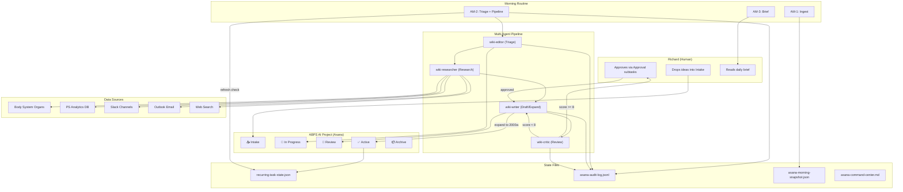
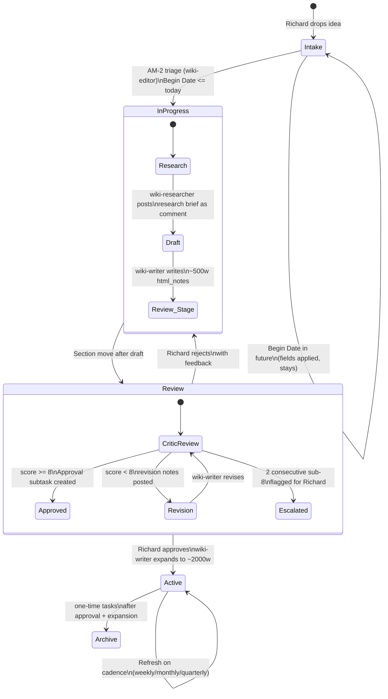
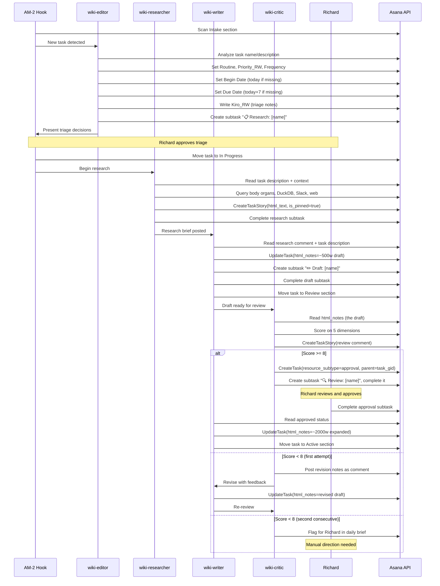

# Design Document: Asana Agent Task Management (ABPS AI Project)

## Overview

The ABPS AI Project transforms Asana from a task tracker into an autonomous document factory. Richard drops raw ideas into an Intake section. A multi-agent pipeline — reusing the existing wiki team agents (editor, researcher, writer, critic) — triages, researches, drafts, reviews, and publishes work products directly inside Asana task descriptions using `html_notes`. The agent self-manages the project lifecycle: scanning for due work during AM-2, executing within date windows, refreshing on cadence, and using Asana's native features (subtasks, approvals, milestones, comments, sections) as workflow infrastructure.

This design converges three existing systems:
1. The Asana command center protocol (My Tasks read/write, field GIDs, guardrails)
2. The wiki agent pipeline (editor → researcher → writer → critic)
3. The recurring task state system (period-based cadence execution)

The ABPS AI Project is a Level 5 (Agentic Orchestration) capability — the first fully autonomous agent workflow in the system.

## Architecture

### System Context Diagram



### Full Lifecycle Data Flow



## Components and Interfaces

### Component 1: ABPS AI Project Structure (Asana)

The project is Richard's manually-created Asana project. The agent configures its internal structure on first run.

#### Sections (created via `CreateProjectSection`)

| Section | Purpose | Tasks Move Here When |
|---------|---------|---------------------|
| Intake | Raw ideas from Richard | Richard creates task or agent proposes |
| In Progress | Pipeline active (research/draft) | Begin Date <= today, triage approved |
| Review | Draft complete, awaiting critic + approval | wiki-writer finishes ~500w draft |
| Active | Approved, expanded, living documents | Richard approves + wiki-writer expands |
| Archive | One-time docs, completed | One-time frequency, post-expansion |

#### Custom Fields

| Field | Type | Options | Purpose |
|-------|------|---------|---------|
| Frequency | enum | weekly, monthly, quarterly, one-time | Refresh cadence for Active docs |
| Routine | enum | (inherited from My Tasks schema) | Triage bucket assignment |
| Priority_RW | enum | Today, Urgent, Not urgent | Urgency signal |
| Kiro_RW | text | — | Agent scratchpad: triage notes, pipeline state, refresh log |
| Begin Date | date | — | Start of execution window (`start_on`) |
| Due Date | date | — | End of execution window (`due_on`) |

GIDs for Routine (`1213608836755502`), Priority_RW (`1212905889837829`), Kiro_RW (`1213915851848087`), and Begin Date (`1213440376528542`) are already known from asana-command-center.md. The Frequency field GID and section GIDs will be discovered/created during project setup and recorded in asana-command-center.md under a new "ABPS AI Project" section.

#### GID Discovery Protocol

On first run (or when ABPS AI Project section is missing from asana-command-center.md):

1. `GetProjectSections(project_gid)` → record section GIDs
2. `GetTaskDetails` on any project task → inspect `custom_fields` array for Frequency field → record GID
3. If Frequency field doesn't exist: create it via Asana UI (no CreateCustomField tool), then re-read
4. Write all discovered GIDs to asana-command-center.md under `## ABPS AI Project`

```
## ABPS AI Project
- Project GID: {discovered}
- Sections:
  - Intake: {gid}
  - In Progress: {gid}
  - Review: {gid}
  - Active: {gid}
  - Archive: {gid}
- Frequency Field GID: {gid}
  - weekly: {option_gid}
  - monthly: {option_gid}
  - quarterly: {option_gid}
  - one-time: {option_gid}
```

### Component 2: Multi-Agent Pipeline Orchestration

The pipeline reuses the four wiki team agents with Asana-specific adaptations. The key difference from the wiki pipeline: output surfaces are Asana `html_notes` and comments instead of staging files.

#### Pipeline Sequence



#### Agent Adaptations for Asana

| Wiki Pipeline | Asana Pipeline | Change |
|---------------|----------------|--------|
| Research brief → `wiki/research/{slug}-research.md` | Research brief → pinned comment on task | Output surface: Asana comment, not file |
| Draft → `wiki/staging/{slug}.md` | Draft → `html_notes` on task | Output surface: Asana task description |
| Review → `wiki/reviews/{slug}-review.md` | Review → comment on task | Output surface: Asana comment |
| Publish → `wiki/published/{slug}.md` | Expand → updated `html_notes` | No separate publish step; Active section = published |
| Markdown with frontmatter | HTML with `<strong>` headers | Format: Asana HTML constraints |

#### Context Passed to Each Agent

| Agent | Reads | Writes |
|-------|-------|--------|
| wiki-editor | Task name, task description, Intake section listing | Routine, Priority_RW, Frequency, Kiro_RW, Begin/Due dates, research subtask |
| wiki-researcher | Task description, Kiro_RW, body organs, DuckDB, Slack, email, web | Pinned comment (research brief), complete research subtask |
| wiki-writer | Task description (Richard's idea), pinned research comment, style guides, Kiro_RW | html_notes (draft or expanded), draft/review subtasks, section moves |
| wiki-critic | html_notes (the draft), research comment, Kiro_RW | Review comment (scores + feedback), approval subtask (if score >= 8) |

### Component 3: AM-2 Integration

AM-2 already scans My Tasks. This design extends AM-2 to also scan ABPS_AI_Project.

#### AM-2 ABPS Scan Sequence

```
1. GetProjectSections(abps_project_gid) → get section GIDs
2. GetTasksFromProject(abps_project_gid) → all incomplete tasks
3. For each task, GetTaskDetails → read custom fields, dates, section

4. INTAKE SCAN:
   - Filter: tasks in Intake section with no Routine field set
   - Action: invoke wiki-editor triage for each
   - Present triage decisions to Richard for approval

5. DATE WINDOW CHECK:
   - Filter: tasks where start_on <= today AND NOT completed AND NOT in Active/Archive
   - For tasks entering window for first time (no pipeline subtasks exist): initiate pipeline
   - For tasks with due_on within 2 days AND not in Review: escalate to Priority_RW=Today

6. OVERDUE CHECK:
   - Filter: tasks where due_on < today AND NOT completed AND NOT approved
   - Action: flag in daily brief, write Kiro_RW with recommended action

7. REFRESH CHECK:
   - Filter: tasks in Active section with Frequency != one-time
   - For each: compute current_period, compare against recurring-task-state.json
   - If last_run_period != current_period: queue refresh

8. Include all findings in AM-2 output for Richard's review
```

### Component 4: Asana HTML Formatting

All work products live in `html_notes`. Since Asana rejects `<h1>`-`<h6>`, the agent uses `<strong>` for visual hierarchy.

#### Draft Template (~500 words)

```html
<body>
<strong>DOCUMENT TITLE</strong>

<strong>Executive Summary</strong>
Two to three sentences capturing the key insight, recommendation, or finding. Lead with the result, not the background.

<strong>Section One: [Descriptive Name]</strong>
Content paragraph with <em>emphasis</em> for key terms and <a href="url">links</a> to sources. Every metric connects to registrations, OPS, or customer experience.

<ul>
<li>Key point one with supporting evidence</li>
<li>Key point two with data reference</li>
<li>Key point three with implication</li>
</ul>

<strong>Section Two: [Descriptive Name]</strong>
Analysis content. Use <code>inline code</code> for technical terms. Short paragraphs — 2-4 sentences max.

<strong>Section Three: [Descriptive Name]</strong>
Additional analysis or context.

<strong>Next Steps</strong>
<ol>
<li>First action — owner, date</li>
<li>Second action — owner, date</li>
<li>Third action — owner, date</li>
</ol>
</body>
```

#### Full Document Template (~2000 words)

```html
<body>
<strong>DOCUMENT TITLE</strong>

<strong>Executive Summary</strong>
Three to five sentences. The entire document distilled. An L8 director reading only this paragraph gets 80% of the value.

<strong>Context</strong>
Why this document exists. What changed. How it connects to the Five Levels or current priorities. Link to related Asana tasks or body system organs via <a href="url">references</a>.

<strong>Section One: [Analysis/Finding/Recommendation]</strong>
Detailed content. Lead with the insight, then the evidence. Every table gets a "so what" interpretation immediately after.

<ul>
<li><strong>Sub-point:</strong> Detail with supporting data</li>
<li><strong>Sub-point:</strong> Detail with source citation</li>
</ul>

<strong>Section Two: [Analysis/Finding/Recommendation]</strong>
Continue with depth. Use <em>emphasis</em> for confidence levels: <em>HIGH confidence</em> when volume and duration support conclusions, <em>LOW confidence</em> when they don't.

<strong>Section Three: [Analysis/Finding/Recommendation]</strong>
Additional depth. Credit cross-functional partners by name or team.

<strong>Section Four: [Data/Evidence]</strong>
Supporting data organized in lists. Connect every metric to business impact.

<ol>
<li>Data point one — interpretation</li>
<li>Data point two — interpretation</li>
<li>Data point three — interpretation</li>
</ol>

<strong>Recommendations</strong>
<ul>
<li><strong>Recommendation 1:</strong> What to do, why, expected impact</li>
<li><strong>Recommendation 2:</strong> What to do, why, expected impact</li>
<li><strong>Recommendation 3:</strong> What to do, why, expected impact</li>
</ul>

<strong>Next Steps</strong>
<ol>
<li>Action — owner — date — success criteria</li>
<li>Action — owner — date — success criteria</li>
<li>Action — owner — date — success criteria</li>
</ol>

<strong>Updated [YYYY-MM-DD]: [revision summary]</strong>
</body>
```

#### Allowed Tags Reference

Only these tags are permitted in `html_notes` and `html_text`:
- `<body>` — required wrapper
- `<strong>` — bold (used for section titles, sub-headers)
- `<em>` — italic (emphasis, confidence levels)
- `<u>` — underline
- `<s>` — strikethrough
- `<code>` — inline code
- `<a href="url">` — hyperlinks
- `<ul>`, `<ol>`, `<li>` — lists

Rejected tags: `<h1>`-`<h6>`, `<blockquote>`, `<pre>`, `<table>`, ``, `<div>`, `<span>`, `<p>`, `<br>`.

### Component 5: Approval Flow

The approval subtask is the human-in-the-loop gate between draft and expansion.

#### Approval Subtask Creation

```
CreateTask(
  name="✅ Approve: [parent task name]",
  resource_subtype="approval",
  parent=parent_task_gid,
  assignee=1212732742544167,  // Richard
  projects=[abps_project_gid]
)
```

This creates a subtask with `approval_status: "pending"`.

#### Approval Detection

During AM-2 scan, for tasks in Review section:
1. `GetSubtasksForTask(task_gid)` → find subtask with `resource_subtype="approval"`
2. Check `completed` field on the approval subtask
3. If `completed === true`: approval granted → proceed to expansion (Stage 5)
4. If `completed === false`: still pending → skip
5. If Richard posted a comment after the approval subtask was created but before completing it: read comment for feedback → may need revision

#### Rejection Handling

Richard rejects by posting a comment with feedback (not completing the approval subtask). The agent detects this during AM-2:
1. `GetTaskStories(task_gid)` → check for comments after approval subtask creation timestamp
2. If Richard commented with feedback: treat as revision request → return to Stage 2 (wiki-writer)
3. Update Kiro_RW with rejection reason and revision count

### Component 6: Recurring Task State Integration

When a task moves to Active with a Frequency other than "one-time", it registers in `recurring-task-state.json`.

#### Registration

```json
{
  "abps_ai_{task_gid}": {
    "cadence": "monthly",
    "last_run": "2026-04-15",
    "last_run_period": "2026-04",
    "description": "ABPS AI: [task name] — refresh work product"
  }
}
```

Key format: `abps_ai_{task_gid}` to namespace ABPS entries and avoid collisions with existing recurring tasks.

#### Period Computation

Uses the existing `check_logic` from recurring-task-state.json:
- weekly: `YYYY-WNN` (ISO week number)
- monthly: `YYYY-MM`
- quarterly: `YYYY-QN` (Q1=Jan-Mar, Q2=Apr-Jun, Q3=Jul-Sep, Q4=Oct-Dec)

#### Refresh Execution

When a refresh is due:
1. Read current `html_notes` via `GetTaskDetails`
2. Invoke wiki-researcher for fresh context (body organs, DuckDB, Slack signals)
3. Invoke wiki-writer to update the document with current information
4. Add dated revision line at top: `<strong>Updated [YYYY-MM-DD]: [what changed]</strong>`
5. Post comment: "🔄 Refresh completed: [summary of changes]"
6. Update `recurring-task-state.json` with current date and period

### Component 7: Guardrail Implementation

#### Pre-Write Verification

Every Asana write operation on ABPS_AI_Project tasks follows this pattern:

```
1. GetTaskDetails(task_gid)
2. VERIFY: task.assignee.gid === "1212732742544167" (Richard)
3. IF NOT Richard's task: BLOCK write, log violation, alert in brief
4. IF writing html_notes: READ current content first (read-before-write)
5. EXECUTE write operation
6. APPEND to asana-audit-log.jsonl
```

#### Audit Log Format

Each write operation appends one JSON line to `~/shared/context/active/asana-audit-log.jsonl`:

```json
{
  "timestamp": "2026-04-15T08:30:00Z",
  "tool": "UpdateTask",
  "task_gid": "1234567890123",
  "task_name": "AEO Strategy Guide",
  "project": "ABPS_AI_Project",
  "pipeline_agent": "wiki-writer",
  "pipeline_stage": "draft",
  "fields_modified": ["html_notes"],
  "result": "success",
  "notes": "500w draft written"
}
```

Extended fields vs. the existing audit log format: `project`, `pipeline_agent`, `pipeline_stage`, `task_name`, `notes`.

#### Read-Before-Write Pattern

When updating `html_notes`:
1. `GetTaskDetails(task_gid)` → read current `html_notes`
2. Check if Richard has added content since last agent write (compare against Kiro_RW timestamp)
3. If Richard added content: preserve it, integrate agent content around it
4. If no Richard additions: safe to overwrite with new content
5. Write updated `html_notes` via `UpdateTask`

This prevents the agent from clobbering Richard's manual edits.

## Data Models

### ABPS AI Task (Asana Task with Custom Fields)

```
{
  gid: string,                    // Asana task GID
  name: string,                   // Task name (work product title)
  html_notes: string,             // The work product content (HTML)
  assignee: { gid: "1212732742544167" },  // Always Richard
  start_on: "YYYY-MM-DD",        // Begin Date (execution window start)
  due_on: "YYYY-MM-DD",          // Due Date (execution window end)
  completed: boolean,
  resource_subtype: "default_task",
  memberships: [{ project: { gid: abps_project_gid }, section: { gid: section_gid } }],
  custom_fields: {
    "Routine": enum_option_gid,
    "Priority_RW": enum_option_gid,
    "Frequency": enum_option_gid,   // weekly | monthly | quarterly | one-time
    "Kiro_RW": "date-stamped agent notes"
  },
  subtasks: [
    { name: "📋 Research: [name]", completed: bool },
    { name: "✏️ Draft: [name]", completed: bool },
    { name: "🔍 Review: [name]", completed: bool },
    { name: "✅ Approve: [name]", resource_subtype: "approval", completed: bool }
  ]
}
```

### Pipeline State (tracked via subtasks + Kiro_RW)

The pipeline state is implicit in the task's subtask completion status and section membership:

| State | Section | Subtasks Completed | Kiro_RW Contains |
|-------|---------|-------------------|------------------|
| Untriaged | Intake | none | nothing |
| Triaged, waiting | Intake | none | triage date, fields, scope |
| Research | In Progress | none | "pipeline: research started" |
| Draft | In Progress | 📋 Research | "pipeline: draft started" |
| Review | Review | 📋 Research, ✏️ Draft | "pipeline: review started" |
| Approved | Review | 📋, ✏️, 🔍, ✅ Approve | "pipeline: approved" |
| Active | Active | all | "pipeline: expanded, active" |
| Archived | Archive | all | "pipeline: archived" |

### Recurring Task State Entry

```json
{
  "abps_ai_{task_gid}": {
    "cadence": "weekly" | "monthly" | "quarterly",
    "last_run": "YYYY-MM-DD" | null,
    "last_run_period": "YYYY-WNN" | "YYYY-MM" | "YYYY-QN" | null,
    "description": "ABPS AI: {task_name} — refresh work product"
  }
}
```

### Audit Log Entry

```json
{
  "timestamp": "ISO 8601",
  "tool": "UpdateTask" | "CreateTask" | "CreateTaskStory",
  "task_gid": "string",
  "task_name": "string",
  "project": "ABPS_AI_Project",
  "pipeline_agent": "wiki-editor" | "wiki-researcher" | "wiki-writer" | "wiki-critic" | null,
  "pipeline_stage": "triage" | "research" | "draft" | "review" | "expansion" | "refresh" | null,
  "fields_modified": ["string"],
  "result": "success" | "failure" | "blocked",
  "notes": "string"
}
```

### Morning Snapshot Extension

The existing `asana-morning-snapshot.json` gains an `abps_ai` section:

```json
{
  "snapshot_date": "YYYY-MM-DD",
  "tasks": [...],
  "bucket_counts": {...},
  "today_tasks": [...],
  "overdue_tasks": [...],
  "abps_ai": {
    "intake_count": 0,
    "in_progress": [],
    "in_review": [],
    "active_count": 0,
    "archive_count": 0,
    "pipeline_stages": {
      "task_gid": "research" | "draft" | "review" | "approved" | "expanding"
    },
    "refresh_due": [],
    "overdue": [],
    "entering_window_this_week": []
  }
}
```

## Correctness Properties

*A property is a characteristic or behavior that should hold true across all valid executions of a system — essentially, a formal statement about what the system should do. Properties serve as the bridge between human-readable specifications and machine-verifiable correctness guarantees.*

### Property 1: HTML output contains only allowed tags

*For any* work product HTML string produced by the wiki-writer (draft or expanded), parsing the HTML should yield only tags from the allowed set: `body`, `strong`, `em`, `u`, `s`, `code`, `a`, `ul`, `ol`, `li`. No other HTML tags should be present.

**Validates: Requirements 3.3, 6.1**

### Property 2: Intake filter returns only untriaged tasks

*For any* set of tasks in the Intake section with varying Routine field values (set or unset), the intake scan filter should return exactly those tasks where the Routine field is not set (null/empty). Tasks with any Routine value should be excluded.

**Validates: Requirements 2.1**

### Property 3: Triage produces valid field assignments

*For any* task with a name and description, the wiki-editor triage function should produce: (a) a valid Routine enum value, (b) a valid Priority_RW enum value, (c) a valid Frequency enum value, and (d) a Work_Product type from the set {guide, reference, decision, playbook, analysis}. No field should be null or outside its valid enum range.

**Validates: Requirements 2.2**

### Property 4: Missing dates receive correct defaults

*For any* task in Intake with no Begin Date, the agent should set Begin Date to today's date. *For any* task with no Due Date, the agent should set Due Date to exactly 7 calendar days from today. Tasks that already have dates should retain their original values.

**Validates: Requirements 2.3**

### Property 5: Date window determines section placement

*For any* triaged task, if Begin Date <= today then the task should be moved to "In Progress" section. If Begin Date > today then the task should remain in "Intake" with fields applied. No task with a future Begin Date should appear in "In Progress", "Review", or any pipeline-active section.

**Validates: Requirements 2.6, 4.5, 7.7**

### Property 6: Pipeline subtasks follow naming convention

*For any* task that enters the pipeline, the created subtasks should match these exact patterns: "📋 Research: {parent_task_name}" for research, "✏️ Draft: {parent_task_name}" for drafting, "🔍 Review: {parent_task_name}" for review, and "✅ Approve: {parent_task_name}" (with resource_subtype="approval") for approval. The parent task name portion should match exactly.

**Validates: Requirements 2.7, 7.2, 8.1**

### Property 7: Pipeline stages execute in order

*For any* task that completes the full pipeline, the subtask completion timestamps should be strictly ordered: Research completed before Draft, Draft completed before Review, Review completed before Approve. No stage should complete before its predecessor.

**Validates: Requirements 3.1**

### Property 8: Critic score determines approval path

*For any* critic review with a score >= 8 (average across 5 dimensions), an Approval subtask should be created. *For any* critic review with a score < 8, revision notes should be posted as a comment and no Approval subtask should be created. The threshold is exactly 8 — not 7.9, not 8.1.

**Validates: Requirements 3.5, 10.7**

### Property 9: Two consecutive sub-8 scores trigger escalation

*For any* task where the wiki-critic has scored the draft below 8 on two consecutive reviews, the agent should stop iterating and flag the task for Richard's manual attention. No third automatic revision attempt should occur.

**Validates: Requirements 3.6, 10.8**

### Property 10: Date window filter identifies correct tasks

*For any* set of ABPS_AI_Project tasks with varying dates, completion states, and sections, the date window filter should return exactly those tasks where: Begin Date <= today AND completed === false AND section is NOT "Active" AND section is NOT "Archive".

**Validates: Requirements 4.1**

### Property 11: Near-due tasks are escalated

*For any* task where Due Date is within 2 calendar days of today AND the task is not in the "Review" section AND the task is not completed, the agent should set Priority_RW to "Today".

**Validates: Requirements 4.3**

### Property 12: Overdue tasks are flagged

*For any* task where Due Date < today AND the task is not completed AND no approved Approval subtask exists, the task should be flagged as overdue in the daily brief and a Kiro_RW entry should be written with recommended action.

**Validates: Requirements 4.4**

### Property 13: Period computation is correct for all cadences

*For any* date and cadence pair: weekly cadence should produce format "YYYY-WNN" matching ISO week number, monthly cadence should produce "YYYY-MM", quarterly cadence should produce "YYYY-QN" where Q1=Jan-Mar, Q2=Apr-Jun, Q3=Jul-Sep, Q4=Oct-Dec. The computed period should be deterministic — the same date and cadence always produce the same period string.

**Validates: Requirements 5.2**

### Property 14: Recurring state registration round-trip

*For any* task that moves to Active with a Frequency value other than "one-time", after registration, reading `recurring-task-state.json` should contain an entry keyed `abps_ai_{task_gid}` with the correct cadence, current date as last_run, and current period as last_run_period. After a refresh completes, the last_run and last_run_period should be updated to the refresh date/period.

**Validates: Requirements 5.4, 5.6, 9.2**

### Property 15: One-time tasks archive after expansion

*For any* task with Frequency="one-time" that has been approved and expanded to ~2000 words, the task should be in the "Archive" section and marked as completed. It should NOT appear in any refresh check. It should NOT have an entry in `recurring-task-state.json`.

**Validates: Requirements 5.5, 8.3**

### Property 16: Work product drafts contain required structural elements

*For any* draft work product (~500w), the HTML should contain: at least one `<strong>` element as the title, a section headed "Executive Summary" (or equivalent bold text), between 3 and 5 bold-headed content sections, and a "Next Steps" section. *For any* full work product (~2000w), the HTML should additionally contain: recommendations and supporting data sections.

**Validates: Requirements 6.2, 6.3**

### Property 17: Read-before-write preserves existing content

*For any* task where Richard has added content to html_notes, after the agent updates html_notes, all of Richard's original content should still be present in the updated html_notes. The agent's content should be integrated around Richard's additions, not replace them.

**Validates: Requirements 6.5, 10.5**

### Property 18: Refresh updates include dated revision note

*For any* refresh update to a work product, the updated html_notes should contain a bold dated revision line matching the format `<strong>Updated YYYY-MM-DD: [description]</strong>` at or near the top of the document. A comment should also be posted noting what was updated.

**Validates: Requirements 5.3, 6.6**

### Property 19: Kiro_RW is updated on every task modification

*For any* task modified by the agent (triage, pipeline stage, refresh, or any write operation), the Kiro_RW field should be non-empty and contain a date-stamped entry reflecting the action taken, which agent acted, and why.

**Validates: Requirements 7.6, 8.5, 2.4**

### Property 20: Every write operation produces an audit log entry

*For any* Asana write operation (UpdateTask, CreateTask, CreateTaskStory) on an ABPS_AI_Project task, a corresponding JSON line should be appended to `asana-audit-log.jsonl` containing: timestamp, tool name, task_gid, pipeline_agent, fields_modified, and result status. The count of audit log entries should equal the count of write operations.

**Validates: Requirements 9.3, 10.2**

### Property 21: Assignee verification blocks non-Richard writes

*For any* task in ABPS_AI_Project where the assignee GID is NOT "1212732742544167" (Richard), all write operations (UpdateTask, CreateTaskStory) should be blocked. The blocked operation should be logged with result="blocked" in the audit log.

**Validates: Requirements 10.1**

### Property 22: Expansion requires approved Approval subtask

*For any* task that has been expanded from ~500w to ~2000w, an Approval subtask with resource_subtype="approval" and completed=true should exist as a subtask of that task. No expansion should occur without this approval gate.

**Validates: Requirements 10.4**

### Property 23: API failure triggers retry then escalation

*For any* Asana API call that fails, the agent should: (a) log the failure to audit log, (b) write a Kiro_RW entry, (c) retry exactly once, and (d) if the retry also fails, flag the task for manual attention in the daily brief. No more than one retry should occur per failure.

**Validates: Requirements 10.6**

### Property 24: Each pipeline stage produces a comment

*For any* completed pipeline stage (research, draft, review, expansion, refresh), a comment should exist on the task containing the agent name and a timestamp. The number of pipeline-stage comments should equal the number of completed stages.

**Validates: Requirements 3.2, 7.4**

### Property 25: Section membership is consistent with pipeline state

*For any* task in ABPS_AI_Project, the section should be consistent with the pipeline state: untriaged/future-dated tasks in Intake, active pipeline tasks in In Progress, drafted tasks awaiting review in Review, approved and expanded tasks in Active, completed one-time tasks in Archive. No task should be in a section that contradicts its pipeline state.

**Validates: Requirements 7.5, 8.2**

## Error Handling

### API Failures

| Failure | Detection | Response |
|---------|-----------|----------|
| UpdateTask fails | API error response | Log to audit log + Kiro_RW, retry once, flag for manual attention if retry fails |
| CreateTask fails | API error response | Log, retry once, skip subtask creation and note in Kiro_RW |
| CreateTaskStory fails | API error response | Log, retry once, continue pipeline (comment is audit trail, not blocking) |
| GetTaskDetails fails | API error response | Log, skip task in current scan, retry next AM-2 cycle |
| GetProjectSections fails | API error response | Log, abort ABPS scan for this cycle, flag in brief |

### Pipeline Failures

| Failure | Detection | Response |
|---------|-----------|----------|
| wiki-researcher produces no research | Empty or missing pinned comment | Write Kiro_RW noting research failure, skip to draft with available context, flag in brief |
| wiki-writer produces invalid HTML | HTML parsing detects disallowed tags | Strip disallowed tags, re-run writer with explicit tag constraints, log |
| wiki-critic scores below 8 twice | Counter in Kiro_RW | Stop iterating, flag for Richard with critic feedback |
| Approval subtask not found | GetSubtasksForTask returns no approval type | Create approval subtask (may have been missed), log anomaly |
| Task moved to wrong section | Section GID mismatch | Correct section move, log the correction |

### Data Integrity Failures

| Failure | Detection | Response |
|---------|-----------|----------|
| Kiro_RW exceeds 500 chars | Length check before write | Truncate oldest entries, keep most recent |
| recurring-task-state.json corrupted | JSON parse failure | Log error, skip refresh checks this cycle, alert in brief |
| asana-audit-log.jsonl write fails | File system error | Write to stderr, continue operation (don't block pipeline on audit failure) |
| Richard's content overwritten | Diff check in read-before-write | Restore from last known state (GetTaskDetails cache), log incident |
| GID mismatch (section/field moved) | API returns unexpected structure | Re-run GID discovery protocol, update asana-command-center.md |

### Guardrail Violations

| Violation | Detection | Response |
|-----------|-----------|----------|
| Task not assigned to Richard | Assignee GID check | Block write, log with result="blocked", alert in brief |
| Write without read-before-write | Missing GetTaskDetails call before UpdateTask(html_notes) | Enforce in code: html_notes writes require prior read |
| Expansion without approval | No completed approval subtask | Block expansion, log, create approval subtask if missing |

## Testing Strategy

### Unit Tests

Unit tests cover specific examples, edge cases, and integration points:

- Project setup verification: sections created match expected names, Frequency field has correct options
- HTML tag validation: specific examples of valid and invalid HTML strings
- Date default assignment: task with no dates, task with only Begin Date, task with only Due Date, task with both dates
- Period computation: specific date → period mappings (e.g., 2026-01-15 weekly → "2026-W03", 2026-04-01 quarterly → "2026-Q2")
- Triage classification: specific task names → expected Routine/Priority/Frequency assignments
- Approval detection: approval subtask completed vs pending vs missing
- Audit log format: specific write operations → expected log entries
- Edge cases: empty task name, very long html_notes (>50KB), task with no custom fields, task assigned to someone other than Richard

### Property-Based Tests

Property-based tests verify universal properties across randomized inputs. Each test runs a minimum of 100 iterations.

The project should use a property-based testing library appropriate for the implementation language (e.g., `fast-check` for TypeScript/JavaScript, `hypothesis` for Python, `QuickCheck` for Haskell).

Each property test must be tagged with a comment referencing the design property:

```
// Feature: asana-agent-task-management, Property 1: HTML output contains only allowed tags
```

Each correctness property (Properties 1-25) must be implemented by a single property-based test. Key generators needed:

| Generator | Produces | Used By |
|-----------|----------|---------|
| `arbTaskName` | Random non-empty strings (1-200 chars) | Properties 2, 3, 4, 6 |
| `arbHtmlContent` | Random HTML strings using allowed tags | Properties 1, 16, 17 |
| `arbDate` | Random dates within ±365 days of today | Properties 4, 5, 10, 11, 12, 13 |
| `arbCadence` | Random choice from {weekly, monthly, quarterly, one-time} | Properties 13, 14, 15 |
| `arbTask` | Full task object with random fields | Properties 2, 5, 10, 21, 25 |
| `arbCriticScore` | Random 5-tuple of integers 1-10 | Properties 8, 9 |
| `arbPipelineState` | Random pipeline state (section + subtask completion) | Properties 7, 25 |
| `arbAssigneeGid` | Random GID string, sometimes Richard's | Property 21 |

### Test Configuration

- Minimum 100 iterations per property test
- Each property test references its design document property number
- Tag format: `Feature: asana-agent-task-management, Property {N}: {title}`
- Property tests and unit tests are complementary — unit tests catch specific edge cases, property tests verify general correctness across all inputs
