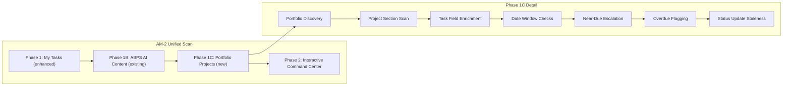
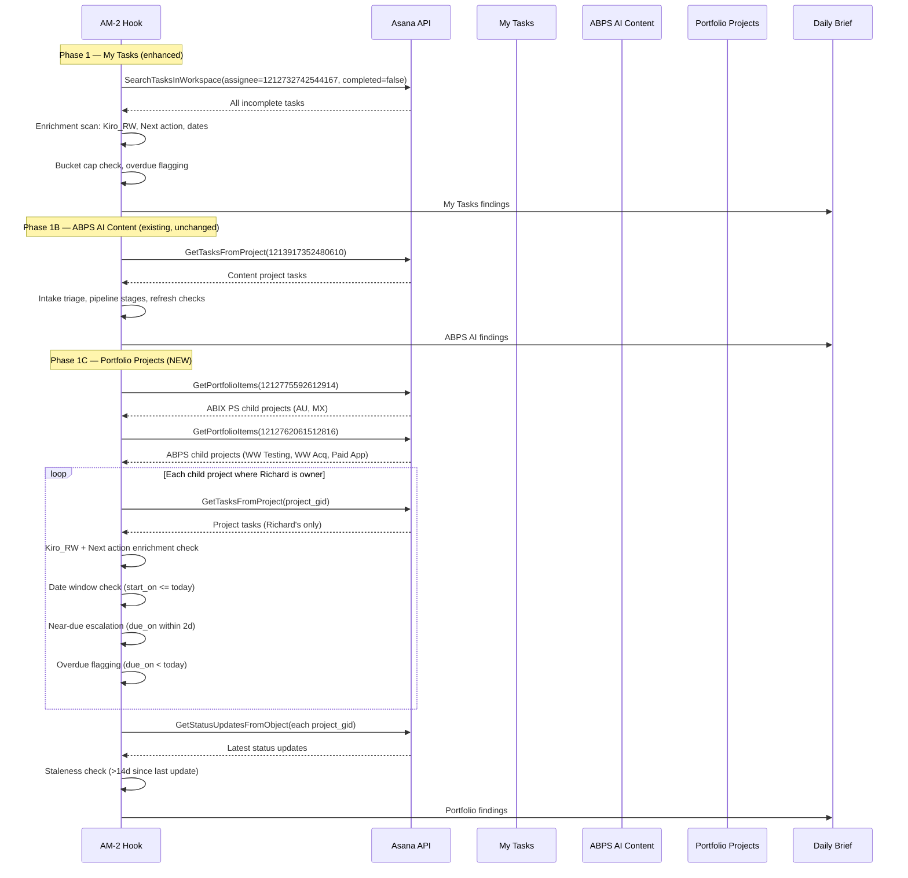

# Design Document: Asana Portfolio Management

## Overview

The ABPS AI spec shipped an autonomous document factory inside a single Asana project (ABPS AI - Content). This spec extends the same depth of management — Kiro_RW brevity, Next action writes, date window checks, near-due escalation, overdue flagging, and the full guardrail protocol — to three additional scopes:

1. **My Tasks deep enrichment** — ensuring every task in Richard's personal task list has Kiro_RW (M/D: <10 words), Next action (imperative, <15 words), proper Routine/Priority_RW, and date management. The AM-2 hook already scans My Tasks (Phase 1 + Phase 2), but field coverage is inconsistent. This spec makes it systematic.

2. **ABIX PS Portfolio** — the Amazon Business Paid Search portfolio (GID: `1212775592612914`) containing AU and MX child projects. The agent reads portfolio items, discovers project sections and custom fields, and manages tasks across all child projects with the same patterns used in ABPS AI Content.

3. **ABPS Portfolio** — the portfolio (GID: `1212762061512816`) containing WW Testing, WW Acquisition, and Paid App child projects. Same portfolio-level scanning, status tracking, and agent management patterns.

Beyond the generic enrichment layer, this spec includes project-specific workflow automation discovered through live probing:
- **AU**: Recurring task auto-creation (weekly agendas, MBR callouts), market context auto-refresh
- **MX**: Cross-team blocker detection (Vijeth/MCS dependencies, Carlos → Lorena handoffs), budget/PO tracking
- **Paid App**: Event countdown automation (Prime Day, BFCM, Back to School), stale task triage, promo event templates

This is a Level 5 (Agentic Orchestration) capability — the agent manages Richard's entire Asana workspace as a unified command center, not just individual projects.

## Architecture

```mermaid
graph TB
    subgraph "Morning Routine"
        AM1["AM-1: Ingest"]
        AM2["AM-2: Triage + Portfolio Scan"]
        AM3["AM-3: Brief"]
    end

    subgraph "My Tasks (1212732838073807)"
        MT_Today["Today tasks"]
        MT_Backlog["Backlog (no Routine)"]
        MT_Overdue["Overdue tasks"]
    end

    subgraph "ABPS AI Content (1213917352480610)"
        ABPS_Intake["Intake"]
        ABPS_InProg["In Progress"]
        ABPS_Review["Review"]
        ABPS_Active["Active"]
    end

    subgraph "ABIX PS Portfolio (1212775592612914)"
        AU["AU (1212762061512767)"]
        MX["MX (1212775592612917)"]
    end

    subgraph "ABPS Portfolio (1212762061512816)"
        WWT["WW Testing (1205997667578893)"]
        WWA["WW Acquisition (1206011235630048)"]
        PA["Paid App (1205997667578886)"]
    end

    subgraph "State Files"
        CmdCenter["asana-command-center.md"]
        Audit["asana-audit-log.jsonl"]
        Snapshot["asana-morning-snapshot.json"]
    end

    AM1 --> Snapshot
    AM2 --> MT_Today
    AM2 --> MT_Backlog
    AM2 --> MT_Overdue
    AM2 --> ABPS_Intake
    AM2 --> AU
    AM2 --> MX
    AM2 --> WWT
    AM2 --> WWA
    AM2 --> PA
    AM2 --> Audit
    AM3 --> CmdCenter
```



### Scan Hierarchy



### AM-2 Phase 1C Sequence



## Components and Interfaces

### Component 1: My Tasks Deep Enrichment

My Tasks (GID: `1212732838073807`) already has Routine, Priority_RW, Kiro_RW, Begin Date, and Next action fields. The gap: many tasks have empty Kiro_RW, no Next action, inconsistent date formats in Kiro_RW, and missing dates. This component systematically fills those gaps.

**Field GIDs (all inherited from My Tasks custom field schema):**

| Field | GID | Type | Enrichment Rule |
|-------|-----|------|-----------------|
| Kiro_RW | `1213915851848087` | text | M/D: <10 words. Set on every modification. |
| Next action | `1213921400039514` | text | Imperative verb, <15 words. Updated on every modification. |
| Routine | `1213608836755502` | enum | Untriaged tasks flagged during AM-2 Phase 1. |
| Priority_RW | `1212905889837829` | enum | Tasks with Routine but no Priority_RW get "Not urgent" default. |
| Begin Date | `1213440376528542` | date | If due_on set but start_on null: start_on = max(today, due_on - 7). |
| Importance_RW | `1212905889837865` | enum | Preserved as-is. |

**Enrichment Coverage Targets:**

| Field | Current Coverage | Target | Rule |
|-------|-----------------|--------|------|
| Kiro_RW | ~20% of tasks | 100% of active tasks | M/D: <10 words on every modification |
| Next action | ~10% of tasks | 100% of active tasks | Imperative, <15 words, on every modification |
| Routine | ~60% of tasks | 100% of tasks | Untriaged → flag for Richard |
| Priority_RW | ~70% of tasks | 100% of tasks with Routine | Default "Not urgent" if Routine set but no Priority |
| Begin Date | ~30% of tasks | 100% of tasks with due date | start_on = max(today, due_on - 7) |
| Due Date | ~50% of tasks | 100% of active tasks | Flag tasks without due_on for Richard |

**Kiro_RW Brevity Rule (§5 from Guardrail Protocol):**

Every Kiro_RW entry MUST follow this format — no exceptions, across ALL scopes (My Tasks, ABPS AI, portfolio projects):

- Format: `M/D: <status in under 10 words>`
- Date: Always `M/D` (e.g., `4/15`, `12/1`). Never `YYYY-MM-DD`, never `[M/D]`, never `MM/DD`.
- Length: Under 10 words after the date.
- Examples:
  - `4/15: Triaged. Sweep, today.`
  - `4/15: Overdue 3d. Extend or kill.`
  - `4/15: Draft sent. Awaiting review.`
  - `4/15: Near-due. Priority escalated.`
- Anti-patterns:
  - ❌ `[4/15] TRIAGE: Routine=Sweep, Priority=Today...`
  - ❌ `2026-04-15: Task enrichment completed for morning scan`

**Next Action Field Protocol (§6 from Guardrail Protocol):**

Updated on EVERY task modification — My Tasks, ABPS AI, and portfolio projects alike:

- Format: One sentence, imperative verb, specific. Under 15 words.
- API call: `UpdateTask(task_gid, custom_fields={"1213921400039514": "next action text"})`
- Examples:
  - `Send AU invoice to finance by EOD Friday`
  - `Review MX keyword data and flag gaps for Vijeth`
  - `Complete subtask 3 before DDD Thursday`
  - `Extend due date — blocked on legal approval`

### Component 2: Portfolio Discovery

The agent discovers portfolio child projects dynamically using `GetPortfolioItems` rather than hardcoding project lists.

**Known Portfolios:**

| Portfolio | GID | Known Children | Richard's Role |
|-----------|-----|---------------|----------------|
| ABIX PS | `1212775592612914` | AU (`1212762061512767`), MX (`1212775592612917`) | Owner of both |
| ABPS | `1212762061512816` | WW Testing (`1205997667578893`), WW Acq (`1206011235630048`), Paid App (`1205997667578886`) | Owner of WW Testing; Member of WW Acq, Paid App |

**Discovery API Calls:**

```
// Step 1: Enumerate portfolio children
GetPortfolioItems(portfolio_gid="1212775592612914")  // ABIX PS → AU, MX
GetPortfolioItems(portfolio_gid="1212762061512816")  // ABPS → WW Testing, WW Acq, Paid App

// Step 2: For each child project, discover sections
GetProjectSections(project_gid="1212762061512767")   // AU sections
GetProjectSections(project_gid="1212775592612917")   // MX sections
GetProjectSections(project_gid="1205997667578893")   // WW Testing sections
GetProjectSections(project_gid="1206011235630048")   // WW Acq sections
GetProjectSections(project_gid="1205997667578886")   // Paid App sections

// Step 3: Sample task for custom field discovery
GetTasksFromProject(project_gid)  // get first task
GetTaskDetails(task_gid, opt_fields="custom_fields.name,custom_fields.gid,custom_fields.type")

// Step 4: Read latest status update
GetStatusUpdatesFromObject(project_gid)
```

**GID Registry Update:**

After discovery, record all project profiles in `asana-command-center.md` under a new `## Portfolio Projects` section:

```markdown
## Portfolio Projects

### ABIX PS Portfolio (1212775592612914)

#### AU (1212762061512767)
- Portfolio: ABIX PS
- Owner: Richard Williams (1212732742544167)
- Sections: [discovered — name: GID pairs]
- Custom Fields: [discovered — Kiro_RW, Next action, Routine, Priority_RW availability]
- Pinned Context Task: 1213917747438931
- Active: yes

#### MX (1212775592612917)
- Portfolio: ABIX PS
- Owner: Richard Williams (1212732742544167)
- Sections: [discovered]
- Custom Fields: [discovered]
- Pinned Context Task: 1213917639688517
- Active: yes

### ABPS Portfolio (1212762061512816)

#### WW Testing (1205997667578893)
- Portfolio: ABPS
- Owner: Richard Williams (1212732742544167)
- Sections: [discovered]
- Custom Fields: [discovered]
- Pinned Context Task: 1213917851621567
- Active: yes

#### WW Acquisition (1206011235630048)
- Portfolio: ABPS
- Owner: Richard Williams (member, not owner)
- Sections: [discovered]
- Custom Fields: [discovered]
- Pinned Context Task: 1213917771203342
- Active: yes

#### Paid App (1205997667578886)
- Portfolio: ABPS
- Owner: Richard Williams (member, not owner)
- Sections: [discovered]
- Custom Fields: [discovered]
- Pinned Context Task: 1213917771155873
- Active: yes
```

### Component 3: Cross-Project Task Management

The agent manages tasks across multiple projects with consistent patterns. Different projects have different section structures and custom field schemas — the normalization layer handles this.

**Cross-Project Rules (applied uniformly to ALL scopes):**

| Rule | Source | Behavior |
|------|--------|----------|
| Kiro_RW brevity | §5 Guardrail Protocol | `M/D: <10 words` on every modification |
| Next action update | §6 Guardrail Protocol | Imperative, <15 words, on every modification |
| Date window check | §4 from ABPS AI spec | start_on <= today AND NOT completed → eligible |
| Near-due escalation | §4 from ABPS AI spec | due_on within 2 days AND not terminal → Priority_RW = Today |
| Overdue flagging | §4 from ABPS AI spec | due_on < today AND NOT completed → flag in brief |
| Assignee verification | §1 Guardrail Protocol | Only modify tasks assigned to Richard (1212732742544167) |
| Audit log | §2 Guardrail Protocol | Every write → asana-audit-log.jsonl with project identifier |
| API retry | §4 Guardrail Protocol | On failure → log → retry once → flag if still failing |

**Project-Specific Handling:**

Not all projects have the same section semantics. The agent must adapt:

| Project | Section Semantics | Terminal Sections (skip for date checks) |
|---------|-------------------|------------------------------------------|
| My Tasks | Routine-based grouping | (none — all sections active) |
| ABPS AI Content | Pipeline stages (Intake → Active → Archive) | Active, Archive |
| AU / MX | Market workstream sections | Completed/Done sections (discovered) |
| WW Testing | Test lifecycle sections | Completed sections (discovered) |
| WW Acquisition | Campaign sections | Completed sections (discovered) |
| Paid App | App campaign sections | Completed sections (discovered) |

### Component 4: Status Update Integration

Asana projects have status updates (weekly/monthly project health reports). The agent reads these for context and detects staleness.

**Read Operations:**

```
// Read latest status updates for each portfolio project
GetStatusUpdatesFromObject(project_gid="1212762061512767")  // AU
GetStatusUpdatesFromObject(project_gid="1212775592612917")  // MX
GetStatusUpdatesFromObject(project_gid="1205997667578893")  // WW Testing
GetStatusUpdatesFromObject(project_gid="1206011235630048")  // WW Acq
GetStatusUpdatesFromObject(project_gid="1205997667578886")  // Paid App
```

**Staleness Detection:**
- Parse `created_at` from the most recent status update
- If `today - created_at > 14 days` → project is stale
- Flag stale projects in daily brief: `⚠️ [Project Name] — no status update in [N] days`

**Status Context in Brief:**
- For each portfolio project, include health color (green/yellow/red) from latest status update
- Surface key highlights and blockers from status text
- Present alongside task-level findings for unified project view

### Component 5: AM-2 Hook Prompt Updates

The AM-2 hook prompt needs three additions:

**Addition 1: Phase 1 Enhancement (My Tasks enrichment)**

Insert after existing Phase 1 task scanning:

```
PHASE 1 ENHANCEMENT — MY TASKS DEEP ENRICHMENT:
After scanning all incomplete My Tasks, check each task for field completeness:

1. KIRO_RW CHECK: If Kiro_RW (GID: 1213915851848087) is empty or null:
   - Propose a Kiro_RW entry based on task name, due date, and status.
   - Format: M/D: <10 words. Use today's date.
   - Example: "4/15: Active. Due Friday. No blockers."
   - Queue for batch enrichment (present to Richard for approval).

2. NEXT ACTION CHECK: If Next action (GID: 1213921400039514) is empty or null:
   - Propose a Next action based on task name, subtasks, and context.
   - Format: Imperative verb, <15 words.
   - Example: "Send AU invoice to finance by EOD Friday"
   - Queue for batch enrichment.

3. DATE CHECK: If due_on is set but start_on is null:
   - Propose start_on = max(today, due_on - 7 calendar days).
   - Queue for batch enrichment.

4. PRESENT ENRICHMENT BATCH:
   After scanning all tasks, present proposed enrichments to Richard:
   📝 MY TASKS ENRICHMENT — [N] task(s) need field updates:
   For each task:
   - [task name] (GID: [gid])
     - Kiro_RW: [proposed entry] (currently empty)
     - Next action: [proposed entry] (currently empty)
     - Begin Date: [proposed date] (currently unset)
   - ACTION: Approve all, approve individually, or skip?

5. EXECUTE APPROVED ENRICHMENTS:
   For each approved task:
   UpdateTask(task_gid, custom_fields={
     "1213915851848087": "[kiro_rw entry]",
     "1213921400039514": "[next action entry]"
   }, start_on="YYYY-MM-DD")
   Log to audit trail with project="My_Tasks".
```

**Addition 2: Phase 1C (Portfolio Projects scan)**

Insert after existing Phase 1B (ABPS AI Content scan):

```
PHASE 1C — PORTFOLIO PROJECT SCAN:
Scan all child projects under ABIX PS and ABPS portfolios for Richard's tasks.

STEP 1 — PORTFOLIO DISCOVERY:
- Call GetPortfolioItems(portfolio_gid="1212775592612914") → ABIX PS children
- Call GetPortfolioItems(portfolio_gid="1212762061512816") → ABPS children
- For each child project, record project_gid and project_name.
- If a new project appears that isn't in asana-command-center.md:
  - Call GetProjectSections(project_gid) to discover sections
  - Call GetTaskDetails on a sample task to discover custom fields
  - Flag for Richard: "New project detected in [portfolio]: [name]. GIDs recorded."
  - Update asana-command-center.md § Portfolio Projects with new project profile.

STEP 2 — PER-PROJECT TASK SCAN:
For each child project (AU, MX, WW Testing, WW Acq, Paid App):
- Call GetTasksFromProject(project_gid) to get all incomplete tasks.
- For each task, call GetTaskDetails(task_gid, opt_fields=
    "name,assignee.gid,due_on,start_on,completed,custom_fields.name,
     custom_fields.display_value,custom_fields.gid,memberships.section.name")
- FILTER: Only process tasks where assignee.gid === "1212732742544167" (Richard).
  Skip tasks assigned to teammates — the agent only manages Richard's tasks.

STEP 3 — FIELD ENRICHMENT CHECK:
For each of Richard's tasks in the project:
a. KIRO_RW: If empty → propose entry (M/D: <10 words)
b. NEXT ACTION: If empty → propose entry (imperative, <15 words)
c. DATES: If due_on set but start_on null → propose start_on
d. Queue all proposals for batch presentation.

STEP 4 — DATE WINDOW CHECKS:
For each of Richard's tasks:
a. If start_on <= today AND NOT completed AND NOT in terminal section:
   → Task is in its execution window. Note in findings.
b. If due_on is set AND (due_on - today) <= 2 AND (due_on - today) >= 0
   AND NOT completed:
   → NEAR-DUE ESCALATION. Set Priority_RW to Today:
   UpdateTask(task_gid, custom_fields={"1212905889837829": "1212905889837830"})
   Update Kiro_RW: "M/D: Near-due. Priority escalated."
   Update Next action with specific next step.
c. If due_on < today AND NOT completed:
   → OVERDUE. Flag in findings.
   Update Kiro_RW: "M/D: Overdue [N]d. Extend or close."
   Update Next action: "Decide: extend due date, reduce scope, or complete"

STEP 5 — STATUS UPDATE STALENESS:
For each child project:
- Call GetStatusUpdatesFromObject(project_gid)
- Parse most recent status update's created_at
- If today - created_at > 14 days → flag as stale
- Record health color (green/yellow/red) from latest update

STEP 6 — PRESENT PORTFOLIO FINDINGS:
Present all findings to Richard in a unified format:

📊 PORTFOLIO SCAN — [N] projects scanned:

For each portfolio:
[Portfolio Name] ([N] projects):
  For each project:
  - [Project Name]: [task_count] tasks ([overdue_count] overdue, [near_due] near-due)
    Status: [green/yellow/red] (last update: [date] — [stale/current])
    Enrichment needed: [N] tasks missing fields

📝 PORTFOLIO ENRICHMENT — [N] task(s) need field updates:
  [Same format as My Tasks enrichment batch]

⚠️ PORTFOLIO ALERTS:
  - Near-due: [task list with project context]
  - Overdue: [task list with project context]
  - Stale projects: [project list with days since last update]
```

**Addition 3: AM-3 Brief Extension (Portfolio section)**

Insert after existing ABPS AI Document Factory section in AM-3:

```
📊 PORTFOLIO STATUS:

ABIX PS:
- AU: [task_count] tasks, [overdue] overdue, [near_due] near-due
  Health: [🟢/🟡/🔴] (updated [date])
- MX: [task_count] tasks, [overdue] overdue, [near_due] near-due
  Health: [🟢/🟡/🔴] (updated [date])

ABPS:
- WW Testing: [task_count] tasks, [overdue] overdue
  Health: [🟢/🟡/🔴] (updated [date])
- WW Acquisition: [task_count] tasks, [overdue] overdue
  Health: [🟢/🟡/🔴] (updated [date])
- Paid App: [task_count] tasks, [overdue] overdue
  Health: [🟢/🟡/🔴] (updated [date])

⚠️ Stale Projects (no update >14d): [list or "None"]
```

### Component 6: Guard-Asana Hook Update

The existing guard-asana hook checks assignee ownership. No changes needed — it already enforces the rule that only Richard's tasks can be modified. Portfolio project tasks assigned to teammates will be blocked by the existing guard.

### Component 7: Audit Hook Update

The existing audit-asana-writes hook logs every write. The audit log format needs the `project` field to distinguish which project a write targeted. The hook prompt should be updated to include project context:

**Current format:**
```json
{"timestamp":"...","tool":"UpdateTask","task_gid":"...","fields_modified":["..."],"result":"success"}
```

**Extended format (for portfolio writes):**
```json
{"timestamp":"...","tool":"UpdateTask","task_gid":"...","task_name":"...","project":"AU","fields_modified":["custom_fields.Kiro_RW","custom_fields.Next_action"],"result":"success","notes":"Phase 1C enrichment"}
```

The `project` field values: `My_Tasks`, `ABPS_AI_Content`, `ABPS_AI_Build`, `AU`, `MX`, `WW_Testing`, `WW_Acquisition`, `Paid_App`.

### Component 8: Recurring Task Auto-Creation (AU + MX Pattern)

AU and MX projects contain recurring operational tasks (Weekly Reporting, AU meetings Agenda, MBR callout, Bi-monthly Flash, WBR, Kingpin). When a recurring task is completed, the agent detects it and auto-creates the next instance with correct dates.

**Detection Logic:**

During AM-2 Phase 1C, for each portfolio project:
1. Check recently completed tasks (completed_since = last scan timestamp)
2. For each completed task, check if the task name matches a known recurring pattern
3. Recurring patterns are detected by:
   - Task name contains recurring keywords: "Weekly", "Bi-monthly", "Monthly", "WBR", "MBR", "Agenda", "Flash", "Kingpin"
   - Task has a cadence indicator in Kiro_RW (e.g., "recurring weekly")
   - Task belongs to a section associated with recurring work (e.g., "Milestones", "Next steps")

**Auto-Creation Protocol:**

```
1. DETECT: Completed task matches recurring pattern
2. COMPUTE next dates:
   - Weekly: due_on = previous_due_on + 7 days; start_on = due_on - 2
   - Bi-monthly: due_on = previous_due_on + 14 days; start_on = due_on - 3
   - Monthly: due_on = same day next month; start_on = due_on - 5
3. CREATE new task:
   CreateTask(
     name = same task name,
     assignee = "1212732742544167",  // Richard
     projects = [same project_gid],
     due_on = computed_due_on,
     start_on = computed_start_on,
     custom_fields = {
       Routine: same as completed task,
       Priority_RW: "Not urgent" (default — escalates as due date approaches),
       Kiro_RW: "M/D: Auto-created from completed instance."
     }
   )
4. MOVE to same section as completed task via AddTaskToSection
5. PRESENT to Richard: "🔄 Auto-created next [task name] due [date]. Approve?"
6. IF Richard rejects: delete the created task
```

**Known Recurring Tasks (AU):**
| Task Pattern | Cadence | Section |
|-------------|---------|---------|
| AU meetings Agenda | Weekly | Next steps |
| Weekly Reporting | Weekly | Next steps |
| MBR callout | Monthly | Milestones |
| Bi-monthly Flash | Bi-monthly | Milestones |

**Known Recurring Tasks (MX):**
| Task Pattern | Cadence | Section |
|-------------|---------|---------|
| WBR | Weekly | Next steps |
| MBR | Monthly | Milestones |
| Bi-monthly Flash | Bi-monthly | Milestones |
| Kingpin | Monthly | Milestones |

**Project-Specific Fields (AU):**
- Priority (GID: `1212762061512785`) — project-level priority field, distinct from Priority_RW
- Task Progress (GID: `1212762061512790`) — project-level progress tracking

The agent preserves these project-specific fields when creating recurring task instances by copying values from the completed task.

### Component 9: Cross-Team Blocker Detection (MX Pattern)

MX has cross-team dependencies (Vijeth/MCS tasks multi-homed into MX, Carlos → Lorena handoffs). The agent detects blocked or overdue cross-team tasks and surfaces them.

**Detection Logic:**

During AM-2 Phase 1C, for MX project tasks:
1. Identify tasks NOT assigned to Richard (assignee.gid !== "1212732742544167")
2. For these teammate tasks, READ ONLY — check due_on and completed status
3. Flag cross-team blockers:
   - Teammate task is overdue (due_on < today AND NOT completed)
   - Teammate task is blocking a Richard task (detected via subtask relationships or task dependencies)
   - Teammate task has been in the same section for >14 days without progress

**Blocker Surfacing Protocol:**

```
1. SCAN: All tasks in MX project (not just Richard's)
2. IDENTIFY: Teammate tasks that are overdue or stale
3. CORRELATE: Check if any Richard task depends on or references the blocked task
   - Subtask parent-child relationships
   - Task name cross-references (e.g., "MX Automotive page" references "Vijeth footer")
   - Same section proximity (tasks in same section likely related)
4. SURFACE in daily brief:
   ⚠️ CROSS-TEAM BLOCKERS (MX):
   - [Teammate task name] (assigned to [name]) — [N] days overdue
     Blocking: [Richard's task name] (due [date])
     Suggested action: Follow up with [teammate] via Slack
5. UPDATE Richard's blocked task Kiro_RW:
   "M/D: Blocked on [teammate] task. [N]d overdue."
6. UPDATE Richard's blocked task Next action:
   "Follow up with [teammate] on [blocker task name]"
```

**Cross-Team Patterns (MX):**
| Teammate | Role | Common Dependencies |
|----------|------|-------------------|
| Vijeth | MCS | Footer tasks, automotive page, multi-homed tasks |
| Carlos | Outgoing | Transition tasks, handoff items |
| Lorena | Incoming | Q2 spend, budget tasks |

**Important:** The agent NEVER modifies teammate tasks. It only reads them for blocker detection and updates Richard's own tasks with blocker context.

### Component 10: Event Countdown Automation (Paid App Pattern)

Paid App is event-driven: Prime Day (June), Back to School (July), PBBD (October), BFCM (November), Gift Guide (December). Tasks auto-escalate as event dates approach.

**Event Calendar:**

| Event | Approximate Date | Prep Window | Escalation Trigger |
|-------|-----------------|-------------|-------------------|
| Prime Day | Mid-June | 30 days before | 14 days before |
| Back to School | Late July | 21 days before | 10 days before |
| PBBD (Prime Big Deals Day) | Mid-October | 30 days before | 14 days before |
| BFCM (Black Friday/Cyber Monday) | Late November | 45 days before | 21 days before |
| Gift Guide | Early December | 30 days before | 14 days before |

**Countdown Logic:**

During AM-2 Phase 1C, for Paid App project:
1. Maintain event calendar in asana-command-center.md under Paid App profile
2. For each upcoming event within its prep window:
   - Scan tasks whose names reference the event (keyword match)
   - Check task status: section, completion, due dates
3. Escalation rules:
   - Task in "Backlog" section AND event within prep window → propose move to "Prioritized"
   - Task in "Prioritized" AND event within escalation trigger → propose move to "In progress" + Priority_RW = Today
   - Task in "Blocked" AND event within escalation trigger → flag as critical blocker in brief

**Stale Task Triage (Paid App):**

Paid App has severely stale tasks (30-42 days overdue). The agent runs a special triage:

```
1. IDENTIFY: Tasks where due_on < today - 30 days AND NOT completed
2. CLASSIFY:
   - Event-related stale: task references a past event → propose Archive
   - Budget-related stale: task references budget/PO → propose extend or escalate
   - General stale: → propose kill-or-revive decision
3. PRESENT to Richard:
   🧹 STALE TASK TRIAGE (Paid App) — [N] tasks need decisions:
   For each task:
   - [task name] — [N] days overdue
     Recommendation: [Archive / Extend to [date] / Kill]
     Reason: [event passed / still relevant / blocked since [date]]
4. EXECUTE Richard's decisions
```

**Promo Event Template:**

When Richard creates a new event task (detected by event keyword in task name), the agent proposes a standardized subtask structure:

```
CreateTask(parent=event_task_gid, name="📋 Campaign brief")
CreateTask(parent=event_task_gid, name="💰 Budget confirmation")
CreateTask(parent=event_task_gid, name="🎨 Creative assets")
CreateTask(parent=event_task_gid, name="🔧 Campaign build")
CreateTask(parent=event_task_gid, name="📊 Post-event analysis")
```

Each subtask gets appropriate due dates relative to the event date.

### Component 11: Budget/PO Tracking (MX + Paid App Pattern)

Both MX and Paid App have budget-related tasks (PO submissions, spend tracking, budget reconciliation). The agent tracks these and surfaces discrepancies.

**Budget Task Detection:**

Tasks are classified as budget-related if:
- Task name contains: "budget", "PO", "spend", "invoice", "reconciliation", "actuals", "forecast"
- Task is in Admin routine
- Task has currency references (MXN, USD, AUD)

**MX Budget Specifics:**
- Lorena Q2 spend tracking (MXN vs USD currency)
- PO submission deadlines
- Google tickets budget allocation

**Paid App Budget Specifics:**
- Monthly actuals reconciliation
- Brandon update drafts (budget status)
- Campaign-level spend tracking

**Budget Tracking Protocol:**

```
1. SCAN: Identify budget-related tasks across MX and Paid App
2. CHECK due dates: Budget tasks are time-sensitive (monthly close, quarterly review)
3. ESCALATE:
   - Budget task due within 3 days → Priority_RW = Today
   - Budget task overdue → flag as critical in brief (budget delays have downstream impact)
4. SURFACE in brief:
   💰 BUDGET TASKS:
   - [MX] Lorena Q2 spend — due [date] ([status])
   - [Paid App] Monthly actuals — due [date] ([status])
5. UPDATE Kiro_RW with budget context:
   "M/D: Budget task. Due [date]. [status]."
```

**Budget Reconciliation Pipeline (Paid App):**

Monthly cycle:
1. Agent detects "monthly actuals" task approaching due date
2. Proposes Kiro_RW update with reconciliation status
3. If discrepancies detected (from task comments or subtask status): flag for Brandon update
4. Draft Brandon update task if one doesn't exist

### Component 12: Market Context Auto-Refresh (AU + MX Pattern)

AU and MX both have pinned context tasks that serve as living project summaries. The agent formalizes the refresh protocol.

**Known Context Tasks:**

| Project | Context Task | GID | Type |
|---------|-------------|-----|------|
| AU | 📋 AU — Market Context (Kiro) | `1213917747438931` | Agent-maintained |
| AU | 📋 AU Market Context (Agent-Maintained) | `1213917747384849` | Agent-maintained |
| MX | (pinned context task) | `1213917639688517` | Agent-maintained |

**Refresh Protocol:**

During AM-2 Phase 1C, after scanning all tasks in a project:

```
1. READ current context task html_notes via GetTaskDetails
2. COMPILE project summary from scan results:
   - Active task count, overdue count, near-due count
   - Current blockers and cross-team dependencies
   - Upcoming deadlines (next 7 days)
   - Recent completions (last 7 days)
   - Recurring task status (next instances)
   - Budget task status (if applicable)
3. COMPARE compiled summary against current context task content
4. IF material changes detected (new blockers, completions, deadline changes):
   a. Read-before-write: preserve any Richard additions
   b. UpdateTask(context_task_gid, html_notes=updated_summary)
   c. Update Kiro_RW on context task: "M/D: Auto-refreshed. [change summary]."
   d. Log to audit trail with project identifier
5. IF no material changes: skip update (avoid noise)
```

**Context Task HTML Structure:**

```html
<body>
<strong>[PROJECT] — Market Context</strong>
<strong>Last refreshed: [M/D]</strong>

<strong>Active Work</strong>
<ul>
<li>[task count] active tasks ([overdue] overdue, [near-due] near-due)</li>
<li>Next deadline: [task name] due [date]</li>
</ul>

<strong>Blockers</strong>
<ul>
<li>[blocker description] — [days blocked]</li>
</ul>

<strong>Recurring Tasks</strong>
<ul>
<li>[task name] — next due [date]</li>
</ul>

<strong>Recent Completions (7d)</strong>
<ul>
<li>[task name] — completed [date]</li>
</ul>

<strong>Budget Status</strong>
<ul>
<li>[budget task] — [status]</li>
</ul>
</body>
```

**Refresh Cadence:**
- AU: Every AM-2 scan (daily) — high activity market
- MX: Every AM-2 scan (daily) — cross-team dependencies need visibility
- Other projects: Weekly (lower activity, less value from daily refresh)

**Material Change Detection:**

A change is "material" if any of these differ from the current context:
- Overdue count changed
- New blocker detected or existing blocker resolved
- Task completed that was previously flagged
- New near-due task entered escalation window
- Budget task status changed

## Data Models

### Portfolio Project Profile

```
{
  project_gid: string,           // Asana project GID
  project_name: string,          // Human-readable name
  portfolio_gid: string,         // Parent portfolio GID
  portfolio_name: string,        // "ABIX PS" or "ABPS"
  owner_gid: string,             // Project owner GID
  richard_role: "owner" | "member",
  sections: [
    { name: string, gid: string, is_terminal: boolean }
  ],
  custom_fields_available: [
    { name: string, gid: string, type: string }
  ],
  pinned_context_task_gid: string | null,
  active: boolean,
  last_scanned: "YYYY-MM-DD",
  last_status_update: "YYYY-MM-DD" | null,
  status_health: "green" | "yellow" | "red" | null
}
```

### Enrichment Batch

```
{
  scan_date: "YYYY-MM-DD",
  scope: "my_tasks" | "portfolio_project",
  project_gid: string | null,     // null for my_tasks
  project_name: string | null,
  tasks_scanned: number,
  tasks_enriched: number,
  enrichments_proposed: [
    {
      task_gid: string,
      task_name: string,
      fields_to_set: {
        kiro_rw: string | null,       // M/D: <10 words
        next_action: string | null,   // imperative, <15 words
        routine: string | null,       // enum option GID
        priority_rw: string | null,   // enum option GID
        start_on: string | null,      // YYYY-MM-DD
        due_on: string | null         // YYYY-MM-DD
      },
      reason: string
    }
  ]
}
```

### Morning Snapshot Extension

The existing `asana-morning-snapshot.json` gains `my_tasks_enrichment` and `portfolio_projects` sections:

```json
{
  "snapshot_date": "YYYY-MM-DD",
  "tasks": [],
  "bucket_counts": {},
  "today_tasks": [],
  "overdue_tasks": [],
  "abps_ai": {},
  "my_tasks_enrichment": {
    "total_incomplete": 0,
    "missing_kiro_rw": 0,
    "missing_next_action": 0,
    "missing_routine": 0,
    "missing_dates": 0,
    "enrichment_coverage_pct": 0
  },
  "portfolio_projects": {
    "abix_ps": {
      "portfolio_gid": "1212775592612914",
      "projects": [
        {
          "project_gid": "1212762061512767",
          "project_name": "AU",
          "richard_task_count": 0,
          "overdue_count": 0,
          "near_due_count": 0,
          "missing_fields_count": 0,
          "last_status_update": null,
          "status_health": null,
          "status_stale": false
        }
      ]
    },
    "abps": {
      "portfolio_gid": "1212762061512816",
      "projects": []
    }
  }
}
```

### Audit Log Entry (Extended)

Portfolio project writes use the extended format with `project` field:

```json
{
  "timestamp": "ISO 8601",
  "tool": "UpdateTask",
  "task_gid": "string",
  "task_name": "string",
  "project": "AU | MX | WW_Testing | WW_Acquisition | Paid_App | My_Tasks | ABPS_AI_Content",
  "pipeline_agent": null,
  "pipeline_stage": null,
  "fields_modified": ["custom_fields.Kiro_RW", "custom_fields.Next_action"],
  "result": "success | failure | blocked",
  "notes": "Phase 1C enrichment"
}
```

## Key Functions with Formal Specifications

### Function 1: enrichMyTasks()

```pascal
PROCEDURE enrichMyTasks(tasks)
  INPUT: tasks — array of incomplete My Tasks assigned to Richard
  OUTPUT: enrichment_batch — proposed field updates for approval
```

**Preconditions:**
- `tasks` is non-empty array of task objects from SearchTasksInWorkspace
- Each task has `gid`, `name`, `custom_fields`, `due_on`, `start_on`
- All tasks have `assignee.gid === "1212732742544167"` (Richard)

**Postconditions:**
- Returns enrichment_batch with 0 or more proposed updates
- No Asana writes executed (proposals only — human-in-the-loop)
- Each proposed Kiro_RW entry follows M/D: <10 words format
- Each proposed Next action follows imperative verb, <15 words format
- Each proposed start_on satisfies: start_on = max(today, due_on - 7)

### Function 2: scanPortfolioProjects()

```pascal
PROCEDURE scanPortfolioProjects(portfolio_gids)
  INPUT: portfolio_gids — array of portfolio GIDs to scan
  OUTPUT: portfolio_findings — per-project task analysis + alerts
```

**Preconditions:**
- `portfolio_gids` contains valid Asana portfolio GIDs
- Agent has read access to all portfolios via Enterprise Asana MCP
- asana-command-center.md is readable for GID registry

**Postconditions:**
- Returns findings for each child project in each portfolio
- Only Richard's tasks (assignee.gid === "1212732742544167") are analyzed
- Teammate tasks are skipped entirely — no reads, no proposals
- Near-due tasks (due_on within 2 days) have Priority_RW escalation proposed
- Overdue tasks (due_on < today) are flagged with recommended action
- Status update staleness (>14 days) is detected per project

### Function 3: applyEnrichment()

```pascal
PROCEDURE applyEnrichment(task_gid, fields_to_set)
  INPUT: task_gid — Asana task GID; fields_to_set — object with field values
  OUTPUT: success — boolean indicating write completion
```

**Preconditions:**
- `task_gid` is a valid Asana task GID
- Task is assigned to Richard (verified by guard-asana hook)
- `fields_to_set.kiro_rw` follows M/D: <10 words format (if present)
- `fields_to_set.next_action` follows imperative, <15 words format (if present)
- Richard has approved this enrichment (human-in-the-loop gate passed)

**Postconditions:**
- All specified fields are written to the task via UpdateTask
- Audit log entry appended to asana-audit-log.jsonl with correct project identifier
- If API call fails: logged, retried once, flagged if retry fails
- Kiro_RW and Next action are never left in an inconsistent state (both written in same call)

### Function 4: checkDateWindows()

```pascal
PROCEDURE checkDateWindows(tasks, project_name)
  INPUT: tasks — array of task objects; project_name — string for audit context
  OUTPUT: alerts — array of {task_gid, alert_type, recommended_action}
```

**Preconditions:**
- Each task has `due_on`, `start_on`, `completed`, `memberships` fields
- `project_name` is a valid project identifier for audit logging

**Postconditions:**
- Tasks where `due_on - today <= 2` AND `due_on >= today` AND NOT completed → alert_type = "near_due"
- Tasks where `due_on < today` AND NOT completed → alert_type = "overdue"
- Near-due tasks have Priority_RW escalation written (if approved)
- Overdue tasks have Kiro_RW updated with overdue status
- Tasks in terminal sections are excluded from alerts

**Loop Invariants:**
- All previously checked tasks have been correctly classified
- No task appears in both near_due and overdue (mutually exclusive by date logic)

### Function 5: detectStatusStaleness()

```pascal
PROCEDURE detectStatusStaleness(project_gids)
  INPUT: project_gids — array of project GIDs to check
  OUTPUT: stale_projects — array of {project_gid, project_name, days_since_update}
```

**Preconditions:**
- Each project_gid is a valid Asana project GID
- Agent has read access to status updates via GetStatusUpdatesFromObject

**Postconditions:**
- Returns projects where most recent status update is >14 days old
- Projects with no status updates ever are included (days_since_update = null, flagged as "never updated")
- Health color (green/yellow/red) is extracted from latest update if available

## Algorithmic Pseudocode

### Algorithm 1: AM-2 Phase 1 Enhancement (My Tasks Enrichment)

```pascal
ALGORITHM enrichMyTasksScan()
INPUT: none (reads from Asana API)
OUTPUT: enrichment_batch presented to Richard

BEGIN
  // Step 1: Pull all incomplete tasks
  tasks ← SearchTasksInWorkspace(
    assignee_any="1212732742544167",
    completed=false
  )

  enrichment_proposals ← []
  today ← currentDate()

  // Step 2: Check each task for field completeness
  FOR EACH task IN tasks DO
    details ← GetTaskDetails(task.gid,
      opt_fields="name,due_on,start_on,custom_fields.name,
                  custom_fields.display_value,custom_fields.gid")

    kiro_rw ← getCustomFieldValue(details, "1213915851848087")
    next_action ← getCustomFieldValue(details, "1213921400039514")
    routine ← getCustomFieldValue(details, "1213608836755502")

    proposal ← { task_gid: task.gid, task_name: details.name, fields_to_set: {} }
    needs_enrichment ← false

    // Kiro_RW check
    IF kiro_rw IS NULL OR kiro_rw IS EMPTY THEN
      proposal.fields_to_set.kiro_rw ← formatKiroRW(today, details)
      needs_enrichment ← true
    ELSE IF NOT matchesBrewityFormat(kiro_rw) THEN
      // Existing entry doesn't follow M/D: <10 words — propose correction
      proposal.fields_to_set.kiro_rw ← reformatKiroRW(today, kiro_rw)
      needs_enrichment ← true
    END IF

    // Next action check
    IF next_action IS NULL OR next_action IS EMPTY THEN
      proposal.fields_to_set.next_action ← inferNextAction(details)
      needs_enrichment ← true
    END IF

    // Date check
    IF details.due_on IS NOT NULL AND details.start_on IS NULL THEN
      proposed_start ← max(today, details.due_on - 7 days)
      proposal.fields_to_set.start_on ← proposed_start
      needs_enrichment ← true
    END IF

    IF needs_enrichment THEN
      enrichment_proposals.add(proposal)
    END IF
  END FOR

  // Step 3: Present batch to Richard
  IF enrichment_proposals.length > 0 THEN
    presentEnrichmentBatch("my_tasks", enrichment_proposals)
    // Wait for Richard's approval before executing
  END IF

  RETURN enrichment_proposals
END
```

### Algorithm 2: AM-2 Phase 1C (Portfolio Project Scan)

```pascal
ALGORITHM scanPortfolios()
INPUT: none (reads from Asana API)
OUTPUT: portfolio_findings presented to Richard

BEGIN
  portfolios ← [
    { gid: "1212775592612914", name: "ABIX PS" },
    { gid: "1212762061512816", name: "ABPS" }
  ]

  all_findings ← []
  all_enrichments ← []
  all_alerts ← []
  today ← currentDate()

  FOR EACH portfolio IN portfolios DO
    // Step 1: Discover child projects
    children ← GetPortfolioItems(portfolio.gid)

    FOR EACH project IN children DO
      // Step 2: Get Richard's tasks in this project
      tasks ← GetTasksFromProject(project.gid)
      richard_tasks ← []

      FOR EACH task IN tasks DO
        details ← GetTaskDetails(task.gid,
          opt_fields="name,assignee.gid,due_on,start_on,completed,
                      custom_fields.name,custom_fields.display_value,
                      custom_fields.gid,memberships.section.name")

        // FILTER: Only Richard's tasks
        IF details.assignee.gid !== "1212732742544167" THEN
          CONTINUE
        END IF

        richard_tasks.add(details)

        // Step 3: Field enrichment check
        kiro_rw ← getCustomFieldValue(details, "1213915851848087")
        next_action ← getCustomFieldValue(details, "1213921400039514")

        IF kiro_rw IS NULL OR NOT matchesBrevityFormat(kiro_rw) THEN
          all_enrichments.add({
            task_gid: task.gid,
            task_name: details.name,
            project: project.name,
            field: "kiro_rw",
            proposed: formatKiroRW(today, details)
          })
        END IF

        IF next_action IS NULL OR next_action IS EMPTY THEN
          all_enrichments.add({
            task_gid: task.gid,
            task_name: details.name,
            project: project.name,
            field: "next_action",
            proposed: inferNextAction(details)
          })
        END IF

        // Step 4: Date window checks
        IF details.due_on IS NOT NULL AND NOT details.completed THEN
          days_until_due ← details.due_on - today

          IF days_until_due <= 2 AND days_until_due >= 0 THEN
            // Near-due escalation
            all_alerts.add({
              task_gid: task.gid,
              task_name: details.name,
              project: project.name,
              alert_type: "near_due",
              days_remaining: days_until_due
            })
            // Auto-escalate Priority_RW to Today
            UpdateTask(task.gid, custom_fields={
              "1212905889837829": "1212905889837830",
              "1213915851848087": formatDate(today) + ": Near-due. Priority escalated.",
              "1213921400039514": "Complete before due date or extend"
            })
          ELSE IF days_until_due < 0 THEN
            // Overdue
            all_alerts.add({
              task_gid: task.gid,
              task_name: details.name,
              project: project.name,
              alert_type: "overdue",
              days_overdue: abs(days_until_due)
            })
            UpdateTask(task.gid, custom_fields={
              "1213915851848087": formatDate(today) + ": Overdue " + abs(days_until_due) + "d. Extend or close.",
              "1213921400039514": "Decide: extend due date, reduce scope, or complete"
            })
          END IF
        END IF
      END FOR

      // Step 5: Status update staleness
      status_updates ← GetStatusUpdatesFromObject(project.gid)
      IF status_updates.length > 0 THEN
        latest ← status_updates[0]
        days_since ← today - latest.created_at
        IF days_since > 14 THEN
          all_alerts.add({
            project: project.name,
            alert_type: "stale_status",
            days_since_update: days_since
          })
        END IF
      END IF

      all_findings.add({
        portfolio: portfolio.name,
        project: project.name,
        richard_task_count: richard_tasks.length,
        overdue_count: countByType(all_alerts, "overdue", project.name),
        near_due_count: countByType(all_alerts, "near_due", project.name)
      })
    END FOR
  END FOR

  // Step 6: Present unified findings
  presentPortfolioFindings(all_findings, all_enrichments, all_alerts)

  RETURN { findings: all_findings, enrichments: all_enrichments, alerts: all_alerts }
END
```

### Algorithm 3: Kiro_RW Formatting

```pascal
ALGORITHM formatKiroRW(today, task_details)
INPUT: today — current date; task_details — Asana task object
OUTPUT: formatted_entry — string matching M/D: <10 words

BEGIN
  month ← today.month        // no leading zero
  day ← today.day            // no leading zero
  prefix ← month + "/" + day + ": "

  // Determine status based on task state
  IF task_details.completed THEN
    RETURN prefix + "Done."
  END IF

  IF task_details.due_on IS NOT NULL THEN
    days_until ← task_details.due_on - today
    IF days_until < 0 THEN
      RETURN prefix + "Overdue " + abs(days_until) + "d. Extend or close."
    ELSE IF days_until <= 2 THEN
      RETURN prefix + "Near-due. Priority escalated."
    END IF
  END IF

  // Default: summarize from task name and routine
  routine ← getCustomFieldValue(task_details, "1213608836755502")
  IF routine IS NOT NULL THEN
    RETURN prefix + "Active. " + routine.display_value + "."
  ELSE
    RETURN prefix + "Needs triage."
  END IF
END
```

**Preconditions:**
- `today` is a valid date
- `task_details` has `name`, `completed`, `due_on`, `custom_fields`

**Postconditions:**
- Output starts with `M/D: ` (no leading zeros, no brackets)
- Output is under 10 words after the date prefix
- Output never uses YYYY-MM-DD format
- Output never uses `[M/D]` bracket format

### Algorithm 4: Kiro_RW Brevity Validation

```pascal
ALGORITHM matchesBrevityFormat(kiro_rw_value)
INPUT: kiro_rw_value — current Kiro_RW field content
OUTPUT: is_valid — boolean

BEGIN
  IF kiro_rw_value IS NULL OR kiro_rw_value IS EMPTY THEN
    RETURN false
  END IF

  // Get the most recent entry (last line)
  lines ← kiro_rw_value.split("\n")
  latest_line ← lines[lines.length - 1].trim()

  // Check format: M/D: <text>
  // Valid: "4/15: Active. Sweep."
  // Invalid: "[4/15] TRIAGE: ...", "2026-04-15: ...", "pipeline: ..."
  IF latest_line matches pattern "^\d{1,2}/\d{1,2}: .+" THEN
    // Check word count after date prefix
    text_after_date ← latest_line.substringAfter(": ")
    word_count ← text_after_date.split(" ").length
    IF word_count <= 10 THEN
      RETURN true
    END IF
  END IF

  RETURN false
END
```

### Algorithm 5: Next Action Inference

```pascal
ALGORITHM inferNextAction(task_details)
INPUT: task_details — Asana task object with name, subtasks, due_on
OUTPUT: next_action — imperative sentence, <15 words

BEGIN
  // Check for incomplete subtasks
  subtasks ← GetSubtasksForTask(task_details.gid)
  incomplete_subtasks ← filter(subtasks, s => NOT s.completed)

  IF incomplete_subtasks.length > 0 THEN
    first_subtask ← incomplete_subtasks[0]
    RETURN "Complete: " + truncate(first_subtask.name, 12 words)
  END IF

  // Check due date proximity
  IF task_details.due_on IS NOT NULL THEN
    days_until ← task_details.due_on - today
    IF days_until < 0 THEN
      RETURN "Decide: extend due date, reduce scope, or complete"
    ELSE IF days_until <= 2 THEN
      RETURN "Finish before " + formatShortDate(task_details.due_on)
    END IF
  END IF

  // Default: derive from task name
  RETURN "Review and determine next step for this task"
END
```

## Example Usage

### Example 1: My Tasks Enrichment During AM-2

```
// AM-2 Phase 1 runs, finds 3 tasks needing enrichment:

📝 MY TASKS ENRICHMENT — 3 task(s) need field updates:

1. MBR callout (GID: 1213531814325315)
   - Kiro_RW: "4/15: Due today. Draft AU + MX sections." (currently empty)
   - Next action: "Draft AU and MX MBR callout sections" (currently empty)
   - ACTION: Approve?

2. Look over AU landing page switch (GID: 1213456789012345)
   - Kiro_RW: "4/15: Overdue 8d. Extend or close." (currently empty)
   - Next action: "Decide: extend due date or mark complete" (currently empty)
   - Begin Date: 4/8 (currently unset, due_on=3/25, using today)
   - ACTION: Approve?

3. F90 (GID: 1213567890123456)
   - Kiro_RW: "4/15: Active. 9 subtasks. Legal pending." (currently empty)
   - Next action: "Complete Get Legal Approval subtask" (currently empty)
   - ACTION: Approve?

// Richard approves all → agent executes:
UpdateTask("1213531814325315", custom_fields={
  "1213915851848087": "4/15: Due today. Draft AU + MX sections.",
  "1213921400039514": "Draft AU and MX MBR callout sections"
})
// Audit log: {"tool":"UpdateTask","task_gid":"1213531814325315","project":"My_Tasks",...}
```

### Example 2: Portfolio Scan Finds Near-Due Task in AU

```
// AM-2 Phase 1C scans ABIX PS portfolio:

📊 PORTFOLIO SCAN — 5 projects scanned:

ABIX PS (2 projects):
- AU: 12 tasks (1 overdue, 2 near-due)
  Status: 🟢 green (last update: 4/10 — current)
  Enrichment needed: 8 tasks missing Kiro_RW
- MX: 9 tasks (0 overdue, 1 near-due)
  Status: 🟡 yellow (last update: 3/28 — ⚠️ stale, 18 days)

⚠️ PORTFOLIO ALERTS:
- Near-due: AU Brand LP test (due 4/17, 2 days) — Priority escalated to Today
- Near-due: AU keyword gap analysis (due 4/16, 1 day) — Priority escalated to Today
- Near-due: MX budget reconciliation (due 4/17, 2 days) — Priority escalated to Today
- Overdue: AU landing page switch (due 3/25, 21 days overdue)
- Stale: MX project — no status update in 18 days

// Auto-executed for near-due tasks:
UpdateTask("AU_task_gid", custom_fields={
  "1212905889837829": "1212905889837830",    // Priority_RW = Today
  "1213915851848087": "4/15: Near-due. Priority escalated.",
  "1213921400039514": "Complete AU Brand LP test analysis before 4/17"
})
```

### Example 3: Kiro_RW Date Format Correction

```
// Task has existing Kiro_RW: "[4/3] TRIAGE: Routine=Sweep, Priority=Today"
// This violates brevity rule — agent proposes correction:

📝 KIRO_RW FORMAT CORRECTION — 1 task:
- Mondays - Write into EU SSR Acq Asana
  Current: "[4/3] TRIAGE: Routine=Sweep, Priority=Today"
  Proposed: "4/15: Active. Sweep, recurring weekly."
  ACTION: Approve correction?

// After approval:
UpdateTask(task_gid, custom_fields={
  "1213915851848087": "4/15: Active. Sweep, recurring weekly."
})
```

### Example 4: AM-3 Brief Portfolio Section

```
📊 PORTFOLIO STATUS:

ABIX PS:
- AU: 12 tasks, 1 overdue, 2 near-due
  Health: 🟢 (updated 4/10)
- MX: 9 tasks, 0 overdue, 1 near-due
  Health: 🟡 (updated 3/28 — ⚠️ stale 18d)

ABPS:
- WW Testing: 8 tasks, 0 overdue
  Health: 🟢 (updated 4/12)
- WW Acquisition: 5 tasks, 1 overdue
  Health: 🟢 (updated 4/8)
- Paid App: 6 tasks, 0 overdue
  Health: 🟢 (updated 4/14)

⚠️ Stale Projects: MX (18 days since last update)
```

## Correctness Properties

*A property is a characteristic or behavior that should hold true across all valid executions of a system — essentially, a formal statement about what the system should do. Properties serve as the bridge between human-readable specifications and machine-verifiable correctness guarantees.*

### Property 1: Kiro_RW brevity format validation

*For any* Kiro_RW entry produced by the agent across any scope (My Tasks, ABPS AI, or portfolio project), the most recent line MUST match the regex pattern `^\d{1,2}/\d{1,2}: .+` where the text after the colon is under 10 words. No entry should use YYYY-MM-DD, `[M/D]` brackets, `MM/DD`, or verbose multi-field descriptions. Single-digit months and days have no leading zero.

**Validates: Requirements 2.1, 2.2, 2.5**

### Property 2: Kiro_RW append and truncation

*For any* existing Kiro_RW content and new entry, the resulting field value should contain the new entry on a new line below existing content. *For any* Kiro_RW field approaching the 500-character limit, the oldest entries should be dropped while the newest entries are preserved, and the total length should remain under 500 characters.

**Validates: Requirements 2.3, 2.4**

### Property 3: Next_Action co-modification

*For any* task where the agent writes any field (Kiro_RW, Priority_RW, Routine, dates, html_notes, completed), the Next_Action field MUST also be updated in the same operation or immediately after. This rule applies uniformly across My Tasks, ABPS AI Content, and all Portfolio_Projects.

**Validates: Requirements 3.1, 3.6**

### Property 4: Next_Action format validation

*For any* Next_Action value produced by the agent, the value MUST be a single sentence under 15 words starting with an imperative verb. *For any* task with incomplete subtasks, the Next_Action should reference the first incomplete subtask.

**Validates: Requirements 3.2, 3.3, 3.5**

### Property 5: Enrichment gap detection

*For any* set of incomplete tasks with varying field states (Kiro_RW empty/invalid, Next_Action empty, start_on null with due_on set, Routine set but Priority_RW null), the enrichment scan should identify exactly those tasks that have at least one gap. Tasks with all fields properly populated should not appear in the enrichment batch.

**Validates: Requirements 1.1, 1.2, 1.3, 1.4, 5.4**

### Property 6: Start date computation

*For any* task with due_on set and start_on null, the proposed start_on MUST equal max(today, due_on minus 7 calendar days). Tasks where due_on is less than 7 days from today should get start_on = today. Tasks where due_on is 7+ days away should get start_on = due_on - 7.

**Validates: Requirements 1.3**

### Property 7: Enrichment approval gate

*For any* enrichment batch (My Tasks or portfolio projects), no write operations should execute before Richard's approval. *For any* partial approval (some items approved, some rejected), only the approved items should be written. Rejected items should remain unchanged.

**Validates: Requirements 1.5, 1.6, 1.7, 13.5, 20.5**

### Property 8: Near-due escalation with terminal section exclusion

*For any* incomplete task where due_on minus today is 0, 1, or 2 calendar days AND the task is NOT in a Terminal_Section AND the task is NOT completed, the agent MUST set Priority_RW to Today. *For any* task where due_on minus today is greater than 2 or less than 0, near-due escalation MUST NOT fire. *For any* task in a Terminal_Section, near-due escalation MUST NOT fire regardless of due date. Near-due escalation executes automatically without approval.

**Validates: Requirements 6.1, 6.2, 6.3, 6.4, 6.5, 11.2**

### Property 9: Overdue flagging without auto-resolution

*For any* incomplete task where due_on is less than today AND the task is NOT in a Terminal_Section, the agent MUST flag it as overdue with Kiro_RW entry "M/D: Overdue [N]d. Extend or close." where N equals the exact number of days overdue. The agent MUST NOT auto-extend due dates, auto-complete, or auto-change scope on any overdue task.

**Validates: Requirements 7.1, 7.2, 7.4, 7.5**

### Property 10: Assignee guard enforcement

*For any* write operation across all scopes, the target task MUST have assignee.gid equal to `1212732742544167` (Richard). *For any* task with a different assignee, the write MUST be blocked, logged with result "blocked", and flagged in the daily brief. Cross_Team_Tasks may be read for blocker detection but MUST never receive write operations.

**Validates: Requirements 9.1, 9.2, 9.4, 5.2, 5.3**

### Property 11: Audit log correctness

*For any* write operation on a portfolio project task, the audit log entry MUST include a project field with the correct identifier from the set {AU, MX, WW_Testing, WW_Acquisition, Paid_App, My_Tasks, ABPS_AI_Content}. The result field MUST accurately reflect the outcome (success, failure, blocked, retry_success, retry_failure). The audit log MUST be append-only — no overwrites or truncation.

**Validates: Requirements 10.1, 10.2, 10.3, 10.4, 10.5**

### Property 12: Portfolio discovery idempotency

*For any* Asana workspace state, running the portfolio discovery algorithm twice MUST produce identical project profiles in asana-command-center.md. No project profiles should be duplicated or corrupted. New projects should be detected and recorded, but existing profiles should remain unchanged.

**Validates: Requirements 4.5**

### Property 13: Status staleness threshold

*For any* project where the most recent status update was created more than 14 days ago, the project MUST be flagged as Stale_Status. *For any* project where the most recent status update was created exactly 14 days ago or less, the project MUST NOT be flagged as stale. The health color (green, yellow, red) from the most recent update MUST be accurately extracted.

**Validates: Requirements 8.2, 8.4, 8.5**

### Property 14: Recurring task date computation

*For any* completed recurring task with a known cadence, the next instance's due_on MUST follow: weekly adds 7 days, bi-monthly adds 14 days, monthly advances to the same day next month. The start_on MUST follow: weekly uses due_on minus 2, bi-monthly uses due_on minus 3, monthly uses due_on minus 5.

**Validates: Requirements 13.2, 13.3**

### Property 15: Recurring task field preservation

*For any* completed recurring task, the auto-created next instance MUST copy the Routine value, section membership, and all project-specific custom fields (including AU Priority GID: `1212762061512785` and Task Progress GID: `1212762061512790`) from the completed task.

**Validates: Requirements 13.4**

### Property 16: Recurring task pattern detection

*For any* completed task in AU or MX whose name contains one of the recurring keywords ("Weekly", "Bi-monthly", "Monthly", "WBR", "MBR", "Agenda", "Flash", "Kingpin"), the agent MUST detect it as a recurring task and initiate auto-creation. Tasks without these keywords MUST NOT trigger auto-creation.

**Validates: Requirements 13.1**

### Property 17: Cross-team blocker detection and response

*For any* Cross_Team_Task in MX that has due_on less than today and is not completed, the agent MUST flag it as a potential blocker. *For any* confirmed blocker correlated with one of Richard's tasks, the agent MUST update Richard's task Kiro_RW with blocker context and Next_Action with a follow-up instruction. The agent MUST surface all blockers in the daily brief.

**Validates: Requirements 14.2, 14.3, 14.4, 14.5, 14.6**

### Property 18: Event countdown escalation

*For any* Paid App task whose name references a known event AND the event is within its prep window, the agent MUST propose appropriate section moves: Backlog → Prioritized when within prep window, Prioritized → In progress with Priority_RW = Today when within escalation trigger. *For any* Blocked event task within escalation trigger, the agent MUST flag it as a critical blocker.

**Validates: Requirements 15.2, 15.3, 15.4, 15.5**

### Property 19: Stale task triage classification

*For any* Paid App task overdue by more than 30 days, the agent MUST classify it as severely stale. Event-related stale tasks MUST receive an archive recommendation. Budget-related stale tasks MUST receive an extend-or-escalate recommendation. All other stale tasks MUST receive a kill-or-revive recommendation.

**Validates: Requirements 16.1, 16.2, 16.3, 16.4**

### Property 20: Budget task escalation threshold

*For any* task classified as a Budget_Task (name contains "budget", "PO", "spend", "invoice", "reconciliation", "actuals", or "forecast"), the near-due escalation threshold MUST be 3 calendar days instead of the standard 2. Overdue Budget_Tasks MUST be flagged as critical with higher visibility than standard overdue tasks.

**Validates: Requirements 17.1, 17.2, 17.3**

### Property 21: Context task conditional refresh

*For any* project scan result, the agent MUST compile a summary and compare it against the current Context_Task content. *For any* Material_Change (overdue count change, new blocker, task completion, near-due escalation, budget status change), the Context_Task MUST be updated. *For any* scan with no Material_Change, no write should occur. Updates MUST follow the read-before-write protocol and use only allowed HTML tags.

**Validates: Requirements 18.1, 18.2, 18.3, 18.4, 18.6**

### Property 22: API retry limit

*For any* failed Asana API call, the agent MUST retry exactly once after a 2-second pause. No more than one retry per failure. *For any* read failure, the affected task MUST be skipped without blocking other tasks. *For any* audit log write failure, the pipeline MUST continue without blocking.

**Validates: Requirements 19.1, 19.4, 19.5, 19.6**

### Property 23: Brief portfolio content completeness

*For any* project included in the daily brief portfolio section, the display MUST include task count, overdue count, near-due count, health color, and last status update date. Stale projects MUST have a warning indicator. Cross-team blockers MUST appear in the alerts subsection.

**Validates: Requirements 12.2, 12.3, 12.5**

### Property 24: Enrichment proposal completeness

*For any* enrichment proposal presented to Richard, the display MUST include task name, task GID, current field value (or "empty"), and proposed new value. Portfolio enrichments MUST be grouped by project name.

**Validates: Requirements 20.3, 20.2**

## Error Handling

### Error 1: Portfolio API returns empty

**Condition:** `GetPortfolioItems` returns 0 children for a known portfolio
**Response:** Log warning in findings. Do not fail the scan — continue with other portfolios.
**Recovery:** Flag in daily brief: "⚠️ [Portfolio] returned 0 projects — verify portfolio membership."

### Error 2: Custom field not available on project

**Condition:** A portfolio project task doesn't have Kiro_RW or Next action custom fields
**Response:** Skip enrichment for that field on that task. Log which fields are missing.
**Recovery:** Flag in findings: "[Project] tasks missing [field] custom field — field may need to be added to project."

### Error 3: Task assignee is not Richard

**Condition:** `GetTaskDetails` returns a task where `assignee.gid !== "1212732742544167"`
**Response:** Skip the task entirely. Do not propose enrichment or execute any writes.
**Recovery:** No recovery needed — this is expected behavior for shared projects.

### Error 4: Status update API failure

**Condition:** `GetStatusUpdatesFromObject` fails for a project
**Response:** Log failure. Mark project status as "unknown" in findings.
**Recovery:** Continue scan for other projects. Flag in brief: "Could not read status for [Project]."

### Error 5: Enrichment write fails

**Condition:** `UpdateTask` fails when applying approved enrichment
**Response:** Log to audit trail with `result="failure"`. Retry once after 2-second pause.
**Recovery:** If retry fails, log `result="retry_failure"`. Flag in brief: "🔴 Enrichment failed for [task_name] — manual attention needed."

## Testing Strategy

### Unit Testing Approach

Since this is a non-code workspace (all logic lives in markdown prompts and JSON configs), "unit testing" means verifying each component's behavior in isolation during dry-run AM-2 executions:

1. **Kiro_RW format validation** — Run the brevity check against a set of known-good and known-bad Kiro_RW values. Verify correct classification.
2. **Next action inference** — Given a task with known subtasks and due dates, verify the inferred next action is imperative, specific, and under 15 words.
3. **Date window classification** — Given tasks with various due_on/start_on/completed combinations, verify correct classification into near-due, overdue, or normal.
4. **Portfolio discovery** — Run GetPortfolioItems on both portfolios and verify all known child projects are returned.

### Integration Testing Approach

Run a full AM-2 cycle with Phase 1 enhancement and Phase 1C enabled. Verify:

1. My Tasks enrichment proposals are generated for tasks with missing fields
2. Portfolio projects are scanned and findings are presented
3. Near-due and overdue alerts fire correctly
4. Status staleness is detected for projects with old updates
5. Audit log entries include correct project identifiers
6. AM-3 brief includes the new Portfolio Status section

### Regression Testing

After deploying hook prompt updates, verify:

1. Existing Phase 1 (My Tasks basic scan) still works correctly
2. Existing Phase 1B (ABPS AI Content pipeline) is unaffected
3. Existing Phase 2 (Interactive Command Center) still works
4. Guard-asana hook correctly blocks writes to teammate tasks in portfolio projects
5. Audit hook correctly logs all new write operations

## Performance Considerations

**API Call Budget:**

| Phase | Calls per project | Total (5 projects) |
|-------|-------------------|-------------------|
| Portfolio discovery | 1 GetPortfolioItems | 2 calls (2 portfolios) |
| Section discovery | 1 GetProjectSections | 5 calls |
| Task listing | 1 GetTasksFromProject | 5 calls |
| Task details | 1 per task | ~50 calls (est. 10 tasks/project) |
| Status updates | 1 GetStatusUpdatesFromObject | 5 calls |
| **Total Phase 1C** | | **~67 calls** |

This is within reasonable limits for a morning scan. If task counts grow, consider:
- Caching project profiles (sections, custom fields) in asana-command-center.md — only re-discover weekly
- Using SearchTasksInWorkspace with project filter instead of GetTasksFromProject + per-task GetTaskDetails
- Batching enrichment writes (multiple custom_fields in one UpdateTask call)

**Scan Ordering:**

Phase 1C runs after Phase 1B (ABPS AI Content) to avoid delaying the document factory pipeline. Portfolio scanning is lower priority than pipeline stage advancement.

## Security Considerations

- **Assignee verification** — The guard-asana hook enforces ownership on every write. Portfolio project tasks assigned to teammates are blocked at the hook level, not just the algorithm level. Defense in depth.
- **Audit trail** — Every write operation is logged to asana-audit-log.jsonl with project context. This provides full traceability for cross-project operations.
- **No credential exposure** — All Asana API access goes through the Enterprise Asana MCP server. No API keys, tokens, or secrets are stored in workspace files.
- **Human-in-the-loop** — Enrichment proposals require Richard's approval. Near-due escalation (Priority_RW = Today) is auto-executed because it's a safety escalation, not a destructive change. Overdue resolution always requires approval.

## Dependencies

| Dependency | Type | Purpose |
|------------|------|---------|
| Enterprise Asana MCP | MCP Server | All Asana API access (read + write) |
| asana-command-center.md | Context file | GID registry, field schemas, guardrail protocol |
| asana-audit-log.jsonl | State file | Append-only audit trail |
| asana-morning-snapshot.json | State file | Morning scan baseline for EOD diff |
| AM-2 hook prompt | Hook config | Primary execution surface for all scan logic |
| AM-3 hook prompt | Hook config | Brief output including portfolio status |
| guard-asana hook | Hook config | Write guardrail enforcement |
| audit-asana-writes hook | Hook config | Post-write audit logging |

## Files Modified by This Spec

| File | Change | Reason |
|------|--------|--------|
| `.kiro/hooks/am-2-triage.kiro.hook` | Add Phase 1 enhancement + Phase 1C | Core scan logic |
| `.kiro/hooks/am-3-brief.kiro.hook` | Add Portfolio Status section | Brief output |
| `.kiro/hooks/audit-asana-writes.kiro.hook` | Add project field to audit entries | Cross-project audit trail |
| `shared/context/active/asana-command-center.md` | Add Portfolio Projects section | GID registry |
| `shared/context/active/asana-morning-snapshot.json` | Add my_tasks_enrichment + portfolio_projects | Snapshot schema |
