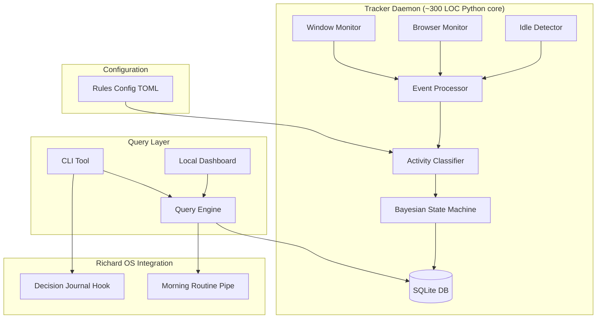
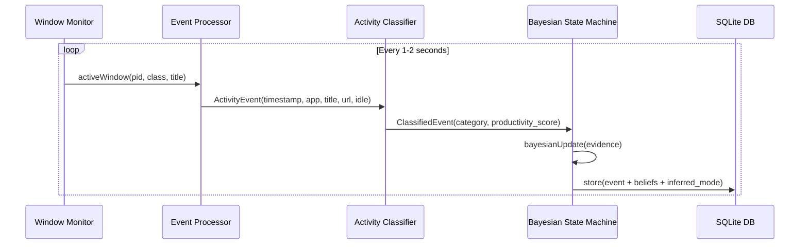

# Design Document: Attention Tracker

## Overview

Attention Tracker is a local-only Linux daemon that monitors the active window, classifies activity into productivity categories, and infers attention state (focused, switching, idle) using a Bayesian probabilistic model. All data stays on-disk in SQLite. No network, no cloud, no telemetry.

The core insight: the difference between "time in an app" and "time actively attending to work." A browser open for 8 hours is noise. 45 minutes of focused writing with no window switches — that's signal. The tracker surfaces these patterns through CLI and a local dashboard.

This serves Level 1 (Sharpen Yourself) by making attention patterns evidence-based. You can't fix what you can't see.

## Architecture



## Sequence Diagram: Main Tracking Loop



## Core Components

### Window Monitor (Wayland-native, X11 fallback)

Wayland is the 2026 default. X11 is the fallback, not the other way around.

```pascal
STRUCTURE WindowInfo
  pid: Integer
  windowClass: String
  windowTitle: String
  timestamp: DateTime
END STRUCTURE
```

- Primary: `wlr-foreign-toplevel` / `ext-foreign-toplevel-list` (Wayland)
- Fallback: `xdotool` / `xprop` (X11/XWayland)
- Emit only on change (deduplicate consecutive identical windows)

### Browser Monitor (Title Parsing First)

Window title parsing is the primary approach — it works across all browsers, Snaps, and Flatpaks without extension installation. Native messaging extensions are an optional enhancement for richer URL data.

```pascal
STRUCTURE TabInfo
  url: String (nullable)
  title: String
  browser: String
  timestamp: DateTime
END STRUCTURE
```

- Primary: Parse browser window title (browsers include page title in `_NET_WM_NAME`)
- Enhancement: Native messaging extension for full URL capture (opt-in)
- Never reads browsing history — only the current active tab context

### Activity Classifier

Maps events to categories using priority-sorted rules. Unmatched events get `category = "uncategorized"` with `productivity_score = NULL` (not 0.5 — that introduces mathematical noise into aggregations).

```pascal
STRUCTURE ClassifiedEvent
  event: ActivityEvent
  category: String
  productivityScore: Float (nullable)  // NULL if uncategorized
  ruleName: String
END STRUCTURE

STRUCTURE ClassificationRule
  name: String
  matchType: Enum(WINDOW_CLASS, TITLE_PATTERN, URL_PATTERN, APP_NAME)
  pattern: String           // regex
  category: String
  productivityScore: Float
  priority: Integer         // higher priority wins
END STRUCTURE
```

## Bayesian Attention State Machine

This is the core innovation over hard-threshold state machines. Instead of rigid rules ("3 switches in 2 min = SWITCHING"), we maintain a probability distribution over attention modes and update it with Bayesian inference on each event.

Why this matters: a 10-second calendar check during a 30-minute focus session shouldn't destroy the FOCUSED state. Hard thresholds can't handle this. Bayesian updates with hysteresis can.

### Belief Structure

```pascal
STRUCTURE AttentionBeliefs
  focused: Float    // P(focused)   — probability user is in deep focus
  switching: Float  // P(switching) — probability user is context-switching
  idle: Float       // P(idle)      — probability user is idle/away
  // INVARIANT: focused + switching + idle = 1.0
END STRUCTURE

STRUCTURE AttentionState
  beliefs: AttentionBeliefs
  inferredMode: AttentionMode  // argmax of beliefs, with hysteresis
  since: DateTime              // when inferredMode last changed
  currentCategory: String
  focusDurationMs: Integer
END STRUCTURE

ENUMERATION AttentionMode
  FOCUSED
  SWITCHING
  IDLE
END ENUMERATION
```

### Bayesian Update Algorithm

```pascal
ALGORITHM bayesianUpdate(state, event, config)
INPUT: state of type AttentionState, event of type ClassifiedEvent, config of type TrackerConfig
OUTPUT: newState of type AttentionState

BEGIN
  ASSERT state.beliefs.focused + state.beliefs.switching + state.beliefs.idle ≈ 1.0

  // Step 1: Compute evidence from the event
  categoryChanged ← event.category ≠ state.currentCategory
  idleSec ← event.event.idleSeconds
  eventDurationMs ← event.event.durationMs

  // Step 2: Compute likelihoods P(evidence | mode) for each mode
  // These are the probability of seeing this evidence IF the user were in each mode

  // --- Focused likelihood ---
  IF idleSec >= config.idle_threshold_seconds THEN
    likelihoodFocused ← 0.01   // almost impossible to be focused while idle
  ELSE IF categoryChanged THEN
    // Micro-interruption detection: short detour < 15s is plausible during focus
    IF eventDurationMs < 15000 THEN
      likelihoodFocused ← 0.4  // brief glance, could still be focused
    ELSE
      likelihoodFocused ← 0.1  // sustained category change, unlikely focused
    END IF
  ELSE
    likelihoodFocused ← 0.9    // same category, not idle — strong focus signal
  END IF

  // --- Switching likelihood ---
  IF idleSec >= config.idle_threshold_seconds THEN
    likelihoodSwitching ← 0.05
  ELSE IF categoryChanged THEN
    likelihoodSwitching ← 0.8  // category change is the hallmark of switching
  ELSE
    likelihoodSwitching ← 0.2  // staying put is weak evidence of switching
  END IF

  // --- Idle likelihood ---
  IF idleSec >= config.away_threshold_seconds THEN
    likelihoodIdle ← 0.99
  ELSE IF idleSec >= config.idle_threshold_seconds THEN
    likelihoodIdle ← 0.9
  ELSE IF idleSec >= 30 THEN
    likelihoodIdle ← 0.3       // some idle time, mild signal
  ELSE
    likelihoodIdle ← 0.05      // actively using computer
  END IF

  // Step 3: Bayesian posterior = prior * likelihood (then normalize)
  posteriorFocused  ← state.beliefs.focused  * likelihoodFocused
  posteriorSwitching ← state.beliefs.switching * likelihoodSwitching
  posteriorIdle     ← state.beliefs.idle     * likelihoodIdle

  // Step 4: Normalize so probabilities sum to 1.0
  total ← posteriorFocused + posteriorSwitching + posteriorIdle
  posteriorFocused  ← posteriorFocused  / total
  posteriorSwitching ← posteriorSwitching / total
  posteriorIdle     ← posteriorIdle     / total

  // Step 5: Apply epsilon floor to prevent certainty collapse
  // Without this, a mode at 0.0 can never recover
  EPSILON ← 0.01
  posteriorFocused  ← MAX(posteriorFocused,  EPSILON)
  posteriorSwitching ← MAX(posteriorSwitching, EPSILON)
  posteriorIdle     ← MAX(posteriorIdle,     EPSILON)

  // Re-normalize after epsilon floor
  total ← posteriorFocused + posteriorSwitching + posteriorIdle
  posteriorFocused  ← posteriorFocused  / total
  posteriorSwitching ← posteriorSwitching / total
  posteriorIdle     ← posteriorIdle     / total

  newBeliefs ← AttentionBeliefs(
    focused: posteriorFocused,
    switching: posteriorSwitching,
    idle: posteriorIdle
  )

  // Step 6: Infer mode with hysteresis
  // Higher threshold to ENTER a mode than to MAINTAIN it
  // This prevents rapid oscillation at decision boundaries
  newMode ← inferModeWithHysteresis(state.inferredMode, newBeliefs, config)

  // Step 7: Update focus duration tracking
  IF newMode = FOCUSED THEN
    newFocusDuration ← state.focusDurationMs + eventDurationMs
  ELSE
    newFocusDuration ← 0
  END IF

  RETURN AttentionState(
    beliefs: newBeliefs,
    inferredMode: newMode,
    since: IF newMode ≠ state.inferredMode THEN event.event.timestamp ELSE state.since,
    currentCategory: event.category,
    focusDurationMs: newFocusDuration
  )
END
```

**Preconditions:**
- state.beliefs sums to 1.0 (within floating-point tolerance)
- event has valid timestamp after state.since
- config thresholds are positive

**Postconditions:**
- Returned beliefs sum to 1.0
- No belief is below EPSILON (0.01)
- inferredMode reflects hysteresis-gated argmax of beliefs
- focusDurationMs resets to 0 on mode change away from FOCUSED

### Hysteresis Function

```pascal
ALGORITHM inferModeWithHysteresis(currentMode, beliefs, config)
INPUT: currentMode of type AttentionMode, beliefs of type AttentionBeliefs, config
OUTPUT: newMode of type AttentionMode

BEGIN
  ENTER_THRESHOLD ← 0.75   // must exceed this to ENTER a new mode
  MAINTAIN_THRESHOLD ← 0.40 // must drop below this to LEAVE current mode

  // Check if current mode should be maintained (sticky)
  currentBelief ← CASE currentMode OF
    FOCUSED:   beliefs.focused
    SWITCHING: beliefs.switching
    IDLE:      beliefs.idle
  END CASE

  IF currentBelief >= MAINTAIN_THRESHOLD THEN
    RETURN currentMode  // stay in current mode (hysteresis)
  END IF

  // Current mode lost confidence — find new mode if any exceeds entry threshold
  IF beliefs.focused >= ENTER_THRESHOLD THEN
    RETURN FOCUSED
  ELSE IF beliefs.idle >= ENTER_THRESHOLD THEN
    RETURN IDLE
  ELSE IF beliefs.switching >= ENTER_THRESHOLD THEN
    RETURN SWITCHING
  END IF

  // No mode has strong enough signal — default to argmax
  RETURN argmax(beliefs.focused, beliefs.switching, beliefs.idle)
END
```

**Preconditions:**
- beliefs sum to 1.0
- ENTER_THRESHOLD > MAINTAIN_THRESHOLD

**Postconditions:**
- Returns a valid AttentionMode
- If current mode belief >= MAINTAIN_THRESHOLD, current mode is preserved (hysteresis)
- Mode only changes when current drops below MAINTAIN and another exceeds ENTER (or argmax fallback)

### Classification Algorithm

```pascal
ALGORITHM classifyEvent(event, rules)
INPUT: event of type ActivityEvent, rules sorted by priority descending
OUTPUT: ClassifiedEvent

BEGIN
  FOR each rule IN rules DO
    matched ← FALSE
    CASE rule.matchType OF
      WINDOW_CLASS:  matched ← regexMatch(rule.pattern, event.windowClass)
      TITLE_PATTERN: matched ← regexMatch(rule.pattern, event.windowTitle)
      URL_PATTERN:   IF event.url IS NOT NULL THEN matched ← regexMatch(rule.pattern, event.url)
      APP_NAME:      matched ← regexMatch(rule.pattern, event.appName)
    END CASE

    IF matched THEN
      RETURN ClassifiedEvent(event, rule.category, rule.productivityScore, rule.name)
    END IF
  END FOR

  // No rule matched — score is NULL, not 0.5
  RETURN ClassifiedEvent(event, "uncategorized", NULL, "default")
END
```

**Preconditions:**
- rules sorted by priority descending; all patterns are valid regex

**Postconditions:**
- Always returns a ClassifiedEvent (never null)
- Unmatched events: category = "uncategorized", productivityScore = NULL
- First (highest-priority) matching rule wins

## Data Model (SQLite)

Requires SQLite JSON1 extension for `app_sequence` and `category_breakdown` JSON field aggregations.

```sql
CREATE TABLE activity_events (
  id TEXT PRIMARY KEY,
  timestamp TEXT NOT NULL,
  app_name TEXT NOT NULL,
  window_class TEXT,
  window_title TEXT,
  url TEXT,
  idle_seconds INTEGER,
  duration_ms INTEGER,
  category TEXT,
  productivity_score REAL,          -- NULL for uncategorized (not 0.5)
  rule_name TEXT,
  attention_mode TEXT,              -- FOCUSED, SWITCHING, IDLE
  belief_focused REAL,              -- P(focused) at time of event
  belief_switching REAL,            -- P(switching) at time of event
  belief_idle REAL,                 -- P(idle) at time of event
  focus_session_id TEXT,
  created_at TEXT DEFAULT CURRENT_TIMESTAMP
);

CREATE TABLE focus_sessions (
  id TEXT PRIMARY KEY,
  start_time TEXT NOT NULL,
  end_time TEXT,
  category TEXT NOT NULL,
  total_duration_ms INTEGER,
  interruption_count INTEGER,
  app_sequence TEXT,                -- JSON array (requires JSON1 extension)
  created_at TEXT DEFAULT CURRENT_TIMESTAMP
);

CREATE TABLE daily_summaries (
  date TEXT PRIMARY KEY,
  total_active_ms INTEGER,
  total_idle_ms INTEGER,
  focus_session_count INTEGER,
  avg_focus_duration_ms INTEGER,
  top_category TEXT,
  category_breakdown TEXT,          -- JSON object (requires JSON1 extension)
  switch_count INTEGER,
  productivity_score_avg REAL,      -- computed excluding NULLs from denominator
  top_daily_insight TEXT,           -- one-liner for Decision Journal pipe
  created_at TEXT DEFAULT CURRENT_TIMESTAMP
);

-- Indexes
CREATE INDEX idx_events_timestamp ON activity_events(timestamp);
CREATE INDEX idx_events_category ON activity_events(category);
CREATE INDEX idx_events_attention_mode ON activity_events(attention_mode);
CREATE INDEX idx_events_session ON activity_events(focus_session_id);
CREATE INDEX idx_sessions_start ON focus_sessions(start_time);
CREATE INDEX idx_summaries_date ON daily_summaries(date);
```

Type convention: `REAL` in SQL schema, `Float` in pseudocode.

### Duration Conservation with NULL Scores

When computing `productivity_score_avg` in daily summaries, exclude events with NULL scores from both numerator and denominator:

```pascal
avgScore ← SUM(score * duration_ms WHERE score IS NOT NULL) / SUM(duration_ms WHERE score IS NOT NULL)
```

Events with NULL scores still count toward `total_active_ms` and `category_breakdown` — they just don't pollute the productivity metric.

## Configuration

```pascal
STRUCTURE TrackerConfig
  poll_interval_ms: Integer DEFAULT 1500
  idle_threshold_seconds: Integer DEFAULT 120
  away_threshold_seconds: Integer DEFAULT 300
  db_path: String DEFAULT "~/.local/share/attention-tracker/tracker.db"
  rules_path: String DEFAULT "~/.config/attention-tracker/rules.toml"
  dashboard_port: Integer DEFAULT 8787
  // Bayesian tuning
  enter_threshold: Float DEFAULT 0.75
  maintain_threshold: Float DEFAULT 0.40
  epsilon_floor: Float DEFAULT 0.01
  micro_interruption_ms: Integer DEFAULT 15000
END STRUCTURE
```

## Richard OS Integration

The tracker pipes its top daily insight into the Decision Journal and morning routine. This is the Richard-specific hook that makes the data actionable rather than just visible.

### Daily Insight → Decision Journal

At end-of-day (or on `attention-tracker journal`), the CLI:
1. Generates the daily summary if not already materialized
2. Extracts the `top_daily_insight` — a single sentence like: "3h12m focused on deep-work (best this week), but 47 min lost to Slack between 2-3pm"
3. Pipes it to the Decision Journal via CLI hook:

```bash
# EOD hook (runs after Meeting Sync, before System Refresh)
attention-tracker journal >> ~/shared/context/intake/attention-insight.md
```

The intake file gets picked up by the Autoresearch Loop and routed to the appropriate organ (eyes.md for patterns, brain.md for strategic implications).

### Morning Routine Integration

During the morning routine, the CLI surfaces yesterday's attention pattern:

```bash
# Part of morning routine bootstrap
attention-tracker yesterday --oneliner
# Output: "Yesterday: 4h22m focused (2 deep sessions), 1h15m switching, peak focus 9-11am"
```

This feeds into the daily brief so Richard sees attention data alongside calendar, tasks, and meeting prep — no extra dashboard to check.

### CLI Commands for Integration

```bash
attention-tracker today              # today's summary
attention-tracker yesterday --oneliner  # one-line for morning routine
attention-tracker journal            # generate insight for Decision Journal
attention-tracker sessions --date today # focus sessions detail
attention-tracker report --range 7d --group category  # weekly breakdown
attention-tracker pattern --range 30d --metric focus   # when do focus sessions happen
attention-tracker unknowns           # list uncategorized apps for user classification
attention-tracker start | stop | status  # daemon management
```

## Correctness Properties

*A property is a characteristic or behavior that should hold true across all valid executions of a system — essentially, a formal statement about what the system should do. Properties serve as the bridge between human-readable specifications and machine-verifiable correctness guarantees.*

### Property 1: Window Event Deduplication

*For any* sequence of window polls, the emitted event stream shall never contain two consecutive events with identical PID, window class, and window title. Consecutive identical polls are collapsed into a single event.

**Validates: Requirement 1.4**

### Property 2: Browser Title Extraction Round-Trip

*For any* browser window title string constructed as "{page_title} - {browser_name}", extracting the page title and reconstructing the window title shall produce the original page title.

**Validates: Requirement 2.1**

### Property 3: Classification Rule Priority

*For any* set of classification rules sorted by priority and any activity event, if multiple rules match the event, the classifier shall return the category and score of the highest-priority matching rule. If no rule matches, the classifier shall return category "uncategorized" with productivity_score NULL.

**Validates: Requirements 3.1, 3.2, 3.3**

### Property 4: Productivity Score Bounds

*For all* classified events where productivity_score is not NULL, the score shall be within the range [0.0, 1.0].

**Validates: Requirement 3.5**

### Property 5: Belief Invariants

*For any* sequence of classified events processed by the Bayesian State Machine, after every update: (a) belief_focused + belief_switching + belief_idle = 1.0 within ±0.001, and (b) no individual belief is below EPSILON (0.01).

**Validates: Requirements 4.1, 4.3**

### Property 6: Hysteresis Correctness

*For any* current attention mode and belief triple: (a) if the current mode's belief is at or above MAINTAIN_THRESHOLD (0.40), the mode is preserved; (b) if the current mode's belief drops below MAINTAIN_THRESHOLD and another mode exceeds ENTER_THRESHOLD (0.75), the mode transitions to that new mode; (c) if no mode exceeds ENTER_THRESHOLD, the mode with the highest belief is selected.

**Validates: Requirements 5.1, 5.2, 5.3**

### Property 7: Hysteresis Stability Under Single Contradictory Event

*For any* attention state where the current mode's belief exceeds MAINTAIN_THRESHOLD, processing a single contradictory event shall not change the inferred mode.

**Validates: Requirement 5.1**

### Property 8: Event Storage Round-Trip

*For any* valid activity event written to the database, reading it back shall produce an event with all fields (timestamp, app_name, window_class, window_title, category, productivity_score, attention_mode, belief_focused, belief_switching, belief_idle) equal to the original.

**Validates: Requirement 6.2**

### Property 9: Temporal Ordering

*For all* events e1, e2 in the database, if e1 was stored before e2, then e1.timestamp ≤ e2.timestamp.

**Validates: Requirement 6.3**

### Property 10: Summary Aggregation Correctness

*For any* set of activity events in a daily summary: (a) productivity_score_avg is computed only from events where productivity_score is not NULL, excluding NULL-scored events from both numerator and denominator; (b) total_active_ms includes durations from all events regardless of whether productivity_score is NULL.

**Validates: Requirements 6.4, 6.5**

### Property 11: Focus Session Integrity

*For any* sequence of events that produces focus sessions: (a) every session has start_time strictly less than end_time; (b) every event with a focus_session_id has a timestamp within the session's [start_time, end_time] range; (c) a new session is created on each transition to FOCUSED and closed on each transition away from FOCUSED.

**Validates: Requirements 7.1, 7.2, 7.3, 7.4**

### Property 12: State Machine Determinism

*For any* two identical sequences of classified events starting from the same initial state, the Bayesian State Machine shall produce identical belief sequences and identical mode sequences.

**Validates: Requirement 4.2**

## Error Handling

### Display Server Connection Lost
Window Monitor returns sentinel "unknown" WindowInfo. Events recorded with app_name="unknown". Idle detector continues independently. Normal tracking resumes on reconnection.

### Browser Extension Not Available
Falls back to window title parsing (primary approach anyway). Classification uses title patterns instead of URL patterns. Accuracy decreases slightly but tracking continues.

### SQLite Write Failure
Events buffered in-memory (max 1000). Retry with exponential backoff (1s→30s max). On buffer full, oldest events dropped with count logged. On corruption, attempt WAL recovery; if that fails, create new database.

### Invalid Classification Rule
Rule skipped with warning logged. Other rules continue. `attention-tracker rule validate` checks rules before daemon loads them.

### Daemon Crash/Restart
On restart, reads last event timestamp from DB. Gap recorded as "daemon-offline" event. Bayesian beliefs reset to uniform prior (0.33, 0.33, 0.34) on restart. Systemd `Restart=on-failure` ensures auto-restart.

## Testing Strategy

### Unit Tests
- Activity Classifier: all rule types, priority ordering, default NULL score for uncategorized
- Bayesian State Machine: belief updates, normalization, epsilon floor, hysteresis transitions
- Event Processor: signal merging, deduplication, NULL browser tab handling

### Property-Based Tests (Hypothesis)
1. **Belief normalization**: For any sequence of events, beliefs always sum to 1.0 ±0.001
2. **Epsilon floor**: No belief ever drops below 0.01
3. **Classification totality**: classify() always returns non-null ClassifiedEvent; uncategorized events have NULL score
4. **State machine determinism**: Same event sequence → same belief sequence
5. **Duration conservation**: Daily summary totals = sum of individual event durations
6. **Hysteresis stability**: Single contradictory event doesn't flip mode if current belief > MAINTAIN_THRESHOLD

### Integration Tests
- End-to-end: simulate window switches, verify events + beliefs in DB
- CLI round-trip: collect data → query → verify output matches DB
- Crash recovery: kill -9 → restart → verify no corruption, beliefs reset to prior
- Journal pipe: verify `attention-tracker journal` produces valid insight string

## Dependencies

- **Wayland protocols**: `wlr-foreign-toplevel` / `ext-foreign-toplevel-list` (primary window monitoring)
- **X11 libraries**: `libX11`, `libXss` (fallback for X11/XWayland)
- **SQLite 3 with JSON1 extension**: Local database (verify JSON1 with `SELECT json('{}')`)
- **Python 3.10+**: Core runtime (~300 LOC for WindowMonitor + Classifier + StateMachine)
- **TOML parser**: `tomllib` (stdlib in 3.11+) or `tomli`
- **Systemd**: Daemon management (optional, can run standalone)
- **No external services**: Zero network dependencies by design
