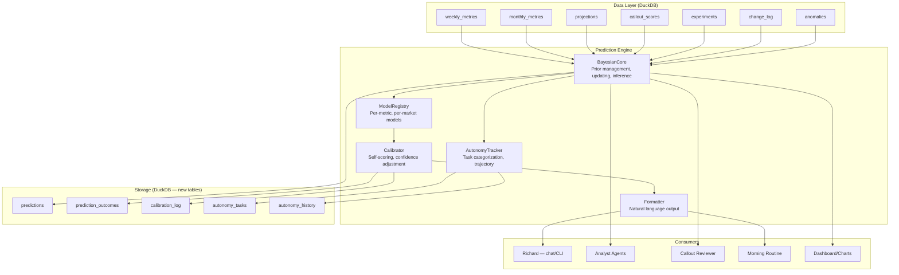
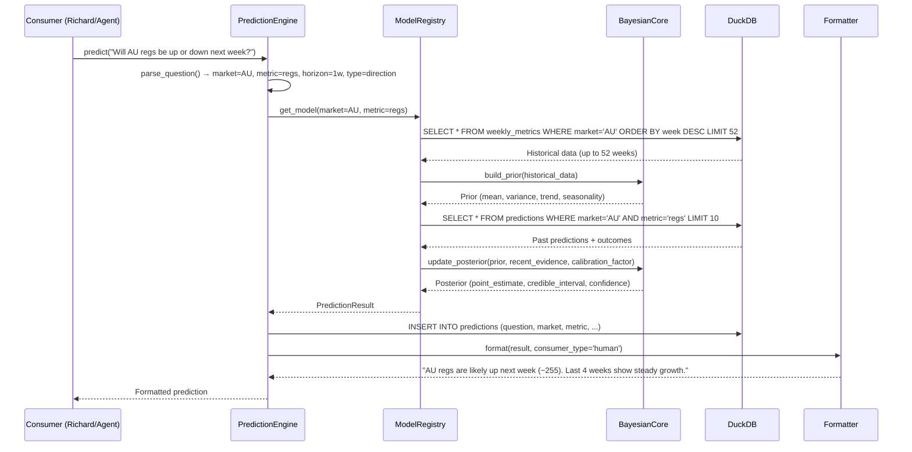
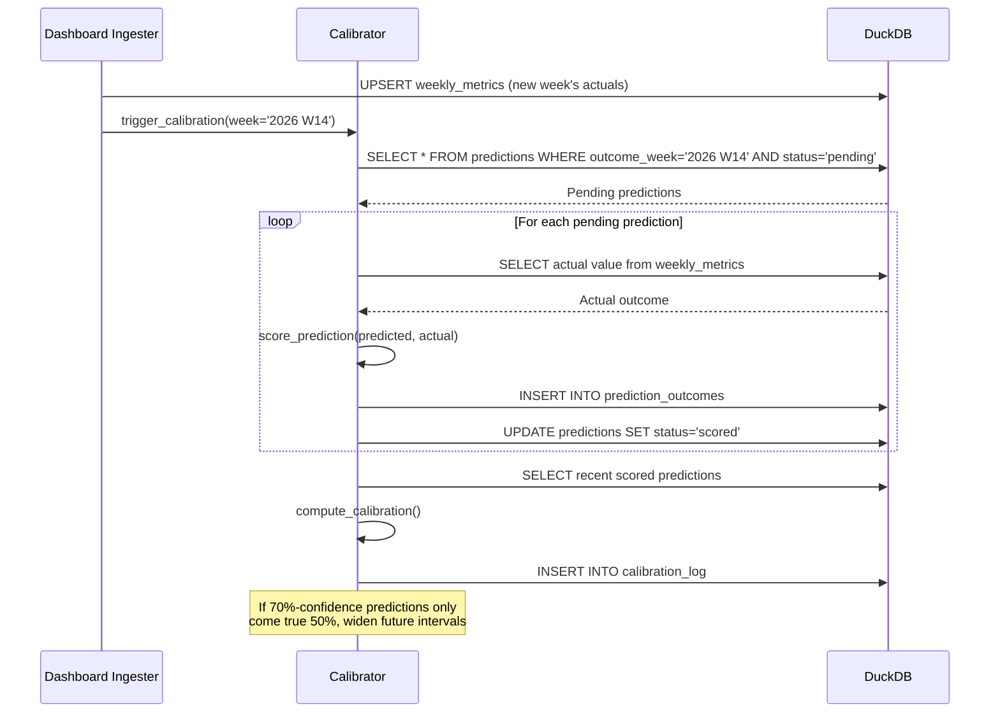
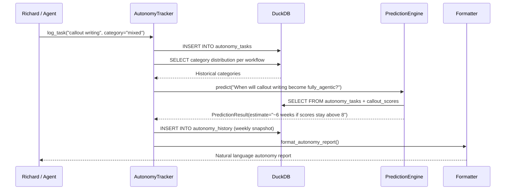

# Design Document: Bayesian Prediction Engine

## Overview

The prediction engine adds a Bayesian inference layer on top of the DuckDB data layer, turning historical paid search metrics into forward-looking predictions with natural-language confidence levels. It reads from the tables defined in the data-layer-overhaul spec (weekly_metrics, monthly_metrics, projections, callout_scores, experiments, etc.), builds implicit priors from historical patterns, updates those priors as new data arrives each week, and outputs predictions that sound like a human analyst — "likely", "very likely", "uncertain" — never "posterior distribution" or "credible interval."

The engine serves multiple consumers: Richard directly via chat or CLI, callout analyst agents for better projections, the callout reviewer for predicted quality scores, the morning routine for proactive alerts, and a new autonomy measurement system that tracks what percentage of Richard's marketing manager work is fully agentic vs. mixed vs. human-only. Every prediction is logged to DuckDB with its confidence level, and when the outcome is known, the prediction is scored. The engine's calibration — did 70% predictions come true 70% of the time? — is tracked over time, and poor calibration automatically widens confidence intervals.

This is structural, not cosmetic. It changes how predictions are made (Bayesian updating from historical data) while keeping the output invisible — Richard sees better predictions over time without knowing the machinery. It reduces decisions by giving agents a single `predict()` call instead of building their own projection logic. And it embodies subtraction: the Bayesian core replaces ad-hoc projection methods scattered across analyst agents with one canonical prediction path.

## Architecture

The engine sits between the DuckDB data layer and the consumers (agents, CLI, morning routine). It reads structured data via `query.py`, maintains internal model state in DuckDB tables, and exposes a simple Python API + CLI.



## Sequence Diagrams

### Prediction Request Flow



### Weekly Calibration Flow



### Autonomy Measurement Flow




## Components and Interfaces

### Component 1: PredictionEngine (main entry point)

**Purpose**: Single entry point for all prediction requests. Parses natural-language questions, routes to the appropriate model, and returns formatted results.

**Interface**:
```python
class PredictionEngine:
    def __init__(self, db_path: str = None):
        """Initialize with DuckDB connection. Loads model registry and calibrator."""

    def predict(self, question: str, consumer: str = 'human', context: dict = None) -> PredictionResult:
        """Main entry point. Parses question, runs inference, logs, formats."""

    def predict_metric(self, market: str, metric: str, horizon_weeks: int = 1,
                       consumer: str = 'human') -> PredictionResult:
        """Structured prediction for a specific market+metric+horizon."""

    def calibrate(self, week: str = None) -> CalibrationReport:
        """Score pending predictions against actuals. Called after each ingestion."""

    def get_calibration_report(self) -> CalibrationReport:
        """Current calibration state: accuracy by confidence tier."""
```

**Responsibilities**:
- Parse natural-language questions into structured prediction requests
- Route to appropriate model (metric, direction, comparison, probability)
- Log every prediction to DuckDB
- Format output for consumer type
- Trigger calibration when new data arrives


### Component 2: BayesianCore (inference engine)

**Purpose**: The statistical machinery. Builds priors from historical data, updates with new evidence, produces posterior estimates with credible intervals. This component is invisible to consumers.

**Interface**:
```python
class BayesianCore:
    def build_prior(self, historical: list[dict], metric: str) -> PriorState:
        """Build prior from historical data. Extracts: mean, variance, trend, seasonality, volatility."""

    def update_posterior(self, prior: PriorState, new_evidence: list[dict],
                         calibration_factor: float = 1.0) -> PosteriorState:
        """Conjugate Normal-Gamma update. calibration_factor widens/tightens intervals."""

    def point_estimate(self, posterior: PosteriorState, horizon: int = 1) -> float:
        """Extract point estimate projected forward by horizon weeks."""

    def credible_interval(self, posterior: PosteriorState, level: float = 0.7) -> tuple[float, float]:
        """Credible interval at given level (default 70%)."""

    def direction_probability(self, posterior: PosteriorState, threshold: float = 0.0) -> float:
        """Probability that next value exceeds current + threshold."""

    def time_to_target(self, posterior: PosteriorState, target: float,
                       max_weeks: int = 26) -> tuple[int, float]:
        """Estimated weeks to reach target, with confidence."""
```

**Responsibilities**:
- Normal-Gamma conjugate model for metric values (handles mean + variance updating)
- Trend extraction via simple linear regression on recent data
- Seasonality detection via week-of-year patterns (when 52+ weeks available)
- Volatility estimation from residuals
- All statistical output stays internal — never exposed to consumers


### Component 3: ModelRegistry (per-metric model management)

**Purpose**: Manages one model per (market, metric) pair. Handles model creation, caching, and invalidation when new data arrives.

**Interface**:
```python
class ModelRegistry:
    def get_model(self, market: str, metric: str) -> BayesianModel:
        """Get or create a model for this market+metric pair."""

    def invalidate(self, market: str = None, metric: str = None) -> int:
        """Invalidate cached models. Called after new data ingestion."""

    def list_models(self) -> list[dict]:
        """List all active models with their last-updated timestamps."""
```

**Responsibilities**:
- Lazy model creation (built on first request, cached)
- Cache invalidation when new weekly data arrives
- No persistent model storage — models are rebuilt from DuckDB data on demand
- This keeps the system stateless and portable (no pickle files, no model artifacts)

### Component 4: Calibrator (self-scoring)

**Purpose**: Tracks prediction accuracy and adjusts confidence levels. The engine's self-awareness mechanism.

**Interface**:
```python
class Calibrator:
    def score_prediction(self, prediction_id: int, actual_value: float) -> PredictionScore:
        """Score a single prediction against its actual outcome."""

    def compute_calibration(self, lookback: int = 100) -> CalibrationReport:
        """Compute calibration across recent predictions. Checks if X%-confidence predictions came true X% of the time."""

    def get_confidence_adjustment(self) -> float:
        """Returns multiplier for credible intervals. 1.0=well-calibrated, >1.0=overconfident, <1.0=underconfident."""

    def confidence_to_language(self, probability: float) -> str:
        """Map probability to natural language: >0.85='very likely', 0.70-0.85='likely', 0.55-0.70='leaning toward', 0.45-0.55='uncertain', 0.30-0.45='leaning against', 0.15-0.30='unlikely', <0.15='very unlikely'."""
```

**Responsibilities**:
- Score each prediction when outcome is known
- Track calibration by confidence tier over time
- Automatically adjust confidence intervals based on calibration history
- Map statistical confidence to natural language


### Component 5: Formatter (natural language output)

**Purpose**: Translates PredictionResult objects into consumer-appropriate output. Human consumers get natural language. Agent consumers get structured dicts.

**Interface**:
```python
class Formatter:
    def format(self, result: PredictionResult, consumer: str = 'human') -> str | dict:
        """Format prediction. 'human' = natural language, 'agent' = structured dict."""

    def format_alert(self, result: PredictionResult) -> str:
        """Format as a morning routine alert. Concise, actionable."""

    def format_autonomy_report(self, current: dict, trajectory: list[dict],
                                predictions: list[PredictionResult]) -> str:
        """Format autonomy measurement report for Richard."""
```

**Responsibilities**:
- No statistical jargon in human output — ever
- Use Richard's voice: direct, concise, data-grounded
- Include reasoning ("the last 4 weeks show steady growth")
- Alerts are one-liners for morning routine integration

### Component 6: AutonomyTracker (Level 5 measurement)

**Purpose**: Categorizes tasks/workflows as fully_agentic, mixed, or human_only. Tracks ratios over time. Predicts when workflows will shift categories.

**Interface**:
```python
class AutonomyTracker:
    def log_task(self, workflow: str, category: str, details: str = None,
                 agent: str = None) -> int:
        """Log a task execution. category: 'fully_agentic'|'mixed'|'human_only'. Returns task ID."""

    def get_ratios(self, period: str = 'week') -> dict:
        """Current autonomy ratios by period."""

    def get_workflow_trajectory(self, workflow: str) -> list[dict]:
        """Historical category distribution for a specific workflow."""

    def predict_transition(self, workflow: str,
                           target_category: str = 'fully_agentic') -> PredictionResult:
        """Predict when a workflow will reach target category."""

    def five_levels_position(self) -> dict:
        """Map current autonomy state to Richard's Five Levels framework."""
```

**Responsibilities**:
- Categorize each task/workflow execution
- Track ratios over time (weekly snapshots)
- Connect to the Five Levels framework from brain.md
- Predict workflow transitions using the BayesianCore


## Data Models

### New DuckDB Tables

```python
# predictions: every prediction logged
CREATE TABLE IF NOT EXISTS predictions (
    id INTEGER PRIMARY KEY,
    question TEXT,
    market VARCHAR,
    metric VARCHAR,
    prediction_type VARCHAR,          -- 'point','direction','probability','time_to_target','comparison'
    point_estimate DOUBLE,
    lower_bound DOUBLE,
    upper_bound DOUBLE,
    confidence_level VARCHAR,         -- 'very_likely','likely','leaning_toward','uncertain', etc.
    confidence_probability DOUBLE,
    direction VARCHAR,                -- 'up','down','flat', NULL
    horizon_weeks INTEGER,
    outcome_week VARCHAR,             -- when the outcome will be known
    reasoning TEXT,
    consumer VARCHAR,                 -- 'richard','analyst','reviewer','morning_routine'
    status VARCHAR DEFAULT 'pending', -- 'pending','scored','expired','cancelled'
    created_at TIMESTAMP DEFAULT current_timestamp
);

# prediction_outcomes: scored predictions
CREATE TABLE IF NOT EXISTS prediction_outcomes (
    id INTEGER PRIMARY KEY,
    prediction_id INTEGER NOT NULL,
    actual_value DOUBLE,
    predicted_value DOUBLE,
    error_pct DOUBLE,
    direction_correct BOOLEAN,
    within_interval BOOLEAN,
    score DOUBLE,                     -- 0-1 composite accuracy score
    scored_at TIMESTAMP DEFAULT current_timestamp,
    FOREIGN KEY (prediction_id) REFERENCES predictions(id)
);

# calibration_log: periodic calibration snapshots
CREATE TABLE IF NOT EXISTS calibration_log (
    id INTEGER PRIMARY KEY,
    period VARCHAR,
    total_predictions INTEGER,
    total_scored INTEGER,
    mean_error_pct DOUBLE,
    direction_accuracy DOUBLE,
    interval_coverage DOUBLE,
    calibration_score DOUBLE,
    confidence_adjustment DOUBLE,
    tier_breakdown TEXT,              -- JSON
    computed_at TIMESTAMP DEFAULT current_timestamp
);

# autonomy_tasks: individual task executions
CREATE TABLE IF NOT EXISTS autonomy_tasks (
    id INTEGER PRIMARY KEY,
    workflow VARCHAR NOT NULL,        -- 'callout_writing','morning_brief','bid_management', etc.
    category VARCHAR NOT NULL,        -- 'fully_agentic','mixed','human_only'
    details TEXT,
    agent VARCHAR,
    quality_score DOUBLE,
    logged_at TIMESTAMP DEFAULT current_timestamp
);

# autonomy_history: weekly snapshots of autonomy ratios
CREATE TABLE IF NOT EXISTS autonomy_history (
    week VARCHAR NOT NULL,
    workflow VARCHAR NOT NULL,
    total_tasks INTEGER,
    pct_fully_agentic DOUBLE,
    pct_mixed DOUBLE,
    pct_human_only DOUBLE,
    avg_quality_score DOUBLE,
    five_levels_position INTEGER,     -- 1-5 mapping
    computed_at TIMESTAMP DEFAULT current_timestamp,
    PRIMARY KEY (week, workflow)
);
```


### Core Data Types

```python
from dataclasses import dataclass, field
from typing import Optional
from datetime import datetime

@dataclass
class PriorState:
    """Internal representation of a Bayesian prior. Never exposed to consumers."""
    mean: float
    variance: float
    n_observations: int
    trend_slope: float              # weekly change rate
    trend_confidence: float         # R-squared of trend fit
    seasonality: dict[int, float]   # week_of_year -> seasonal adjustment factor
    volatility: float               # residual standard deviation
    last_updated: datetime = field(default_factory=datetime.now)

@dataclass
class PosteriorState:
    """Internal representation of updated beliefs. Never exposed to consumers."""
    mean: float
    variance: float
    n_observations: int
    trend_slope: float
    trend_confidence: float
    seasonality: dict[int, float]
    volatility: float
    calibration_factor: float
    credible_interval_70: tuple[float, float]
    credible_interval_90: tuple[float, float]

@dataclass
class PredictionResult:
    """The output of a prediction. This IS exposed to consumers."""
    question: str
    market: Optional[str]
    metric: Optional[str]
    prediction_type: str
    point_estimate: Optional[float]
    lower_bound: Optional[float]
    upper_bound: Optional[float]
    confidence_level: str
    confidence_probability: float
    direction: Optional[str]
    horizon_weeks: int
    reasoning: str
    formatted_output: Optional[str]
    prediction_id: Optional[int]

@dataclass
class PredictionScore:
    """Result of scoring a prediction against actuals."""
    prediction_id: int
    actual_value: float
    predicted_value: float
    error_pct: float
    direction_correct: bool
    within_interval: bool
    score: float

@dataclass
class CalibrationReport:
    """Snapshot of engine calibration state."""
    total_predictions: int
    total_scored: int
    mean_error_pct: float
    direction_accuracy: float
    interval_coverage: float
    calibration_score: float
    confidence_adjustment: float
    tier_breakdown: dict[str, dict]
```

### Validation Rules

| Table | Rule | Enforcement |
|-------|------|-------------|
| predictions | prediction_type IN ('point','direction','probability','time_to_target','comparison') | CHECK |
| predictions | confidence_probability BETWEEN 0 AND 1 | CHECK |
| predictions | status IN ('pending','scored','expired','cancelled') | CHECK |
| prediction_outcomes | score BETWEEN 0 AND 1 | CHECK |
| prediction_outcomes | prediction_id EXISTS in predictions | FOREIGN KEY |
| calibration_log | direction_accuracy BETWEEN 0 AND 1 | CHECK |
| autonomy_tasks | category IN ('fully_agentic','mixed','human_only') | CHECK |
| autonomy_history | five_levels_position BETWEEN 1 AND 5 | CHECK |


## Key Functions with Formal Specifications

### Function 1: `build_prior()`

```python
def build_prior(self, historical: list[dict], metric: str) -> PriorState:
    values = [row[metric] for row in historical if row.get(metric) is not None]
    if len(values) < 3:
        return PriorState(mean=values[0] if values else 0.0, variance=1e6,
                          n_observations=len(values), trend_slope=0.0,
                          trend_confidence=0.0, seasonality={}, volatility=1e3)
    n = len(values)
    mean = sum(values) / n
    variance = sum((v - mean) ** 2 for v in values) / (n - 1)
    # Trend: simple linear regression on index
    indices = list(range(n))
    x_mean = sum(indices) / n
    ss_xy = sum((i - x_mean) * (v - mean) for i, v in zip(indices, values))
    ss_xx = sum((i - x_mean) ** 2 for i in indices)
    trend_slope = ss_xy / ss_xx if ss_xx > 0 else 0.0
    predicted = [mean + trend_slope * (i - x_mean) for i in indices]
    ss_res = sum((v - p) ** 2 for v, p in zip(values, predicted))
    ss_tot = sum((v - mean) ** 2 for v in values)
    trend_confidence = 1 - (ss_res / ss_tot) if ss_tot > 0 else 0.0
    seasonality = {}  # populated when n >= 52
    residuals = [v - p for v, p in zip(values, predicted)]
    volatility = (sum(r ** 2 for r in residuals) / (n - 2)) ** 0.5 if n > 2 else variance ** 0.5
    return PriorState(mean=mean, variance=variance, n_observations=n,
                      trend_slope=trend_slope, trend_confidence=trend_confidence,
                      seasonality=seasonality, volatility=volatility)
```

**Preconditions:**
- `historical` is a list of dicts from `weekly_metrics`, ordered most-recent-first
- `metric` is a valid column name in `weekly_metrics`

**Postconditions:**
- If fewer than 3 data points: returns uninformative prior (variance >= 1e6)
- If 3+ data points: mean, variance, trend, and volatility computed from data
- No side effects — pure function

**Loop Invariants:**
- During trend computation: all previously processed values contribute to running sums


### Function 2: `update_posterior()`

```python
def update_posterior(self, prior: PriorState, new_evidence: list[dict],
                     calibration_factor: float = 1.0) -> PosteriorState:
    metric_values = [row.get('value', row.get('regs', 0)) for row in new_evidence if row]
    if not metric_values:
        ci_70 = (prior.mean - 1.04 * prior.volatility * calibration_factor,
                 prior.mean + 1.04 * prior.volatility * calibration_factor)
        ci_90 = (prior.mean - 1.645 * prior.volatility * calibration_factor,
                 prior.mean + 1.645 * prior.volatility * calibration_factor)
        return PosteriorState(mean=prior.mean, variance=prior.variance,
                              n_observations=prior.n_observations, trend_slope=prior.trend_slope,
                              trend_confidence=prior.trend_confidence, seasonality=prior.seasonality,
                              volatility=prior.volatility, calibration_factor=calibration_factor,
                              credible_interval_70=ci_70, credible_interval_90=ci_90)
    n_new = len(metric_values)
    new_mean = sum(metric_values) / n_new
    prior_weight = prior.n_observations
    total_weight = prior_weight + n_new
    posterior_mean = (prior_weight * prior.mean + n_new * new_mean) / total_weight
    new_var = sum((v - new_mean) ** 2 for v in metric_values) / n_new if n_new > 1 else prior.variance
    posterior_variance = ((prior_weight * prior.variance + n_new * new_var) / total_weight
        + (prior_weight * n_new * (prior.mean - new_mean) ** 2) / (total_weight ** 2))
    # Trend: blend 60% recent, 40% prior (recency bias)
    posterior_trend = prior.trend_slope  # default
    if n_new >= 3:
        recent_indices = list(range(n_new))
        rx_mean = sum(recent_indices) / n_new
        ss_xy = sum((i - rx_mean) * (v - new_mean) for i, v in zip(recent_indices, metric_values))
        ss_xx = sum((i - rx_mean) ** 2 for i in recent_indices)
        recent_trend = ss_xy / ss_xx if ss_xx > 0 else 0.0
        posterior_trend = 0.6 * recent_trend + 0.4 * prior.trend_slope
    posterior_volatility = (prior.volatility * prior_weight + (new_var ** 0.5) * n_new) / total_weight
    adjusted_vol = posterior_volatility * calibration_factor
    ci_70 = (posterior_mean - 1.04 * adjusted_vol, posterior_mean + 1.04 * adjusted_vol)
    ci_90 = (posterior_mean - 1.645 * adjusted_vol, posterior_mean + 1.645 * adjusted_vol)
    return PosteriorState(mean=posterior_mean, variance=posterior_variance,
                          n_observations=total_weight, trend_slope=posterior_trend,
                          trend_confidence=prior.trend_confidence, seasonality=prior.seasonality,
                          volatility=posterior_volatility, calibration_factor=calibration_factor,
                          credible_interval_70=ci_70, credible_interval_90=ci_90)
```

**Preconditions:**
- `prior` is a valid PriorState
- `calibration_factor` is a positive float (typically 0.5-2.0)

**Postconditions:**
- Posterior mean lies between prior mean and evidence mean
- Posterior variance <= prior variance (more data = more certainty)
- Credible intervals scaled by calibration_factor
- No side effects — pure function

**Loop Invariants:**
- During variance computation: running sum of squared deviations is non-negative


### Function 3: `score_prediction()`

```python
def score_prediction(self, prediction_id: int, actual_value: float) -> PredictionScore:
    pred = db(f"SELECT * FROM predictions WHERE id = {prediction_id}")[0]
    predicted = pred['point_estimate']
    error_pct = abs(actual_value - predicted) / abs(actual_value) * 100 if actual_value != 0 else 0
    direction_correct = True
    if pred['direction']:
        if pred['direction'] == 'up':
            direction_correct = actual_value > predicted - abs(predicted * 0.02)
        else:
            direction_correct = actual_value < predicted + abs(predicted * 0.02)
    within_interval = (pred['lower_bound'] is not None and pred['upper_bound'] is not None
                       and pred['lower_bound'] <= actual_value <= pred['upper_bound'])
    # Composite: 40% direction, 30% interval, 30% error magnitude
    dir_score = 1.0 if direction_correct else 0.0
    int_score = 1.0 if within_interval else 0.0
    err_score = max(0, 1.0 - error_pct / 50)
    score = 0.4 * dir_score + 0.3 * int_score + 0.3 * err_score
    result = PredictionScore(prediction_id=prediction_id, actual_value=actual_value,
                             predicted_value=predicted, error_pct=error_pct,
                             direction_correct=direction_correct, within_interval=within_interval,
                             score=score)
    db_upsert('prediction_outcomes', {'prediction_id': prediction_id, 'actual_value': actual_value,
              'predicted_value': predicted, 'error_pct': error_pct,
              'direction_correct': direction_correct, 'within_interval': within_interval,
              'score': score}, key_cols=['prediction_id'])
    db_write(f"UPDATE predictions SET status = 'scored' WHERE id = {prediction_id}")
    return result
```

**Preconditions:**
- `prediction_id` exists in `predictions` table with status 'pending'
- `actual_value` is a valid numeric value

**Postconditions:**
- `prediction_outcomes` table has a new row for this prediction
- `predictions` row status updated to 'scored'
- Composite score is between 0.0 and 1.0

### Function 4: `compute_calibration()`

```python
def compute_calibration(self, lookback: int = 100) -> CalibrationReport:
    scored = db(f"""SELECT p.*, po.actual_value, po.direction_correct, po.within_interval, po.score
        FROM predictions p JOIN prediction_outcomes po ON p.id = po.prediction_id
        ORDER BY po.scored_at DESC LIMIT {lookback}""")
    if not scored:
        return CalibrationReport(total_predictions=0, total_scored=0, mean_error_pct=0,
                                 direction_accuracy=0, interval_coverage=0,
                                 calibration_score=1.0, confidence_adjustment=1.0, tier_breakdown={})
    tiers = {}
    for pred in scored:
        level = pred['confidence_level']
        if level not in tiers:
            tiers[level] = {'count': 0, 'hits': 0, 'expected_rate': 0}
        tiers[level]['count'] += 1
        if pred['within_interval']:
            tiers[level]['hits'] += 1
        tiers[level]['expected_rate'] = pred['confidence_probability']
    for level, data in tiers.items():
        data['hit_rate'] = data['hits'] / data['count'] if data['count'] > 0 else 0
    total = len(scored)
    direction_correct = sum(1 for s in scored if s['direction_correct'])
    within_interval = sum(1 for s in scored if s['within_interval'])
    mean_error = sum(abs(s.get('error_pct', 0) or 0) for s in scored) / total
    cal_errors = [abs(d['hit_rate'] - d['expected_rate']) for d in tiers.values() if d['count'] >= 5]
    calibration_score = 1.0 - (sum(cal_errors) / len(cal_errors)) if cal_errors else 1.0
    main_tier = max(tiers.values(), key=lambda d: d['count']) if tiers else None
    if main_tier and main_tier['hit_rate'] > 0 and main_tier['count'] >= 5:
        adjustment = max(0.5, min(2.0, main_tier['expected_rate'] / main_tier['hit_rate']))
    else:
        adjustment = 1.0
    return CalibrationReport(total_predictions=total, total_scored=total,
                             mean_error_pct=mean_error, direction_accuracy=direction_correct / total,
                             interval_coverage=within_interval / total,
                             calibration_score=calibration_score, confidence_adjustment=adjustment,
                             tier_breakdown=tiers)
```

**Preconditions:**
- `lookback` is a positive integer

**Postconditions:**
- If no scored predictions: returns neutral report (adjustment=1.0)
- confidence_adjustment clamped to [0.5, 2.0]
- Tiers with fewer than 5 predictions excluded from calibration error

**Loop Invariants:**
- Each prediction counted exactly once in exactly one tier


## Algorithmic Pseudocode

### Main Prediction Algorithm

```pascal
ALGORITHM predict(question, consumer, context)
INPUT: question (string), consumer ('human'|'agent'), context (optional dict)
OUTPUT: PredictionResult with formatted output

BEGIN
  parsed ← parse_question(question, context)
  ASSERT parsed.market IS NOT NULL OR parsed.metric IS NOT NULL

  historical ← market_trend(parsed.market, weeks=52)
  IF length(historical) < 3 THEN
    RETURN low_confidence_result("Insufficient data for reliable prediction")
  END IF

  prior ← build_prior(historical, parsed.metric)
  cal_factor ← calibrator.get_confidence_adjustment()
  ASSERT 0.5 <= cal_factor <= 2.0

  recent ← historical[0:8]
  posterior ← update_posterior(prior, recent, cal_factor)
  ASSERT posterior.n_observations >= prior.n_observations

  SWITCH parsed.prediction_type
    CASE 'direction':
      prob ← direction_probability(posterior)
      direction ← IF prob > 0.5 THEN 'up' ELSE 'down'
      confidence ← confidence_to_language(max(prob, 1 - prob))
    CASE 'point':
      estimate ← point_estimate(posterior, parsed.horizon)
      ci ← credible_interval(posterior, level=0.7)
    CASE 'time_to_target':
      (weeks_est, conf) ← time_to_target(posterior, parsed.target)
    CASE 'probability':
      prob ← direction_probability(posterior, threshold=parsed.threshold)
    CASE 'comparison':
      posterior_b ← build_and_update(parsed.comparison_market, parsed.metric)
      result ← compare_posteriors(posterior, posterior_b)
  END SWITCH

  reasoning ← build_reasoning(posterior, historical, parsed)
  result ← PredictionResult(question, parsed, estimate, ci, confidence, reasoning)
  result.prediction_id ← log_prediction(result)
  result.formatted_output ← formatter.format(result, consumer)
  RETURN result
END
```

### Question Parsing Algorithm

```pascal
ALGORITHM parse_question(question, context)
INPUT: question (string), context (optional dict)
OUTPUT: ParsedQuestion(market, metric, prediction_type, horizon, target)

BEGIN
  market ← NULL
  FOR each code IN ['US','CA','UK','DE','FR','IT','ES','JP','AU','MX'] DO
    IF code IN uppercase(question) THEN market ← code; BREAK END IF
  END FOR
  IF context.market IS NOT NULL THEN market ← context.market END IF

  metric_keywords ← {regs: ['regs','registrations'], spend: ['spend','cost','budget'],
                      cpa: ['cpa','cost per'], cvr: ['cvr','conversion'],
                      clicks: ['clicks','traffic'], cpc: ['cpc','cost per click']}
  metric ← match_keywords(question, metric_keywords)

  IF question contains 'up or down' THEN prediction_type ← 'direction'
  ELSE IF question contains 'how many weeks' THEN prediction_type ← 'time_to_target'
  ELSE IF question contains 'probability' OR 'chance' THEN prediction_type ← 'probability'
  ELSE IF question contains 'if we launch' THEN prediction_type ← 'comparison'
  ELSE prediction_type ← 'point'
  END IF

  horizon ← 1
  IF question contains 'next month' THEN horizon ← 4
  ELSE IF question contains 'next.*weeks' THEN horizon ← extract_number('weeks')
  END IF

  RETURN ParsedQuestion(market, metric, prediction_type, horizon, target)
END
```

### Calibration Algorithm

```pascal
ALGORITHM calibrate(week)
INPUT: week (string) — the week whose actuals just arrived
OUTPUT: CalibrationReport

BEGIN
  pending ← db("SELECT * FROM predictions WHERE outcome_week = week AND status = 'pending'")
  FOR each prediction IN pending DO
    actual ← fetch_actual(prediction.market, prediction.metric, week)
    IF actual IS NULL THEN CONTINUE END IF
    score ← score_prediction(prediction.id, actual)
    ASSERT 0.0 <= score.score <= 1.0
  END FOR
  report ← compute_calibration(lookback=100)
  engine.calibration_factor ← report.confidence_adjustment
  RETURN report
END
```


## Example Usage

### Richard asks questions via CLI

```python
from prediction_engine import PredictionEngine

engine = PredictionEngine()

# Simple direction question
result = engine.predict("Will AU regs be up or down next week?")
print(result.formatted_output)
# "AU regs are likely up next week (~255, up from 245).
#  The last 4 weeks show steady growth and no holidays ahead."

# Point estimate
result = engine.predict("What will MX spend be this month?")
# "MX is on track for about $72K this month (OP2: $68K).
#  Current pace is slightly above plan, driven by strong Brand volume."

# Probability question
result = engine.predict("What's the probability AU CPA stays under $140 for the next 4 weeks?")
# "Leaning toward yes, about 60% chance AU CPA stays under $140
#  for the next 4 weeks. Recent trend is $138 avg but volatility is high."

# Time-to-target
result = engine.predict("How many weeks until DE catches OP2?")
# "At current pace, DE is unlikely to catch OP2 this quarter.
#  The gap is 4% and trend is flat. Would need a sustained +8% WoW lift."

# Complex cross-market comparison
result = engine.predict(
    "If we launch OCI in FR, what's the expected reg lift based on UK/DE patterns?"
)
# "Based on UK (+23%) and DE (+18%) OCI lifts, FR could see roughly +20%
#  reg lift (~800 additional regs/month). Confidence is moderate, FR has
#  stronger NB competition (bruneau.fr at 39-47% IS) which may dampen the effect."
```

### Agent calls for structured data

```python
result = engine.predict_metric(market='AU', metric='regs', horizon_weeks=1, consumer='agent')
# result.point_estimate = 255.3
# result.lower_bound = 228.1
# result.upper_bound = 282.5
# result.confidence_level = 'likely'
# result.confidence_probability = 0.72
# result.direction = 'up'
```

### Morning routine integration

```python
engine = PredictionEngine()
alerts = []
for market in ['AU', 'MX']:
    month_pred = engine.predict_metric(market, 'regs', horizon_weeks=4)
    op2 = db(f"SELECT regs_op2 FROM monthly_metrics WHERE market='{market}' "
             f"AND month='{current_month()}'")
    if op2 and month_pred.point_estimate < op2[0]['regs_op2'] * 0.85:
        alerts.append(engine.formatter.format_alert(month_pred))
        # "Heads up: MX is tracking 15% below OP2 pace, 70% chance of missing target"
```

### CLI usage

```bash
python3 ~/shared/tools/prediction/predict.py "Will AU regs be up next week?"
python3 ~/shared/tools/prediction/predict.py --market AU --metric regs --horizon 1
python3 ~/shared/tools/prediction/predict.py --calibrate
python3 ~/shared/tools/prediction/predict.py --autonomy
python3 ~/shared/tools/prediction/predict.py --log-task "callout_writing" --category mixed
```


## Correctness Properties

*A property is a characteristic or behavior that should hold true across all valid executions of a system — essentially, a formal statement about what the system should do. Properties serve as the bridge between human-readable specifications and machine-verifiable correctness guarantees.*

### Property 1: Prior builds from data, not assumptions

*For any* list of 3 or more positive numeric values representing a historical metric time series, `build_prior()` SHALL return a PriorState whose mean equals the arithmetic mean of the values, whose trend_slope equals the OLS regression slope over the index, and whose volatility equals the RMSE of the trend-fit residuals. *For any* list of fewer than 3 values, `build_prior()` SHALL return a PriorState with variance >= 1e6.

**Validates: Requirements 1.1, 1.2, 1.4, 1.5**

### Property 2: Posterior convergence

*For any* valid PriorState and non-empty evidence list, `update_posterior()` SHALL return a PosteriorState whose mean lies between the prior mean and the evidence mean, and whose variance is less than or equal to the prior variance.

**Validates: Requirements 2.1, 2.2**

### Property 3: Calibration factor scales credible intervals

*For any* valid PriorState, evidence list, and two calibration factors k1 and k2 where k2 > k1 > 0, the credible interval width produced by `update_posterior()` with calibration_factor=k2 SHALL be greater than or equal to the interval width produced with calibration_factor=k1.

**Validates: Requirement 2.3**

### Property 4: Question parsing determinism

*For any* question string and context dict, calling `parse_question()` multiple times with identical inputs SHALL return the same ParsedQuestion (same market, metric, prediction_type, and horizon).

**Validates: Requirement 3.5**

### Property 5: Question parsing extracts known entities

*For any* question string containing exactly one of the 10 valid market codes and exactly one metric keyword, `parse_question()` SHALL extract the correct market and metric. The prediction_type SHALL be one of: 'point', 'direction', 'probability', 'time_to_target', or 'comparison'.

**Validates: Requirements 3.1, 3.2, 3.3, 3.4**

### Property 6: Prediction logging completeness

*For any* call to `predict()` or `predict_metric()` that returns a PredictionResult, there SHALL exist exactly one new row in the `predictions` table with a unique integer `id` matching the returned `prediction_id`, and `status='pending'`.

**Validates: Requirements 4.1, 4.2**

### Property 7: Scoring produces valid composite score

*For any* prediction_id with status 'pending' and any positive actual_value, `score_prediction()` SHALL return a PredictionScore with composite score in [0, 1] computed as 0.4 × direction_score + 0.3 × interval_score + 0.3 × error_magnitude_score, SHALL insert a row into prediction_outcomes, and SHALL update the prediction status to 'scored'.

**Validates: Requirements 5.1, 5.2, 5.3**

### Property 8: Scoring idempotence

*For any* prediction_id and actual_value, calling `score_prediction()` twice with the same arguments SHALL produce the same PredictionScore and the same database state (upsert semantics — no duplicate rows).

**Validates: Requirement 5.4**

### Property 9: Calibration self-correction with bounds

*For any* set of scored predictions where the actual hit rate for a confidence tier (with at least 5 predictions) differs from the expected rate, `compute_calibration()` SHALL produce a `confidence_adjustment` factor that moves in the corrective direction (>1.0 if overconfident, <1.0 if underconfident), clamped to [0.5, 2.0].

**Validates: Requirements 6.1, 6.2, 6.3**

### Property 10: Confidence language monotonicity

*For any* two probabilities p1 > p2 in [0, 1], `confidence_to_language(p1)` SHALL map to a confidence level equal to or higher than `confidence_to_language(p2)` in the ordering: very_unlikely < unlikely < leaning_against < uncertain < leaning_toward < likely < very_likely.

**Validates: Requirements 7.1, 7.2**

### Property 11: No statistical jargon in human output

*For any* PredictionResult formatted with `consumer='human'`, the `formatted_output` SHALL NOT contain any of: "posterior", "prior", "conjugate", "credible interval", "p-value", "distribution", "variance", "standard deviation", "Bayesian", "Normal-Gamma", "hypothesis test", "significance level". The output SHALL contain the confidence level in plain English and reasoning text.

**Validates: Requirements 8.1, 8.2**

### Property 12: Autonomy ratios sum to 100%

*For any* set of logged autonomy tasks for a workflow and period, `get_ratios()` SHALL return pct_fully_agentic + pct_mixed + pct_human_only equal to 100% within floating-point tolerance of 0.1%.

**Validates: Requirement 10.2**

### Property 13: Database constraint enforcement

*For any* attempt to insert a row into predictions, prediction_outcomes, autonomy_tasks, or autonomy_history with values violating the defined CHECK constraints (e.g., invalid prediction_type, score outside [0,1], invalid category, five_levels_position outside [1,5]), the database SHALL reject the insert.

**Validates: Requirements 11.2, 11.3, 11.4, 11.5**


## Error Handling

### Error Scenario 1: Insufficient Historical Data

**Condition**: Prediction requested for a market/metric with fewer than 3 weeks of data.
**Response**: Return PredictionResult with `confidence_level='uncertain'`, reasoning explains insufficient data.
**Recovery**: Automatic as more weekly data is ingested.

### Error Scenario 2: DuckDB Unavailable

**Condition**: DuckDB file missing, corrupted, or locked.
**Response**: Raise `PredictionEngineError` with clear recovery instructions.
**Recovery**: Run `python3 init_db.py` then `python3 ingest.py <latest_xlsx>`.

### Error Scenario 3: Unparseable Question

**Condition**: Natural language question doesn't match any known pattern.
**Response**: Return PredictionResult with `confidence_level='uncertain'`, suggest rephrasing or structured API.
**Recovery**: User rephrases or uses `--market` and `--metric` flags.

### Error Scenario 4: Calibration with Zero Scored Predictions

**Condition**: `compute_calibration()` called but no predictions scored yet.
**Response**: Return neutral CalibrationReport with `confidence_adjustment=1.0`.
**Recovery**: Automatic as predictions are scored over time.

### Error Scenario 5: Stale Model After Long Gap

**Condition**: No new data ingested for 3+ weeks.
**Response**: Predictions work but with wider intervals. Reasoning notes staleness.
**Recovery**: Ingest latest dashboard data. Models auto-rebuild.

### Error Scenario 6: Conflicting Cross-Market Comparison

**Condition**: Reference markets have very different data availability.
**Response**: Prediction proceeds but reasoning notes the asymmetry.
**Recovery**: Automatic as markets accumulate more data.

## Testing Strategy

### Unit Testing Approach

Test each component in isolation against a test DuckDB instance:
- `build_prior()`: verify mean/variance/trend from known data, uninformative prior on <3 points
- `update_posterior()`: verify posterior mean between prior and evidence means, variance decreases
- `direction_probability()`: verify >0.5 for upward-trending data
- `time_to_target()`: verify reasonable estimates for known linear trends
- `score_prediction()`: verify scoring logic against hand-computed examples
- `compute_calibration()`: verify adjustment direction
- `confidence_to_language()`: verify monotonicity across full [0,1] range
- `Formatter.format()`: verify no statistical jargon in human output
- `AutonomyTracker.get_ratios()`: verify ratios sum to 100%
- `parse_question()`: verify correct parsing for each question type

### Property-Based Testing Approach

**Property Test Library**: hypothesis (Python)

Key properties to test with random inputs:
- `build_prior()` on random positive float sequences always returns valid PriorState
- `update_posterior()` posterior mean always between prior mean and evidence mean
- `update_posterior()` posterior variance <= prior variance (for non-empty evidence)
- `confidence_to_language()` is monotonically non-decreasing across [0, 1]
- `score_prediction()` composite score always in [0, 1]
- `compute_calibration()` confidence_adjustment always in [0.5, 2.0]
- `parse_question()` is deterministic (same input, same output)
- Autonomy ratios always sum to 100%
- Formatted human output never contains statistical jargon terms

### Integration Testing Approach

End-to-end test flow:
1. Initialize test DuckDB with synthetic weekly_metrics (10 markets x 20 weeks)
2. Call `predict()` for each prediction type
3. Verify predictions logged to `predictions` table
4. Insert "actual" values into weekly_metrics for predicted weeks
5. Call `calibrate()`, verify predictions scored, outcomes logged
6. Call `compute_calibration()`, verify calibration report is reasonable
7. Make new predictions, verify confidence_adjustment affects interval width
8. Log autonomy tasks, verify ratios compute correctly
9. Verify CLI produces same results as Python API


## Performance Considerations

- Model building reads at most 52 weeks of data per market/metric, a single SQL query returning ~52 rows. Sub-10ms.
- No persistent model files. Models rebuild from DuckDB on demand. ~50ms per prediction (acceptable for interactive use).
- Calibration computation reads at most 100 recent scored predictions, single SQL join. Sub-10ms.
- The `predictions` table grows at ~50 predictions/week, ~2,600/year. DuckDB handles this trivially.
- Question parsing is string matching, sub-1ms.
- Total prediction latency: ~100ms (parse + query + build prior + update posterior + format).

## Security Considerations

- No external API calls. Everything runs locally against DuckDB.
- No credentials stored or transmitted.
- Prediction data is internal PS metrics. No PII, no customer data.
- The engine reads from DuckDB (read-only for metrics tables) and writes only to its own tables.
- CLI input is parsed as strings, not executed. No injection risk from question text.

## Dependencies

- **duckdb** (Python package): Already installed. Core data access.
- **math** (stdlib): Statistical computations.
- **datetime** (stdlib): Timestamps, week calculations.
- **dataclasses** (stdlib): Data type definitions.
- **json** (stdlib): Serialization for tier_breakdown storage.
- **re** (stdlib): Question parsing regex.
- **argparse** (stdlib): CLI interface.
- **numpy/scipy** (optional): If available, used for more precise Normal-Gamma conjugate updates and CDF computations. Falls back to simplified closed-form approximations otherwise.
- **query.py** (internal): `db()`, `db_write()`, `db_upsert()`, `market_trend()`, `market_week()` from data-layer-overhaul.
- **init_db.py** (internal): Extended with 5 new table definitions.

No new external dependencies required. The engine runs on stdlib + duckdb + the existing query helper.

## Integration with Existing System

### Data Layer Dependency

The prediction engine depends on the data-layer-overhaul spec:
- Reads from: `weekly_metrics`, `monthly_metrics`, `projections`, `callout_scores`, `experiments`, `change_log`, `anomalies`
- Uses: `query.py` functions (`db()`, `db_write()`, `db_upsert()`, `market_trend()`, `market_week()`)
- Extends: `init_db.py` with 5 new tables

### Consumer Integration Points

| Consumer | Integration Method | Output Format |
|----------|-------------------|---------------|
| Richard (chat) | `engine.predict("question")` | Natural language string |
| Richard (CLI) | `python3 predict.py "question"` | Natural language to stdout |
| Analyst agents | `engine.predict_metric(market, metric, horizon, consumer='agent')` | PredictionResult dataclass |
| Callout reviewer | `engine.predict_metric(market, 'callout_score', consumer='agent')` | PredictionResult dataclass |
| Morning routine | `engine.predict_metric()` + `formatter.format_alert()` | One-liner alert string |
| Dashboard/charts | `db("SELECT * FROM predictions ...")` | Raw SQL results |
| Autonomy tracking | `tracker.log_task()` + `tracker.get_ratios()` | Dict or formatted report |

### File Layout

```
~/shared/tools/prediction/
├── __init__.py
├── engine.py          # PredictionEngine class
├── core.py            # BayesianCore class
├── models.py          # ModelRegistry class
├── calibrator.py      # Calibrator class
├── formatter.py       # Formatter class
├── autonomy.py        # AutonomyTracker class
├── types.py           # Dataclasses
├── parser.py          # Question parsing logic
└── predict.py         # CLI entry point
```

### Hook Integration

- **Dashboard ingester** (`ingest.py`): After ingestion, calls `engine.calibrate(week)` to score pending predictions.
- **Morning routine** (`rw-morning-routine`): Calls `engine.predict_metric()` for alerts. Calls `tracker.get_ratios()` for autonomy update.
- **WBR callout pipeline** (`wbr-callout-pipeline`): Analyst agents call `engine.predict_metric()` for better projections.
- **Autoresearch loop** (`run-the-loop`): Calls `tracker.compute_autonomy_snapshot()` for weekly autonomy history.

### Portability

The prediction engine is fully portable:
- Pure Python with stdlib + duckdb (single-file database)
- No external API calls, no cloud services, no model files
- All state lives in DuckDB tables (portable single file)
- Schema documented in `init_db.py` and exportable via `schema_export()`
- A new AI on a different platform can reconstruct the engine from source files + DuckDB data
