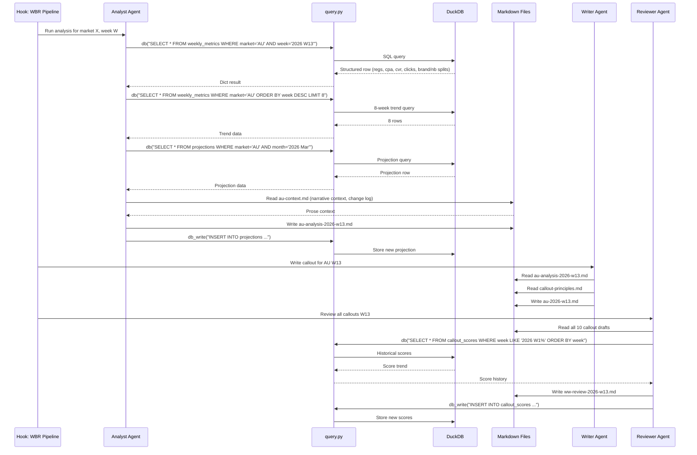
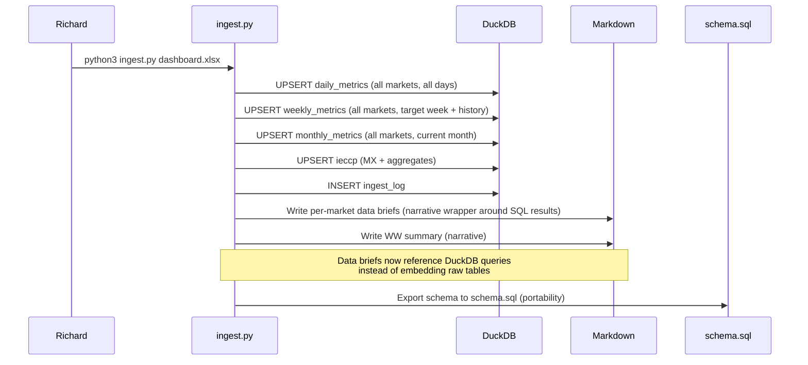
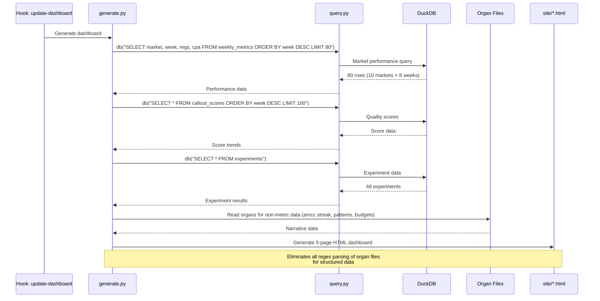

# Design Document: Data Layer Overhaul

## Overview

The body system currently stores all structured data (metrics, projections, callout scores, experiment results) as markdown files that agents parse with regex on every access. The DuckDB analytical database (`~/shared/tools/data/ps-analytics.duckdb`) was built as a persistent, queryable data layer for paid search metrics — the dashboard ingester already writes to both markdown and DuckDB on each run. This overhaul migrates structured data into DuckDB as the canonical source of truth for numbers, while keeping markdown as the canonical source for narrative content. The result: agents query SQL for data instead of parsing files, markdown files get simpler (prose only, no embedded tables), and the system trends toward subtraction (fewer files, less parsing, less duplication).

This is a structural change, not a cosmetic one. It changes the default access pattern from "read a file and regex out a number" to "run a SQL query." It embodies three of Richard's design principles: structural over cosmetic (changing the data access default), subtraction before addition (eliminating redundant markdown tables), and reduce decisions not options (agents don't choose between file parsing and SQL — SQL is the path of least resistance for structured data).

The portability constraint is non-negotiable: the system must survive a platform move with nothing but text files. DuckDB is a single portable file (no server, no daemon), but the schema and query patterns must be documented in plain text so a new AI on a different platform could reconstruct the database from markdown source files if needed. The markdown files remain the reconstruction source — DuckDB is the query-optimized view.

## Architecture

The overhaul introduces a two-layer data architecture: a narrative layer (markdown) and a structured layer (DuckDB). Every piece of data lives in exactly one canonical location. Agents access data through a unified query helper that abstracts the storage layer.

```mermaid
graph TD
    subgraph "Data Sources"
        XLSX[WW Dashboard XLSX]
        AGENTS[Agent Observations]
        HOOKS[Hook Outputs]
    end

    subgraph "Ingestion Layer"
        ING[Dashboard Ingester<br/>ingest.py]
        FEED[New Feeders<br/>callout scorer, experiment logger]
    end

    subgraph "Structured Layer — DuckDB"
        DB[(ps-analytics.duckdb)]
        DB --- DM[daily_metrics]
        DB --- WM[weekly_metrics]
        DB --- MM[monthly_metrics]
        DB --- IE[ieccp]
        DB --- PR[projections]
        DB --- CS[callout_scores]
        DB --- EX[experiments]
        DB --- IL[ingest_log]
        DB --- CL_NEW[change_log]
        DB --- AN[anomalies]
    end

    subgraph "Narrative Layer — Markdown"
        ORG[Organ Prose<br/>eyes, hands, brain, etc.]
        CALL[Callout Drafts<br/>per-market .md]
        MEET[Meeting Notes]
        WIKI[Wiki Articles]
        CTX[Context Files<br/>callout-principles, etc.]
    end

    subgraph "Query Layer"
        QH[query.py<br/>db&#40;&#41; + db_df&#40;&#41;]
        QH --- SQLA[SQL for structured data]
        QH --- READ[File read for narrative]
    end

    subgraph "Consumers"
        AN_AG[Analyst Agents]
        WR_AG[Writer Agents]
        REV[Callout Reviewer]
        CHART[Chart Generator]
        MORN[Morning Routine]
        LOOP[Autoresearch Loop]
    end

    XLSX --> ING
    AGENTS --> FEED
    HOOKS --> FEED
    ING --> DB
    ING --> CALL
    FEED --> DB
    AN_AG --> QH
    WR_AG --> QH
    REV --> QH
    CHART --> QH
    MORN --> QH
    LOOP --> QH
    QH --> DB
    QH --> ORG
    QH --> CALL
```



## Sequence Diagrams

### Callout Pipeline (Post-Overhaul)



### Dashboard Ingestion Flow (Post-Overhaul)



### Chart Generation Flow (Post-Overhaul)



## Components and Interfaces

### Component 1: Enhanced Query Helper (`query.py`)

**Purpose**: Unified data access layer. All agents and scripts access structured data through this module — never by opening the .duckdb file directly. Adds write capability and convenience functions for common query patterns.

**Current Interface** (read-only):
```python
def db(sql: str, db_path: str = None) -> list[dict]:
    """Run SQL, return list of dicts."""

def db_df(sql: str, db_path: str = None) -> pd.DataFrame:
    """Run SQL, return DataFrame."""
```

**New Interface** (read + write + convenience):
```python
# --- Core (existing, unchanged) ---
def db(sql: str, db_path: str = None) -> list[dict]: ...
def db_df(sql: str, db_path: str = None) -> pd.DataFrame: ...

# --- Write operations (new) ---
def db_write(sql: str, params: tuple = None, db_path: str = None) -> int:
    """Execute INSERT/UPDATE/DELETE. Returns rows affected."""

def db_upsert(table: str, data: dict, key_cols: list[str], db_path: str = None) -> None:
    """Insert or update a row. key_cols define the conflict target."""

# --- Convenience queries (new) ---
def market_week(market: str, week: str) -> dict | None:
    """Get weekly metrics for a single market+week."""

def market_trend(market: str, weeks: int = 8) -> list[dict]:
    """Get last N weeks of metrics for a market, most recent first."""

def market_month(market: str, month: str) -> dict | None:
    """Get monthly metrics + OP2 targets for a market+month."""

def projection(market: str, week: str) -> dict | None:
    """Get projection for a market+week."""

def callout_scores(market: str, weeks: int = 8) -> list[dict]:
    """Get last N weeks of callout quality scores."""

def schema_export(output_path: str = None) -> str:
    """Export full schema as CREATE TABLE statements (portability)."""
```

**Responsibilities**:
- Single point of access for all DuckDB operations
- Connection management (read-only for queries, read-write for mutations)
- Schema export for portability documentation
- Convenience functions eliminate repetitive SQL across agents

### Component 2: Schema Manager (`init_db.py`)

**Purpose**: Database schema definition and migration. Extended with new tables for data that currently lives in markdown.

**New Tables** (added to existing schema):

```python
# --- Change log: replaces per-market {market}-change-log.md structured entries ---
con.execute("""
    CREATE TABLE IF NOT EXISTS change_log (
        id INTEGER PRIMARY KEY,
        market VARCHAR NOT NULL,
        date DATE NOT NULL,
        category VARCHAR,  -- 'bid_strategy', 'negative_kw', 'url_migration', 'promo', 'budget'
        description TEXT,
        impact_metric VARCHAR,
        impact_value DOUBLE,
        source VARCHAR,  -- 'manual', 'ingester', 'agent'
        ingested_at TIMESTAMP DEFAULT current_timestamp
    )
""")

# --- Anomalies: replaces flagged anomalies in supplementary sections ---
con.execute("""
    CREATE TABLE IF NOT EXISTS anomalies (
        id INTEGER PRIMARY KEY,
        market VARCHAR NOT NULL,
        week VARCHAR NOT NULL,
        metric VARCHAR NOT NULL,  -- 'regs', 'cpa', 'cvr', 'spend', etc.
        value DOUBLE,
        baseline DOUBLE,
        deviation_pct DOUBLE,
        direction VARCHAR,  -- 'above', 'below'
        flagged_at TIMESTAMP DEFAULT current_timestamp,
        resolved BOOLEAN DEFAULT false,
        notes TEXT
    )
""")

# --- Competitor intel: replaces eyes.md competitive landscape tables ---
con.execute("""
    CREATE TABLE IF NOT EXISTS competitors (
        market VARCHAR NOT NULL,
        competitor VARCHAR NOT NULL,
        week VARCHAR NOT NULL,
        impression_share DOUBLE,
        cpc_impact_pct DOUBLE,
        segment VARCHAR,  -- 'brand', 'nb', 'generic'
        notes TEXT,
        ingested_at TIMESTAMP DEFAULT current_timestamp,
        PRIMARY KEY (market, competitor, week)
    )
""")

# --- OCI rollout status: replaces eyes.md OCI tables ---
con.execute("""
    CREATE TABLE IF NOT EXISTS oci_status (
        market VARCHAR NOT NULL PRIMARY KEY,
        status VARCHAR,  -- 'live', 'in_progress', 'not_planned'
        launch_date DATE,
        full_impact_date DATE,
        reg_lift_pct DOUBLE,
        cpa_improvement TEXT,
        notes TEXT,
        updated_at TIMESTAMP DEFAULT current_timestamp
    )
""")
```

### Component 3: Dashboard Ingester (`ingest.py`) — Modified

**Purpose**: Already writes to DuckDB. Changes: (1) stop generating redundant markdown data tables that duplicate what's in DuckDB, (2) generate slimmer data briefs that reference SQL queries instead of embedding raw numbers, (3) auto-detect and write anomalies to the anomalies table, (4) export schema after each run.

**Interface changes**:
```python
class DashboardIngester:
    # Existing methods unchanged
    def _read_daily_tab(self, market) -> list[dict]: ...
    def _read_weekly_tab(self, market, target_week) -> list[dict]: ...
    def _read_monthly_actuals(self) -> dict: ...

    # New methods
    def _detect_anomalies(self, market: str, week_data: dict, trend: list[dict]) -> list[dict]:
        """Flag metrics deviating >20% from 8-week average. Write to anomalies table."""

    def _write_slim_data_brief(self, market: str, week: str) -> None:
        """Write data brief that references DuckDB queries instead of embedding tables.
        Brief contains: narrative summary, query hints, and only the numbers
        the analyst agent needs that aren't in DuckDB (e.g., context notes)."""

    def _export_schema(self) -> None:
        """After each ingest, export schema.sql for portability."""
```

### Component 4: Chart Generator (`generate.py`) — Modified

**Purpose**: Currently parses organ markdown files with regex to extract metrics for HTML dashboard. Changes: read structured data from DuckDB via query.py, keep organ parsing only for narrative data (amcc streak, patterns, budgets, competence stages).

**Interface changes**:
```python
# Replace these regex-based parsers:
# parse_tracker_scorecard() -> db("SELECT * FROM weekly_metrics ...")
# parse_changelog() experiments -> db("SELECT * FROM experiments")
# parse_changelog() savings -> db("SELECT * FROM compression_log") [new table]

# Keep these (narrative data, not in DuckDB):
# parse_gut_budgets() — word counts are organ metadata, not PS metrics
# parse_patterns() — behavioral patterns, not structured metrics
# parse_amcc() — willpower tracking, narrative
# parse_five_levels() — strategic priorities, narrative
# parse_competence_stages() — derived from narrative data
# parse_organ_staleness() — file metadata
# parse_autonomy_spectrum() — role classification, narrative
```

### Component 5: Portability Layer (`schema.sql` + `RECONSTRUCTION.md`)

**Purpose**: Plain-text documentation that allows any AI on any platform to reconstruct the DuckDB database from markdown source files.

**Files**:
- `~/shared/tools/data/schema.sql` — Auto-generated after each ingest. Full CREATE TABLE statements.
- `~/shared/tools/data/RECONSTRUCTION.md` — Human-readable guide: which markdown files map to which tables, how to rebuild from scratch, query patterns for common agent tasks.

## Data Models

### Migration Classification: What Moves, What Stays

#### Migrates to DuckDB (structured, queryable, numbers)

| Current Location | Data | Target Table | Rationale |
|-----------------|------|-------------|-----------|
| Per-market data briefs (embedded tables) | Daily/weekly/monthly metrics | daily_metrics, weekly_metrics, monthly_metrics | Already in DuckDB via ingester. Briefs become narrative-only. |
| Per-market data briefs (trend tables) | 8-week trend numbers | weekly_metrics (query last 8) | Redundant — just a SQL query now. |
| Per-market data briefs (projection tables) | MTD actuals, OP2 targets, projections | projections, monthly_metrics | Already in DuckDB. Briefs reference queries. |
| Callout supplementary sections (trend line) | `W5: 239 \| W6: 257 \| ...` | weekly_metrics | Redundant with weekly_metrics.regs. |
| Callout supplementary sections (anomalies) | Flagged anomalies >20% deviation | anomalies (new table) | Structured data, queryable for trends. |
| Per-market projections files | Projection tracking tables | projections | Already partially in DuckDB. Complete the migration. |
| eyes.md (Market Health table) | Regs, vs OP2, YoY, Spend, CPA per market | monthly_metrics + weekly_metrics | Numbers belong in DB. Eyes keeps narrative interpretation. |
| eyes.md (OCI Performance tables) | Rollout status, impact metrics | oci_status (new table) | Structured, rarely changes, queryable. |
| eyes.md (Competitive Landscape tables) | Competitor IS%, CPC impact | competitors (new table) | Structured, changes weekly, trend-queryable. |
| eyes.md (Ad Copy Testing results) | CTR%, clicks%, regs% | experiments | Test results are structured data. |
| Per-market change logs (structured entries) | Bid changes, keyword adds, URL migrations | change_log (new table) | Structured events, queryable by date/market/category. |
| Callout reviewer scores | 5-dimension quality scores | callout_scores | Already in DuckDB schema. Wire up the reviewer to write. |
| heart.md (experiment results) | CE-N status, metrics before/after | experiments | Already in DuckDB schema. Wire up Karpathy to write. |
| nervous-system.md (pattern scores) | Pattern trajectory scores | Could add patterns table | Lower priority — patterns are semi-narrative. |

#### Stays as Markdown (narrative, prose, context)

| File | Data | Why It Stays |
|------|------|-------------|
| Organ prose (all 11 organs) | Narrative content, principles, protocols | Prose is not queryable. Organs are read as context, not queried for numbers. |
| Callout drafts (per-market .md) | WBR callout prose | Written for humans, not machines. The callout IS the markdown. |
| Analysis briefs (per-market .md) | Analyst narrative, suggested angles | Prose reasoning, not structured data. |
| Meeting notes (meetings/*.md) | Session summaries, themes, open items | Narrative content. |
| Wiki articles (artifacts/*.md) | Published documents | Narrative content. |
| callout-principles.md | Writing rules and style guide | Reference prose. |
| Per-market context files | Market-specific narrative context | Prose context (holidays, team dynamics, strategic notes). |
| soul.md, rw-trainer.md | Identity, coaching framework | Behavioral config, not data. |
| current.md, org-chart.md | Live state, org structure | Semi-structured but low-frequency, high-narrative. |
| rw-tracker.md | Weekly scorecard, patterns | Mix of narrative and numbers — keep as markdown, query DuckDB for the numbers. |
| Per-market change logs (narrative entries) | Prose context around changes | "Why we did this" stays as prose. Structured "what changed" moves to DuckDB. |

### Files That Can Be Eliminated or Simplified

| File | Current State | Post-Overhaul | Words Saved (est.) |
|------|--------------|---------------|-------------------|
| Per-market data briefs | Full metric tables + narrative | Narrative only + query hints | ~60% reduction per brief |
| eyes.md Market Health table | 10-row metric table | Remove table, add "query: `db('SELECT ...')`" hint | ~200w |
| eyes.md OCI tables | 2 static tables | Remove, reference `oci_status` table | ~150w |
| eyes.md Competitive tables | 3 tables across sections | Remove, reference `competitors` table | ~200w |
| Callout supplementary trend lines | Inline `W5: 239 \| W6: 257 \| ...` | Remove, reference `market_trend('AU')` | ~30w per callout × 10 = 300w |
| Per-market projections files | Markdown tables with weekly rows | Eliminate entirely — projections table is canonical | ~100w per market × 10 = 1000w |
| heart.md experiment results | Inline in changelog.md | Eliminate from changelog, query `experiments` table | Variable |

**Estimated total word reduction**: ~2,000-3,000 words across the system. This is subtraction — the data still exists, it's just in DuckDB instead of duplicated in markdown.

### Validation Rules

| Table | Rule | Enforcement |
|-------|------|-------------|
| daily_metrics | market IN ('US','CA','UK','DE','FR','IT','ES','JP','AU','MX') | CHECK constraint |
| daily_metrics | date <= CURRENT_DATE | CHECK constraint |
| weekly_metrics | week matches pattern 'YYYY WNN' | Application-level |
| monthly_metrics | spend_op2 > 0 when present | Application-level |
| projections | projected_regs > 0 | CHECK constraint |
| callout_scores | overall_score BETWEEN 0 AND 10 | CHECK constraint |
| callout_scores | All dimension scores BETWEEN 0 AND 10 | CHECK constraint |
| competitors | impression_share BETWEEN 0 AND 100 | CHECK constraint |
| anomalies | deviation_pct != 0 | CHECK constraint |

## Key Functions with Formal Specifications

### Function 1: `db_upsert()`

```python
def db_upsert(table: str, data: dict, key_cols: list[str], db_path: str = None) -> None:
    """Insert or update a row based on key columns."""
    path = db_path or DB_PATH
    cols = list(data.keys())
    vals = list(data.values())
    placeholders = ', '.join(['?'] * len(cols))
    col_list = ', '.join(cols)
    updates = ', '.join(f"{c} = EXCLUDED.{c}" for c in cols if c not in key_cols)
    conflict = ', '.join(key_cols)

    sql = f"""
        INSERT INTO {table} ({col_list}) VALUES ({placeholders})
        ON CONFLICT ({conflict}) DO UPDATE SET {updates}
    """
    con = duckdb.connect(path)
    con.execute(sql, vals)
    con.close()
```

**Preconditions:**
- `table` exists in the database schema
- `data` dict keys match column names in `table`
- `key_cols` are a subset of `data` keys and match the table's PRIMARY KEY
- All values in `data` are compatible with their column types

**Postconditions:**
- If row with matching key_cols values exists: non-key columns are updated
- If no matching row exists: new row is inserted
- Database connection is closed (no leaked connections)
- No other rows in the table are modified

**Loop Invariants:** N/A (single operation)

### Function 2: `market_trend()`

```python
def market_trend(market: str, weeks: int = 8) -> list[dict]:
    """Get last N weeks of weekly metrics for a market."""
    return db(f"""
        SELECT * FROM weekly_metrics
        WHERE market = '{market}'
        ORDER BY week DESC
        LIMIT {weeks}
    """)
```

**Preconditions:**
- `market` is one of the 10 valid market codes
- `weeks` is a positive integer
- weekly_metrics table exists and has data

**Postconditions:**
- Returns list of 0 to `weeks` dicts, ordered most-recent-first
- Each dict contains all columns from weekly_metrics
- Only rows matching the specified market are returned
- No side effects on the database

### Function 3: `_detect_anomalies()`

```python
def _detect_anomalies(self, market: str, week_data: dict, trend: list[dict]) -> list[dict]:
    """Flag metrics deviating >20% from 8-week average."""
    anomalies = []
    metrics_to_check = ['regs', 'cpa', 'cvr', 'spend', 'clicks']

    for metric in metrics_to_check:
        current = week_data.get(metric)
        if current is None:
            continue
        historical = [w.get(metric) for w in trend if w.get(metric) is not None]
        if len(historical) < 3:
            continue
        baseline = sum(historical) / len(historical)
        if baseline == 0:
            continue
        deviation = (current - baseline) / baseline
        if abs(deviation) > 0.20:
            anomalies.append({
                'market': market,
                'week': week_data['week'],
                'metric': metric,
                'value': current,
                'baseline': round(baseline, 2),
                'deviation_pct': round(deviation * 100, 1),
                'direction': 'above' if deviation > 0 else 'below',
            })
    return anomalies
```

**Preconditions:**
- `market` is a valid market code
- `week_data` contains at least 'week' key and metric values
- `trend` is a list of prior week dicts (ideally 8 weeks)

**Postconditions:**
- Returns list of anomaly dicts (may be empty)
- Only metrics with >20% deviation from mean are flagged
- Metrics with fewer than 3 historical data points are skipped
- No mutations to input data
- Each anomaly dict contains: market, week, metric, value, baseline, deviation_pct, direction

### Function 4: `schema_export()`

```python
def schema_export(output_path: str = None) -> str:
    """Export full schema as CREATE TABLE statements for portability."""
    path = output_path or os.path.expanduser('~/shared/tools/data/schema.sql')
    con = duckdb.connect(DB_PATH, read_only=True)
    tables = [t[0] for t in con.execute("SHOW TABLES").fetchall()]
    statements = []
    for table in tables:
        create_stmt = con.execute(
            f"SELECT sql FROM duckdb_tables() WHERE table_name = '{table}'"
        ).fetchone()
        if create_stmt:
            statements.append(create_stmt[0] + ';')
        # Also export row counts as comments
        count = con.execute(f"SELECT COUNT(*) FROM {table}").fetchone()[0]
        statements.append(f"-- {table}: {count} rows as of export")
    con.close()
    output = '\n\n'.join(statements)
    with open(path, 'w') as f:
        f.write(f"-- PS Analytics Schema Export\n")
        f.write(f"-- Generated: {datetime.now().isoformat()}\n")
        f.write(f"-- Source: {DB_PATH}\n\n")
        f.write(output)
    return path
```

**Preconditions:**
- Database file exists at DB_PATH
- Output directory exists and is writable

**Postconditions:**
- schema.sql file contains valid CREATE TABLE statements for all tables
- File includes row count comments for each table
- File includes generation timestamp
- A new AI on a different platform can run this SQL to recreate the schema

## Algorithmic Pseudocode

### Main Migration Algorithm

```pascal
ALGORITHM migrateDataLayer()
INPUT: existing body system (markdown files + DuckDB with partial data)
OUTPUT: overhauled system (DuckDB as structured canonical, markdown as narrative canonical)

BEGIN
  // Phase 1: Extend schema
  newTables ← [change_log, anomalies, competitors, oci_status]
  FOR each table IN newTables DO
    IF table NOT EXISTS IN database THEN
      CREATE table with schema from init_db.py
    END IF
  END FOR

  // Phase 2: Backfill historical data
  FOR each market IN ALL_MARKETS DO
    // Backfill competitors from eyes.md
    competitors ← parseCompetitorTables(eyes.md)
    FOR each competitor IN competitors DO
      db_upsert('competitors', competitor, ['market', 'competitor', 'week'])
    END FOR

    // Backfill OCI status from eyes.md
    ociData ← parseOCITables(eyes.md)
    db_upsert('oci_status', ociData, ['market'])

    // Backfill change log from per-market change-log.md
    changes ← parseChangeLog(market + '-change-log.md')
    FOR each change IN changes DO
      db_upsert('change_log', change, ['id'])
    END FOR
  END FOR

  // Phase 3: Update consumers
  // Modify analyst agents to query DuckDB instead of parsing data briefs
  // Modify chart generator to query DuckDB instead of regex-parsing organs
  // Modify callout reviewer to write scores to DuckDB

  // Phase 4: Slim down markdown
  FOR each organ IN [eyes.md] DO
    REMOVE metric tables that now live in DuckDB
    ADD query hints: "Data: db('SELECT ... FROM weekly_metrics ...')"
    KEEP all narrative prose unchanged
  END FOR

  FOR each market IN ALL_MARKETS DO
    SIMPLIFY data briefs (remove embedded tables, add query references)
    ELIMINATE per-market projections .md files
    SPLIT change logs: structured → DuckDB, narrative → stays in .md
  END FOR

  // Phase 5: Portability
  schema_export('~/shared/tools/data/schema.sql')
  WRITE RECONSTRUCTION.md with rebuild instructions

  RETURN success
END
```

## Example Usage

### Agent querying weekly trend (replaces regex parsing of data briefs)

```python
from query import db, market_trend, market_week

# Before: Agent reads au-data-brief-2026-w13.md, regex-parses a markdown table
# After: One function call
trend = market_trend('AU', weeks=8)
# Returns: [{'market': 'AU', 'week': '2026 W13', 'regs': 245, 'cpa': 138.5, ...}, ...]

this_week = market_week('AU', '2026 W13')
# Returns: {'market': 'AU', 'week': '2026 W13', 'regs': 245, 'cpa': 138.5,
#           'brand_regs': 180, 'nb_regs': 65, 'cvr': 0.032, ...}
```

### Analyst agent producing projections (replaces markdown table append)

```python
from query import db_upsert

# Before: Agent opens au-projections.md, appends a markdown table row
# After: One upsert
db_upsert('projections', {
    'market': 'AU',
    'week': '2026 W13',
    'month': '2026 Mar',
    'days_elapsed': 21,
    'total_days': 31,
    'projected_regs': 1050,
    'projected_spend': 155000,
    'projected_cpa': 148,
    'op2_regs': 1100,
    'vs_op2_regs_pct': -4.5,
    'rationale': 'Weekday pattern + Easter Monday dip on 3/31',
    'source': 'abix-analyst',
}, key_cols=['market', 'week'])
```

### Callout reviewer storing quality scores

```python
from query import db_upsert, callout_scores

# Store this week's scores
db_upsert('callout_scores', {
    'market': 'AU',
    'week': '2026 W13',
    'overall_score': 7.8,
    'headline_clarity': 8.0,
    'narrative_justification': 7.5,
    'conciseness': 8.0,
    'actionability': 7.5,
    'voice': 8.0,
    'word_count': 112,
    'reviewer_notes': 'Solid. YoY paragraph could be tighter.',
}, key_cols=['market', 'week'])

# Query score trend for review comparison
history = callout_scores('AU', weeks=8)
avg_score = sum(s['overall_score'] for s in history) / len(history)
```

### Chart generator reading from DuckDB (replaces regex parsing)

```python
from query import db

# Before: parse_tracker_scorecard() reads rw-tracker.md with regex
# After: Direct SQL for market performance data
perf_data = db("""
    SELECT market, week, regs, cpa, spend,
           brand_regs, nb_regs, cvr
    FROM weekly_metrics
    WHERE week >= '2026 W06'
    ORDER BY market, week
""")

# Before: parse_changelog() experiments with regex on changelog.md
# After: Direct SQL
experiments = db("SELECT * FROM experiments ORDER BY start_date DESC")

# Before: parse_amcc() with regex — STAYS AS IS (narrative data)
amcc = parse_amcc()  # Still reads amcc.md — willpower is narrative, not metric
```

### Portability: Reconstructing DuckDB from markdown

```python
# If DuckDB file is lost or on a new platform:
# 1. Run init_db.py to create empty schema
# 2. Run ingest.py on the latest dashboard xlsx to populate metrics
# 3. Competitors, OCI status, change log can be manually re-entered
#    or parsed from the markdown files that still exist as backup

# The schema.sql file documents the exact structure:
# python3 ~/shared/tools/data/init_db.py
# python3 ~/shared/tools/dashboard-ingester/ingest.py latest-dashboard.xlsx
```

## Correctness Properties

*A property is a characteristic or behavior that should hold true across all valid executions of a system — essentially, a formal statement about what the system should do. Properties serve as the bridge between human-readable specifications and machine-verifiable correctness guarantees.*

### Property 1: Upsert correctness and idempotence

*For any* valid data dict and key columns, calling `db_upsert()` SHALL insert a new row when no matching key exists, update non-key columns when a matching key exists, and calling `db_upsert()` twice with identical data SHALL produce the same database state as calling it once.

**Validates: Requirements 1.2, 1.3**

### Property 2: Write error safety

*For any* malformed SQL statement passed to `db_write()`, the function SHALL raise a descriptive error and the database state SHALL remain identical to its state before the call.

**Validates: Requirement 1.5**

### Property 3: Convenience function equivalence to raw SQL

*For any* valid market, week, month, and weeks-count inputs, each convenience function (`market_week`, `market_trend`, `market_month`, `projection`, `callout_scores`) SHALL return data identical to the equivalent raw SQL query executed via `db()`.

**Validates: Requirements 2.1, 2.2, 2.3, 2.4, 2.5, 2.6**

### Property 4: List convenience functions are bounded, filtered, and ordered

*For any* market and positive integer N, `market_trend(market, N)` and `callout_scores(market, N)` SHALL return a list of length ≤ N, where every row matches the specified market, and rows are ordered by week descending (most-recent-first).

**Validates: Requirements 2.2, 2.5**

### Property 5: Schema migration idempotence

*For any* existing database with populated tables, running `init_db.py` SHALL add any missing tables without modifying or deleting existing table data or row counts.

**Validates: Requirements 3.5, 13.3**

### Property 6: CHECK constraint enforcement

*For any* value outside the defined valid range (callout_scores outside 0-10, impression_share outside 0-100, deviation_pct equal to 0, projected_regs ≤ 0), inserting that value SHALL be rejected by the database.

**Validates: Requirement 3.6**

### Property 7: Schema export round-trip

*For any* database state, exporting the schema via `schema_export()` and executing the resulting SQL on an empty DuckDB instance SHALL create all tables with the same structure (column names, types, constraints) as the source database.

**Validates: Requirements 4.1, 4.3**

### Property 8: Anomaly detection threshold correctness

*For any* metric with at least 3 historical data points and a non-zero baseline average, the Anomaly_Detector SHALL flag the metric if and only if its absolute deviation from the 8-week average exceeds 20%. Metrics with fewer than 3 data points or a zero baseline SHALL not be flagged.

**Validates: Requirements 5.1, 5.2, 5.3, 5.4**

### Property 9: Anomaly detection purity

*For any* input data passed to `_detect_anomalies()`, the function SHALL not modify the input data, and no database tables other than the anomalies table SHALL be affected.

**Validates: Requirement 5.5**

### Property 10: Narrative preservation during markdown simplification

*For any* markdown file undergoing simplification, the prose word count after simplification SHALL be greater than or equal to the prose word count before simplification minus a small epsilon (accounting for table-to-query-hint replacement).

**Validates: Requirement 7.3**

### Property 11: Read-only connection enforcement

*For any* SQL write statement (INSERT, UPDATE, DELETE) passed to `db()`, the Query_Helper SHALL raise an error and the database SHALL remain unchanged.

**Validates: Requirements 12.1, 12.3**

### Property 12: Ingester idempotence

*For any* valid xlsx file, running the Ingester twice on the same file SHALL produce the same database state as running it once (upsert semantics on primary keys).

**Validates: Requirement 10.4**

### Property 13: Empty query returns empty result

*For any* valid SQL SELECT query against an empty or not-yet-backfilled table, the Query_Helper SHALL return an empty list (not raise an error).

**Validates: Requirement 13.4**

### Property 14: Migration completeness

*For any* structured data point that exists in a source markdown table, after migration completes, there SHALL exist a SQL query that returns that data point from DuckDB.

**Validates: Requirement 6.4**

## Error Handling

### Error Scenario 1: DuckDB File Missing or Corrupted

**Condition**: Agent calls `db()` but ps-analytics.duckdb doesn't exist or is corrupted.
**Response**: `db()` raises a clear error: "DuckDB not found at {path}. Run init_db.py to create, then ingest.py to populate."
**Recovery**: Run `python3 init_db.py` then `python3 ingest.py <latest_xlsx>`. Markdown files are untouched — they're the reconstruction source.

### Error Scenario 2: Schema Mismatch After Update

**Condition**: `init_db.py` adds new tables but existing DuckDB has old schema.
**Response**: `CREATE TABLE IF NOT EXISTS` is idempotent — new tables are added without affecting existing data.
**Recovery**: Run `python3 init_db.py` to add missing tables. Existing data is preserved.

### Error Scenario 3: Ingester Writes Partial Data

**Condition**: Ingester crashes mid-write (e.g., malformed xlsx).
**Response**: DuckDB uses ACID transactions. Partial writes are rolled back.
**Recovery**: Fix the xlsx issue, re-run ingester. Upsert semantics mean re-running is safe.

### Error Scenario 4: Agent Attempts Write via Read-Only Connection

**Condition**: An agent calls `db()` (read-only) with an INSERT/UPDATE statement.
**Response**: DuckDB raises "Cannot execute write operation in read-only mode."
**Recovery**: Agent should use `db_write()` or `db_upsert()` for mutations. Only authorized operations (ingester, reviewer score writes, analyst projection writes) should use write functions.

### Error Scenario 5: Query Returns Empty During Transition

**Condition**: Agent queries DuckDB for data that hasn't been backfilled yet.
**Response**: Empty result set (not an error). Agent falls back to markdown parsing.
**Recovery**: Run backfill script for the missing data category. Transition period only — once backfill is complete, empty results indicate genuinely missing data.

## Testing Strategy

### Unit Testing Approach

Test each new function in `query.py` against a test DuckDB instance:
- `db_write()`: verify row insertion, verify rows-affected count
- `db_upsert()`: verify insert-on-new, update-on-existing, no duplicate rows
- `market_trend()`: verify correct ordering, correct limit, correct market filter
- `market_week()`: verify single-row return, None on missing data
- `schema_export()`: verify output is valid SQL, verify all tables present
- `_detect_anomalies()`: verify >20% threshold, verify skip on insufficient data, verify direction

### Property-Based Testing Approach

**Property Test Library**: hypothesis (Python)

Key properties to test:
- `db_upsert` is idempotent: upserting the same data twice produces the same row count
- `market_trend(m, n)` always returns <= n rows, all for market m, ordered by week DESC
- `_detect_anomalies` never flags a metric with <3 historical data points
- `schema_export` output, when executed on an empty DuckDB, creates all tables from the original

### Integration Testing Approach

End-to-end test: run `ingest.py` on a test xlsx → verify DuckDB tables populated → run `query.py` convenience functions → verify results match expected values → run `schema_export()` → verify schema.sql is valid → run `init_db.py` on a fresh DB using exported schema → verify table structure matches.

## Performance Considerations

DuckDB is columnar and optimized for analytical queries (aggregations, trends, YoY comparisons). The current system's performance bottleneck is regex parsing of large markdown files on every agent access. Expected improvements:

- **Weekly trend query**: ~5ms (DuckDB SQL) vs ~200ms (read file + regex parse)
- **Cross-market aggregation**: ~10ms (single SQL) vs ~2s (read 10 files + parse each)
- **Historical comparison**: ~5ms (SQL with WHERE clause) vs not feasible (would require reading all historical files)

The .duckdb file is expected to stay under 50MB even with years of daily data for 10 markets. No performance concerns at this scale.

## Security Considerations

- DuckDB file permissions: readable by all agents, writable only by ingester and authorized write operations
- No credentials stored in DuckDB — it contains only performance metrics
- Query helper uses parameterized queries where possible to prevent SQL injection from malformed market names or week labels
- Read-only connections are the default; write connections are explicit opt-in

## Dependencies

- **duckdb** (Python package): Already installed. Used by init_db.py, query.py, ingest.py.
- **openpyxl** (Python package): Already installed. Used by ingest.py for xlsx parsing.
- **No new dependencies required.** The overhaul uses only packages already in the system.

## Pipeline Update Summary

### Callout Pipeline (`wbr-callout-pipeline.kiro.hook`)

**Phase 0 (Context Load)**: Add `query.py` import. Analyst agents query DuckDB for metrics instead of reading data briefs for numbers.
**Phase 2 (Analysis)**: Analyst agents call `market_trend()`, `market_week()`, `projection()` instead of parsing data brief markdown tables. Write projections via `db_upsert()`.
**Phase 4 (Review)**: Reviewer writes scores to `callout_scores` table via `db_upsert()`. Reads historical scores via `callout_scores()` for trend comparison.

### Morning Routine (`rw-morning-routine.kiro.hook`)

**Step 3 (Daily Brief)**: Brief can include DuckDB-sourced metrics (e.g., "AU W13: 245 regs, $138 CPA" from `market_week('AU', '2026 W13')`). No structural change to the routine — just a better data source for the numbers it already includes.

### Autoresearch Loop (`heart.md`)

**Experiment logging**: Karpathy writes experiment results to `experiments` table via `db_upsert()` instead of only logging to changelog.md. Changelog.md remains the narrative audit trail; DuckDB holds the structured metrics (before/after, effect size, decision).

### Chart Generator (`generate.py`)

**Major refactor**: Replace regex-based parsers for structured data with DuckDB queries. Keep regex parsers only for narrative organ data (amcc, patterns, budgets, competence, staleness, autonomy). This is the largest code change in the overhaul.

### Dashboard Ingester (`ingest.py`)

**Minimal change**: Already writes to DuckDB. Add: (1) anomaly detection + write to anomalies table, (2) schema export after each run, (3) slimmer data brief generation that references queries instead of embedding tables.

---

## Agentic Architecture: Beyond Refactoring

The sections above describe a refactor — moving data from markdown to DuckDB. This section describes the architectural shifts that make agents autonomous operators, not just faster assistants. This is the bridge from Level 3 (team automation) to Level 5 (full agentic orchestration).

### The Core Problem

Today, agents are stateless between sessions. Every hook invocation starts from zero — read body.md, read spine.md, load context, parse files, figure out what happened since last time. The DuckDB layer fixes the data access problem, but it doesn't fix the state problem. Agents don't remember what they did, what they learned, or what they decided. Richard is the continuity layer — he's the one who remembers "we changed MX bid strategy last Tuesday" and "AU CVR has been declining for 3 weeks."

In an agentic future, the database IS the continuity layer. Agents write their observations, decisions, and actions to the DB. Other agents read them. Richard reviews the output, not the process.

### New Tables for Agent Autonomy

```sql
-- Agent actions: what agents did, when, and why
CREATE TABLE IF NOT EXISTS agent_actions (
    id INTEGER PRIMARY KEY,
    agent VARCHAR NOT NULL,        -- 'abix-analyst', 'callout-reviewer', 'morning-routine'
    action_type VARCHAR NOT NULL,  -- 'analysis', 'draft', 'review', 'decision', 'escalation'
    market VARCHAR,
    week VARCHAR,
    description TEXT,
    input_summary TEXT,            -- what context the agent consumed
    output_summary TEXT,           -- what the agent produced
    confidence VARCHAR,            -- 'high', 'medium', 'low'
    requires_human_review BOOLEAN DEFAULT false,
    reviewed_by_human BOOLEAN DEFAULT false,
    human_feedback TEXT,
    created_at TIMESTAMP DEFAULT current_timestamp
);

-- Agent observations: things agents notice that aren't metrics
CREATE TABLE IF NOT EXISTS agent_observations (
    id INTEGER PRIMARY KEY,
    agent VARCHAR NOT NULL,
    observation_type VARCHAR,      -- 'anomaly', 'pattern', 'risk', 'opportunity', 'question'
    market VARCHAR,
    week VARCHAR,
    content TEXT,
    severity VARCHAR,              -- 'info', 'warning', 'critical'
    acted_on BOOLEAN DEFAULT false,
    acted_on_by VARCHAR,
    created_at TIMESTAMP DEFAULT current_timestamp
);

-- Decision log: structured decisions with audit trail
CREATE TABLE IF NOT EXISTS decisions (
    id INTEGER PRIMARY KEY,
    decision_type VARCHAR,         -- 'bid_change', 'budget_adjustment', 'test_launch', 'escalation'
    market VARCHAR,
    description TEXT,
    rationale TEXT,
    made_by VARCHAR,               -- 'abix-analyst', 'richard', 'morning-routine'
    approved_by VARCHAR,           -- NULL if auto-approved, 'richard' if human-approved
    approval_required BOOLEAN DEFAULT true,
    status VARCHAR,                -- 'proposed', 'approved', 'executed', 'rejected', 'reverted'
    outcome TEXT,
    created_at TIMESTAMP DEFAULT current_timestamp,
    resolved_at TIMESTAMP
);

-- Task queue: agents can create and claim work
CREATE TABLE IF NOT EXISTS task_queue (
    id INTEGER PRIMARY KEY,
    task_type VARCHAR,             -- 'callout', 'analysis', 'review', 'investigation', 'escalation'
    market VARCHAR,
    description TEXT,
    priority INTEGER DEFAULT 5,   -- 1=critical, 5=normal, 10=backlog
    assigned_to VARCHAR,           -- agent name or 'richard'
    status VARCHAR DEFAULT 'pending', -- 'pending', 'in_progress', 'completed', 'blocked'
    created_by VARCHAR,
    created_at TIMESTAMP DEFAULT current_timestamp,
    completed_at TIMESTAMP,
    result TEXT
);
```

### What Changes for Each Pipeline

**Callout Pipeline — from "run when Richard clicks" to "run when data arrives"**

Today: Richard drops xlsx → runs ingester → clicks WBR hook → reviews output.
Future: Ingester detects new xlsx in a watched folder → auto-ingests → auto-triggers callout pipeline → agents produce callouts → reviewer scores them → if all scores > 7, auto-posts to Quip draft → Richard gets a summary email: "10 callouts ready, 2 need your attention (AU headline, MX ie%CCP framing)." Richard's job shifts from running the pipeline to reviewing exceptions.

The DuckDB layer enables this because agents can check "has this week been ingested?" with a single query instead of scanning for file existence.

**Morning Routine — from "build the brief" to "brief builds itself overnight"**

Today: Richard clicks the hook → agent scans email, calendar, tasks → builds brief → sends.
Future: Overnight batch (scheduled or triggered by calendar day-change): email scan writes signals to `agent_observations`, task sync updates `task_queue`, calendar analysis writes meeting prep to DB. Morning hook just queries the DB and assembles the brief from pre-computed components. The brief is ready before Richard wakes up. His click is "send" not "build."

**Autoresearch Loop — from "maintenance run" to "continuous monitoring"**

Today: Richard clicks "run the loop" → agent reads all organs → updates what's stale → runs one experiment.
Future: Staleness detection runs continuously (or on a schedule). Each organ has a `last_updated` and `staleness_threshold` in the DB. When an organ crosses its threshold, the loop auto-triggers for that organ only — not a full cascade. Experiments run on their own schedule based on the experiment queue in DuckDB. Richard reviews the weekly calibration report, not the individual runs.

**Chart Generator — from "generate on demand" to "live dashboard"**

Today: Richard clicks update-dashboard → script parses organs + JSON → generates HTML.
Future: Dashboard queries DuckDB directly. Since DuckDB is always current (ingester writes on each run), the dashboard is always current. No generation step needed — the HTML reads from the DB at render time. Or: a lightweight watcher regenerates the HTML whenever the DB's `ingest_log` gets a new row.

### The Approval Gradient

Not everything goes autonomous at once. The `decisions` table has an `approval_required` field. This creates a gradient:

| Decision Type | Today | Phase 1 | Phase 2 (Future) |
|--------------|-------|---------|-------------------|
| Write a callout draft | Agent writes, Richard reviews | Same | Agent writes, auto-posts if score > 8 |
| Flag an anomaly | Agent flags in markdown | Agent writes to DB, surfaces in brief | Agent auto-investigates, proposes action |
| Adjust a projection | Analyst writes to markdown | Analyst writes to DB | Analyst auto-adjusts, logs rationale |
| Change a bid strategy | Richard does manually | Agent proposes, Richard approves | Agent executes within guardrails, logs |
| Escalate to stakeholder | Richard decides | Agent proposes escalation | Agent drafts escalation, Richard sends |
| Create a new test | Richard designs | Agent proposes test design | Agent designs + launches within guardrails |

The guardrails are the key. An agent can auto-execute a bid change if: (a) the change is < 10% of current bid, (b) the market's CPA is within 20% of target, (c) the change aligns with the current strategy in context.md. Anything outside those bounds gets escalated to Richard via the `decisions` table with `approval_required = true`.

### What Richard's Role Becomes

Today: Richard is the executor who uses agents as tools.
Phase 1 (this overhaul): Richard is the reviewer who checks agent output.
Phase 2: Richard is the governor who sets guardrails and reviews exceptions.
Phase 3 (Level 5): Richard is the strategist who sets direction. Agents operate.

The DuckDB layer is what makes Phase 2 and 3 possible. Without a shared, queryable state layer, agents can't coordinate. They can't check "did another agent already investigate this anomaly?" or "what was the last bid change for MX?" With DuckDB, every agent action is logged, queryable, and auditable. Richard can review a week's worth of agent decisions with one SQL query instead of reading 50 markdown files.

### Portability in the Agentic Future

The portability constraint gets more important, not less. If agents are making decisions autonomously, the audit trail must be reconstructable. The `agent_actions`, `decisions`, and `task_queue` tables are the audit trail. The `schema.sql` + `RECONSTRUCTION.md` pattern ensures any platform can rebuild the full history.

Additionally: the DuckDB file itself becomes the portable artifact. Instead of syncing 200 markdown files to portable-body/, you sync one .duckdb file that contains the complete structured history of every metric, decision, and agent action. The markdown files remain for narrative context, but the DB is the operational backbone.

### Implementation Phases

This section maps to the task list that will follow:

**Phase A (This Overhaul)**: Migrate structured data to DuckDB. Agents query SQL instead of parsing markdown. All existing pipelines work the same way, just faster and cleaner. Richard's workflow doesn't change.

**Phase B (Agent State)**: Add agent_actions, agent_observations, decisions, task_queue tables. Agents start logging what they do. Richard can query agent activity. No autonomy change yet — just visibility.

**Phase C (Approval Gradient)**: Implement the approval_required logic. Low-risk decisions auto-execute. Medium-risk decisions get proposed and queued for Richard. High-risk decisions require explicit approval. Richard's morning brief includes a "decisions pending your review" section.

**Phase D (Continuous Operations)**: Pipelines shift from "click to run" to "run on trigger." Callouts auto-generate when data arrives. Briefs auto-build overnight. Staleness detection runs continuously. Richard's role shifts from operator to governor.

Phase A is what we build now. Phases B-D are designed into the schema so we don't have to restructure later.
