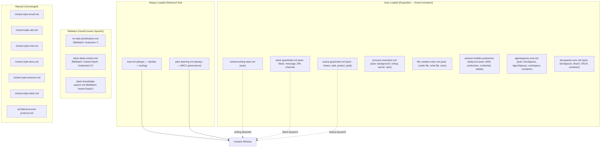
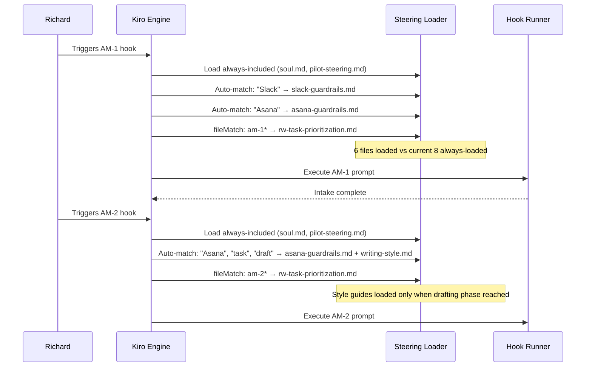
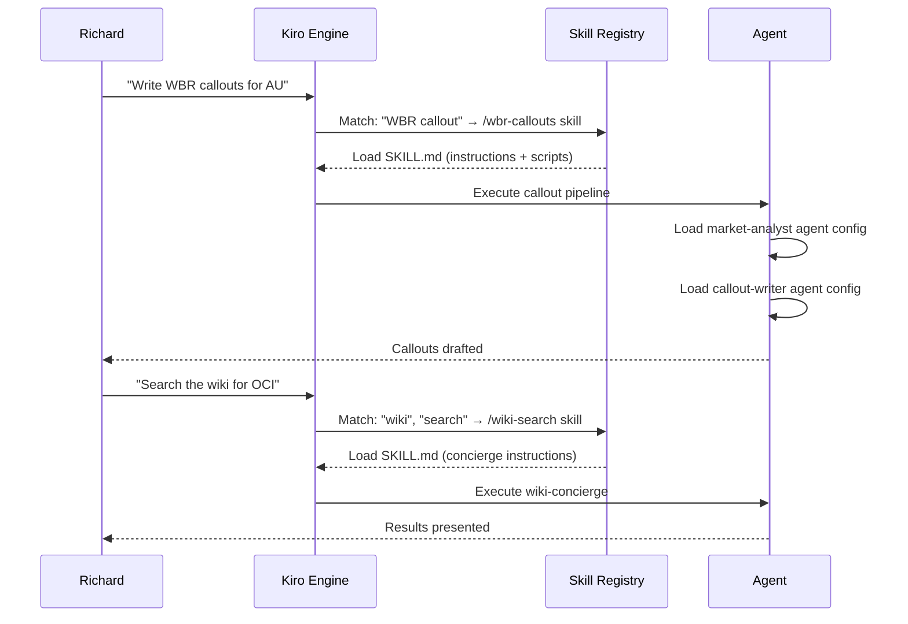

# Design Document: Kiro Setup Optimization

## Overview

A comprehensive audit and optimization of Richard Williams' Kiro IDE configuration — steering files, hooks, skills, and context provider usage — against the full Kiro product capability set. The goal is to reduce wasted context tokens from always-loaded files, formalize agent routing patterns as skills, exploit unused hook event types for guardrails and automation, and identify gaps where Kiro features could replace manual workflows.

This is a configuration project. The "implementation" is editing YAML front matter, creating SKILL.md files, adjusting hook event types, and restructuring inclusion modes. No application code is written. Every recommendation is checked against Richard's six building principles — particularly "subtraction before addition," "structural over cosmetic," and "reduce decisions, not options."

## Architecture

### Current Token Budget Flow

```mermaid
graph TD
    subgraph "Always Loaded (Every Interaction)"
        S1["soul.md (no front matter)"]
        S2["slack-guardrails.md (always)"]
        S3["agentspaces-core.md (always)"]
        S4["devspaces-core.md (always)"]
        S5["amazon-builder-production-safety.md (always)"]
        S6["file-creation-rules.md (always)"]
        S7["process-execution.md (always)"]
        S8["context/pilot-steering.md (always)"]
    end

    subgraph "Auto-Loaded (When Relevant)"
        A1["richard-writing-style.md (auto)"]
    end

    subgraph "Manual (Loaded on Request)"
        M1["richard-style-email.md"]
        M2["richard-style-wbr.md"]
        M3["richard-style-mbr.md"]
        M4["richard-style-docs.md"]
        M5["richard-style-amazon.md"]
        M6["richard-style-slack.md"]
        M7["slack-deep-context.md"]
        M8["slack-knowledge-search.md"]
        M9["asana-guardrails.md"]
        M10["architecture-eval-protocol.md"]
        M11["rw-task-prioritization.md"]
    end

    S1 --> CTX["Context Window"]
    S2 --> CTX
    S3 --> CTX
    S4 --> CTX
    S5 --> CTX
    S6 --> CTX
    S7 --> CTX
    S8 --> CTX
    A1 -.->|"when writing detected"| CTX
    M1 -.->|"manual only"| CTX
```



### Optimized Token Budget Flow (Proposed)




## Sequence Diagrams

### Morning Routine — Optimized Steering Activation



### Skill Invocation — Agent Routing via Skills




## Components and Interfaces

### Component 1: Steering File Optimization

#### 1A. Inclusion Mode Changes

The biggest token savings come from converting always-loaded files to auto-inclusion with keyword triggers. Currently 8 files load on every interaction regardless of relevance. Most interactions don't touch Slack, AWS, or background processes.

| File | Current Mode | Proposed Mode | Rationale |
|------|-------------|---------------|-----------|
| soul.md | always (no front matter) | always (add front matter explicitly) | Identity + routing must always load. Add `inclusion: always` front matter for explicitness. |
| slack-guardrails.md | always | auto (name: "Slack Guardrails", description: "Rules for Slack messaging, DM, channel posting, ingestion") | Only needed when Slack MCP tools are in play. Auto-activates on "Slack", "message", "DM", "channel", "post" keywords. |
| agentspaces-core.md | always | auto (name: "AgentSpaces Core", description: "DevSpaces container rules, workspace boundaries, file operations") | Only relevant when discussing environment, containers, or workspace boundaries. |
| devspaces-core.md | always | auto (name: "DevSpaces Core", description: "Brazil build system, CRUX tools, containerized development") | Overlaps significantly with agentspaces-core.md. Consider merging into one file. |
| amazon-builder-production-safety.md | always | auto (name: "Production Safety", description: "AWS credential safety, production resource protection, destructive action guardrails") | Only needed when AWS resources, credentials, or destructive operations are discussed. |
| file-creation-rules.md | always | auto (name: "File Creation Rules", description: "Where to create files: workspace, home, shared folder") | Simple rules that only matter during file creation. |
| process-execution.md | always | auto (name: "Process Execution", description: "Background process template with nohup, setsid for servers and long-running commands") | Only needed when running background processes. |
| context/pilot-steering.md | always | always (keep) | ARCC governance must fire before any code examination. Cannot risk missing the trigger. |

**Estimated token savings:** ~3,000-5,000 tokens per non-infrastructure interaction (the majority of Richard's usage is writing, task management, and coaching — not AWS or container work).


#### 1B. Merge Candidates

**agentspaces-core.md + devspaces-core.md → environment-rules.md**

These two files have ~70% content overlap (both discuss containerized environment, workspace boundaries, file operations, security). Merging them into a single `environment-rules.md` with `inclusion: auto` and description keywords covering both DevSpaces and AgentSpaces eliminates redundancy.

```pascal
PROCEDURE merge_environment_files
  INPUT: agentspaces-core.md, devspaces-core.md
  OUTPUT: environment-rules.md (auto inclusion)
  
  SEQUENCE
    combined_content ← deduplicate(agentspaces-core, devspaces-core)
    front_matter ← {
      inclusion: "auto",
      name: "Environment Rules",
      description: "DevSpaces and AgentSpaces container rules, workspace boundaries, Brazil tools, file operations"
    }
    WRITE environment-rules.md WITH front_matter + combined_content
    DELETE agentspaces-core.md
    DELETE devspaces-core.md
  END SEQUENCE
END PROCEDURE
```

**Principle alignment:** Subtraction before addition — removing a file, not adding one.

#### 1C. File Reference Opportunities

Kiro supports `#[[file:relative_path]]` syntax to link live workspace files. Richard's steering files currently duplicate context that exists in shared/ files.

| Steering File | Duplicated Content | Replace With |
|--------------|-------------------|-------------|
| soul.md → Agent Routing Directory | Full routing table (~40 lines) | Keep in soul.md — this is the canonical source, not a duplicate |
| soul.md → Key Context Files | File paths listed statically | `#[[file:~/shared/context/body/body.md]]` for the navigation layer |
| asana-guardrails.md → GID references | Hardcoded GIDs | `#[[file:~/shared/context/active/asana-command-center.md]]` for GID lookups |
| rw-task-prioritization.md → Five Levels | Restates strategic priorities | `#[[file:~/shared/context/body/brain.md]]` for live priority state |

**Note:** File references load the linked file's content into context when the steering file is loaded. Use sparingly — each reference adds to the token budget. Only use when the referenced content changes frequently and the steering file would otherwise go stale.

#### 1D. Foundational Steering Files

Kiro auto-generates `product.md`, `tech.md`, and `structure.md` as foundational steering. Richard's workspace doesn't appear to have these. For a non-code workspace like Richard's, these would describe:

- **product.md**: The body system, its purpose, the Five Levels framework
- **tech.md**: MCP servers in use (Asana, Slack, Outlook, DuckDB, Hedy, Calendar), hook architecture, agent routing
- **structure.md**: Auto-generated from workspace file tree

**Recommendation:** Generate `product.md` and `tech.md` for the workspace. These give Kiro baseline context about what this workspace IS without loading soul.md's full content. Low cost, high value for new sessions.


### Component 2: Skills Expansion

Richard has 10 agent routing patterns in soul.md but only 1 skill (cr-tagging). Skills offer progressive disclosure — only the name/description loads at startup, full instructions load on match. This is structurally better than embedding routing logic in soul.md because:

1. Soul.md loads every interaction. Routing table = ~800 tokens loaded even when no routing is needed.
2. Skills activate on keyword match via `/command` or natural language. Zero cost when not triggered.
3. Skills can include scripts/ for deterministic tasks (validation, file generation, API calls).

#### Proposed Skills

| Skill Name | Source Pattern | Trigger Keywords | Scripts Needed |
|-----------|---------------|-----------------|----------------|
| `/wbr-callouts` | market-analyst → callout-writer → callout-reviewer | "WBR", "callout", "weekly callout" | `scripts/validate-callout.sh` (word count check) |
| `/wiki-write` | wiki-editor → researcher → writer → critic | "write wiki", "document", "wiki article" | None — orchestration only |
| `/wiki-search` | wiki-concierge | "search wiki", "find doc", "do we have" | None |
| `/wiki-audit` | wiki-critic | "audit wiki", "stale docs" | None |
| `/coach` | rw-trainer | "coaching", "career", "1:1 prep", "retrospective", "growth" | None |
| `/charts` | eyes-chart | "chart", "dashboard", "visualize" | `scripts/generate.sh` (wraps python3 generate.py) |
| `/bridge-sync` | agent-bridge-sync | "sync to git", "bridge sync", "portable body" | `scripts/sync.sh` (git operations) |
| `/sharepoint-sync` | sharepoint-sync hook | "sync to SharePoint", "SharePoint" | `scripts/sync.sh` (wraps cli.py) |

#### Skill Structure Example: `/wbr-callouts`

```
~/.kiro/skills/wbr-callouts/
├── SKILL.md
├── scripts/
│   └── validate-callout.sh
└── references/
    └── callout-principles.md
```

```pascal
STRUCTURE SKILL_MD
  name: "wbr-callouts"
  description: "Full WBR callout pipeline: ingest → analyst → writer → blind review → correction. 10 markets."
  
  instructions:
    "1. Load callout-principles.md from references/
     2. Determine ISO week number
     3. Invoke market-analyst agent for each market with data
     4. Invoke callout-writer agent for markets with >66% confidence
     5. Run blind review across all callouts
     6. Correct any below 66% threshold
     7. Run validate-callout.sh for word count compliance
     8. Present AU/MX highlights to Richard"
END STRUCTURE
```

#### What Stays in soul.md

The Agent Routing Directory stays in soul.md because it serves as the fallback routing table when no skill matches. Skills handle the common, well-defined patterns. Soul.md handles ambiguous cases and the "if unsure, handle it yourself" default.

**However**, the routing table can be trimmed. Remove entries that are now fully covered by skills. Keep only:
- `karpathy` (gatekeeper role — too nuanced for a skill)
- `rw-trainer` (keep in soul.md as the routing table entry, but also create the `/coach` skill for direct invocation)
- The routing rules paragraph (fallback behavior)


### Component 3: Hook Improvements

#### 3A. Unused Hook Event Types

Richard's hooks use only 2 of 10 available event types: `userTriggered` (9 hooks) and `preToolUse` (2 guard hooks). Several unused event types would add value:

| Event Type | Current Usage | Opportunity |
|-----------|--------------|-------------|
| `userTriggered` | 9 hooks | Fully utilized |
| `preToolUse` | 2 hooks (calendar, email) | **Add: Asana write guard** |
| `postToolUse` | 0 hooks | **Add: Asana audit logger** |
| `promptSubmit` | 0 hooks | **Add: Context pre-loader** |
| `agentStop` | 0 hooks | **Add: Session summary writer** |
| `fileEdited` | 0 hooks | **Add: Organ change detector** |
| `fileCreated` | 0 hooks | Low value for Richard's workflow |
| `fileDeleted` | 0 hooks | Low value for Richard's workflow |
| `preTaskExecution` | 0 hooks | Useful if Richard adopts spec-driven workflows more |
| `postTaskExecution` | 0 hooks | Same as above |

#### 3B. Proposed New Hooks

**Hook: guard-asana.kiro.hook (preToolUse)**

Currently, Asana guardrails are enforced by prompt instructions in each hook. This is fragile — every hook must remember to include the guardrail text. A `preToolUse` hook on Asana MCP tools would enforce guardrails structurally, not by instruction.

```json
{
  "name": "Guard: Asana",
  "version": "1",
  "description": "Blocks Asana writes on non-Richard tasks. Enforces whitelist/blacklist from asana-guardrails.md.",
  "when": {
    "type": "preToolUse",
    "toolTypes": ["@mcp.*asana.*"]
  },
  "then": {
    "type": "askAgent",
    "prompt": "Load asana-guardrails.md. Inspect the tool call. If it's a READ operation (Get*, Search*, List*) → ACCESS GRANTED. If it's a WRITE operation (Update*, Create*, Set*, Delete*): check target task assignee GID. If assignee === 1212732742544167 (Richard) → check whitelist → ACCESS GRANTED or DRAFT-FIRST. If assignee !== Richard → ACCESS DENIED. Log to asana-audit-log.jsonl."
  }
}
```

**Principle alignment:** Structural over cosmetic — moves guardrails from prompt text (cosmetic, can be forgotten) to hook enforcement (structural, always fires).

**Hook: audit-asana-writes.kiro.hook (postToolUse)**

Automatic audit logging after every Asana write, regardless of which hook or chat session triggered it.

```json
{
  "name": "Audit: Asana Writes",
  "version": "1",
  "description": "Logs every Asana write operation to audit trail.",
  "when": {
    "type": "postToolUse",
    "toolTypes": ["@mcp.*asana.*"]
  },
  "then": {
    "type": "askAgent",
    "prompt": "If the completed tool call was a write operation (UpdateTask, CreateTask, CreateTaskStory, SetParentForTask), append to ~/shared/context/active/asana-audit-log.jsonl: {timestamp, tool, task_gid, fields_modified, result}. If it was a read operation, skip."
  }
}
```


**Hook: context-preloader.kiro.hook (promptSubmit)**

Uses the `USER_PROMPT` environment variable to pre-load relevant context before the agent processes the request. This replaces the "read body.md first" instruction in soul.md with structural pre-loading.

```json
{
  "name": "Context Pre-Loader",
  "version": "1",
  "description": "Analyzes user prompt to pre-load relevant body organs and context files.",
  "when": {
    "type": "promptSubmit"
  },
  "then": {
    "type": "runCommand",
    "command": "echo \"$USER_PROMPT\" | python3 ~/shared/tools/context-router/route.py"
  }
}
```

The `route.py` script would be a simple keyword matcher that outputs which context files to load. This is a Level 5 (Agentic Orchestration) enhancement — the system pre-loads context without Richard asking.

**Caution:** This adds latency to every prompt. Start as an experiment via Karpathy's experiment queue. Measure whether pre-loading reduces follow-up context requests.

**Hook: session-summary.kiro.hook (agentStop)**

Writes a brief session summary to intake/ after every agent turn. Feeds the autoresearch loop with session data.

```json
{
  "name": "Session Summary",
  "version": "1",
  "description": "Writes session summary to intake/ after agent completes its turn.",
  "when": {
    "type": "agentStop"
  },
  "then": {
    "type": "askAgent",
    "prompt": "Write a 2-3 line summary of what was accomplished in this session to ~/shared/context/intake/session-log.md. Include: date, topic, key actions taken, any decisions made. Append, don't overwrite."
  }
}
```

**Caution:** This fires after EVERY agent turn, including trivial ones. Consider adding a minimum-complexity threshold in the prompt (e.g., "only log if the session involved file writes, tool calls, or multi-turn conversation").

**Hook: organ-change-detector.kiro.hook (fileEdited)**

Detects when body organ files are edited and triggers coherence checks.

```json
{
  "name": "Organ Change Detector",
  "version": "1",
  "description": "Detects edits to body organ files and flags for coherence check.",
  "when": {
    "type": "fileEdited",
    "fileGlob": "**/shared/context/body/*.md"
  },
  "then": {
    "type": "askAgent",
    "prompt": "An organ file was edited. Check: does this edit conflict with other organs? Flag any cross-organ inconsistencies. If the edit was to heart.md or gut.md, verify it was made by the karpathy agent (these files are gated). Log the change to ~/shared/context/intake/organ-changes.md."
  }
}
```


### Component 4: Context Provider Usage

Richard's hooks and chat sessions reference files via explicit paths. Kiro's `#` context providers offer faster, more targeted context loading.

#### Current vs Recommended Usage

| Provider | Current Usage | Recommendation |
|----------|-------------|----------------|
| `#file` | Not used — paths hardcoded in prompts | Use in chat for ad-hoc file references. Hooks should continue using explicit paths in prompts. |
| `#folder` | Not used | Use `#folder ~/shared/context/body/` when asking about the full body system |
| `#codebase` | Not used | Low value — Richard's workspace isn't a codebase |
| `#git diff` | Not used | Use before agent-bridge-sync to preview what changed |
| `#terminal` | Not used | Use when debugging hook execution or script failures |
| `#problems` | Not used | Low value for non-code workspace |
| `#url` | Not used | **High value** — use to pull Quip docs, wiki pages, or SharePoint content into chat context |
| `#steering` | Not used | Use to reference steering files in chat: `#steering soul.md` |
| `#spec` | Not used | Use to reference specs: `#spec asana-agent-integration` |
| `#docs` | Not used | Use to reference Kiro product docs when building new hooks/skills |
| `#mcp` | Not used | Use to inspect available MCP tools: `#mcp asana` to see Asana tool list |
| `#repository` | Not used | Low value for non-code workspace |
| `#current` | Not used | Use to reference the currently open file in chat |

#### High-Impact Additions

1. **`#url` for Quip docs**: Richard frequently references Quip documents in tasks and emails. Using `#url https://quip-amazon.com/...` in chat would pull the doc content directly instead of requiring manual copy-paste.

2. **`#mcp` for tool discovery**: When building new hooks or debugging MCP tool calls, `#mcp asana` shows all available Asana tools with their parameters. Eliminates guessing at tool names.

3. **`#spec` for spec-driven work**: Richard has 2 active specs. Referencing them in chat with `#spec asana-agent-integration` loads the full spec context without manually opening files.

4. **`#steering` for meta-work**: When optimizing the system itself (like this spec), `#steering slack-guardrails.md` loads the steering file into chat context for review.

### Component 5: Powers Evaluation

Powers are dynamic MCP tool bundles that load on-demand based on conversation keywords. Richard's current MCP setup uses direct server configurations. Powers would add value for:

| Power Category | Potential Value | Assessment |
|---------------|----------------|------------|
| Asana Power | Low — Richard already has Enterprise Asana MCP configured directly | Skip. Direct MCP is more reliable for his workflow. |
| Slack Power | Low — same reason, direct MCP configured | Skip. |
| DuckDB Power | Low — direct MCP configured | Skip. |
| GitHub Power | Medium — agent-bridge-sync uses git CLI | Consider if a GitHub Power offers PR creation, issue tracking beyond CLI. |
| Documentation Power | Medium — could help with wiki pipeline | Evaluate marketplace for doc generation powers. |
| Calendar/Email Power | Low — direct MCP configured | Skip. |

**Recommendation:** Powers add the most value when you DON'T already have the MCP server configured. Richard's core tools (Asana, Slack, DuckDB, Calendar, Email) are all direct MCP connections. Powers would be redundant. Monitor the marketplace for powers that offer capabilities beyond what his current MCPs provide — particularly around document generation, data visualization, or cross-tool orchestration.


### Component 6: Token/Context Budget Analysis

#### Current Always-Loaded Cost

```pascal
PROCEDURE estimate_always_loaded_tokens
  INPUT: current steering files with inclusion: always
  OUTPUT: token estimate per interaction

  SEQUENCE
    // Approximate token counts (1 token ≈ 4 chars)
    soul_md ← 4500 tokens  // ~18,000 chars, loaded every time
    slack_guardrails ← 800 tokens
    agentspaces_core ← 400 tokens
    devspaces_core ← 400 tokens
    amazon_builder_safety ← 600 tokens
    file_creation_rules ← 200 tokens
    process_execution ← 300 tokens
    pilot_steering ← 800 tokens
    
    total_always ← 8000 tokens  // loaded EVERY interaction
    
    // With auto-loaded richard-writing-style.md when writing
    writing_style ← 1200 tokens
    total_with_writing ← 9200 tokens
    
    RETURN total_always
  END SEQUENCE
END PROCEDURE
```

#### Proposed Always-Loaded Cost

```pascal
PROCEDURE estimate_optimized_tokens
  INPUT: optimized steering files
  OUTPUT: token estimate per interaction

  SEQUENCE
    soul_md ← 4500 tokens  // still always (identity + routing)
    pilot_steering ← 800 tokens  // still always (ARCC governance)
    
    total_always ← 5300 tokens  // 2,700 tokens saved per interaction
    
    // Auto-loaded files add ~0-2000 tokens depending on topic
    // Slack interaction: +800 (slack-guardrails)
    // Asana interaction: +1200 (asana-guardrails)  
    // AWS interaction: +600 (production-safety)
    // Writing interaction: +1200 (writing-style)
    // Environment question: +600 (environment-rules, merged)
    
    RETURN total_always
  END SEQUENCE
END PROCEDURE
```

**Net savings: ~2,700 tokens per non-specialized interaction.** For Richard's typical usage (task management, coaching, writing), the auto-loaded files activate only when relevant, keeping the baseline lean.

#### soul.md Optimization

Soul.md is the largest always-loaded file (~4,500 tokens). It contains:
- Identity (essential — keep)
- Agent Voice (essential — keep)
- How I Work (essential — keep)
- What Matters (essential — keep)
- How I Build / 6 principles (essential — keep)
- Influences (nice-to-have — could move to auto)
- My Systems (reference — could use file references)
- Five Levels (essential — keep)
- Key Context Files (reference — could use file references)
- Agent Routing Directory (~800 tokens — partially moves to skills)
- Instructions for Any Agent (essential — keep)

**Proposed soul.md trimming:**
1. Move "Influences" section to a separate `influences.md` with `inclusion: manual` — only needed for deep coaching sessions
2. Replace "Key Context Files" paths with `#[[file:~/shared/context/body/body.md]]` — body.md is the navigation layer
3. Trim Agent Routing Directory to only entries not covered by skills (karpathy, rw-trainer, routing rules)
4. Remove "My Systems" section — this duplicates body.md navigation

**Estimated savings:** ~800-1,000 tokens from soul.md, bringing it to ~3,500 tokens.


### Component 7: What's NOT Possible (Kiro Limitations)

These are things Richard might want but Kiro doesn't currently support. Documenting them prevents wasted effort and sets expectations.

| Desired Capability | Status | Workaround |
|-------------------|--------|------------|
| **Cross-workspace steering sync** | Not supported. Global steering (~/.kiro/steering/) is per-machine. No built-in sync between DevSpaces instances. | Use agent-bridge-sync to manually sync steering files via git. Or use MDM/central repo for team steering (enterprise feature). |
| **Hook chaining** | Not supported. Hooks are independent — one hook cannot trigger another hook. AM-1 → AM-2 → AM-3 requires manual triggering of each. | Keep the current manual sequential triggering. Document the sequence in a skill or steering file. |
| **Conditional hook execution based on context** | Not supported. Hooks fire on their event type unconditionally. Cannot say "only run this hook on Fridays" or "only if Asana has overdue tasks." | Put conditional logic inside the hook prompt: "Check if today is Friday. If not, skip the weekly scorecard section." |
| **Hook scheduling / cron** | Not supported. `userTriggered` hooks require manual invocation. No time-based triggers. | Richard manually triggers AM/EOD hooks. Could use external cron to send a signal, but Kiro has no native scheduler. |
| **Steering file inheritance** | Not supported. Cannot have a base steering file that other files extend or override. | Use file references (`#[[file:]]`) to compose steering from multiple sources. |
| **Dynamic inclusion mode** | Not supported. Inclusion mode is static in front matter. Cannot change based on time of day, active project, or session type. | Use `auto` with broad keyword descriptions to approximate dynamic loading. |
| **Skill chaining / pipelines** | Not supported. Skills are invoked individually. Cannot define "skill A triggers skill B." | Encode the pipeline sequence in the skill's SKILL.md instructions. The agent follows the sequence. |
| **Hook access to previous hook output** | Not supported. Each hook execution is independent. AM-2 cannot directly read AM-1's output. | AM-1 writes to intake/ files. AM-2 reads intake/ files. File system is the shared state. |
| **preToolUse with conditional allow/block** | Partially supported. preToolUse can inspect the tool call, but the "block" is advisory — the agent decides based on the hook's prompt response. Not a hard technical block. | Make the hook prompt very explicit: "ACCESS DENIED. Do NOT proceed." The agent respects this in practice. |
| **Multi-model routing per hook** | Not supported. All hooks use the same model as the current session. Cannot say "use GLM-5 for this hook, Opus for that one." | Use the model that best fits the most demanding hook. For cost optimization, consider running lightweight hooks in separate sessions with cheaper models. |
| **Steering file versioning** | Not supported. No built-in version history for steering files. | Use git (agent-bridge-sync) to version steering files. |
| **Power bundling with steering** | Supported but not used. Powers can include steering files and hooks. | If Richard creates custom powers, he can bundle related steering + hooks together. |
| **Custom subagents with isolated context** | Supported (Feb 2026 release). Richard's agent routing patterns could use custom subagents to split context by domain. | **This is a significant opportunity.** Each routed agent (rw-trainer, karpathy, market-analyst, etc.) could be a custom subagent with its own context window, preventing cross-contamination. Evaluate as a Phase 2 optimization. |

#### Custom Subagents — The Big Opportunity

The Feb 2026 custom subagents feature is the most impactful unused capability for Richard's setup. Currently, all agent routing happens within a single context window — when the market-analyst runs, it shares context with the coaching system, the wiki pipeline, and everything else. Custom subagents would:

1. Give each agent its own context window (no cross-contamination)
2. Allow domain-specific model selection (cheaper models for simple tasks)
3. Reduce the "context pollution" problem where one agent's output confuses another
4. Enable true parallel execution for independent tasks

**This deserves its own spec.** Flag for Phase 2 after the steering/skills/hooks optimization is complete.


## Data Models

### Steering File Front Matter Schema

```pascal
STRUCTURE SteeringFrontMatter
  inclusion: ENUM {always, manual, auto, fileMatch}
  name: String (required if inclusion = auto)
  description: String (required if inclusion = auto)
  fileMatch: String[] (required if inclusion = fileMatch)
END STRUCTURE
```

### Proposed Front Matter Changes

```pascal
// slack-guardrails.md — change from always to auto
STRUCTURE SlackGuardrailsFrontMatter
  inclusion: "auto"
  name: "Slack Communication Guardrails"
  description: "Rules for Slack messaging, DM posting, channel operations, ingestion cycles, and audit logging"
END STRUCTURE

// asana-guardrails.md — change from manual to auto
STRUCTURE AsanaGuardrailsFrontMatter
  inclusion: "auto"
  name: "Asana Guardrails"
  description: "Asana write permissions, ownership boundaries, whitelist/blacklist, audit logging for task management"
END STRUCTURE

// process-execution.md — change from always to auto
STRUCTURE ProcessExecutionFrontMatter
  inclusion: "auto"
  name: "Process Execution Rules"
  description: "Background process template with nohup setsid for servers, npm commands, long-running processes"
END STRUCTURE

// file-creation-rules.md — change from always to auto
STRUCTURE FileCreationFrontMatter
  inclusion: "auto"
  name: "File Creation Rules"
  description: "Where to create files: workspace directory, home directory, shared folder for persistence"
END STRUCTURE

// amazon-builder-production-safety.md — change from always to auto
STRUCTURE ProductionSafetyFrontMatter
  inclusion: "auto"
  name: "Production Safety"
  description: "AWS credential safety, production resource protection, destructive action confirmation, IAM policies"
END STRUCTURE

// environment-rules.md (merged agentspaces + devspaces) — new file, auto
STRUCTURE EnvironmentRulesFrontMatter
  inclusion: "auto"
  name: "Environment Rules"
  description: "DevSpaces AgentSpaces container rules, workspace boundaries, Brazil build system, file operations"
END STRUCTURE

// rw-task-prioritization.md — change from manual to fileMatch
STRUCTURE TaskPrioritizationFrontMatter
  inclusion: "fileMatch"
  fileMatch: ["hooks/am-*", "hooks/eod-*"]
END STRUCTURE
```

### Skill Definition Schema

```pascal
STRUCTURE SkillDefinition
  name: String  // kebab-case, matches directory name
  description: String  // 1-2 sentences, used for keyword matching
  instructions: String  // Full execution instructions, loaded on match
  scripts: Script[]  // Optional deterministic scripts
  references: File[]  // Optional reference files bundled with skill
END STRUCTURE

STRUCTURE Script
  path: String  // relative to scripts/ directory
  purpose: String  // what this script does
  deterministic: Boolean  // true = same input always produces same output
END STRUCTURE
```

### Hook Event Type Schema

```pascal
STRUCTURE HookDefinition
  name: String
  version: String
  description: String
  when: HookTrigger
  then: HookAction
END STRUCTURE

STRUCTURE HookTrigger
  type: ENUM {
    fileEdited, fileCreated, fileDeleted,
    userTriggered,
    promptSubmit, agentStop,
    preToolUse, postToolUse,
    preTaskExecution, postTaskExecution
  }
  fileGlob: String (optional, for file* types)
  toolTypes: String[] (optional, for *ToolUse types — supports regex)
END STRUCTURE

STRUCTURE HookAction
  type: ENUM {askAgent, runCommand}
  prompt: String (for askAgent)
  command: String (for runCommand)
END STRUCTURE
```


## Algorithmic Pseudocode

### Inclusion Mode Migration Algorithm

```pascal
ALGORITHM migrate_inclusion_modes
INPUT: current_steering_files (list of steering file configs)
OUTPUT: updated_steering_files with optimized inclusion modes

BEGIN
  FOR each file IN current_steering_files DO
    ASSERT file.path EXISTS
    
    current_mode ← read_front_matter(file).inclusion
    
    IF file.name = "soul.md" OR file.name = "pilot-steering.md" THEN
      // These MUST stay always — identity and governance
      SET file.inclusion ← "always"
      CONTINUE
    END IF
    
    IF current_mode = "always" THEN
      // Evaluate if this file is needed in every interaction
      usage_domains ← analyze_content_domains(file)
      
      IF usage_domains ARE NARROW (< 3 topic areas) THEN
        // Convert to auto with keyword triggers
        keywords ← extract_keywords(file.content)
        SET file.inclusion ← "auto"
        SET file.name ← generate_display_name(file)
        SET file.description ← generate_description(keywords)
      ELSE
        // File covers too many domains — keep always
        SET file.inclusion ← "always"
      END IF
    END IF
    
    IF current_mode = "manual" AND file IS USED BY HOOKS THEN
      // Consider fileMatch for hook-specific files
      matching_hooks ← find_hooks_that_reference(file)
      IF matching_hooks IS NOT EMPTY THEN
        SET file.inclusion ← "fileMatch"
        SET file.fileMatch ← hook_glob_patterns(matching_hooks)
      END IF
    END IF
  END FOR
  
  RETURN updated_steering_files
END
```

**Preconditions:**
- All steering files exist at their current paths
- Front matter is valid YAML
- No circular file references

**Postconditions:**
- Every file has explicit inclusion mode in front matter
- No file lost its content during migration
- soul.md and pilot-steering.md remain `always`
- Token budget for always-loaded files is reduced

### Skill Creation Algorithm

```pascal
ALGORITHM create_skill_from_routing_pattern
INPUT: routing_entry (from soul.md Agent Routing Directory)
OUTPUT: skill directory with SKILL.md

BEGIN
  skill_name ← kebab_case(routing_entry.agent_name)
  skill_dir ← "~/.kiro/skills/" + skill_name + "/"
  
  // Extract trigger keywords from routing table
  triggers ← routing_entry.trigger_phrases
  description ← summarize(routing_entry.what_it_owns, 2 sentences)
  
  // Build instructions from existing hook prompts and agent configs
  IF EXISTS hook_for(routing_entry.agent_name) THEN
    instructions ← extract_instructions(hook.prompt)
  ELSE
    instructions ← routing_entry.what_it_owns + execution_steps
  END IF
  
  // Identify deterministic scripts
  scripts ← []
  IF routing_entry INVOLVES validation OR file_generation THEN
    script ← create_validation_script(routing_entry)
    scripts.APPEND(script)
  END IF
  
  // Identify reference files
  references ← []
  IF routing_entry REFERENCES steering_files THEN
    FOR each ref IN routing_entry.referenced_files DO
      references.APPEND(copy_to_references(ref))
    END FOR
  END IF
  
  // Write SKILL.md
  WRITE skill_dir + "SKILL.md" WITH {
    front_matter: {name: skill_name, description: description},
    body: instructions
  }
  
  // Write scripts if any
  FOR each script IN scripts DO
    WRITE skill_dir + "scripts/" + script.name WITH script.content
  END FOR
  
  // Copy references if any
  FOR each ref IN references DO
    COPY ref.source TO skill_dir + "references/" + ref.name
  END FOR
  
  RETURN skill_dir
END
```

**Preconditions:**
- Routing entry exists in soul.md
- Agent name is unique
- No existing skill with the same name

**Postconditions:**
- Skill directory created with valid SKILL.md
- SKILL.md front matter has name and description
- All referenced files are accessible from the skill


## Key Functions with Formal Specifications

### Function 1: validate_front_matter(file)

```pascal
PROCEDURE validate_front_matter(file)
  INPUT: steering file path
  OUTPUT: validation result (valid/invalid + errors)
```

**Preconditions:**
- File exists and is readable
- File is a markdown file

**Postconditions:**
- If inclusion = "auto": name and description fields are non-empty
- If inclusion = "fileMatch": fileMatch array is non-empty and contains valid glob patterns
- If inclusion = "always" or "manual": no additional fields required
- Returns list of validation errors (empty if valid)

### Function 2: estimate_token_cost(file)

```pascal
PROCEDURE estimate_token_cost(file)
  INPUT: steering file path
  OUTPUT: approximate token count (integer)
```

**Preconditions:**
- File exists and is readable

**Postconditions:**
- Returns positive integer
- Estimate is within 20% of actual token count (1 token ≈ 4 characters)
- Includes front matter in the count

### Function 3: check_auto_activation(file, prompt)

```pascal
PROCEDURE check_auto_activation(file, prompt)
  INPUT: steering file with auto inclusion, user prompt text
  OUTPUT: boolean (would this file activate for this prompt?)
```

**Preconditions:**
- File has inclusion = "auto" with name and description
- Prompt is non-empty string

**Postconditions:**
- Returns true if any keyword in the file's description appears in the prompt
- Matching is case-insensitive
- Returns false if no keywords match

## Example Usage

### Example 1: Migrating slack-guardrails.md

```pascal
SEQUENCE
  // Before: always loaded, ~800 tokens every interaction
  file ← read("~/.kiro/steering/slack-guardrails.md")
  ASSERT file.front_matter.inclusion = "always"
  
  // After: auto loaded, 0 tokens unless Slack is mentioned
  file.front_matter ← {
    inclusion: "auto",
    name: "Slack Communication Guardrails",
    description: "Rules for Slack messaging, DM posting, channel operations, ingestion cycles"
  }
  WRITE file
  
  // Verify: prompt about Asana should NOT load this file
  result ← check_auto_activation(file, "Update my Asana tasks")
  ASSERT result = FALSE
  
  // Verify: prompt about Slack SHOULD load this file
  result ← check_auto_activation(file, "Send a Slack message to the team")
  ASSERT result = TRUE
END SEQUENCE
```

### Example 2: Creating the /wbr-callouts skill

```pascal
SEQUENCE
  // Extract from soul.md routing table
  routing ← find_routing_entry("market-analyst → callout-writer")
  
  // Create skill
  skill ← create_skill_from_routing_pattern(routing)
  ASSERT skill.path = "~/.kiro/skills/wbr-callouts/"
  ASSERT EXISTS(skill.path + "SKILL.md")
  
  // Verify skill activates on correct keywords
  ASSERT skill.description CONTAINS "WBR"
  ASSERT skill.description CONTAINS "callout"
  
  // Verify routing table entry can be trimmed from soul.md
  ASSERT skill COVERS routing.trigger_phrases
END SEQUENCE
```

### Example 3: Adding the Asana guard hook

```pascal
SEQUENCE
  // Create preToolUse hook for Asana writes
  hook ← {
    name: "Guard: Asana",
    when: {type: "preToolUse", toolTypes: ["@mcp.*asana.*"]},
    then: {type: "askAgent", prompt: "...guardrail check..."}
  }
  WRITE "~/.kiro/hooks/guard-asana.kiro.hook" WITH hook
  
  // Verify: this replaces inline guardrail text in AM-1, AM-2, AM-3, EOD-2
  // Those hooks can now remove their GUARDRAILS sections
  // The guard hook fires BEFORE any Asana tool call regardless of source
  
  // Remove redundant guardrail text from hook prompts
  FOR each hook IN [am-1, am-2, am-3, eod-2] DO
    hook.prompt ← remove_section(hook.prompt, "GUARDRAILS:")
    WRITE hook
  END FOR
END SEQUENCE
```


## Correctness Properties

*A property is a characteristic or behavior that should hold true across all valid executions of a system — essentially, a formal statement about what the system should do. Properties serve as the bridge between human-readable specifications and machine-verifiable correctness guarantees.*

### Property 1: Always-loaded files are minimal and essential

*For any* interaction with the optimized setup, the always-loaded steering files should be exactly: soul.md and context/pilot-steering.md. No other file should have `inclusion: always`. The total token cost of always-loaded files should be less than 6,000 tokens.

**Validates: Requirements 1.1, 15.1**

### Property 2: Auto-inclusion files have valid activation metadata

*For any* steering file with `inclusion: auto`, the front matter must contain both a non-empty `name` field and a non-empty `description` field. The description must contain at least 3 distinct keywords that would trigger activation.

**Validates: Requirements 1.3, 2.4**

### Property 3: No steering file loses content during migration

*For any* steering file that changes inclusion mode, the file's body content (everything below the front matter) must be byte-identical before and after the migration. Only the front matter changes.

**Validates: Requirement 1.6**

### Property 4: Asana guard hook correctly classifies read vs write operations

*For any* Asana MCP tool call, the guard-asana preToolUse hook must correctly classify it as read or write. Read operations (Get*, Search*, List*) must be granted access. Write operations on non-Richard tasks must be denied. Write operations on Richard's tasks must be checked against the whitelist. Every evaluation must be logged.

**Validates: Requirements 7.2, 7.3, 7.4, 7.5**

### Property 5: Skills cover all formalized routing patterns

*For any* agent routing pattern that has been converted to a skill, the skill's description keywords must be a superset of the routing table's trigger phrases. The skill directory must contain a valid SKILL.md with name, description, and instructions.

**Validates: Requirements 5.1, 5.3**

### Property 6: Merged files preserve all unique content

*For any* file merge (e.g., agentspaces-core.md + devspaces-core.md → environment-rules.md), the merged file must contain every unique instruction, rule, and guideline from both source files. No rule should be lost in the merge.

**Validates: Requirement 2.2**

### Property 7: Hook guardrail removal doesn't weaken enforcement

*For any* Asana write operation, the allow/block decision must be identical before and after migrating from inline GUARDRAILS sections to the centralized guard-asana preToolUse hook. Every write that was blocked remains blocked, every write that was allowed remains allowed.

**Validates: Requirement 12.2**

### Property 8: Audit hook logs writes and skips reads

*For any* Asana MCP tool call that completes, write operations (UpdateTask, CreateTask, CreateTaskStory, SetParentForTask) must produce a log entry in asana-audit-log.jsonl containing timestamp, tool name, task GID, fields modified, and result status. Read operations must produce no log entry.

**Validates: Requirements 8.2, 8.3, 8.4**

### Property 9: Soul.md trimming preserves essential identity

*For any* trimming of soul.md (removing Influences, My Systems, Key Context Files sections), the remaining content must still contain: Identity, Agent Voice, How I Work, What Matters, How I Build (6 principles), Five Levels, Agent Routing Directory (trimmed), and Instructions for Any Agent. No essential section is removed.

**Validates: Requirement 6.1**

### Property 10: Session summary hook respects complexity threshold

*For any* agent turn, the session-summary agentStop hook should write to intake/ only when the session involved tool calls, file modifications, or 3+ conversation turns. Single short responses with no tool calls or file writes should produce no log entry.

**Validates: Requirements 10.2, 10.4**

### Property 11: Gated organ files require karpathy authorship

*For any* edit to heart.md or gut.md detected by the organ-change-detector hook, the hook must verify the edit was made by the karpathy agent. All organ changes must be logged to organ-changes.md.

**Validates: Requirements 11.3, 11.4**

### Property 12: Optimization artifacts are independently reversible

*For any* deleted skill, the soul.md routing table must still contain the fallback routing entry for that agent pattern. For any deleted hook, all other hooks and steering files must continue functioning without modification.

**Validates: Requirements 18.3, 18.4**

## Error Handling

### Error Scenario 1: Auto-inclusion fails to activate

**Condition:** A steering file with `inclusion: auto` doesn't activate when it should (e.g., slack-guardrails.md doesn't load when user mentions "Slack")
**Response:** The description keywords may be too narrow. Broaden the description to include more synonyms and related terms.
**Recovery:** Temporarily change back to `inclusion: always` while debugging. Test activation with various prompt phrasings. Update description keywords.

### Error Scenario 2: preToolUse hook blocks legitimate writes

**Condition:** The guard-asana hook incorrectly blocks a write operation that should be allowed (e.g., writing Kiro_RW on Richard's own task)
**Response:** The hook prompt's whitelist logic may be too restrictive.
**Recovery:** Check the hook prompt against asana-guardrails.md whitelist. Update the hook prompt to match the full whitelist. The hook is advisory — the agent can override if the prompt logic is clearly wrong, but this should be logged.

### Error Scenario 3: Skill doesn't match expected keywords

**Condition:** User says "write WBR callouts" but the /wbr-callouts skill doesn't activate
**Response:** The skill's description may not contain the right keywords for Kiro's matching algorithm.
**Recovery:** Update SKILL.md description to include more trigger phrases. Test with various phrasings. As a fallback, the soul.md routing table still contains the entry.

### Error Scenario 4: Merged environment file missing rules

**Condition:** After merging agentspaces-core.md and devspaces-core.md, an environment rule is missing
**Response:** The merge missed a unique rule from one of the source files.
**Recovery:** Keep the original files as backups until the merge is verified. Diff the merged file against both originals to find missing content.


## Testing Strategy

### Unit Testing Approach

Each optimization change should be tested in isolation before combining:

1. **Inclusion mode changes:** Change one file at a time. After each change, test 3 prompts: one that should activate the file, one that shouldn't, and one edge case. Verify activation behavior matches expectations.

2. **Skill creation:** Create one skill at a time. Test with the exact trigger phrases from the routing table. Verify the skill produces the same behavior as the routing table entry. Test with paraphrased triggers to verify keyword matching.

3. **Hook additions:** Add one hook at a time. Test with a controlled tool call. Verify the hook fires at the right time and produces the expected behavior. For guard hooks, test both allow and block scenarios.

4. **File merges:** Merge files, then diff the merged file against both originals. Verify no unique content is lost. Test auto-activation with keywords from both original files.

### Property-Based Testing Approach

**Property Test Library:** Manual verification (this is a configuration project, not code)

For each correctness property, create a test scenario:
- Property 1 (minimal always-loaded): Count files with `inclusion: always` in front matter. Verify exactly 2.
- Property 2 (valid auto metadata): Parse all auto-inclusion files. Verify name and description fields exist and are non-empty.
- Property 3 (content preservation): SHA-256 hash of file body before and after migration. Hashes must match.
- Property 4 (guardrail coverage): Trigger an Asana write from chat (not a hook). Verify guard-asana hook fires.

### Integration Testing Approach

Run the full morning routine (AM-1 → AM-2 → AM-3) with the optimized setup. Verify:
- All necessary steering files activate during each hook
- Guardrails still enforce correctly (test with a deliberate non-Richard task write)
- Token usage is measurably lower (compare session token counts before/after)
- No behavioral regressions in task management, drafting, or briefing

### Rollback Plan

All changes are reversible:
1. Keep backup copies of original steering files before modifying front matter
2. Keep original agentspaces-core.md and devspaces-core.md before merging
3. Skills can be deleted without affecting soul.md routing (routing table is the fallback)
4. New hooks can be deleted without affecting existing hooks
5. If any optimization causes issues, revert the specific file and re-test

## Performance Considerations

- **Token savings:** ~2,700 tokens per non-specialized interaction from inclusion mode changes. ~800-1,000 additional tokens from soul.md trimming. Total: ~3,500-3,700 tokens saved per typical interaction.
- **Activation latency:** Auto-inclusion adds negligible latency (keyword matching is fast). preToolUse hooks add one agent turn before each Asana write — acceptable for guardrail enforcement.
- **agentStop hook cost:** The session-summary hook fires after every agent turn. With the complexity threshold, most trivial turns are skipped. Cost is ~100 tokens per substantive session.
- **promptSubmit hook cost:** The context-preloader fires before every prompt. If implemented as a runCommand (python script), latency is <1 second. If implemented as askAgent, it adds one agent turn. Recommend runCommand for speed.

## Security Considerations

- **Guardrail weakening risk:** Converting slack-guardrails.md from `always` to `auto` means it won't load if the user doesn't mention Slack-related keywords. However, the guard hooks (guard-email, guard-calendar, and proposed guard-asana) provide structural enforcement regardless of steering file loading. The steering file is defense-in-depth, not the primary control.
- **preToolUse advisory nature:** Kiro's preToolUse hooks are advisory — the agent decides based on the hook's response. This is not a hard technical block. For critical guardrails (Asana writes, email sends), the combination of preToolUse hook + inline prompt instructions + audit logging provides layered defense.
- **ARCC governance:** pilot-steering.md stays `always` — no change to ARCC compliance.

## Dependencies

- Kiro IDE with steering, hooks, and skills support (current version)
- Existing MCP server configurations (Asana, Slack, DuckDB, Calendar, Email, Hedy)
- ~/shared/context/ file system for state files
- Python 3 for context-preloader script (if implemented)
- Git for agent-bridge-sync backup of steering file changes

