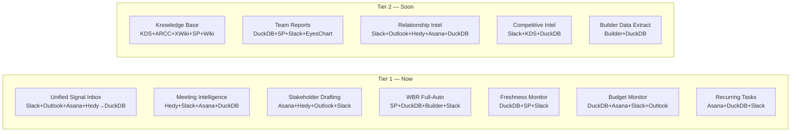
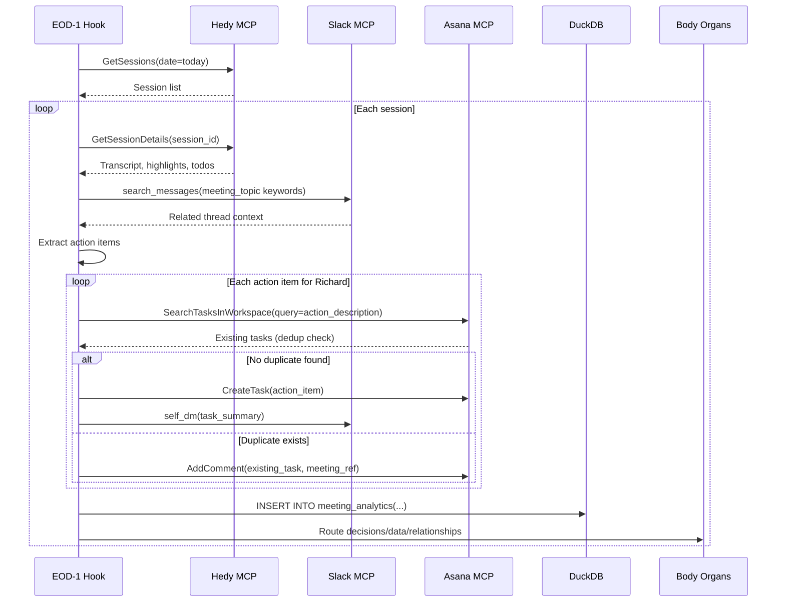
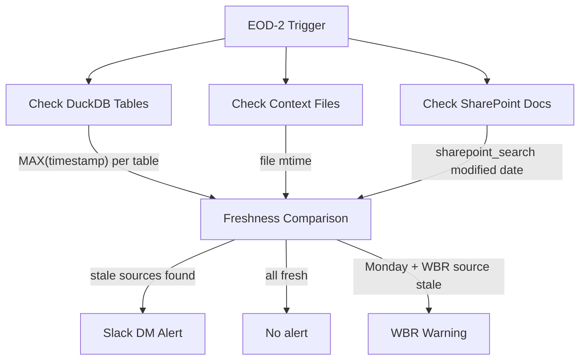

# Design Document: MCP Capability Expansion

## Overview

This spec expands Richard's 12-MCP ecosystem from isolated single-server usage to cross-MCP synergies, process consolidation, and new automation patterns. The existing system uses 6 MCPs heavily (Asana, Slack, Outlook, DuckDB, SharePoint, Hedy) in AM/EOD hooks and the WBR pipeline. The remaining 6 (Builder, XWiki, Knowledge Discovery, ARCC, Weblab, AgentCore) are connected but underutilized. This design wires them together into unified pipelines that advance all Five Levels.

The design is organized into 4 implementation layers, each building on the previous:

1. **Data Layer** — DuckDB schema extensions (unified_signals, relationship_activity, recurring_tasks, competitive_signals, workflow_executions, publication_registry)
2. **Pipeline Layer** — Cross-MCP workflow orchestration (meeting intelligence, WBR full-auto, knowledge base maintenance, team reports)
3. **Intelligence Layer** — Proactive monitoring, anomaly detection, relationship intelligence, competitive intelligence
4. **Hook Integration Layer** — AM/EOD hook prompt modifications to activate all pipelines

Related specs (avoid overlap):
- `mcp-integration-optimization/` — granular cross-MCP wiring (meeting-to-task, signal-to-task)
- `agentcore-system-integration/` — AgentCore service-level integration (browser, runtime, code interpreter)
- `kiro-setup-optimization/` — steering, hooks, skills configuration
- `asana-portfolio-management/` — Asana task lifecycle and portfolio scanning

## Architecture

```mermaid
graph TB
    subgraph "Signal Sources"
        Slack["Slack MCP"]
        Outlook["Outlook MCP"]
        Asana["Asana MCP"]
        Hedy["Hedy MCP"]
        Builder["Builder MCP"]
        KDS["KDS MCP"]
        ARCC["ARCC MCP"]
        XWiki["XWiki MCP"]
        SP["SharePoint MCP"]
    end

    subgraph "Data Layer (DuckDB)"
        US["unified_signals"]
        RA["relationship_activity"]
        RT["recurring_tasks"]
        CS["competitive_signals"]
        WE["workflow_executions"]
        PR["publication_registry"]
        MA["meeting_analytics"]
    end

    subgraph "Pipeline Layer"
        MI["Meeting Intelligence"]
        WBR["WBR Full-Auto"]
        KB["Knowledge Base Maintenance"]
        TR["Team Reports"]
        SD["Stakeholder Drafting"]
    end

    subgraph "Intelligence Layer"
        FM["Freshness Monitor"]
        BM["Budget Monitor"]
        AD["Anomaly Detection"]
        RI["Relationship Intelligence"]
        CI["Competitive Intelligence"]
    end

    subgraph "Hook Integration"
        AM1["AM-1: Ingest + Signals"]
        AM2["AM-2: Triage + Monitors"]
        AM3["AM-3: Brief + Alerts"]
        EOD1["EOD-1: Meeting Intel"]
        EOD2["EOD-2: Maintenance + Intel"]
    end

    Slack --> US
    Outlook --> US
    Asana --> US
    Hedy --> US
    Hedy --> MI
    Builder --> WBR
    KDS --> KB
    ARCC --> KB
    XWiki --> KB
    SP --> WBR
    SP --> TR

    US --> AM2
    MI --> EOD1
    WBR --> AM1
    KB --> EOD2
    TR --> EOD2

    FM --> AM3
    BM --> AM3
    AD --> AM3
    RI --> EOD2
    CI --> AM1

    US --> RA
    MI --> MA
    WBR --> WE
    KB --> PR
```



### Cross-MCP Workflow Map



## Components and Interfaces

### Component 1: DuckDB Schema Extensions

All new pipelines write structured data to DuckDB. This component defines the schema additions.

**New Tables:**

```sql
-- Requirement 1: Unified Signal Inbox
CREATE TABLE IF NOT EXISTS unified_signals (
    signal_id VARCHAR PRIMARY KEY,
    source_mcp VARCHAR NOT NULL,        -- 'slack', 'outlook', 'asana', 'hedy'
    source_id VARCHAR NOT NULL,          -- message ts, email id, task gid, session id
    author VARCHAR,
    author_alias VARCHAR,
    timestamp TIMESTAMP NOT NULL,
    content_preview VARCHAR(500),
    signal_type VARCHAR NOT NULL,        -- 'request', 'fyi', 'blocker', 'decision', 'action_item'
    raw_priority INTEGER DEFAULT 0,
    computed_priority DOUBLE,
    cluster_id VARCHAR,                  -- links related signals
    disposition VARCHAR,                 -- 'task_created', 'task_updated', 'deferred', 'dismissed'
    disposition_task_gid VARCHAR,
    created_at TIMESTAMP DEFAULT CURRENT_TIMESTAMP
);

-- Requirement 2: Meeting Analytics
CREATE TABLE IF NOT EXISTS meeting_analytics (
    session_id VARCHAR PRIMARY KEY,
    meeting_name VARCHAR NOT NULL,
    meeting_date DATE NOT NULL,
    duration_minutes INTEGER,
    participant_count INTEGER,
    action_item_count INTEGER,
    richard_speaking_share DOUBLE,
    hedging_count INTEGER DEFAULT 0,
    topics_discussed VARCHAR[],
    slack_context_attached BOOLEAN DEFAULT FALSE,
    organ_updates VARCHAR[],             -- which organs were updated
    created_at TIMESTAMP DEFAULT CURRENT_TIMESTAMP
);

-- Requirement 5: Freshness Monitoring
CREATE TABLE IF NOT EXISTS data_freshness (
    source_name VARCHAR NOT NULL,
    source_type VARCHAR NOT NULL,        -- 'duckdb_table', 'context_file', 'sharepoint_doc'
    expected_cadence_hours INTEGER NOT NULL,
    last_updated TIMESTAMP,
    last_checked TIMESTAMP DEFAULT CURRENT_TIMESTAMP,
    is_stale BOOLEAN DEFAULT FALSE,
    downstream_workflows VARCHAR[],
    PRIMARY KEY (source_name, source_type)
);

-- Requirement 6: Publication Registry
CREATE TABLE IF NOT EXISTS publication_registry (
    article_id VARCHAR PRIMARY KEY,
    article_title VARCHAR NOT NULL,
    local_path VARCHAR NOT NULL,
    sharepoint_url VARCHAR,
    xwiki_page_id VARCHAR,
    sharepoint_status VARCHAR DEFAULT 'pending',  -- 'published', 'pending', 'failed'
    xwiki_status VARCHAR DEFAULT 'pending',
    sharepoint_last_published TIMESTAMP,
    xwiki_last_published TIMESTAMP,
    sync_status VARCHAR DEFAULT 'pending',         -- 'in_sync', 'diverged', 'pending'
    created_at TIMESTAMP DEFAULT CURRENT_TIMESTAMP,
    updated_at TIMESTAMP DEFAULT CURRENT_TIMESTAMP
);

-- Requirement 8: Budget/Task Health
CREATE TABLE IF NOT EXISTS health_alerts (
    alert_id VARCHAR PRIMARY KEY,
    alert_type VARCHAR NOT NULL,         -- 'budget_overrun', 'stale_task', 'metric_anomaly', 'at_risk_project'
    market VARCHAR,
    severity VARCHAR NOT NULL,           -- 'info', 'warning', 'critical'
    message VARCHAR NOT NULL,
    context_data JSON,
    slack_context VARCHAR,               -- related Slack discussion if found
    acknowledged BOOLEAN DEFAULT FALSE,
    created_at TIMESTAMP DEFAULT CURRENT_TIMESTAMP
);

-- Requirement 9: Relationship Intelligence
CREATE TABLE IF NOT EXISTS relationship_activity (
    person_name VARCHAR NOT NULL,
    person_alias VARCHAR NOT NULL,
    week DATE NOT NULL,                  -- Monday of the week
    slack_interactions INTEGER DEFAULT 0,
    email_exchanges INTEGER DEFAULT 0,
    meetings_shared INTEGER DEFAULT 0,
    asana_collaborations INTEGER DEFAULT 0,
    total_score INTEGER DEFAULT 0,
    interaction_trend VARCHAR,           -- 'active', 'cooling', 'intensifying', 'dormant'
    PRIMARY KEY (person_alias, week)
);

-- Requirement 10: Competitive Intelligence
CREATE TABLE IF NOT EXISTS competitive_signals (
    signal_id VARCHAR PRIMARY KEY,
    competitor_name VARCHAR NOT NULL,
    market VARCHAR,
    source_type VARCHAR NOT NULL,        -- 'slack_mention', 'impression_share', 'kds_finding'
    source_id VARCHAR,
    content VARCHAR,
    metric_change DOUBLE,
    detected_at TIMESTAMP DEFAULT CURRENT_TIMESTAMP
);

-- Requirement 11: Recurring Task Lifecycle
CREATE TABLE IF NOT EXISTS recurring_tasks (
    task_name VARCHAR NOT NULL,
    project_name VARCHAR NOT NULL,
    cadence VARCHAR NOT NULL,            -- 'daily', 'weekly', 'biweekly', 'monthly'
    last_completed_date DATE,
    next_due_date DATE,
    total_instances INTEGER DEFAULT 0,
    on_time_instances INTEGER DEFAULT 0,
    compliance_rate DOUBLE DEFAULT 1.0,
    PRIMARY KEY (task_name, project_name)
);

-- Requirement 11: Cross-MCP Workflow Observability
CREATE TABLE IF NOT EXISTS workflow_executions (
    execution_id VARCHAR PRIMARY KEY,
    workflow_name VARCHAR NOT NULL,
    trigger_source VARCHAR,
    mcp_servers_involved VARCHAR[],
    start_time TIMESTAMP NOT NULL,
    end_time TIMESTAMP,
    status VARCHAR DEFAULT 'running',    -- 'running', 'completed', 'partial', 'failed'
    steps_completed INTEGER DEFAULT 0,
    steps_failed INTEGER DEFAULT 0,
    duration_seconds DOUBLE,
    error_details JSON,
    created_at TIMESTAMP DEFAULT CURRENT_TIMESTAMP
);

-- Requirement 12: Builder MCP Cache
CREATE TABLE IF NOT EXISTS builder_cache (
    cache_key VARCHAR PRIMARY KEY,
    source_tool VARCHAR NOT NULL,        -- 'phonetool', 'taskei', 'code_amazon', 'xwiki'
    data JSON NOT NULL,
    fetched_at TIMESTAMP DEFAULT CURRENT_TIMESTAMP,
    stale_after_hours INTEGER DEFAULT 168  -- 7 days for org, 24 for tickets
);
```

**New Views:**

```sql
-- Requirement 1: Priority-ordered signal queue for AM-2
CREATE VIEW unified_signal_queue AS
SELECT *,
    CASE signal_type
        WHEN 'blocker' THEN 5
        WHEN 'request' THEN 4
        WHEN 'decision' THEN 3
        WHEN 'action_item' THEN 2
        WHEN 'fyi' THEN 1
    END AS type_weight,
    -- Stakeholder rank: Brandon=5, Kate=4, skip-level=3, direct=2, other=1
    computed_priority
FROM unified_signals
WHERE disposition IS NULL
ORDER BY computed_priority DESC, timestamp DESC;

-- Requirement 10: Competitive intelligence aggregation
CREATE VIEW competitive_intelligence AS
SELECT
    competitor_name,
    market,
    COUNT(*) FILTER (WHERE source_type = 'slack_mention') AS slack_mentions_7d,
    COUNT(*) FILTER (WHERE source_type = 'impression_share') AS share_changes,
    COUNT(*) FILTER (WHERE source_type = 'kds_finding') AS kds_findings,
    MAX(detected_at) AS last_signal
FROM competitive_signals
WHERE detected_at > CURRENT_TIMESTAMP - INTERVAL '7 days'
GROUP BY competitor_name, market;

-- Requirement 11: Workflow reliability dashboard
CREATE VIEW workflow_reliability AS
SELECT
    workflow_name,
    COUNT(*) AS total_runs,
    COUNT(*) FILTER (WHERE status = 'completed') AS successes,
    ROUND(COUNT(*) FILTER (WHERE status = 'completed') * 100.0 / COUNT(*), 1) AS success_rate,
    ROUND(AVG(duration_seconds), 1) AS avg_duration_s,
    MAX(start_time) AS last_run
FROM workflow_executions
WHERE start_time > CURRENT_TIMESTAMP - INTERVAL '7 days'
GROUP BY workflow_name;
```

**Freshness Configuration (seeded on first run):**

```sql
INSERT INTO data_freshness (source_name, source_type, expected_cadence_hours, downstream_workflows) VALUES
('daily_metrics', 'duckdb_table', 36, ARRAY['am_brief', 'budget_monitor']),
('weekly_metrics', 'duckdb_table', 192, ARRAY['wbr_pipeline', 'anomaly_detection']),
('change_log', 'duckdb_table', 192, ARRAY['wbr_pipeline']),
('slack_messages', 'duckdb_table', 36, ARRAY['am_triage', 'competitive_intel']),
('callout_scores', 'duckdb_table', 192, ARRAY['wbr_pipeline']),
('au-context.md', 'context_file', 336, ARRAY['wbr_callouts']),
('mx-context.md', 'context_file', 336, ARRAY['wbr_callouts']),
('us-context.md', 'context_file', 336, ARRAY['wbr_callouts']),
('ca-context.md', 'context_file', 336, ARRAY['wbr_callouts']),
('jp-context.md', 'context_file', 336, ARRAY['wbr_callouts']),
('uk-context.md', 'context_file', 336, ARRAY['wbr_callouts']),
('de-context.md', 'context_file', 336, ARRAY['wbr_callouts']),
('fr-context.md', 'context_file', 336, ARRAY['wbr_callouts']),
('it-context.md', 'context_file', 336, ARRAY['wbr_callouts']),
('es-context.md', 'context_file', 336, ARRAY['wbr_callouts']),
('wbr_dashboard', 'sharepoint_doc', 192, ARRAY['wbr_pipeline']);
```


### Component 2: Unified Signal Inbox Pipeline (Req 1)

Consolidates signals from 4 MCP sources into a single prioritized queue in DuckDB, replacing the current sequential per-source processing in AM-1/AM-2.

**Signal Extraction per Source:**

| Source MCP | Signal Extraction Method | Signal Types |
|-----------|------------------------|--------------|
| Slack | `search_messages` + `list_channel_history` | request, fyi, blocker, decision |
| Outlook | `email_search` + `email_read` | request, fyi, action_item |
| Asana | `SearchTasksInWorkspace` (notifications) | action_item, blocker |
| Hedy | `GetSessions` + `GetSessionDetails` | action_item, decision |

**Priority Computation:**

```python
def compute_priority(signal):
    # Stakeholder rank from memory.md relationship graph
    stakeholder_ranks = {
        'Brandon Munday': 5, 'Kate Rundell': 4, 'Todd Heimes': 4,
        'Lena': 3, 'Lorena': 3, 'Andrew': 3, 'Stacey': 3,
        'Adi': 3, 'Dwayne': 3
    }
    stakeholder_rank = stakeholder_ranks.get(signal.author, 1)
    
    type_weights = {
        'blocker': 5, 'request': 4, 'decision': 3,
        'action_item': 2, 'fyi': 1
    }
    type_weight = type_weights.get(signal.signal_type, 1)
    
    # Recency: signals from last 4 hours get 2x, last 24h get 1.5x, older get 1x
    hours_old = (now() - signal.timestamp).total_seconds() / 3600
    recency = 2.0 if hours_old < 4 else (1.5 if hours_old < 24 else 1.0)
    
    return stakeholder_rank * type_weight * recency
```

**Signal Clustering:**

After all signals are inserted, run clustering:

```sql
-- Find signals from same author within 48 hours with overlapping keywords
-- Implemented as a Python post-processing step using FTS similarity
UPDATE unified_signals s1
SET cluster_id = (
    SELECT MIN(signal_id) FROM unified_signals s2
    WHERE s2.author_alias = s1.author_alias
    AND ABS(EPOCH(s2.timestamp - s1.timestamp)) < 172800  -- 48 hours
    AND s2.signal_id != s1.signal_id
    -- keyword overlap checked in Python via FTS
)
WHERE cluster_id IS NULL;
```

**AM-1 Integration:**

The existing AM-1 hook prompt gets a new section after each source scan:

```
SIGNAL INSERTION — After scanning each source:
For each actionable signal identified:
1. Generate a unique signal_id: {source}_{source_id}_{timestamp}
2. Classify signal_type based on content analysis
3. Compute raw_priority from stakeholder rank × type weight × recency
4. INSERT INTO unified_signals (signal_id, source_mcp, source_id, author, ...)
5. After all sources scanned, run clustering query
```

**AM-2 Integration:**

Replace sequential source processing with unified queue:

```
PHASE 0 — UNIFIED TRIAGE:
Query: SELECT * FROM unified_signal_queue LIMIT 25
Process signals in priority order regardless of source.
For each signal:
  - If actionable → create/update Asana task, set disposition='task_created'
  - If informational → route to appropriate organ, set disposition='deferred'
  - If noise → set disposition='dismissed'
```

### Component 3: Meeting Intelligence Pipeline (Req 2)

Extends EOD-1 from simple Hedy ingestion to a full intelligence pipeline: Hedy → Slack enrichment → action item extraction → Asana task creation → DuckDB analytics → organ routing.

**Pipeline Sequence:**



**Slack Context Enrichment:**

For each Hedy session, extract 2-3 topic keywords from the meeting name and agenda. Query Slack:

```
search_messages(query="topic_keyword1 topic_keyword2", limit=5)
```

Attach matching Slack threads as context to the meeting record. This enables the action item extraction to reference pre-meeting discussion.

**Organ Routing Rules:**

| Content Type | Target Organ | Routing Condition |
|-------------|-------------|-------------------|
| Strategic decision | brain.md | Decision involves priorities, resource allocation, or direction |
| Market data point | eyes.md | Specific metric, competitor info, or performance data mentioned |
| Relationship signal | memory.md | New stakeholder interaction, sentiment shift, or collaboration pattern |
| Action item | hands.md | Task assigned to Richard with deadline |
| Communication pattern | nervous-system.md | Speaking share, hedging, or visibility data |

### Component 4: Stakeholder Communication Drafting (Req 3)

Auto-generates ready-to-send Slack messages and email replies during AM-2 based on Asana task context, meeting history, and stakeholder preferences.

**Draft Generation Triggers:**

| Trigger | Source | Draft Type |
|---------|--------|-----------|
| Task due date approaching (≤2 days) | Asana MCP | Status update to task collaborators |
| Blocker resolved | Asana MCP (task completed/unblocked) | Unblock notification |
| Status change on watched task | Asana MCP | Progress update |
| Meeting follow-up overdue (>48h) | meeting_analytics + Hedy MCP | Follow-up message |

**Draft Context Assembly:**

For each draft, the system assembles context from multiple MCPs:

1. **Task context** (Asana MCP): task name, description, due date, project, collaborators
2. **Meeting context** (Hedy MCP via meeting_analytics): recent discussions about the topic
3. **Communication history** (Slack MCP via DuckDB FTS): recent messages with the recipient
4. **Stakeholder preferences** (memory.md): communication style, preferred channel, relationship context

**Draft Storage:**

```
~/shared/context/intake/drafts/
├── {date}-{recipient}-{type}.md
│   # Metadata header:
│   # recipient: Brandon Munday
│   # channel: slack_dm
│   # urgency: normal
│   # source_task_gid: 1234567890
│   # generated_at: 2026-04-07T08:30:00
│   #
│   # Draft body follows...
```

**Staleness Detection:**

Before presenting a draft to Richard, check if source data has changed:
- Query Asana for task status changes since draft generation
- Query DuckDB for new meeting records involving the recipient
- If changes detected → regenerate draft with current context, mark old draft as stale

**Recipient Whitelist (hardcoded from soul.md):**

```python
STAKEHOLDER_WHITELIST = [
    'Brandon Munday', 'Kate Rundell', 'Lena', 'Lorena',
    'Andrew', 'Stacey', 'Adi', 'Dwayne'
]
```

No drafts generated for recipients outside this list.

### Component 5: WBR Full Automation Pipeline (Req 4)

Extends the existing WBR watcher from SharePoint→DuckDB→callouts to include Quip publishing via Builder MCP and Slack team notification.

**Extended Pipeline Steps:**

| Step | MCP(s) | Action | Critical? |
|------|--------|--------|-----------|
| 1. Dashboard detection | SharePoint | Poll for new xlsx | Yes |
| 2. Data ingestion | DuckDB | Ingest to weekly_metrics | Yes |
| 3. Change log ingestion | Agent Bridge + DuckDB | Google Sheets → DuckDB | No |
| 4. Projection accuracy | DuckDB | Compare projections vs actuals | No |
| 5. Callout generation | DuckDB + context files | 10-market callouts | Yes |
| 6. Quip publishing | Builder MCP | Write to Pre-WBR Callouts doc | No |
| 7. Slack notification | Slack MCP | Team channel + Richard DM | No |
| 8. Pipeline logging | DuckDB | workflow_executions record | No |

**Quip Publishing via Builder MCP:**

```
// Builder MCP Quip access
ReadInternalWebsites(url="quip-amazon.com/[doc_id]")  // Read current structure
// Then write formatted callouts to the appropriate section
```

The agent reads the existing Quip document structure first, identifies the correct section for the new week's callouts, and appends content preserving the existing structure.

**Change Log Cross-Reference:**

After ingesting both the dashboard and change log:

```sql
-- Find change log entries that explain WoW metric movements
SELECT cl.market, cl.change_description, cl.change_date,
       wm.regs_wow_pct, wm.spend_wow_pct
FROM change_log cl
JOIN weekly_metrics wm ON cl.market = wm.market AND cl.week = wm.week
WHERE ABS(wm.regs_wow_pct) > 10 OR ABS(wm.spend_wow_pct) > 10;
```

Include matching change log entries in the callout context for each market.

**Workflow Observability:**

Every pipeline run logs to `workflow_executions`:

```sql
INSERT INTO workflow_executions (
    execution_id, workflow_name, trigger_source, mcp_servers_involved,
    start_time, status
) VALUES (
    'wbr_' || strftime(now(), '%Y%m%d_%H%M%S'),
    'wbr_full_auto',
    'sharepoint_poll',
    ARRAY['sharepoint', 'duckdb', 'builder', 'slack'],
    CURRENT_TIMESTAMP,
    'running'
);
```

Updated on completion with end_time, steps_completed, steps_failed, duration_seconds.

### Component 6: Freshness Monitoring System (Req 5)

Proactive staleness detection across all data sources, running during EOD-2.

**Check Sequence:**



**DuckDB Table Freshness Check:**

```sql
-- Check each monitored table's latest timestamp
SELECT source_name, expected_cadence_hours,
    CASE 
        WHEN source_name = 'daily_metrics' THEN 
            (SELECT MAX(date) FROM daily_metrics)
        WHEN source_name = 'weekly_metrics' THEN 
            (SELECT MAX(week_end) FROM weekly_metrics)
        WHEN source_name = 'slack_messages' THEN 
            (SELECT MAX(timestamp) FROM slack_messages)
        -- etc.
    END AS last_data_timestamp,
    EPOCH(CURRENT_TIMESTAMP - last_data_timestamp) / 3600 AS hours_since_update
FROM data_freshness
WHERE source_type = 'duckdb_table';
```

**Context File Freshness:**

For each market context file, check the `Last updated:` header line (all organs follow this convention). Parse the date and compare against the 14-day threshold.

**SharePoint Document Freshness:**

```
sharepoint_search(query="AB SEM WW Dashboard FileType:xlsx", rowLimit=1)
// Check LastModifiedTime from result
```

**Alert Format (Slack DM):**

```
📊 Data Freshness Report — [date]

⚠️ STALE SOURCES:
- daily_metrics: last updated 42h ago (threshold: 36h)
  Affects: am_brief, budget_monitor
- au-context.md: last updated 18 days ago (threshold: 14d)
  Affects: wbr_callouts

✅ All other sources within expected cadence.
```

### Component 7: Knowledge Base Auto-Maintenance (Req 6)

Enriches the wiki pipeline with KDS and ARCC context, adds XWiki as a second publishing channel, and monitors article staleness.

**Wiki Pipeline Extension Points:**

| Pipeline Stage | Current | Extended |
|---------------|---------|----------|
| Researcher | Reads local context + SharePoint | + KDS query + ARCC query |
| Librarian (publish) | SharePoint sync only | + XWiki publish |
| Maintenance | Manual staleness check | Automated lint + Asana task creation |

**KDS/ARCC Integration in Researcher:**

```
// During wiki-researcher context gathering:
1. Extract 3-5 topic keywords from the article brief
2. Query KDS: knowledge_discovery_search(query="topic keywords", limit=5)
3. Query ARCC: search_arcc(query="topic keywords")
4. Include relevant findings in research brief with source attribution
```

**XWiki Publishing:**

```
// After SharePoint sync succeeds:
1. Convert markdown → XWiki markup (headings, lists, tables, code blocks)
2. Determine namespace: PaidSearch/{ArticleTitle}
3. xwiki_create_page or xwiki_update_page(space="PaidSearch", title=article_title, content=xwiki_markup)
4. Update publication_registry in DuckDB
```

**Markdown → XWiki Conversion Rules:**

| Markdown | XWiki Markup |
|----------|-------------|
| `# Heading` | `= Heading =` |
| `## Heading` | `== Heading ==` |
| `**bold**` | `**bold**` |
| `*italic*` | `//italic//` |
| `- list item` | `* list item` |
| `1. ordered` | `1. ordered` |
| `` `code` `` | `{{code}}code{{/code}}` |
| `[link](url)` | `[[label>>url]]` |
| `| table |` | `| table` |

**Article Staleness Detection (weekly lint):**

```sql
-- Find articles with active Slack discussion but stale content
SELECT pr.article_title, pr.local_path,
    COUNT(sm.ts) AS recent_mentions,
    pr.sharepoint_last_published
FROM publication_registry pr
LEFT JOIN slack_messages sm ON sm.full_text ILIKE '%' || pr.article_title || '%'
    AND sm.timestamp > CURRENT_TIMESTAMP - INTERVAL '14 days'
WHERE pr.sharepoint_last_published < CURRENT_TIMESTAMP - INTERVAL '14 days'
GROUP BY pr.article_title, pr.local_path, pr.sharepoint_last_published
HAVING COUNT(sm.ts) > 3;
```

For each stale article with active discussion → create Asana task via Enterprise Asana MCP.

### Component 8: Team-Facing Reports (Req 7)

Generates HTML reports from DuckDB data and publishes to SharePoint for team access.

**Report Types:**

| Report | Trigger | Data Source | Audience |
|--------|---------|------------|----------|
| Weekly WBR Summary | After WBR pipeline | weekly_metrics, callout_scores | Brandon, Stacey, Adi, Dwayne |
| Monthly Performance | 1st business day | monthly_metrics | Same + Kate |

**HTML Generation:**

Uses the Eyes Chart agent's existing Chart.js capability. Reports are self-contained HTML files with embedded data — no external dependencies.

```
// Invoke eyes-chart agent or generate directly:
python3 ~/shared/tools/progress-charts/generate.py \
    --report weekly_wbr \
    --output ~/shared/artifacts/reports/wbr-summary-w{NN}.html
```

**SharePoint Upload:**

```
sharepoint_upload_file(
    siteUrl="https://amazon.sharepoint.com/sites/ABPaidSearch",
    folderPath="/Shared Documents/Reports",
    fileName="wbr-summary-w{NN}.html",
    fileContent=html_content
)
```

**Slack Notification:**

```
post_message(
    channel="C0993SRL6FQ",  // rsw-channel or team channel
    text="📊 W{NN} WBR Summary published → [SharePoint link]\nHighlight: {most_significant_finding}"
)
```

### Component 9: Proactive Budget and Task Health Monitoring (Req 8)

Runs during AM-1 to detect budget overruns, stale tasks, and metric anomalies before they become problems.

**Budget Overrun Detection:**

```sql
-- Daily spend vs budget target
SELECT market, date, daily_spend, daily_budget_target,
    ROUND(daily_spend / daily_budget_target * 100, 1) AS pacing_pct
FROM daily_metrics
WHERE date = CURRENT_DATE - 1
AND market IN ('AU', 'MX')
AND daily_spend > daily_budget_target * 1.2;

-- Monthly pacing
SELECT market, 
    SUM(daily_spend) AS mtd_spend,
    monthly_budget,
    ROUND(SUM(daily_spend) / monthly_budget * 100, 1) AS mtd_pacing_pct,
    -- Projected month-end based on current run rate
    ROUND(SUM(daily_spend) / DAY(CURRENT_DATE) * DAY(LAST_DAY(CURRENT_DATE)), 2) AS projected_spend
FROM daily_metrics
WHERE MONTH(date) = MONTH(CURRENT_DATE) AND YEAR(date) = YEAR(CURRENT_DATE)
AND market IN ('AU', 'MX')
GROUP BY market, monthly_budget
HAVING projected_spend > monthly_budget * 1.05;
```

**Abandoned Overdue Task Detection:**

```
// Via Asana MCP:
SearchTasksInWorkspace(
    assignee="1212732742544167",
    completed_since=null,  // incomplete only
    opt_fields="name,due_on,custom_fields.display_value,modified_at"
)
// Filter: due_on < today - 7 AND no Kiro_RW update in last 5 days
```

**Metric Anomaly Detection:**

```sql
-- WoW change exceeding 15% vs trailing 4-week average
WITH trailing AS (
    SELECT market, metric_name,
        AVG(value) AS avg_4wk,
        STDDEV(value) AS std_4wk
    FROM weekly_metrics
    WHERE week_end BETWEEN CURRENT_DATE - 35 AND CURRENT_DATE - 7
    GROUP BY market, metric_name
),
current_week AS (
    SELECT market, metric_name, value
    FROM weekly_metrics
    WHERE week_end = (SELECT MAX(week_end) FROM weekly_metrics)
)
SELECT c.market, c.metric_name, c.value, t.avg_4wk,
    ROUND((c.value - t.avg_4wk) / t.avg_4wk * 100, 1) AS wow_change_pct
FROM current_week c
JOIN trailing t ON c.market = t.market AND c.metric_name = t.metric_name
WHERE ABS((c.value - t.avg_4wk) / t.avg_4wk) > 0.15;
```

**Contextual Enrichment:**

When an anomaly is detected, query Slack for explanatory context:

```
search_messages(query="{market} {metric_name}", limit=5)
// Look for campaign launches, bid changes, competitor mentions
```

### Component 10: Relationship Intelligence (Req 9)

Builds a data-driven relationship activity graph from 4 MCP sources, replacing manual memory.md maintenance.

**Weekly Computation (EOD-2):**

```python
def compute_weekly_interactions(person_alias, week_start):
    # Slack: count messages mentioning or from this person
    slack_count = db.execute("""
        SELECT COUNT(*) FROM slack_messages 
        WHERE author_name ILIKE ? AND timestamp >= ? AND timestamp < ? + INTERVAL '7 days'
    """, [person_alias, week_start, week_start]).fetchone()[0]
    
    # Email: count exchanges via Outlook MCP
    # email_search(query=f"from:{person_alias} OR to:{person_alias}", ...)
    email_count = len(email_results)
    
    # Meetings: count shared sessions from meeting_analytics
    meeting_count = db.execute("""
        SELECT COUNT(*) FROM meeting_analytics
        WHERE meeting_date >= ? AND meeting_date < ? + INTERVAL '7 days'
        AND ? = ANY(participants)
    """, [week_start, week_start, person_alias]).fetchone()[0]
    
    # Asana: count task collaborations
    # SearchTasksInWorkspace with collaborator filter
    asana_count = len(asana_collab_tasks)
    
    total = slack_count + email_count * 2 + meeting_count * 3 + asana_count
    return {
        'slack_interactions': slack_count,
        'email_exchanges': email_count,
        'meetings_shared': meeting_count,
        'asana_collaborations': asana_count,
        'total_score': total
    }
```

**Trend Detection:**

```sql
-- Cooling: 3 consecutive zero weeks after being active
WITH weekly_scores AS (
    SELECT person_alias, week, total_score,
        LAG(total_score, 1) OVER (PARTITION BY person_alias ORDER BY week) AS prev_1,
        LAG(total_score, 2) OVER (PARTITION BY person_alias ORDER BY week) AS prev_2,
        LAG(total_score, 3) OVER (PARTITION BY person_alias ORDER BY week) AS prev_3
    FROM relationship_activity
)
SELECT person_alias FROM weekly_scores
WHERE total_score = 0 AND prev_1 = 0 AND prev_2 = 0
AND prev_3 > 5;

-- Intensifying: 3x trailing 4-week average
SELECT person_alias, week, total_score, avg_4wk
FROM (
    SELECT person_alias, week, total_score,
        AVG(total_score) OVER (
            PARTITION BY person_alias ORDER BY week
            ROWS BETWEEN 4 PRECEDING AND 1 PRECEDING
        ) AS avg_4wk
    FROM relationship_activity
)
WHERE total_score > avg_4wk * 3 AND avg_4wk > 0;
```

**Memory.md Auto-Update:**

After computing trends, update memory.md relationship entries:

```markdown
## Relationship Graph
| Person | Role | Last Interaction | Trend | Score |
|--------|------|-----------------|-------|-------|
| Brandon Munday | Manager (L7) | 2026-04-07 | active | 12 |
| Kate Rundell | Director (L8) | 2026-03-28 | cooling | 0 |
```

### Component 11: Competitive Intelligence (Req 10)

Automated competitive signal collection from Slack mentions, KDS findings, and DuckDB impression share data.

**Competitor List (configurable):**

```python
COMPETITORS = [
    'Walmart', 'Staples', 'Grainger', 'Uline', 'Office Depot',
    'Quill', 'Zoro', 'MSC Industrial', 'Fastenal', 'HD Supply'
]
```

**Slack Mention Tagging (AM-1):**

During Slack ingestion, check each message against the competitor list:

```python
for msg in slack_messages:
    for competitor in COMPETITORS:
        if competitor.lower() in msg.text.lower():
            db.execute("""
                INSERT INTO competitive_signals 
                (signal_id, competitor_name, market, source_type, source_id, content, detected_at)
                VALUES (?, ?, ?, 'slack_mention', ?, ?, CURRENT_TIMESTAMP)
            """, [f"cs_{msg.ts}", competitor, infer_market(msg.channel), msg.ts, msg.text[:500]])
```

**WBR Callout Enrichment:**

Before generating callouts, query competitive context:

```sql
SELECT competitor_name, market, COUNT(*) as mentions,
    STRING_AGG(content, ' | ' ORDER BY detected_at DESC) AS recent_context
FROM competitive_signals
WHERE detected_at > CURRENT_TIMESTAMP - INTERVAL '7 days'
GROUP BY competitor_name, market;
```

Include in callout context for each market.

### Component 12: Recurring Task Lifecycle (Req 11)

Full lifecycle management for recurring Asana tasks — detection, creation, compliance tracking.

**Detection Logic (EOD-2):**

```
// Query recently completed tasks
SearchTasksInWorkspace(
    assignee="1212732742544167",
    completed_since=yesterday_iso,
    opt_fields="name,completed_at,due_on,projects.name,custom_fields"
)

// For each completed task, check if it matches recurring patterns
RECURRING_PATTERNS = {
    'Weekly': 7, 'Bi-monthly': 14, 'Monthly': 30,
    'WBR': 7, 'MBR': 30, 'Agenda': 7, 'Flash': 14, 'Kingpin': 30
}
```

**Next Instance Creation:**

```
CreateTask(
    name=completed_task.name,
    assignee="1212732742544167",
    projects=[completed_task.project_gid],
    due_on=computed_next_due,
    start_on=computed_next_start,
    custom_fields={
        "Routine": completed_task.routine,
        "Kiro_RW": f"{today_md}: Auto-created. Next instance.",
        "Next_action": f"Complete by {due_date}"
    }
)
```

**Duplicate Prevention:**

Before creating, check:

```
SearchTasksInWorkspace(
    query=task_name,
    projects=[project_gid],
    completed_since=null  // incomplete only
)
// If matching task exists with due_on within cadence window → skip creation
```

**Compliance Tracking:**

```sql
UPDATE recurring_tasks
SET total_instances = total_instances + 1,
    on_time_instances = on_time_instances + CASE 
        WHEN completed_date <= due_date THEN 1 ELSE 0 END,
    compliance_rate = (on_time_instances + CASE WHEN completed_date <= due_date THEN 1 ELSE 0 END)::DOUBLE 
        / (total_instances + 1),
    last_completed_date = completed_date,
    next_due_date = computed_next_due
WHERE task_name = ? AND project_name = ?;
```

### Component 13: Builder MCP Data Extraction (Req 12)

Extracts structured data from internal tools via Builder MCP and caches in DuckDB.

**Phonetool Integration:**

```
// When resolving a person's org context:
ReadInternalWebsites(url="https://phonetool.amazon.com/users/{alias}")
// Extract: name, title, team, manager, location
// Cache in builder_cache with stale_after_hours=168 (7 days)
```

**Taskei/SIM Enrichment:**

```
// When a Slack signal references a ticket:
// Detect pattern: SIM-*, tt/*, or Taskei link
ReadInternalWebsites(url="https://t.corp.amazon.com/{ticket_id}")
// Extract: status, assignee, priority, title
// Cache in builder_cache with stale_after_hours=24
```

**Cache Check Before Query:**

```sql
SELECT data FROM builder_cache
WHERE cache_key = ? 
AND fetched_at > CURRENT_TIMESTAMP - INTERVAL (stale_after_hours || ' hours');
```

If cache hit → use cached data. If miss → query Builder MCP → update cache.


### Component 14: Hook Integration Layer

All pipelines are activated through modifications to existing AM/EOD hook prompts. No new hooks are created — this follows the "protect the habit loop" principle.

**AM-1 Hook Additions:**

| Addition | After Step | MCPs Used |
|----------|-----------|-----------|
| Signal insertion to unified_signals | Each source scan | DuckDB |
| Competitor mention tagging | Slack scan | DuckDB |
| Budget overrun check | Data available | DuckDB |

**AM-2 Hook Additions:**

| Addition | After Step | MCPs Used |
|----------|-----------|-----------|
| Unified signal queue triage | Phase 0 (new) | DuckDB, Asana |
| Stakeholder draft generation | Phase 2 | Asana, Hedy, Slack, Outlook |
| Abandoned task detection | Phase 1 | Asana |

**AM-3 Hook Additions:**

| Addition | Section | MCPs Used |
|----------|---------|-----------|
| Health alerts summary | New section | DuckDB |
| Freshness warnings | New section | DuckDB |
| Draft queue summary | New section | Filesystem |

**EOD-1 Hook Additions:**

| Addition | After Step | MCPs Used |
|----------|-----------|-----------|
| Slack context enrichment | Hedy session processing | Slack |
| Meeting analytics insertion | Session processing | DuckDB |
| Organ routing | Session processing | Filesystem |
| Asana task creation from action items | Action item extraction | Asana, Slack |

**EOD-2 Hook Additions:**

| Addition | After Step | MCPs Used |
|----------|-----------|-----------|
| Freshness monitoring | Maintenance cascade | DuckDB, SharePoint, Slack |
| Relationship intelligence computation | Maintenance cascade | DuckDB, Slack, Outlook, Hedy, Asana |
| Recurring task lifecycle check | Maintenance cascade | Asana, DuckDB |
| Wiki lint + KDS enrichment | Maintenance cascade | KDS, ARCC, XWiki, Asana |
| Workflow reliability summary | End of EOD-2 | DuckDB |

**WBR Watcher Additions:**

| Addition | After Step | MCPs Used |
|----------|-----------|-----------|
| Quip publishing | After callout generation | Builder |
| Team Slack notification | After Quip publish | Slack |
| Change log cross-reference | During callout generation | DuckDB |
| Anomaly detection | After data ingestion | DuckDB, Slack |

## Correctness Properties

### Property 1: Signal Insertion Completeness (Req 1)
FOR ALL signals extracted from any MCP source during AM-1, inserting the signal into unified_signals and then querying by signal_id SHALL return the original signal with all fields populated (source_mcp, source_id, author, timestamp, content_preview, signal_type, raw_priority).

### Property 2: Priority Ordering Determinism (Req 1)
FOR ALL pairs of signals (A, B) in unified_signal_queue, IF A.computed_priority > B.computed_priority THEN A SHALL appear before B in the queue. IF A.computed_priority = B.computed_priority THEN the signal with the more recent timestamp SHALL appear first.

### Property 3: Signal Clustering Symmetry (Req 1)
FOR ALL signal pairs (A, B) where A.author_alias = B.author_alias AND |A.timestamp - B.timestamp| < 48 hours AND keyword_overlap(A, B) > threshold, IF A is assigned cluster_id C THEN B SHALL also be assigned cluster_id C.

### Property 4: Meeting Action Item Deduplication (Req 2)
FOR ALL action items extracted from Hedy sessions, IF an existing Asana task matches the action item description within the same project, THEN the system SHALL add a comment to the existing task AND SHALL NOT create a new task. The total task count for that project SHALL remain unchanged.

### Property 5: Draft Recipient Whitelist Enforcement (Req 3)
FOR ALL drafts generated by the stakeholder communication system, the recipient SHALL be a member of the STAKEHOLDER_WHITELIST. No draft SHALL be generated for a recipient not in the whitelist.

### Property 6: WBR Pipeline Step Logging Completeness (Req 4)
FOR ALL WBR pipeline executions, the workflow_executions record SHALL contain steps_completed + steps_failed = total_steps. Every step (dashboard_detected, data_ingested, callouts_generated, quip_published, slack_notified) SHALL have a logged status.

### Property 7: Quip Document Structure Preservation (Req 4)
FOR ALL Quip write operations, the existing document sections present before the write SHALL still be present after the write. The write SHALL only append content to the designated section.

### Property 8: Freshness Threshold Consistency (Req 5)
FOR ALL data sources in data_freshness, IF hours_since_update > expected_cadence_hours THEN is_stale SHALL be TRUE. IF hours_since_update <= expected_cadence_hours THEN is_stale SHALL be FALSE. No source SHALL be simultaneously stale and fresh.

### Property 9: Publication Registry Sync Status (Req 6)
FOR ALL articles in publication_registry, IF sharepoint_last_published = xwiki_last_published (within 1 hour) THEN sync_status SHALL be 'in_sync'. IF they differ by more than 1 hour THEN sync_status SHALL be 'diverged'.

### Property 10: Budget Alert Threshold Accuracy (Req 8)
FOR ALL budget overrun alerts, the daily_spend / daily_budget_target ratio SHALL exceed 1.2 (120%). No alert SHALL be generated when the ratio is at or below 1.2.

### Property 11: Relationship Trend Classification (Req 9)
FOR ALL persons in relationship_activity, IF total_score = 0 for 3 consecutive weeks after total_score > 5 for the prior 4 weeks THEN interaction_trend SHALL be 'cooling'. IF total_score > 3 × trailing_4_week_average THEN interaction_trend SHALL be 'intensifying'.

### Property 12: Recurring Task Duplicate Prevention (Req 11)
FOR ALL recurring task creation attempts, IF an incomplete task with the same name exists in the same project with due_on within the cadence window, THEN no new task SHALL be created. The count of incomplete tasks matching that name SHALL remain unchanged.

### Property 13: Recurring Task Compliance Rate Bounds (Req 11)
FOR ALL entries in recurring_tasks, compliance_rate SHALL equal on_time_instances / total_instances. compliance_rate SHALL be between 0.0 and 1.0 inclusive. on_time_instances SHALL be <= total_instances.

### Property 14: Builder Cache TTL Enforcement (Req 12)
FOR ALL entries in builder_cache, IF CURRENT_TIMESTAMP - fetched_at > stale_after_hours THEN the cache entry SHALL NOT be used and a fresh query SHALL be made. IF CURRENT_TIMESTAMP - fetched_at <= stale_after_hours THEN the cached data SHALL be returned without querying Builder MCP.

### Property 15: Competitive Signal Attribution (Req 10)
FOR ALL entries in competitive_signals, competitor_name SHALL be a member of the configured COMPETITORS list. No signal SHALL be created for a company name not in the list.

### Property 16: Workflow Execution Duration Consistency (Req 11 observability)
FOR ALL completed workflow_executions, duration_seconds SHALL equal EPOCH(end_time - start_time). duration_seconds SHALL be > 0 for all completed workflows.

## Implementation Tiers

### Tier 1 — Now (no new dependencies)

| Priority | Component | Requirements | MCPs | Estimated Effort |
|----------|-----------|-------------|------|-----------------|
| 1 | DuckDB Schema Extensions | All | DuckDB | 1 session |
| 2 | Unified Signal Inbox | Req 1 | Slack, Outlook, Asana, Hedy, DuckDB | 2 sessions |
| 3 | Freshness Monitoring | Req 5 | DuckDB, SharePoint, Slack | 1 session |
| 4 | Budget/Task Health Monitoring | Req 8 | DuckDB, Asana, Slack, Outlook | 1 session |
| 5 | Recurring Task Lifecycle | Req 11 | Asana, DuckDB, Slack | 1 session |
| 6 | Meeting Intelligence Pipeline | Req 2 | Hedy, Slack, Asana, DuckDB | 2 sessions |
| 7 | Stakeholder Drafting | Req 3 | Asana, Hedy, Outlook, Slack | 1 session |
| 8 | WBR Full Automation | Req 4 | SharePoint, DuckDB, Builder, Slack | 2 sessions |

### Tier 2 — Soon (minor config/wiring)

| Priority | Component | Requirements | MCPs | Estimated Effort |
|----------|-----------|-------------|------|-----------------|
| 9 | Competitive Intelligence | Req 10 | Slack, KDS, DuckDB | 1 session |
| 10 | Relationship Intelligence | Req 9 | Slack, Outlook, Hedy, Asana, DuckDB | 2 sessions |
| 11 | Knowledge Base Maintenance | Req 6 | KDS, ARCC, XWiki, SharePoint | 2 sessions |
| 12 | Team Reports | Req 7 | DuckDB, SharePoint, Slack | 1 session |
| 13 | Builder Data Extraction | Req 12 | Builder, DuckDB | 1 session |

## Dependencies and Risks

| Risk | Impact | Mitigation |
|------|--------|-----------|
| Builder MCP Quip access may not support write operations | WBR Quip publishing blocked | Fall back to local markdown + manual copy-paste. Test Quip write capability first. |
| KDS/ARCC query relevance may be low for PS-specific topics | Knowledge enrichment adds noise | Filter results by relevance score. Start with wiki pipeline only, expand if quality is good. |
| XWiki markup conversion may lose formatting | Wiki articles look broken on w.amazon.com | Build conversion test suite. Manual review first 3 articles before automating. |
| Unified signal volume may overwhelm AM-2 triage | Triage takes too long | Cap queue at 25 signals per run. Defer low-priority signals automatically. |
| Relationship intelligence computation may be slow (4 MCP queries per person) | EOD-2 runtime increases | Batch queries. Process top 20 stakeholders only. Cache intermediate results. |
| AgentCore auth blocker (Isengard account) persists | Tier 3 capabilities unavailable | All Tier 1 and Tier 2 work is independent of AgentCore. No blocking dependency. |
