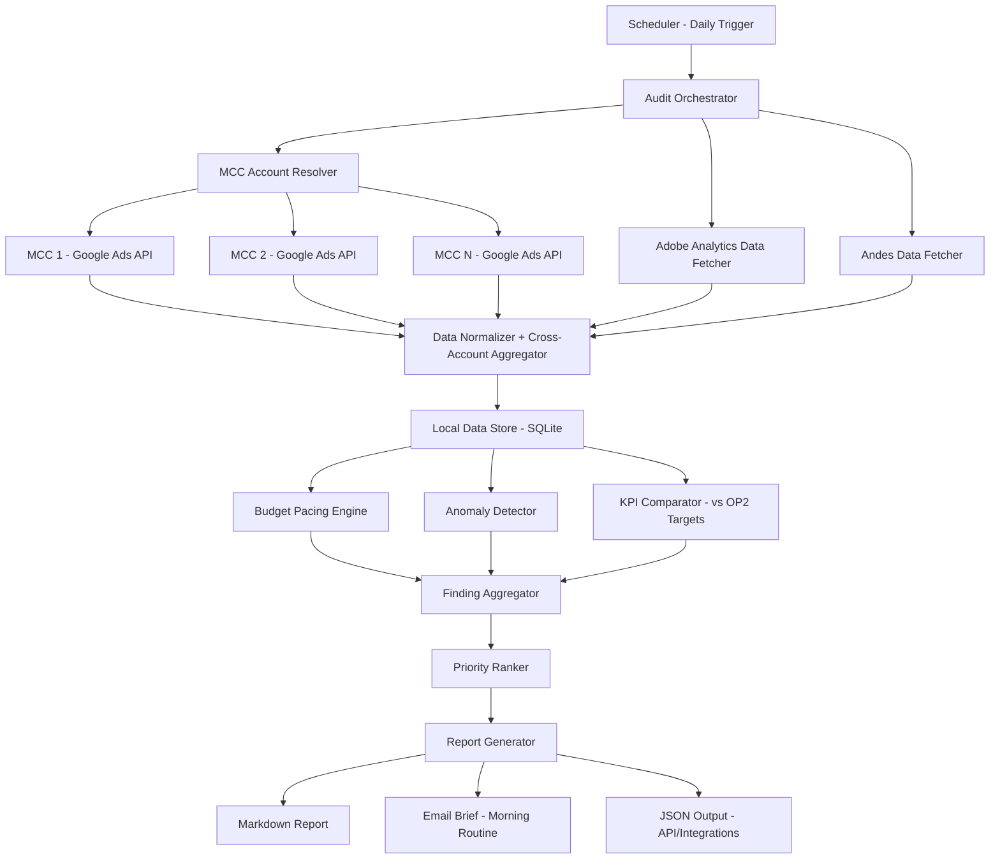
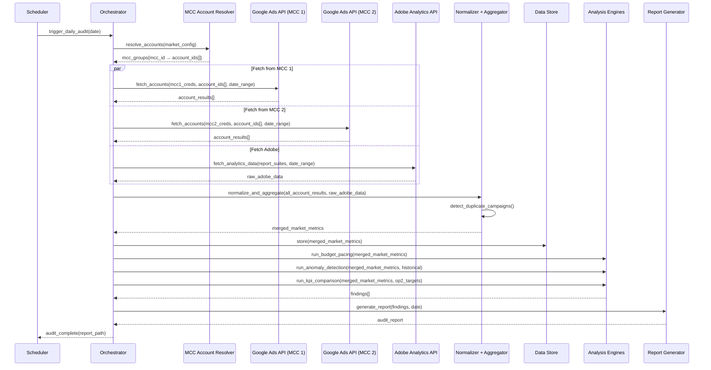
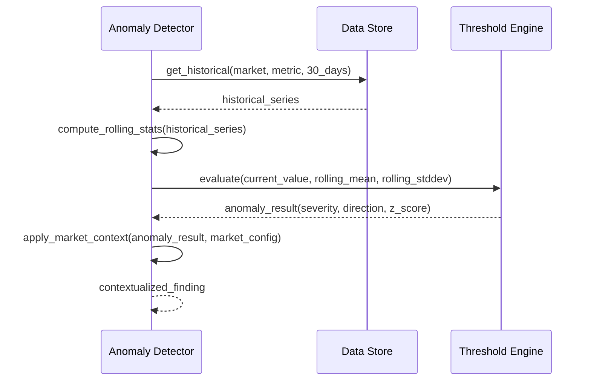

# Design Document: Paid Search Daily Audit

## Overview

The Paid Search Daily Audit is an automated system that runs daily health checks across Richard's paid search campaigns in AU, MX, and team-wide markets (US, UK, DE, FR, IT, ES, JP, CA). It pulls data from Google Ads and Adobe Analytics, detects performance anomalies (spend pacing, CPA spikes, traffic drops, conversion rate shifts), compares actuals against OP2 targets, and generates a structured audit report with prioritized action items.

The system replaces the current manual process of logging into each Google Ads account, pulling Adobe reports, and mentally cross-referencing metrics against targets. It surfaces what matters — budget at risk, campaigns underperforming, anomalies that need investigation — so Richard can spend time on strategy instead of data gathering. The audit output feeds directly into the morning routine and WBR prep workflows.

The core value proposition: turn a 45-60 minute daily manual check into a 5-minute scan of a prioritized, exception-based report.

## Architecture



## Sequence Diagrams

### Daily Audit Flow



### Anomaly Detection Detail



## Components and Interfaces

### Component 1: Audit Orchestrator

**Purpose**: Coordinates the entire daily audit pipeline — triggers data fetches, runs analysis engines, and produces the final report.

```pascal
INTERFACE AuditOrchestrator
  run_audit(config: AuditConfig, date: Date): AuditReport
  run_market_audit(market: MarketCode, date: Date): MarketAuditResult
  get_audit_history(market: MarketCode, days: Integer): AuditReport[]
END INTERFACE
```

**Responsibilities**:
- Orchestrate data fetching across all configured markets
- Handle partial failures gracefully (if one API is down, still audit what's available)
- Manage audit state and history
- Enforce execution timeouts

### Component 2: Google Ads Data Fetcher

**Purpose**: Pulls campaign-level and ad-group-level metrics from Google Ads API across multiple MCCs and accounts. Handles the reality that a single market's accounts may live under different MCCs with separate credentials.

```pascal
INTERFACE GoogleAdsDataFetcher
  fetch_market_data(market: MarketConfig, date_range: DateRange): MarketGoogleData
  fetch_account_campaigns(mcc: MCCConfig, account_id: String, date_range: DateRange): CampaignData[]
  fetch_account_ad_groups(mcc: MCCConfig, account_id: String, campaign_ids: String[], date_range: DateRange): AdGroupData[]
  fetch_account_keywords(mcc: MCCConfig, account_id: String, campaign_ids: String[], date_range: DateRange): KeywordData[]
  get_account_budget_info(mcc: MCCConfig, account_id: String): BudgetInfo[]
  resolve_mcc_credentials(mcc: MCCConfig): AuthToken
  validate_account_access(mcc: MCCConfig, account_id: String): Boolean
END INTERFACE

STRUCTURE MarketGoogleData
  market: MarketCode
  account_results: AccountResult[]  -- One per account in the market
  failed_accounts: FailedAccount[]  -- Accounts that errored (partial success is OK)
END STRUCTURE

STRUCTURE AccountResult
  account_id: String
  mcc_id: String                    -- Which MCC this was fetched through
  campaigns: CampaignData[]
  budget_info: BudgetInfo[]
END STRUCTURE

STRUCTURE FailedAccount
  account_id: String
  mcc_id: String
  error: String
  is_retryable: Boolean
END STRUCTURE
```

**Responsibilities**:
- Authenticate with each MCC independently using its own OAuth credentials
- For each market, iterate through all AccountMappings, grouping by MCC to minimize auth overhead
- Pull spend, impressions, clicks, conversions, CPA, ROAS at campaign and ad-group level per account
- Pull budget allocation and daily spend caps per account
- Handle API rate limits and pagination per MCC (rate limits are MCC-scoped, not account-scoped)
- Return raw data tagged with account_id and mcc_id for traceability
- Support partial success: if one account or MCC fails, still return data from the rest
- Validate that each account is accessible under its configured MCC before fetching (catch misconfigs early)

### Component 3: Adobe Analytics Data Fetcher

**Purpose**: Pulls traffic and conversion data from Adobe Analytics (AMO) for cross-referencing with Google Ads data.

```pascal
INTERFACE AdobeAnalyticsDataFetcher
  fetch_traffic_data(report_suite: String, date_range: DateRange, segments: Segment[]): TrafficData[]
  fetch_conversion_data(report_suite: String, date_range: DateRange): ConversionData[]
  fetch_registration_data(report_suite: String, date_range: DateRange): RegistrationData[]
END INTERFACE
```

**Responsibilities**:
- Pull registration counts, traffic volume, and conversion rates from Adobe
- Segment data by market and campaign type (Brand vs Non-Brand)
- Handle AMO access and authentication
- Provide registration data that maps to Google Ads campaign attribution

### Component 4: Data Normalizer

**Purpose**: Transforms raw data from multiple sources into a unified schema for analysis. Handles aggregation of data across multiple Google Ads accounts (potentially from different MCCs) into a single market-level view.

```pascal
INTERFACE DataNormalizer
  normalize_market_google_data(raw: MarketGoogleData): NormalizedMetrics[]
  normalize_adobe_data(raw: TrafficData[]): NormalizedMetrics[]
  merge_sources(google: NormalizedMetrics[], adobe: NormalizedMetrics[]): MergedMetrics[]
  apply_currency_conversion(metrics: NormalizedMetrics[], target_currency: CurrencyCode): NormalizedMetrics[]
  aggregate_across_accounts(account_metrics: NormalizedMetrics[]): NormalizedMetrics[]
  detect_duplicate_campaigns(account_metrics: NormalizedMetrics[]): DuplicateWarning[]
END INTERFACE
```

**Responsibilities**:
- Map Google Ads fields to internal schema, preserving account_id and mcc_id as metadata
- Aggregate metrics across all accounts within a market (sum spend, clicks, impressions, conversions; recompute ratios)
- Detect potential duplicate campaign names across accounts in the same market (same campaign running in two accounts = double-counting risk)
- Map Adobe Analytics fields to internal schema
- Join data on campaign/market dimensions
- Handle currency conversion (AUD, MXN, USD, EUR, JPY, CAD, GBP)
- Flag data quality issues (missing fields, mismatched totals, partial account failures)

### Component 5: Budget Pacing Engine

**Purpose**: Calculates budget utilization rate and projects end-of-period spend against targets.

```pascal
INTERFACE BudgetPacingEngine
  calculate_pacing(market: MarketCode, actuals: SpendData, budget: BudgetTarget): PacingResult
  project_end_of_period(daily_spend_series: Decimal[], days_remaining: Integer): SpendProjection
  project_multi_horizon(market: MarketCode, metrics: NormalizedMetrics[], targets: OP2Targets, audit_date: Date): MultiHorizonProjection
  detect_pacing_anomaly(pacing: PacingResult, threshold: PacingThreshold): PacingFinding
END INTERFACE
```

**Responsibilities**:
- Compare actual spend vs. planned spend for the period
- Project month-end, quarter-end, and year-end spend and registrations using trailing 7-day average daily run rate
- Flag underspend (< 85% pacing) and overspend (> 110% pacing) at each horizon
- Produce WBR-style projection lines: "[Month] is projected to end at $X spend and X registrations (vs. OP2: +/-% spend, +/-% registrations)"
- Extend the same methodology to quarterly and yearly: QTD actuals + (daily run rate × days remaining in quarter/year)
- Account for known events (promos, seasonal spikes)
- Compute projected CPA at each horizon (projected spend / projected registrations)

### Component 6: Anomaly Detector

**Purpose**: Identifies statistically significant deviations in key metrics using rolling baselines.

```pascal
INTERFACE AnomalyDetector
  detect_anomalies(current: NormalizedMetrics, historical: NormalizedMetrics[], config: AnomalyConfig): AnomalyFinding[]
  compute_baseline(historical: NormalizedMetrics[], window: Integer): BaselineStats
  evaluate_metric(current_value: Decimal, baseline: BaselineStats, threshold: Decimal): AnomalyResult
END INTERFACE
```

**Responsibilities**:
- Compute rolling 7-day and 30-day baselines for each metric
- Detect deviations beyond configurable z-score thresholds
- Distinguish between expected variation (weekday/weekend) and true anomalies
- Classify severity: INFO, WARNING, CRITICAL

### Component 7: KPI Comparator

**Purpose**: Compares current performance against OP2 plan targets and Kingpin Goal thresholds.

```pascal
INTERFACE KPIComparator
  compare_to_targets(actuals: MarketMetrics, targets: OP2Targets): KPIFinding[]
  compute_goal_progress(actuals: Decimal, target: Decimal, days_elapsed: Integer, days_total: Integer): GoalProgress
  flag_at_risk_goals(progress: GoalProgress[], risk_threshold: Decimal): KPIFinding[]
END INTERFACE
```

**Responsibilities**:
- Load OP2 targets per market (regs, CPA, spend)
- Compare MTD actuals vs. prorated monthly targets
- Flag goals that are off-pace (< 90% of prorated target)
- Track Kingpin Goal progress for MX (and future markets)

### Component 8: Report Generator

**Purpose**: Produces the final audit report in multiple formats.

```pascal
INTERFACE ReportGenerator
  generate_markdown(findings: PrioritizedFinding[], date: Date): String
  generate_email_brief(findings: PrioritizedFinding[], date: Date): EmailContent
  generate_json(findings: PrioritizedFinding[], date: Date): JSONObject
  format_market_section(market: MarketCode, findings: PrioritizedFinding[]): String
END INTERFACE
```

**Responsibilities**:
- Produce a scannable markdown report grouped by market
- Generate an email-ready brief for the morning routine
- Output JSON for programmatic consumption by other tools
- Include trend sparklines (text-based) for key metrics
- Highlight action items with clear ownership

## Data Models

### MCCConfig

```pascal
STRUCTURE MCCConfig
  mcc_id: String                   -- 10-digit MCC CID (e.g., "123-456-7890")
  mcc_name: String                 -- Human-readable label (e.g., "AB Global MCC", "AB LATAM MCC")
  credential_ref: String           -- Reference to stored OAuth credential for this MCC
  api_version: String              -- Google Ads API version (e.g., "v17")
END STRUCTURE
```

**Validation Rules**:
- mcc_id must be a valid 10-digit Google Ads CID
- credential_ref must resolve to a valid OAuth token in the credential store
- Each MCC requires its own authentication — credentials are NOT shared across MCCs

### AccountMapping

```pascal
STRUCTURE AccountMapping
  account_id: String               -- 10-digit Google Ads CID for the child account
  account_name: String             -- Human-readable label (e.g., "AB AU - Non-Brand")
  mcc_id: String                   -- Parent MCC that owns this account
  market: MarketCode               -- Which market this account belongs to
  campaign_type_hint: String       -- Optional: "Brand", "Non-Brand", "Competitor", or NULL if mixed
  is_active: Boolean               -- Whether to include in audits
  notes: String                    -- Optional: context (e.g., "Legacy account, migrating Q2")
END STRUCTURE
```

**Validation Rules**:
- account_id must be a valid 10-digit Google Ads CID
- mcc_id must reference an existing MCCConfig
- market must be one of the supported market codes
- A single market can have accounts spread across multiple MCCs
- An account belongs to exactly one MCC and one market

### MarketConfig

```pascal
STRUCTURE MarketConfig
  market_code: MarketCode          -- "AU", "MX", "US", "UK", "DE", "FR", "IT", "ES", "JP", "CA"
  account_mappings: AccountMapping[] -- All Google Ads accounts for this market (may span multiple MCCs)
  adobe_report_suite: String
  currency: CurrencyCode           -- "AUD", "MXN", "USD", etc.
  timezone: String                 -- "Australia/Sydney", "America/Mexico_City"
  op2_targets: OP2Targets
  anomaly_thresholds: AnomalyConfig
  is_hands_on: Boolean             -- TRUE for AU/MX, FALSE for team-wide
  campaign_types: String[]         -- ["Brand", "Non-Brand", "Competitor"]
END STRUCTURE
```

**Validation Rules**:
- market_code must be one of the supported market codes
- account_mappings must contain at least one active AccountMapping
- All account_mappings must have market == this market's market_code
- currency must match the market's local currency
- op2_targets must have at least regs and CPA defined
- Accounts across different MCCs are aggregated at the market level for reporting

### NormalizedMetrics

```pascal
STRUCTURE NormalizedMetrics
  date: Date
  market: MarketCode
  campaign_type: String            -- "Brand", "Non-Brand", "Competitor"
  campaign_name: String
  account_id: String               -- Google Ads CID this data came from (NULL for Adobe-only)
  mcc_id: String                   -- MCC that owns the account (NULL for Adobe-only)
  impressions: Integer
  clicks: Integer
  spend: Decimal                   -- In local currency
  spend_usd: Decimal               -- Converted to USD for cross-market comparison
  conversions: Integer             -- Registrations
  cpa: Decimal                     -- Cost per acquisition (local currency)
  ctr: Decimal                     -- Click-through rate
  conversion_rate: Decimal         -- Conversions / Clicks
  quality_score_avg: Decimal       -- Average keyword quality score
  source: DataSource               -- "GOOGLE_ADS", "ADOBE", "MERGED"
  is_aggregated: Boolean           -- TRUE if this row is a market-level rollup across accounts
END STRUCTURE
```

**Validation Rules**:
- spend >= 0
- cpa = spend / conversions (when conversions > 0)
- ctr = clicks / impressions (when impressions > 0)
- conversion_rate = conversions / clicks (when clicks > 0)

### AnomalyFinding

```pascal
STRUCTURE AnomalyFinding
  market: MarketCode
  metric_name: String              -- "CPA", "Registrations", "Spend", "CTR", etc.
  current_value: Decimal
  baseline_value: Decimal          -- Rolling average
  deviation_pct: Decimal           -- Percentage deviation from baseline
  z_score: Decimal                 -- Standard deviations from mean
  direction: Direction             -- "UP", "DOWN"
  severity: Severity               -- "INFO", "WARNING", "CRITICAL"
  campaign_scope: String           -- "All", specific campaign name, or campaign type
  context: String                  -- Human-readable explanation
END STRUCTURE
```

### PacingResult

```pascal
STRUCTURE PacingResult
  market: MarketCode
  period: String                   -- "March 2026", "Q3 FY26"
  budget_target: Decimal
  actual_spend: Decimal
  pacing_pct: Decimal              -- actual / prorated_target * 100
  projected_eom_spend: Decimal     -- End-of-month projection
  projected_variance_pct: Decimal  -- Projected vs target variance
  status: PacingStatus             -- "ON_TRACK", "UNDERSPEND", "OVERSPEND"
  days_elapsed: Integer
  days_remaining: Integer
END STRUCTURE
```

### MultiHorizonProjection

```pascal
STRUCTURE MultiHorizonProjection
  market: MarketCode
  audit_date: Date
  monthly: PeriodProjection
  quarterly: PeriodProjection
  yearly: PeriodProjection
END STRUCTURE

STRUCTURE PeriodProjection
  period_label: String             -- "March 2026", "Q1 FY26", "FY26"
  period_type: PeriodType          -- "MONTHLY", "QUARTERLY", "YEARLY"
  days_elapsed: Integer
  days_remaining: Integer
  days_total: Integer
  -- Spend
  actual_spend: Decimal            -- Period-to-date actual
  projected_spend: Decimal         -- Projected end-of-period (actuals + run_rate × days_remaining)
  target_spend: Decimal            -- OP2 target for the period
  spend_vs_op2_pct: Decimal        -- ((projected - target) / target) × 100
  spend_pacing_pct: Decimal        -- (actual / prorated_target) × 100
  -- Registrations
  actual_regs: Integer             -- Period-to-date actual
  projected_regs: Integer          -- Projected end-of-period
  target_regs: Integer             -- OP2 target for the period
  regs_vs_op2_pct: Decimal         -- ((projected - target) / target) × 100
  regs_pacing_pct: Decimal         -- (actual / prorated_target) × 100
  -- CPA
  actual_cpa: Decimal              -- Period-to-date CPA (actual_spend / actual_regs)
  projected_cpa: Decimal           -- Projected end-of-period CPA (projected_spend / projected_regs)
  target_cpa: Decimal              -- OP2 target CPA
  -- Run rate used
  daily_spend_run_rate: Decimal    -- Trailing 7-day average daily spend
  daily_regs_run_rate: Decimal     -- Trailing 7-day average daily registrations
  -- Status
  status: PacingStatus             -- "ON_TRACK", "UNDERSPEND", "OVERSPEND"
END STRUCTURE
```

**Validation Rules**:
- projected_spend = actual_spend + (daily_spend_run_rate × days_remaining)
- projected_regs = actual_regs + (daily_regs_run_rate × days_remaining)
- projected_cpa = projected_spend / projected_regs (when projected_regs > 0)
- spend_vs_op2_pct = ((projected_spend - target_spend) / target_spend) × 100
- days_elapsed + days_remaining = days_total

### AuditReport

```pascal
STRUCTURE AuditReport
  date: Date
  generated_at: Timestamp
  markets_audited: MarketCode[]
  summary: AuditSummary
  market_sections: MarketSection[]
  action_items: ActionItem[]
  data_quality_notes: String[]
END STRUCTURE

STRUCTURE AuditSummary
  total_spend_usd: Decimal
  total_registrations: Integer
  blended_cpa_usd: Decimal
  critical_findings_count: Integer
  warning_findings_count: Integer
  markets_on_track: Integer
  markets_at_risk: Integer
END STRUCTURE

STRUCTURE MarketSection
  market: MarketCode
  pacing: PacingResult
  projections: MultiHorizonProjection  -- Monthly/Quarterly/Yearly projections (WBR-style)
  anomalies: AnomalyFinding[]
  kpi_status: KPIFinding[]
  top_campaigns: CampaignSummary[]
  wow_changes: WoWComparison
END STRUCTURE

STRUCTURE ActionItem
  priority: Integer                -- 1 = highest
  market: MarketCode
  category: String                 -- "BUDGET", "PERFORMANCE", "ANOMALY", "GOAL"
  description: String
  suggested_action: String
  urgency: String                  -- "TODAY", "THIS_WEEK", "MONITOR"
END STRUCTURE
```

### OP2Targets

```pascal
STRUCTURE OP2Targets
  monthly_spend_target: Decimal
  monthly_reg_target: Integer
  target_cpa: Decimal
  quarterly_spend_target: Decimal
  quarterly_reg_target: Integer
  yearly_spend_target: Decimal
  yearly_reg_target: Integer
  yearly_target_cpa: Decimal
END STRUCTURE
```


## Algorithmic Pseudocode

### Main Audit Orchestration Algorithm

```pascal
ALGORITHM run_daily_audit(config, audit_date)
INPUT: config of type AuditConfig, audit_date of type Date
OUTPUT: report of type AuditReport

BEGIN
  ASSERT config.markets IS NOT EMPTY
  ASSERT audit_date <= today()

  all_findings ← EMPTY LIST
  data_quality_notes ← EMPTY LIST
  market_sections ← EMPTY LIST

  -- Step 1: Fetch data for each configured market
  FOR EACH market IN config.markets DO
    ASSERT market.account_mappings IS NOT EMPTY

    TRY
      -- Group accounts by MCC to minimize auth overhead
      mcc_groups ← group_by(market.account_mappings, m → m.mcc_id)
      all_account_data ← EMPTY LIST
      failed_accounts ← EMPTY LIST

      FOR EACH mcc_id, accounts IN mcc_groups DO
        mcc_config ← config.mcc_configs.find(m → m.mcc_id = mcc_id)
        ASSERT mcc_config IS NOT NULL  -- Config validation should catch this

        TRY
          auth_token ← resolve_mcc_credentials(mcc_config)

          FOR EACH account IN accounts WHERE account.is_active DO
            TRY
              account_data ← fetch_account_campaigns(mcc_config, account.account_id, date_range)
              budget_data ← get_account_budget_info(mcc_config, account.account_id)
              all_account_data.add(BUILD AccountResult(
                account_id: account.account_id,
                mcc_id: mcc_id,
                campaigns: account_data,
                budget_info: budget_data
              ))
            CATCH account_error
              failed_accounts.add(BUILD FailedAccount(
                account_id: account.account_id,
                mcc_id: mcc_id,
                error: account_error.message,
                is_retryable: is_retryable_error(account_error)
              ))
            END TRY
          END FOR

        CATCH mcc_auth_error
          -- Entire MCC is down — mark all its accounts as failed
          FOR EACH account IN accounts DO
            failed_accounts.add(BUILD FailedAccount(
              account_id: account.account_id,
              mcc_id: mcc_id,
              error: "MCC auth failure: " + mcc_auth_error.message,
              is_retryable: TRUE
            ))
          END FOR
        END TRY
      END FOR

      -- Log failed accounts as data quality notes
      FOR EACH failed IN failed_accounts DO
        data_quality_notes.add("Account " + failed.account_id + " (MCC " + failed.mcc_id + ") failed: " + failed.error)
      END FOR

      -- If ALL accounts failed, skip this market entirely
      IF all_account_data IS EMPTY THEN
        data_quality_notes.add("All accounts failed for " + market.market_code + " — skipping market")
        CONTINUE
      END IF

      market_google_data ← BUILD MarketGoogleData(
        market: market.market_code,
        account_results: all_account_data,
        failed_accounts: failed_accounts
      )

      adobe_data ← fetch_adobe_data(market, audit_date)
    CATCH api_error
      data_quality_notes.add("Failed to fetch data for " + market.market_code + ": " + api_error.message)
      CONTINUE  -- Skip this market, audit the rest
    END TRY

    -- Step 2: Normalize, aggregate across accounts, and merge with Adobe
    normalized ← normalize_market_google_data(market_google_data)
    duplicate_warnings ← detect_duplicate_campaigns(normalized)
    FOR EACH warning IN duplicate_warnings DO
      data_quality_notes.add(warning.message)
    END FOR
    aggregated ← aggregate_across_accounts(normalized)
    merged ← merge_sources(aggregated, normalize_adobe_data(adobe_data))

    -- Step 3: Store for historical reference
    store_metrics(merged, audit_date)

    -- Step 4: Load historical data for baseline computation
    historical ← load_historical(market.market_code, 30)

    -- Step 5: Run analysis engines
    pacing_result ← run_budget_pacing(merged, market.op2_targets, audit_date)
    projections ← project_multi_horizon(market.market_code, merged, market.op2_targets, audit_date)
    anomalies ← detect_anomalies(merged, historical, market.anomaly_thresholds)
    kpi_findings ← compare_kpi_targets(merged, market.op2_targets, audit_date)

    -- Step 6: Build market section
    section ← BUILD MarketSection(
      market: market.market_code,
      pacing: pacing_result,
      projections: projections,
      anomalies: anomalies,
      kpi_status: kpi_findings,
      top_campaigns: get_top_campaigns(merged, 5),
      wow_changes: compute_wow(merged, historical)
    )
    market_sections.add(section)

    -- Collect all findings for prioritization
    all_findings.add_all(pacing_result.findings)
    all_findings.add_all(anomalies)
    all_findings.add_all(kpi_findings)
  END FOR

  -- Step 7: Prioritize and generate report
  prioritized ← rank_findings(all_findings)
  action_items ← generate_action_items(prioritized)
  summary ← compute_summary(market_sections)

  report ← BUILD AuditReport(
    date: audit_date,
    generated_at: now(),
    markets_audited: config.markets.map(m → m.market_code),
    summary: summary,
    market_sections: market_sections,
    action_items: action_items,
    data_quality_notes: data_quality_notes
  )

  ASSERT report.markets_audited IS NOT EMPTY
  ASSERT report.summary IS NOT NULL

  RETURN report
END
```

**Preconditions:**
- config contains at least one market with valid API credentials
- audit_date is not in the future
- API credentials are valid and have read access

**Postconditions:**
- Returns a complete AuditReport with all auditable markets included
- Markets with API failures are skipped but noted in data_quality_notes
- All findings are prioritized and action items generated

**Loop Invariants:**
- All previously processed markets have valid market_sections entries
- all_findings contains findings only from successfully audited markets

### Anomaly Detection Algorithm

```pascal
ALGORITHM detect_anomalies(current_metrics, historical_metrics, config)
INPUT: current_metrics of type NormalizedMetrics[], historical_metrics of type NormalizedMetrics[], config of type AnomalyConfig
OUTPUT: findings of type AnomalyFinding[]

BEGIN
  findings ← EMPTY LIST
  monitored_metrics ← ["CPA", "Registrations", "Spend", "CTR", "ConversionRate", "Clicks"]

  FOR EACH metric_name IN monitored_metrics DO
    -- Extract time series for this metric
    current_value ← aggregate_metric(current_metrics, metric_name)
    historical_series ← extract_series(historical_metrics, metric_name)

    IF length(historical_series) < 7 THEN
      CONTINUE  -- Not enough history for meaningful baseline
    END IF

    -- Compute rolling baseline (7-day and 30-day)
    rolling_7d ← compute_rolling_stats(historical_series, 7)
    rolling_30d ← compute_rolling_stats(historical_series, 30)

    -- Use 7-day baseline for short-term anomalies
    z_score_7d ← (current_value - rolling_7d.mean) / rolling_7d.stddev
    deviation_pct_7d ← ((current_value - rolling_7d.mean) / rolling_7d.mean) * 100

    -- Determine direction
    IF current_value > rolling_7d.mean THEN
      direction ← "UP"
    ELSE
      direction ← "DOWN"
    END IF

    -- Apply day-of-week adjustment
    dow_factor ← get_day_of_week_factor(historical_series, day_of_week(current_metrics[0].date))
    adjusted_z_score ← z_score_7d / dow_factor

    -- Classify severity
    severity ← classify_severity(adjusted_z_score, metric_name, config)

    IF abs(adjusted_z_score) >= config.min_z_score THEN
      context ← generate_context(metric_name, current_value, rolling_7d.mean, deviation_pct_7d, direction)

      finding ← BUILD AnomalyFinding(
        market: current_metrics[0].market,
        metric_name: metric_name,
        current_value: current_value,
        baseline_value: rolling_7d.mean,
        deviation_pct: deviation_pct_7d,
        z_score: adjusted_z_score,
        direction: direction,
        severity: severity,
        campaign_scope: "All",
        context: context
      )
      findings.add(finding)
    END IF

    -- Also check at campaign-type level (Brand vs Non-Brand)
    FOR EACH campaign_type IN ["Brand", "Non-Brand"] DO
      type_current ← filter_by_type(current_metrics, campaign_type)
      type_historical ← filter_by_type(historical_metrics, campaign_type)

      IF length(type_historical) >= 7 THEN
        type_value ← aggregate_metric(type_current, metric_name)
        type_baseline ← compute_rolling_stats(extract_series(type_historical, metric_name), 7)
        type_z ← (type_value - type_baseline.mean) / type_baseline.stddev

        IF abs(type_z) >= config.min_z_score + 0.5 THEN
          -- Higher threshold for campaign-type level to reduce noise
          type_finding ← BUILD AnomalyFinding(
            market: current_metrics[0].market,
            metric_name: metric_name,
            current_value: type_value,
            baseline_value: type_baseline.mean,
            deviation_pct: ((type_value - type_baseline.mean) / type_baseline.mean) * 100,
            z_score: type_z,
            direction: IF type_value > type_baseline.mean THEN "UP" ELSE "DOWN",
            severity: classify_severity(type_z, metric_name, config),
            campaign_scope: campaign_type,
            context: generate_context(metric_name, type_value, type_baseline.mean, deviation_pct, direction)
          )
          findings.add(type_finding)
        END IF
      END IF
    END FOR
  END FOR

  RETURN findings
END
```

**Preconditions:**
- current_metrics contains at least one day of data
- historical_metrics contains at least 7 days of data for meaningful baselines
- config.min_z_score > 0 (typically 1.5 - 2.0)

**Postconditions:**
- Returns only findings that exceed the configured z-score threshold
- Each finding includes human-readable context
- Campaign-type findings use a higher threshold to reduce noise

**Loop Invariants:**
- All findings in the list have abs(z_score) >= config.min_z_score
- Each finding has a valid severity classification

### Budget Pacing Algorithm

```pascal
ALGORITHM run_budget_pacing(metrics, targets, audit_date)
INPUT: metrics of type NormalizedMetrics[], targets of type OP2Targets, audit_date of type Date
OUTPUT: result of type PacingResult

BEGIN
  ASSERT targets.monthly_spend_target > 0

  -- Calculate period boundaries
  month_start ← first_day_of_month(audit_date)
  month_end ← last_day_of_month(audit_date)
  days_in_month ← days_between(month_start, month_end) + 1
  days_elapsed ← days_between(month_start, audit_date) + 1
  days_remaining ← days_in_month - days_elapsed

  -- Calculate actual spend MTD
  actual_spend ← SUM(m.spend FOR m IN metrics WHERE m.date >= month_start AND m.date <= audit_date)

  -- Calculate prorated target
  prorated_target ← targets.monthly_spend_target * (days_elapsed / days_in_month)

  -- Pacing percentage
  pacing_pct ← (actual_spend / prorated_target) * 100

  -- Project end-of-month spend using trailing 7-day average
  recent_daily_spend ← get_trailing_daily_spend(metrics, audit_date, 7)
  avg_daily_spend ← MEAN(recent_daily_spend)
  projected_eom_spend ← actual_spend + (avg_daily_spend * days_remaining)
  projected_variance_pct ← ((projected_eom_spend - targets.monthly_spend_target) / targets.monthly_spend_target) * 100

  -- Determine status
  IF pacing_pct >= 85 AND pacing_pct <= 110 THEN
    status ← "ON_TRACK"
  ELSE IF pacing_pct < 85 THEN
    status ← "UNDERSPEND"
  ELSE
    status ← "OVERSPEND"
  END IF

  result ← BUILD PacingResult(
    market: metrics[0].market,
    period: format_month_year(audit_date),
    budget_target: targets.monthly_spend_target,
    actual_spend: actual_spend,
    pacing_pct: pacing_pct,
    projected_eom_spend: projected_eom_spend,
    projected_variance_pct: projected_variance_pct,
    status: status,
    days_elapsed: days_elapsed,
    days_remaining: days_remaining
  )

  ASSERT result.pacing_pct >= 0
  ASSERT result.days_elapsed + result.days_remaining = days_in_month

  RETURN result
END
```

**Preconditions:**
- targets.monthly_spend_target is positive
- metrics contains data for the current month
- audit_date is within the current month

**Postconditions:**
- pacing_pct accurately reflects actual vs. prorated target
- projected_eom_spend is based on trailing 7-day average (not full-month average)
- status correctly classifies pacing against 85%/110% thresholds

**Loop Invariants:** N/A (no loops)

### Multi-Horizon Projection Algorithm

```pascal
ALGORITHM project_multi_horizon(market, metrics, targets, audit_date)
INPUT: market of type MarketCode, metrics of type NormalizedMetrics[], targets of type OP2Targets, audit_date of type Date
OUTPUT: projection of type MultiHorizonProjection

BEGIN
  -- Compute trailing 7-day run rates (same basis as WBR callout projections)
  trailing_7d_metrics ← FILTER metrics WHERE date > (audit_date - 7) AND date <= audit_date
  ASSERT length(trailing_7d_metrics) >= 1  -- At least some recent data

  daily_spend_run_rate ← SUM(m.spend FOR m IN trailing_7d_metrics) / count_distinct_dates(trailing_7d_metrics)
  daily_regs_run_rate ← SUM(m.conversions FOR m IN trailing_7d_metrics) / count_distinct_dates(trailing_7d_metrics)

  -- === MONTHLY PROJECTION ===
  month_start ← first_day_of_month(audit_date)
  month_end ← last_day_of_month(audit_date)
  month_days_total ← days_between(month_start, month_end) + 1
  month_days_elapsed ← days_between(month_start, audit_date) + 1
  month_days_remaining ← month_days_total - month_days_elapsed

  mtd_spend ← SUM(m.spend FOR m IN metrics WHERE m.date >= month_start AND m.date <= audit_date)
  mtd_regs ← SUM(m.conversions FOR m IN metrics WHERE m.date >= month_start AND m.date <= audit_date)

  monthly ← build_period_projection(
    label: format_month_year(audit_date),
    period_type: "MONTHLY",
    days_elapsed: month_days_elapsed,
    days_remaining: month_days_remaining,
    actual_spend: mtd_spend,
    actual_regs: mtd_regs,
    target_spend: targets.monthly_spend_target,
    target_regs: targets.monthly_reg_target,
    target_cpa: targets.target_cpa,
    daily_spend_run_rate: daily_spend_run_rate,
    daily_regs_run_rate: daily_regs_run_rate
  )

  -- === QUARTERLY PROJECTION ===
  quarter_start ← first_day_of_quarter(audit_date)
  quarter_end ← last_day_of_quarter(audit_date)
  quarter_days_total ← days_between(quarter_start, quarter_end) + 1
  quarter_days_elapsed ← days_between(quarter_start, audit_date) + 1
  quarter_days_remaining ← quarter_days_total - quarter_days_elapsed

  qtd_spend ← SUM(m.spend FOR m IN metrics WHERE m.date >= quarter_start AND m.date <= audit_date)
  qtd_regs ← SUM(m.conversions FOR m IN metrics WHERE m.date >= quarter_start AND m.date <= audit_date)

  -- For QTD, also pull from historical store for months prior to current month
  IF quarter_start < month_start THEN
    prior_months_spend ← load_period_actuals(market, quarter_start, month_start - 1, "spend")
    prior_months_regs ← load_period_actuals(market, quarter_start, month_start - 1, "conversions")
    qtd_spend ← qtd_spend + prior_months_spend
    qtd_regs ← qtd_regs + prior_months_regs
  END IF

  quarterly ← build_period_projection(
    label: format_quarter_year(audit_date),
    period_type: "QUARTERLY",
    days_elapsed: quarter_days_elapsed,
    days_remaining: quarter_days_remaining,
    actual_spend: qtd_spend,
    actual_regs: qtd_regs,
    target_spend: targets.quarterly_spend_target,
    target_regs: targets.quarterly_reg_target,
    target_cpa: targets.target_cpa,
    daily_spend_run_rate: daily_spend_run_rate,
    daily_regs_run_rate: daily_regs_run_rate
  )

  -- === YEARLY PROJECTION ===
  year_start ← first_day_of_year(audit_date)
  year_end ← last_day_of_year(audit_date)
  year_days_total ← days_between(year_start, year_end) + 1
  year_days_elapsed ← days_between(year_start, audit_date) + 1
  year_days_remaining ← year_days_total - year_days_elapsed

  ytd_spend ← load_period_actuals(market, year_start, audit_date, "spend")
  ytd_regs ← load_period_actuals(market, year_start, audit_date, "conversions")

  yearly ← build_period_projection(
    label: format_fiscal_year(audit_date),
    period_type: "YEARLY",
    days_elapsed: year_days_elapsed,
    days_remaining: year_days_remaining,
    actual_spend: ytd_spend,
    actual_regs: ytd_regs,
    target_spend: targets.yearly_spend_target,
    target_regs: targets.yearly_reg_target,
    target_cpa: targets.yearly_target_cpa,
    daily_spend_run_rate: daily_spend_run_rate,
    daily_regs_run_rate: daily_regs_run_rate
  )

  projection ← BUILD MultiHorizonProjection(
    market: market,
    audit_date: audit_date,
    monthly: monthly,
    quarterly: quarterly,
    yearly: yearly
  )

  RETURN projection
END

FUNCTION build_period_projection(label, period_type, days_elapsed, days_remaining,
    actual_spend, actual_regs, target_spend, target_regs, target_cpa,
    daily_spend_run_rate, daily_regs_run_rate)
OUTPUT: projection of type PeriodProjection

BEGIN
  days_total ← days_elapsed + days_remaining
  projected_spend ← actual_spend + (daily_spend_run_rate × days_remaining)
  projected_regs ← actual_regs + ROUND(daily_regs_run_rate × days_remaining)

  -- Prorated targets for pacing
  prorated_spend_target ← target_spend × (days_elapsed / days_total)
  prorated_regs_target ← target_regs × (days_elapsed / days_total)

  spend_pacing_pct ← IF prorated_spend_target > 0 THEN (actual_spend / prorated_spend_target) × 100 ELSE NULL
  regs_pacing_pct ← IF prorated_regs_target > 0 THEN (actual_regs / prorated_regs_target) × 100 ELSE NULL

  -- vs OP2 (projected end-of-period vs full-period target)
  spend_vs_op2_pct ← IF target_spend > 0 THEN ((projected_spend - target_spend) / target_spend) × 100 ELSE NULL
  regs_vs_op2_pct ← IF target_regs > 0 THEN ((projected_regs - target_regs) / target_regs) × 100 ELSE NULL

  -- CPA
  actual_cpa ← IF actual_regs > 0 THEN actual_spend / actual_regs ELSE NULL
  projected_cpa ← IF projected_regs > 0 THEN projected_spend / projected_regs ELSE NULL

  -- Status
  IF spend_pacing_pct IS NOT NULL AND spend_pacing_pct >= 85 AND spend_pacing_pct <= 110 THEN
    status ← "ON_TRACK"
  ELSE IF spend_pacing_pct IS NOT NULL AND spend_pacing_pct < 85 THEN
    status ← "UNDERSPEND"
  ELSE IF spend_pacing_pct IS NOT NULL THEN
    status ← "OVERSPEND"
  ELSE
    status ← "UNKNOWN"
  END IF

  RETURN BUILD PeriodProjection(
    period_label: label,
    period_type: period_type,
    days_elapsed: days_elapsed,
    days_remaining: days_remaining,
    days_total: days_total,
    actual_spend: actual_spend,
    projected_spend: projected_spend,
    target_spend: target_spend,
    spend_vs_op2_pct: spend_vs_op2_pct,
    spend_pacing_pct: spend_pacing_pct,
    actual_regs: actual_regs,
    projected_regs: projected_regs,
    target_regs: target_regs,
    regs_vs_op2_pct: regs_vs_op2_pct,
    regs_pacing_pct: regs_pacing_pct,
    actual_cpa: actual_cpa,
    projected_cpa: projected_cpa,
    target_cpa: target_cpa,
    daily_spend_run_rate: daily_spend_run_rate,
    daily_regs_run_rate: daily_regs_run_rate,
    status: status
  )
END FUNCTION
```

**Preconditions:**
- metrics contains at least 1 day of recent data for run rate computation
- targets has values for all three horizons (monthly, quarterly, yearly)
- Historical store has actuals for prior months in the current quarter/year (for QTD/YTD rollups)

**Postconditions:**
- All three horizons use the same trailing 7-day run rate (consistent projection basis, matching WBR methodology)
- projected_spend = actual_spend + (run_rate × days_remaining) at each horizon
- vs OP2 percentages compare projected end-of-period totals against full-period targets
- Pacing percentages compare actuals-to-date against prorated targets
- QTD and YTD actuals include data from prior months loaded from the historical store

**Loop Invariants:** N/A (no loops)

### Priority Ranking Algorithm

```pascal
ALGORITHM rank_findings(findings)
INPUT: findings of type Finding[] (union of AnomalyFinding, PacingFinding, KPIFinding)
OUTPUT: prioritized of type PrioritizedFinding[]

BEGIN
  scored_findings ← EMPTY LIST

  FOR EACH finding IN findings DO
    score ← 0

    -- Severity weight (base score)
    IF finding.severity = "CRITICAL" THEN
      score ← score + 100
    ELSE IF finding.severity = "WARNING" THEN
      score ← score + 50
    ELSE
      score ← score + 10
    END IF

    -- Market weight (hands-on markets get priority)
    IF finding.market IN ["AU", "MX"] THEN
      score ← score + 20
    ELSE
      score ← score + 5
    END IF

    -- Category weight
    IF finding.category = "BUDGET" THEN
      score ← score + 30  -- Budget issues are time-sensitive
    ELSE IF finding.category = "GOAL" THEN
      score ← score + 25  -- Kingpin goal misses have leadership visibility
    ELSE IF finding.category = "PERFORMANCE" THEN
      score ← score + 15
    END IF

    -- Recency weight (findings that are worsening trend)
    IF finding HAS trend AND finding.trend = "WORSENING" THEN
      score ← score + 15
    END IF

    scored_findings.add(BUILD PrioritizedFinding(finding: finding, score: score))
  END FOR

  -- Sort descending by score
  prioritized ← sort(scored_findings, BY score DESCENDING)

  -- Assign priority ranks
  FOR i ← 0 TO length(prioritized) - 1 DO
    prioritized[i].priority ← i + 1
  END FOR

  RETURN prioritized
END
```

**Preconditions:**
- findings list may be empty (no anomalies = clean audit)
- Each finding has a valid severity and market

**Postconditions:**
- Output is sorted by descending priority score
- Each finding has a unique priority rank (1 = highest)
- Hands-on markets (AU, MX) are weighted higher than team-wide markets

**Loop Invariants:**
- All scored findings have score > 0
- Priority ranks are sequential starting from 1

### Week-over-Week Comparison Algorithm

```pascal
ALGORITHM compute_wow(current_metrics, historical_metrics)
INPUT: current_metrics of type NormalizedMetrics[], historical_metrics of type NormalizedMetrics[]
OUTPUT: comparison of type WoWComparison

BEGIN
  current_date ← current_metrics[0].date
  prior_week_date ← current_date - 7

  -- Aggregate current day
  current_agg ← BUILD MetricAggregate(
    spend: SUM(m.spend FOR m IN current_metrics),
    clicks: SUM(m.clicks FOR m IN current_metrics),
    impressions: SUM(m.impressions FOR m IN current_metrics),
    conversions: SUM(m.conversions FOR m IN current_metrics)
  )
  current_agg.cpa ← IF current_agg.conversions > 0 THEN current_agg.spend / current_agg.conversions ELSE NULL
  current_agg.ctr ← IF current_agg.impressions > 0 THEN current_agg.clicks / current_agg.impressions ELSE NULL
  current_agg.cvr ← IF current_agg.clicks > 0 THEN current_agg.conversions / current_agg.clicks ELSE NULL

  -- Aggregate prior week same day
  prior_metrics ← FILTER historical_metrics WHERE date = prior_week_date
  prior_agg ← BUILD MetricAggregate(
    spend: SUM(m.spend FOR m IN prior_metrics),
    clicks: SUM(m.clicks FOR m IN prior_metrics),
    impressions: SUM(m.impressions FOR m IN prior_metrics),
    conversions: SUM(m.conversions FOR m IN prior_metrics)
  )
  prior_agg.cpa ← IF prior_agg.conversions > 0 THEN prior_agg.spend / prior_agg.conversions ELSE NULL
  prior_agg.ctr ← IF prior_agg.impressions > 0 THEN prior_agg.clicks / prior_agg.impressions ELSE NULL
  prior_agg.cvr ← IF prior_agg.clicks > 0 THEN prior_agg.conversions / prior_agg.clicks ELSE NULL

  -- Compute changes
  comparison ← BUILD WoWComparison(
    current: current_agg,
    prior_week: prior_agg,
    spend_change_pct: pct_change(current_agg.spend, prior_agg.spend),
    clicks_change_pct: pct_change(current_agg.clicks, prior_agg.clicks),
    conversions_change_pct: pct_change(current_agg.conversions, prior_agg.conversions),
    cpa_change_pct: pct_change(current_agg.cpa, prior_agg.cpa),
    ctr_change_pct: pct_change(current_agg.ctr, prior_agg.ctr)
  )

  RETURN comparison
END

FUNCTION pct_change(current, prior)
  IF prior IS NULL OR prior = 0 THEN
    RETURN NULL
  END IF
  RETURN ((current - prior) / prior) * 100
END FUNCTION
```

**Preconditions:**
- current_metrics contains data for the audit date
- historical_metrics contains data for at least 7 days prior

**Postconditions:**
- All percentage changes are NULL when prior period data is missing or zero
- CPA, CTR, CVR are NULL when denominators are zero (no division by zero)

**Loop Invariants:** N/A

## Key Functions with Formal Specifications

### Function: classify_severity()

```pascal
FUNCTION classify_severity(z_score, metric_name, config)
INPUT: z_score of type Decimal, metric_name of type String, config of type AnomalyConfig
OUTPUT: severity of type Severity
```

**Preconditions:**
- z_score is a valid decimal number
- metric_name is one of the monitored metrics
- config contains threshold definitions for each severity level

**Postconditions:**
- Returns "CRITICAL" if abs(z_score) >= config.critical_threshold (default 3.0)
- Returns "WARNING" if abs(z_score) >= config.warning_threshold (default 2.0)
- Returns "INFO" if abs(z_score) >= config.min_z_score (default 1.5)
- CPA increases are one severity level higher than other metrics (CPA spike = more urgent)
- Registration drops are one severity level higher (directly impacts Kingpin Goals)

### Function: generate_action_items()

```pascal
FUNCTION generate_action_items(prioritized_findings)
INPUT: prioritized_findings of type PrioritizedFinding[]
OUTPUT: action_items of type ActionItem[]
```

**Preconditions:**
- prioritized_findings is sorted by priority score descending
- Each finding has a valid category and severity

**Postconditions:**
- Returns at most 10 action items (top priority only — avoid overwhelm)
- Each action item has a concrete suggested_action (not generic advice)
- Urgency is mapped: CRITICAL → "TODAY", WARNING → "THIS_WEEK", INFO → "MONITOR"
- Budget-related items always get "TODAY" urgency regardless of severity

### Function: get_day_of_week_factor()

```pascal
FUNCTION get_day_of_week_factor(historical_series, target_dow)
INPUT: historical_series of type Decimal[], target_dow of type Integer (0=Mon, 6=Sun)
OUTPUT: factor of type Decimal
```

**Preconditions:**
- historical_series has at least 14 days of data (2 full weeks)
- target_dow is between 0 and 6

**Postconditions:**
- Returns a factor > 0 representing the typical ratio of target_dow performance to overall average
- Factor of 1.0 means the day performs at average
- Factor > 1.0 means higher variance is expected on this day (e.g., weekends)
- Used to adjust z-scores so weekend dips don't trigger false anomalies

## Example Usage

```pascal
-- Example 1: Run a full daily audit
SEQUENCE
  config ← load_audit_config("~/.kiro/audit/config.json")
  report ← run_daily_audit(config, today())

  -- Output markdown report
  markdown ← generate_markdown(report.action_items, today())
  write_file("~/shared/audit-reports/" + format_date(today()) + ".md", markdown)

  -- Send email brief for morning routine
  email ← generate_email_brief(report.action_items, today())
  send_to_morning_routine(email)

  DISPLAY "Audit complete: " + report.summary.critical_findings_count + " critical, "
    + report.summary.warning_findings_count + " warnings"
END SEQUENCE

-- Example 2: Check AU budget pacing mid-month (WBR-style projection)
SEQUENCE
  au_config ← get_market_config("AU")
  metrics ← load_metrics("AU", first_day_of_month(today()), today())
  projections ← project_multi_horizon("AU", metrics, au_config.op2_targets, today())

  -- Monthly (WBR callout line)
  m ← projections.monthly
  DISPLAY m.period_label + " is projected to end at $" + m.projected_spend + " spend and "
    + m.projected_regs + " registrations. (vs. OP2: " + m.spend_vs_op2_pct + "% spend, "
    + m.regs_vs_op2_pct + "% registrations)"

  -- Quarterly
  q ← projections.quarterly
  DISPLAY q.period_label + ": QTD $" + q.actual_spend + " spend, " + q.actual_regs + " regs. "
    + "Projected EOQ: $" + q.projected_spend + " / " + q.projected_regs + " regs "
    + "(vs. OP2: " + q.spend_vs_op2_pct + "% spend, " + q.regs_vs_op2_pct + "% regs)"

  -- Yearly
  y ← projections.yearly
  DISPLAY y.period_label + ": YTD $" + y.actual_spend + " spend, " + y.actual_regs + " regs. "
    + "Projected EOY: $" + y.projected_spend + " / " + y.projected_regs + " regs "
    + "(vs. OP2: " + y.spend_vs_op2_pct + "% spend, " + y.regs_vs_op2_pct + "% regs)"
    + " | Projected CPA: $" + y.projected_cpa + " (target: $" + y.target_cpa + ")"
END SEQUENCE

-- Example 3: Investigate AU NB registration anomaly (like the W11 -9% WoW drop)
SEQUENCE
  au_metrics ← load_metrics("AU", today() - 30, today())
  nb_metrics ← FILTER au_metrics WHERE campaign_type = "Non-Brand"
  historical ← load_historical("AU", 30)
  nb_historical ← FILTER historical WHERE campaign_type = "Non-Brand"

  anomalies ← detect_anomalies(nb_metrics, nb_historical, default_anomaly_config())

  FOR EACH anomaly IN anomalies DO
    IF anomaly.metric_name = "Registrations" AND anomaly.direction = "DOWN" THEN
      DISPLAY "NB Reg anomaly: " + anomaly.deviation_pct + "% from baseline"
      DISPLAY "Context: " + anomaly.context
    END IF
  END FOR
END SEQUENCE
```

## Correctness Properties

The following properties must hold for any valid audit execution:

1. **Completeness**: For every market in config where API calls succeed, the report MUST contain a corresponding MarketSection. `∀ market ∈ config.markets: api_success(market) ⟹ ∃ section ∈ report.market_sections: section.market = market.market_code`

2. **Pacing Consistency**: Budget pacing percentage must equal actual spend divided by prorated target. `∀ pacing ∈ report: pacing.pacing_pct = (pacing.actual_spend / (pacing.budget_target × days_elapsed / days_in_month)) × 100`

3. **Anomaly Threshold Guarantee**: No finding with z-score below the minimum threshold appears in results. `∀ finding ∈ anomalies: abs(finding.z_score) >= config.min_z_score`

4. **Priority Ordering**: Action items are strictly ordered by priority score. `∀ i, j: i < j ⟹ action_items[i].score >= action_items[j].score`

5. **No Division by Zero**: All ratio metrics handle zero denominators. `∀ metric ∈ {CPA, CTR, CVR}: denominator = 0 ⟹ metric_value = NULL`

6. **Currency Consistency**: All cross-market comparisons use USD-converted values. `∀ m1, m2 ∈ report.summary: m1.market ≠ m2.market ⟹ comparison uses spend_usd`

7. **Graceful Degradation**: API failures for one market do not prevent auditing other markets. `api_failure(market_A) ∧ api_success(market_B) ⟹ report contains market_B section`

8. **Temporal Correctness**: Historical baselines only use data strictly before the audit date. `∀ data_point ∈ baseline_computation: data_point.date < audit_date`

9. **Action Item Bound**: Report contains at most 10 action items to prevent information overload. `length(report.action_items) <= 10`

10. **Idempotency**: Running the same audit for the same date with the same data produces identical results. `run_daily_audit(config, date) = run_daily_audit(config, date) when underlying data is unchanged`

11. **Cross-MCC Account Completeness**: For every active account mapping in a market, the audit must either include its data or record it as a failed account. `∀ account ∈ market.account_mappings: account.is_active ⟹ (account ∈ market_google_data.account_results ∨ account ∈ market_google_data.failed_accounts)`

12. **No Cross-MCC Double Counting**: Each campaign's metrics appear exactly once in the aggregated market view, even if the same campaign name exists in accounts under different MCCs. `∀ campaign ∈ aggregated_metrics: campaign is attributed to exactly one (account_id, mcc_id) pair`

13. **MCC-Scoped Rate Limiting**: API calls respect per-MCC rate limits independently. Throttling on MCC A does not delay fetches from MCC B. `rate_limit_hit(mcc_A) ⟹ fetch(mcc_B) proceeds without delay`

14. **Partial MCC Failure Isolation**: If authentication fails for one MCC, accounts under other MCCs for the same market are still fetched. `auth_failure(mcc_A) ∧ auth_success(mcc_B) ∧ market has accounts in both ⟹ report includes mcc_B account data`

15. **Projection Run Rate Consistency**: All three projection horizons (monthly, quarterly, yearly) use the same trailing 7-day daily run rate. `∀ market: projection.monthly.daily_spend_run_rate = projection.quarterly.daily_spend_run_rate = projection.yearly.daily_spend_run_rate`

16. **Projection Arithmetic Integrity**: Projected end-of-period values equal actuals-to-date plus run rate times days remaining. `∀ period ∈ {monthly, quarterly, yearly}: period.projected_spend = period.actual_spend + (period.daily_spend_run_rate × period.days_remaining)`

17. **Period Day Accounting**: Days elapsed plus days remaining equals total days in the period. `∀ period ∈ projection: period.days_elapsed + period.days_remaining = period.days_total`

## Error Handling

### Error Scenario 1: Google Ads API Failure

**Condition**: Google Ads API returns an error (auth failure, rate limit, timeout) for a specific account or MCC
**Response**: 
- Account-level failure: Log the error, record in failed_accounts, continue fetching other accounts in the same market (even under the same MCC)
- MCC-level auth failure: Mark all accounts under that MCC as failed, continue fetching from other MCCs
- All accounts in a market fail: Skip the market entirely, add data_quality_note
**Recovery**: If Adobe data is available and some (but not all) Google Ads accounts succeeded, produce a partial audit with a "PARTIAL_DATA" flag and list which accounts are missing. The report should clearly indicate which MCC/accounts contributed data vs. which failed.

### Error Scenario 6: MCC Configuration Drift

**Condition**: An account has been moved between MCCs (e.g., during a Google Ads restructure) and the configured mcc_id no longer has access
**Response**: validate_account_access() catches this during the fetch phase. Record as a failed account with error "Account not accessible under configured MCC."
**Recovery**: Add a prominent data_quality_note suggesting config update. The audit proceeds with remaining accessible accounts. Include a suggested fix: "Update account X's mcc_id from MCC_A to MCC_B in config."

### Error Scenario 2: Adobe Analytics API Failure

**Condition**: Adobe Analytics API is unreachable or returns incomplete data
**Response**: Proceed with Google Ads data only. Flag metrics that rely on Adobe (registration attribution, traffic source breakdown) as unavailable.
**Recovery**: Use Google Ads conversion data as a fallback for registration counts (may differ from Adobe due to attribution model differences). Note the discrepancy risk.

### Error Scenario 3: Insufficient Historical Data

**Condition**: A market has fewer than 7 days of historical data (new market, data gap)
**Response**: Skip anomaly detection for that market. Still run budget pacing and KPI comparison if targets are configured.
**Recovery**: Note in the report that anomaly detection will activate once 7+ days of history are available.

### Error Scenario 4: Currency Conversion Failure

**Condition**: Exchange rate data is unavailable for a market's currency
**Response**: Use the last known exchange rate with a staleness warning. If no rate has ever been fetched, use a hardcoded fallback rate and flag it prominently.
**Recovery**: Cross-market USD comparisons are marked as approximate. Individual market metrics in local currency remain accurate.

### Error Scenario 5: Stale Data

**Condition**: The most recent data available is older than the audit date (API lag, delayed reporting)
**Response**: Run the audit on the most recent available data. Clearly label the report with the actual data date vs. the requested audit date.
**Recovery**: Include a "DATA_LAG" warning in the report summary with the number of hours/days of lag.

## Testing Strategy

### Unit Testing Approach

- Test each analysis engine independently with known input/output pairs
- Budget pacing: verify calculations with hand-computed examples (mid-month, start-of-month, end-of-month)
- Anomaly detection: verify z-score computation, severity classification, and day-of-week adjustment
- KPI comparator: verify prorated target calculations and at-risk flagging
- Priority ranker: verify scoring weights and sort order
- Data normalizer: verify field mapping, currency conversion, and merge logic

### Property-Based Testing Approach

**Property Test Library**: fast-check (JavaScript) or hypothesis (Python)

- Pacing percentage is always between 0% and infinity (never negative)
- Anomaly findings always have abs(z_score) >= min_z_score
- Priority ranking produces a valid permutation of input findings
- Currency conversion is reversible (convert to USD and back = original ± rounding)
- Report always contains exactly the markets that succeeded
- Action items count never exceeds 10
- WoW comparison handles zero-value prior periods without errors
- Cross-account aggregation: market-level spend = sum of all account-level spends (no data lost or duplicated during aggregation)
- Partial MCC failure: if N of M accounts succeed, report contains data from exactly those N accounts
- Duplicate campaign detection: if two accounts have campaigns with identical names, a warning is generated
- Multi-horizon projection: all three horizons produce identical run rates for the same input data
- Projection arithmetic: projected_spend = actual_spend + (run_rate × days_remaining) for any valid input
- Period day accounting: days_elapsed + days_remaining = days_total for all period types
- Projection vs OP2: when projected equals target, vs_op2_pct = 0; when projected > target, vs_op2_pct > 0

### Integration Testing Approach

- End-to-end test with mock API responses for Google Ads and Adobe
- Verify that a full audit run produces a valid report structure
- Test partial failure scenarios (one API down, stale data)
- Test with real historical data snapshots to validate anomaly detection accuracy
- Verify report output formats (markdown, email, JSON) are well-formed

## Performance Considerations

- API calls to Google Ads and Adobe should run in parallel per market (not sequential)
- Historical data queries should be indexed by (market, date) in SQLite
- Rolling statistics should be computed incrementally (update with new day, drop oldest) rather than recomputed from scratch
- Report generation should complete within 60 seconds for all markets combined
- SQLite database should be pruned to retain only 90 days of history (configurable)
- Cache exchange rates with a 24-hour TTL to avoid redundant API calls

## Security Considerations

- Google Ads API credentials must be stored in a secure credential store, not in config files
- Adobe Analytics credentials follow the same pattern
- Audit reports may contain spend data — store in user-accessible locations only (~/shared/audit-reports/)
- No PII is processed (campaign data is aggregate metrics, not user-level)
- API tokens should be refreshed automatically and never logged in plaintext
- SQLite database should have file permissions restricted to the owning user

## Dependencies

- Google Ads API (v17+) — campaign, ad group, keyword, and budget reporting
- Adobe Analytics API (2.0) — traffic, conversion, and registration reporting
- SQLite — local data storage for historical metrics and audit history
- Exchange rate API (or static rates) — currency conversion for cross-market comparison
- Mermaid — diagram rendering in markdown reports
- Cron or systemd timer — daily scheduling (or integration with morning routine hook)
- Email/notification system — for morning routine brief delivery
