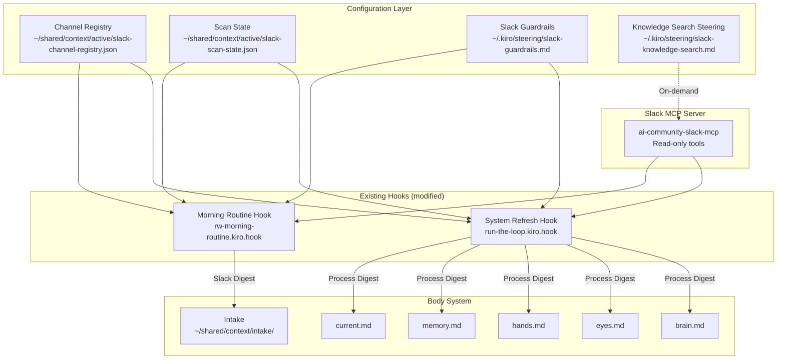
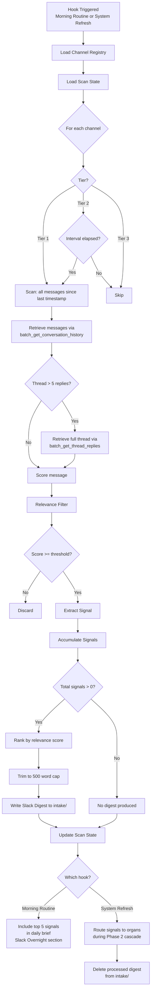

# Design Document — Slack Context Ingestion

## Overview

Slack Context Ingestion adds Slack as a read-only context source for the Body system. The Slack MCP server (`ai-community-slack-mcp`) already provides full read access. The design challenge is filtering — Slack is high-volume, high-frequency, and mostly noise. This system extracts what matters (decisions, action items, status changes, stakeholder signals, hot topics) and routes it to existing organs without creating new routines, new visible steps, or new files Richard has to manage.

The implementation is entirely configuration-driven: markdown steering rules, JSON state files, and modifications to existing hook prompts. No application code. No new hooks. No new agents.

### Design Principles Applied

| Principle | How It Applies |
|-----------|---------------|
| Routine as liberation | Slack scanning runs inside existing hooks (morning routine, system refresh). No new routine to trigger. |
| Structural over cosmetic | Changes what the system knows by default. Organs get richer context. Nothing looks different. |
| Subtraction before addition | Replaces manual Slack checking. No new files in the body. Digests are transient (intake → process → delete). |
| Invisible over visible | Morning brief just has better context. No "Slack section" unless overnight activity warrants it. |
| Reduce decisions, not options | The system decides what's relevant. Richard reviews only what surfaces in the brief or organs. |

### Key Constraints

- Read-only: only Slack MCP read operations (per slack-guardrails.md). Never post, open conversations, add members, or create channels.
- Portable: all config and state files are plain text (markdown/JSON). A new AI on a different platform can read them without MCP access.
- Budget-respecting: Slack digests capped at 500 words. Organ routing respects gut.md word budgets. Cumulative weekly tracking prevents bloat.
- No new hooks: Slack scanning is a data source within existing hooks, not a separate step.

---

## Architecture

### System Context




### Data Flow — Full Ingestion Pipeline



---

## Components and Interfaces

### 1. Channel Registry

The Channel Registry is the configuration file that tells the ingester which channels to scan, how often, and where to route their signals.

**File:** `~/shared/context/active/slack-channel-registry.json`

**Why JSON:** Machine-readable for the agent, human-editable, portable. JSON over markdown because the agent needs to parse tier/interval/keyword fields programmatically during scan logic.

**Schema:**

```json
{
  "version": "1.0",
  "last_updated": "2026-04-01T00:00:00Z",
  "updated_by": "system",
  "tiers": {
    "1": "Priority — scanned every cycle",
    "2": "Watch — scanned on interval or keyword trigger",
    "3": "Archive/Ignore — never scanned"
  },
  "channels": [
    {
      "channel_id": "C0993SRL6FQ",
      "channel_name": "rsw-channel",
      "tier": 1,
      "organ_targets": ["hands", "current"],
      "scan_interval_hours": null,
      "keyword_triggers": [],
      "notes": "Richard's private channel. Always scan."
    }
  ],
  "community_channels": [
    {
      "channel_id": "C0A1JD8FCUV",
      "channel_name": "agentspaces-interest",
      "member_count": 15000,
      "topics": ["AgentSpaces", "DevSpaces", "MCP", "agent development"],
      "notes": "Knowledge search only — not scanned by ingester"
    }
  ],
  "people_watch": {
    "derived_from": "memory.md relationship graph",
    "last_derived": "2026-04-01T00:00:00Z",
    "always_high_relevance": [
      {
        "slack_user_id": "U_BRANDON",
        "alias": "brandoxy",
        "name": "Brandon Munday",
        "reason": "Richard's manager — all messages high-relevance"
      }
    ],
    "boosted": [
      {
        "slack_user_id": "U_ALEXIS",
        "alias": "alexieck",
        "name": "Alexis Eck",
        "reason": "AU POC, active stakeholder"
      },
      {
        "slack_user_id": "U_LENA",
        "alias": "lenazak",
        "name": "Lena Zak",
        "reason": "AU country leader, key stakeholder"
      },
      {
        "slack_user_id": "U_LORENA",
        "alias": "lorealea",
        "name": "Lorena Alvarez Larrea",
        "reason": "MX primary PS stakeholder"
      },
      {
        "slack_user_id": "U_YUN",
        "alias": "yunchu",
        "name": "Yun-Kang Chu",
        "reason": "Peer, MX/Adobe/Modern Search"
      },
      {
        "slack_user_id": "U_ADI",
        "alias": "aditthk",
        "name": "Aditya Satish Thakur",
        "reason": "Peer, weekly sync"
      },
      {
        "slack_user_id": "U_DWAYNE",
        "alias": "dtpalmer",
        "name": "Dwayne Palmer",
        "reason": "MCS/Website, WBR coverage"
      },
      {
        "slack_user_id": "U_KATE",
        "alias": "kataxt",
        "name": "Kate Rundell",
        "reason": "L8 Director, skip-level"
      }
    ],
    "candidate_tracking": {
      "threshold": "3+ interactions in 7 days",
      "candidates": []
    }
  },
  "default_tier_for_new_channels": 3
}
```

**Initial Tier 1 Channels (Priority):**

| Channel | ID | Rationale | Organ Targets |
|---------|-----|-----------|---------------|
| rsw-channel | C0993SRL6FQ | Richard's private channel | hands, current |
| paid-acq-team (if exists) | TBD | Core team channel | current, hands, memory |
| ab-paid-search (if exists) | TBD | PS-specific discussions | current, eyes, hands |

**Initial Tier 2 Channels (Watch):**

| Channel | Scan Interval | Keyword Triggers | Organ Targets |
|---------|--------------|-----------------|---------------|
| ab-marketing (if exists) | 24h | OCI, Polaris, Baloo, testing | current, eyes |
| ab-au-marketing (if exists) | 24h | CPC, CPA, Polaris, Lena | current, eyes |

**Community Channels (Knowledge Search only — not scanned by ingester):**

| Channel | ID | Members | Topics |
|---------|-----|---------|--------|
| agentspaces-interest | C0A1JD8FCUV | 15K+ | AgentSpaces, DevSpaces, MCP |
| amazon-builder-genai-power-users | C08GJKNC3KM | 35K+ | GenAI, Bedrock, AI tools |
| cps-ai-win-share-learn | C09LU3K7KS8 | 5K+ | AI wins, best practices |
| bedrock-agentcore-interest | C096H6QNW6M | 7K+ | Bedrock AgentCore |
| abma-genbi-analytics-interest | C0A1J4QG3CY | 141 | GenBI, analytics |
| andes-workbench-interest | C096T4SK3EY | 20K+ | Andes Workbench |

**Channel Discovery:** When `list_channels` returns channels not in the registry, they default to Tier 3. The agent logs them in the scan state under `discovered_channels` for Richard to review during the next morning brief if any look relevant.


### 2. Scan State File

Tracks what has been scanned, when, and cumulative volume metrics. The single source of truth for deduplication and resumption.

**File:** `~/shared/context/active/slack-scan-state.json`

**Schema:**

```json
{
  "version": "1.0",
  "last_scan": {
    "timestamp": "2026-04-01T14:30:00Z",
    "hook": "morning-routine",
    "status": "success",
    "signals_extracted": 7,
    "channels_scanned": 4,
    "errors": []
  },
  "channels": {
    "C0993SRL6FQ": {
      "channel_name": "rsw-channel",
      "last_message_ts": "1743523800.000100",
      "last_scan_ts": "2026-04-01T14:30:00Z",
      "messages_processed": 12,
      "signals_extracted": 3
    }
  },
  "dm_conversations": {
    "D_BRANDON": {
      "user_name": "Brandon Munday",
      "last_message_ts": "1743520200.000050",
      "last_scan_ts": "2026-04-01T14:30:00Z"
    }
  },
  "hot_topics": {
    "active": [
      {
        "topic": "Polaris rollout",
        "first_seen": "2026-03-30T10:00:00Z",
        "last_seen": "2026-04-01T12:00:00Z",
        "channels": ["C_TEAM", "C_AU", "C_MCS"],
        "key_participants": ["afvans", "dtpalmer", "brandoxy"],
        "signal_count": 8,
        "status": "active"
      }
    ],
    "cooled": []
  },
  "volume_tracking": {
    "week_start": "2026-03-31",
    "words_by_organ": {
      "current": 120,
      "hands": 85,
      "memory": 45,
      "eyes": 60,
      "brain": 0
    },
    "total_words_this_week": 310
  },
  "discovered_channels": [],
  "people_watch_candidates": [],
  "tool_invocation_log": [
    {
      "timestamp": "2026-04-01T14:30:00Z",
      "tool": "batch_get_conversation_history",
      "channel": "C0993SRL6FQ",
      "result": "success"
    }
  ]
}
```

**Cold Start Behavior:** If `slack-scan-state.json` does not exist, the ingester creates it and scans only the most recent 24 hours of messages per channel. This prevents ingesting historical noise on first run or platform migration.

**Edit Handling:** When the ingester encounters a message whose `ts` matches a previously processed message but with an `edited` field, it updates the existing Signal rather than creating a duplicate. The scan state tracks message timestamps, not content hashes — edits are detected by the Slack API's `edited` metadata.

### 3. Slack Digest Format

The digest is a transient markdown file dropped into `intake/` for processing by the morning routine or system refresh cascade. It is deleted after processing.

**File:** `~/shared/context/intake/slack-digest-{YYYY-MM-DD-HHmm}.md`

**Format:**

```markdown
# Slack Digest — 2026-04-01 14:30 UTC

Cycle: morning-routine | Channels scanned: 4 | Signals: 7 | Words: 487/500

## Signals

### [ACTION-RW] Action item from Brandon
- **Type:** action-item
- **Source:** #paid-acq-team → thread 1743520200.000050
- **Author:** Brandon Munday (brandoxy)
- **Timestamp:** 2026-04-01 09:15 PT
- **Target organ:** hands
- **Summary:** Brandon asked Richard to prepare AU CPC trend data for Kate's review by Thursday. Specifically wants the rolling 4-week view with OCI impact projections.

### Status change: Polaris weblab
- **Type:** status-change
- **Source:** #ab-paid-search → thread 1743521000.000030
- **Author:** Dwayne Palmer (dtpalmer)
- **Timestamp:** 2026-04-01 10:22 PT
- **Target organ:** current
- **Summary:** Polaris weblab dial-up confirmed for April 7. DE and FR included per Andrew's recommendation. JP deferred to next wave.

### Hot Topic: OCI APAC access resolution
- **Type:** topic-update
- **Source:** 3 channels (#paid-acq-team, #ab-paid-search, #oci-rollout)
- **Key participants:** brandoxy, Mike Babich (external)
- **Target organ:** current
- **Summary:** Google restored APAC MCC access. Brandon confirmed login works. JP OCI launch back on track for May timeline.

## Hot Topics

### 🔥 OCI APAC Access (active since 2026-03-25)
Channels: 3 | Participants: 4 | Latest: access restored, JP timeline restored.

## Metadata
- Scan state updated: slack-scan-state.json
- Signals discarded (below threshold): 23
- Word count: 487/500
```

**Rules:**
- Hard cap: 500 words per digest. If more signals than fit, rank by relevance score and include only top-ranked.
- `[ACTION-RW]` prefix on any signal containing a direct action item for Richard — these get priority routing to hands.md.
- No digest file produced when zero relevant signals found. Silence means nothing happened.
- Plain markdown, no MCP dependencies. Any AI can read it.


### 4. Relevance Filter Logic

The Relevance Filter scores each message against Richard's active context. It derives all scoring inputs from existing Body files — no manual configuration.

**Scoring Model:**

| Factor | Points | Source | Rationale |
|--------|--------|--------|-----------|
| Direct mention of Richard (`prichwil`, `@Richard`) | +100 | Message text | Auto high-relevance (Req 2.2) |
| Author is `always_high_relevance` (Brandon) | +100 | people_watch in registry | Manager messages always matter (Req 3.3) |
| Author is `boosted` People Watch | +30 | people_watch in registry | Key stakeholder signal (Req 3.2) |
| Message contains active project keyword | +25 | current.md project names | Project-relevant context (Req 2.1) |
| Message contains keyword trigger from channel registry | +20 | channel_registry keywords | Topic-relevant context (Req 2.1) |
| Message is in a Tier 1 channel | +15 | channel_registry tier | Higher base relevance for priority channels |
| Message contains decision language ("decided", "approved", "confirmed", "blocked") | +20 | Pattern matching | Decision signals (Req 2.3) |
| Message contains action assignment ("@prichwil", "Richard to", "action item") | +25 | Pattern matching | Action item extraction (Req 2.3) |
| Message contains deadline language ("by EOD", "due", "deadline") | +15 | Pattern matching | Urgency signal (Req 2.3) |
| Message contains escalation language ("escalated", "urgent", "blocker") | +20 | Pattern matching | Escalation detection (Req 2.3) |
| Message is in a hot topic cluster | +15 | scan state hot_topics | Hot topic boost (Req 11.3) |
| Thread has > 5 replies (after full thread retrieval) | +10 | Thread metadata | Active discussion signal (Req 2.6) |

**Relevance Threshold:** 25 points. Messages scoring below 25 are discarded without writing to any organ or digest (Req 2.4).

**Score 100+ = high-relevance** (always included in digest, even if at word cap).
**Score 25-99 = relevant** (included if within word cap, ranked by score).
**Score < 25 = noise** (discarded).

**Context Derivation (no manual config):**
- Active project names and keywords: parsed from `current.md` → "Active Projects" section headers and key terms
- Key people: derived from `memory.md` → "Relationship Graph" section names and aliases
- Hot topics: maintained in `slack-scan-state.json` → `hot_topics.active`
- Keyword triggers: stored per-channel in `slack-channel-registry.json`

### 5. Signal Extraction

When a message passes the relevance threshold, the agent extracts a structured Signal:

**Signal Types:**

| Type | Trigger Pattern | Example |
|------|----------------|---------|
| `decision` | "decided", "approved", "confirmed", "going with", "final call" | "We're going with DE + FR for the first weblab wave" |
| `action-item` | "@prichwil", "Richard to", "can you", "please", "action item", "TODO" | "Richard, can you prep the AU CPC trend data by Thursday?" |
| `status-change` | "launched", "completed", "blocked", "delayed", "shipped", "live" | "Polaris weblab dial-up confirmed for April 7" |
| `escalation` | "escalated", "urgent", "blocker", "critical", "need help" | "APAC MCC access still blocked — escalating to Google leadership" |
| `mention` | "prichwil", "@Richard", "Richard" | "Richard had a good point about the two-campaign structure" |
| `topic-update` | Hot topic cluster detection (3+ channels, 24h window) | Cross-channel convergence on OCI timeline |

**Signal Fields:**
- `type`: one of the six types above
- `source_channel`: channel name and ID
- `thread_ts`: thread timestamp (for linking back)
- `author`: name and alias
- `timestamp`: message timestamp (PT-adjusted)
- `content_summary`: 1-2 sentence summary (not raw message text)
- `target_organ`: recommended organ for routing
- `relevance_score`: numeric score from the filter
- `action_flag`: `[ACTION-RW]` if action item directed at Richard

### 6. Organ Routing Rules

Each Signal's `target_organ` field determines where it gets routed during the system refresh cascade. Routing is deterministic based on signal type:

| Signal Type | Primary Organ | Secondary Organ | What Gets Written |
|-------------|--------------|-----------------|-------------------|
| `decision` | brain.md | current.md | Decision log entry with source attribution |
| `action-item` | hands.md | current.md (pending actions) | New action item with `[Slack]` source tag |
| `status-change` | current.md | eyes.md (if metric-related) | Updated project status line |
| `escalation` | current.md | hands.md (if Richard needs to act) | Escalation note on relevant project |
| `mention` | current.md | — | Context note (only if substantive) |
| `topic-update` | current.md | brain.md (if strategic) | Hot topic summary |
| Relationship info (tone shift, new person) | memory.md | — | Updated relationship graph entry |
| Market metrics / competitive intel | eyes.md | DuckDB (if structured data) | Updated metrics or competitor note |

**Routing Constraints:**
- No new organ files created. All Slack signals absorbed into existing organs (Req 5.6).
- Before writing to an organ, check its word budget in gut.md. If at capacity, compress or defer (Req 14.3).
- After routing, delete the processed digest from `intake/` (Req 5.7).
- Source attribution: every Slack-sourced fact written to an organ includes `[Slack: #channel, author, date]` tag for provenance.


### 7. Morning Routine Integration

The morning routine hook (`rw-morning-routine.kiro.hook`) gets a new substep within the existing CONTEXT LOAD phase — not a new step. Slack scanning happens as part of reading fresh context, before the brief is built.

**Integration Point:** After the existing context load (body.md, spine.md, etc.) and before Step 1 (Asana Sync).

**Modified Hook Behavior:**

```
=== CONTEXT LOAD (existing — add Slack scan here) ===
... existing file reads ...

SLACK SCAN (invisible substep — no new numbered step):
1. Load ~/shared/context/active/slack-channel-registry.json
2. Load ~/shared/context/active/slack-scan-state.json
3. Scan Tier 1 channels for messages since last morning routine timestamp
4. Scan Tier 2 channels if interval elapsed
5. Scan DM conversations with People Watch contacts
6. Run Relevance Filter on all retrieved messages
7. If signals found: produce slack-digest-{timestamp}.md in intake/
8. Update slack-scan-state.json
9. If errors (rate limit, API failure): log to scan state, continue with other data sources

=== STEP 3: TO-DO REFRESH + DAILY BRIEF (existing — add Slack Overnight) ===
... existing brief sections ...

PHASE 2 — DAILY BRIEF:
If a Slack digest was produced during context load:
- Add "SLACK OVERNIGHT" section to the brief (between HEADS UP and TODAY)
- Include top 5 signals by relevance score
- Cap at 150 words
- If signals contain [ACTION-RW] items, add them to the To-Do refresh in Phase 1
- If no relevant Slack activity: omit the section entirely (silence = nothing happened)

SLACK OVERNIGHT section format in the brief email:
- Same card-based dark navy design as other sections
- Section header: "SLACK OVERNIGHT" (10px uppercase, #4a5a78)
- Each signal: one row with type icon + summary + source channel in secondary text
- [ACTION-RW] items highlighted in amber (#d4880f)
```

**What Does NOT Change:**
- No new numbered step in the morning routine
- No new hook file
- The brief's overall structure and design system remain identical
- If Slack MCP is unavailable, the morning routine runs normally without Slack context

### 8. Autoresearch Loop Integration

The system refresh hook (`run-the-loop.kiro.hook`) gets Slack scanning added to Phase 1 (Maintenance) as a data source alongside email and calendar.

**Integration Point:** Phase 1 Maintenance, after "Refresh ground truth from email/calendar" and before "Process intake/".

**Modified Hook Behavior:**

```
=== PHASE 1: MAINTENANCE (existing — add Slack as data source) ===
Refresh ground truth from email/calendar.
... existing substeps ...

SLACK INGESTION (new substep within Phase 1):
1. Load slack-channel-registry.json and slack-scan-state.json
2. Scan all Tier 1 channels (messages since last scan timestamp)
3. Scan Tier 2 channels if interval elapsed
4. Scan DM conversations with People Watch contacts
5. Run Relevance Filter → extract Signals
6. If signals found: produce slack-digest in intake/
7. Update slack-scan-state.json (including tool invocation log for audit)
8. On rate limit or API error: log error, continue with other data sources (Req 7.4)

... existing substep: Process intake/ using gut.md Digestion Protocol ...
(The Slack digest in intake/ gets processed here alongside any other intake files)

=== PHASE 2: CASCADE TO ALL ORGANS (existing — Slack signals included) ===
When cascading changes to organs, Slack-sourced Signals from the digest are included
in the cascade input alongside email/calendar/Hedy signals. Routing follows the
organ routing rules table above.

After all signals from a digest are routed to organs:
- Delete the processed digest from intake/ (Req 5.7)
- Update volume_tracking in scan state (words added per organ)
```

**What Does NOT Change:**
- No new phase or step number in the loop
- Phase 3 (experiments), Phase 4 (suggestions), Phase 5-6 (conclusion/housekeeping) unchanged
- If Slack MCP is unavailable, the loop runs normally — it just has one fewer data source

### 9. Knowledge Search Steering Rules

Knowledge Search is a separate capability from scheduled ingestion. It's triggered on-demand by the agent's reasoning process when Richard asks about internal tooling, AI frameworks, or Amazon-specific technical topics.

**File:** `~/.kiro/steering/slack-knowledge-search.md`

**Content:**

```markdown
---
inclusion: manual
---

# Slack Knowledge Search

## When to Search

Search community Slack channels when:
1. Richard asks about MCP servers, CLI tools, Kiro features, AgentSpaces, Bedrock,
   or Amazon internal tooling that you cannot fully answer from your own knowledge
2. You encounter a technical question where community experience would add value
3. Richard explicitly asks "what are people saying about X" or "search Slack for X"

## How to Search

1. Use the `search` tool with the topic as query
2. Filter by community channels listed in slack-channel-registry.json → community_channels
3. Prefer threads from the last 90 days
4. Prefer threads with replies over unanswered questions
5. For relevant threads, retrieve full replies via `batch_get_thread_replies`

## How to Present Results

- Include attribution: author, channel, timestamp, thread link
- Present as supplementary evidence in the conversation, not as authoritative answers
- Let Richard verify and follow up

## What NOT to Do

- Do NOT write Knowledge Search results to Body organs or produce Slack Digests
- Do NOT modify scan state — Knowledge Search operates independently from scheduled scans
- Do NOT report failed searches to Richard — note the gap internally and proceed with your own knowledge
- Do NOT search community channels during scheduled ingestion scans — they are knowledge sources only

## Community Channels

Maintained in slack-channel-registry.json → community_channels section.
Minimum set: agentspaces-interest, amazon-builder-genai-power-users,
cps-ai-win-share-learn, bedrock-agentcore-interest, abma-genbi-analytics-interest,
andes-workbench-interest.
```

### 10. People Watch Derivation

People Watch is not a separate file — it's a section within the Channel Registry that is automatically derived from `memory.md`'s Relationship Graph.

**Derivation Logic:**

1. Parse `memory.md` → "Relationship Graph" section
2. For each person entry, extract: name, alias, role/context, last interaction date
3. Classify into `always_high_relevance` or `boosted`:
   - `always_high_relevance`: Richard's direct manager (Brandon Munday) — all messages score +100 regardless of content
   - `boosted`: all other Relationship Graph entries with interaction in the last 60 days — messages score +30
   - Dormant contacts (60+ days no interaction per gut.md decay rules): excluded from People Watch until they resurface
4. Write the derived list to `slack-channel-registry.json` → `people_watch` section
5. Record `last_derived` timestamp

**Automatic Update:** The People Watch list is re-derived whenever the system refresh cascade updates `memory.md` (Phase 2). No manual configuration needed (Req 3.5).

**New Person Detection (Req 3.6):** During each scan cycle, the ingester tracks unique Slack users who appear in conversations with Richard (DMs or @mentions). If a user not in the People Watch list appears 3+ times in a 7-day window, they are added to `people_watch_candidates` in the scan state. The morning brief flags candidates for Richard's awareness — the system does not auto-promote them to People Watch without the agent's judgment call during the next system refresh.

### 11. Hot Topic Detection

Hot topics are detected from extracted Signals, not raw message text (Req 11.5). This prevents false positives from casual keyword mentions.

**Detection Algorithm:**

```
For each Signal extracted in the current scan cycle:
  1. Extract topic keywords (project names, technical terms, people names)
  2. Normalize keywords (lowercase, strip punctuation)
  3. Match against existing hot_topics.active in scan state
  4. Match against other Signals from the current cycle

If the same topic cluster appears in Signals from 3+ distinct channels
within a 24-hour window:
  → Flag as hot topic
  → Add to scan state hot_topics.active with:
    - topic name
    - first_seen timestamp
    - channels list
    - key_participants list
    - signal_count
  → Include hot topic summary in the Slack Digest
  → Boost relevance score (+15) for all messages in the topic cluster

If a hot topic relates to an active project in current.md:
  → Additional relevance boost (+25 total instead of +15)

Cooling logic:
  If a hot topic has no new Signals for 48 hours:
    → Move from hot_topics.active to hot_topics.cooled
    → Stop applying relevance boost
    → Remove from digest hot topics section
```

**Hot Topic Summary Format (in digest):**
```markdown
### 🔥 [Topic Name] (active since [date])
Channels: [count] | Participants: [list] | Latest: [one-sentence synthesis]
```

### 12. Volume Control Mechanisms

Volume control operates at three levels: per-cycle (digest cap), per-organ (word budget), and per-week (cumulative tracking).

**Level 1 — Per-Cycle Digest Cap (Req 14.1):**
- Hard cap: 500 words per Slack Digest
- When more signals than fit: rank by relevance score, include only top-ranked
- High-relevance signals (score 100+) always included, even if it means fewer lower-scored signals

**Level 2 — Per-Organ Word Budget (Req 14.3):**
- Before writing Slack-sourced content to an organ, check the organ's current word count against its budget in gut.md
- If organ is at or over budget: compress existing content first, or defer the Slack signal to the next cycle
- Slack content follows the same gut.md compression protocol as all other content sources

**Level 3 — Weekly Cumulative Tracking (Req 14.4-14.5):**
- `slack-scan-state.json` → `volume_tracking` tracks words added to each organ from Slack per week
- Week resets on Monday (aligned with `week_start` field)
- If cumulative Slack-sourced words for any organ exceed 20% of that organ's word budget in a single week:
  - Reduce scan frequency for channels feeding that organ (Tier 1 → scan every other cycle, Tier 2 → skip until next week)
  - Log the throttle in scan state
  - Resume normal frequency on weekly reset

**Budget Reference (from gut.md):**

| Organ | Budget | 20% Slack Ceiling |
|-------|--------|-------------------|
| Memory | 3500w | 700w/week |
| Brain | 2500w | 500w/week |
| Eyes | 2500w | 500w/week |
| Hands | 2000w | 400w/week |
| current.md | (no formal budget) | Monitor — flag if Slack adds >500w/week |

---

## Data Models

### Signal (internal representation during processing)

```
Signal {
  id: string              // "{channel_id}_{message_ts}" — unique key
  type: enum              // decision | action-item | status-change | escalation | mention | topic-update
  source_channel_id: string
  source_channel_name: string
  thread_ts: string       // for thread linking
  author_name: string
  author_alias: string
  author_slack_id: string
  timestamp: string       // ISO 8601
  content_summary: string // 1-2 sentences, not raw text
  target_organ: string    // brain | eyes | hands | memory | current
  relevance_score: number
  action_flag: boolean    // true if [ACTION-RW]
  hot_topic: string|null  // hot topic name if part of a cluster
}
```

This is a conceptual model — the agent constructs Signals in-memory during processing. They are serialized only into the Slack Digest markdown format.

### Channel Registry Entry

```
ChannelEntry {
  channel_id: string
  channel_name: string
  tier: 1 | 2 | 3
  organ_targets: string[]
  scan_interval_hours: number | null  // null = every cycle (Tier 1)
  keyword_triggers: string[]
  notes: string
}
```

### People Watch Entry

```
PersonEntry {
  slack_user_id: string
  alias: string
  name: string
  reason: string
  relevance_class: "always_high_relevance" | "boosted"
}
```

---

## Error Handling

### Slack MCP Unavailability

- If the Slack MCP server is unreachable or returns errors, the ingester logs the error to `slack-scan-state.json` → `last_scan.errors` and continues
- The morning routine runs normally without Slack context — the "Slack Overnight" section is simply omitted
- The system refresh runs normally — Slack is one of multiple data sources, not a dependency
- No organ fails because Slack data is unavailable (Req 13.4)

### Rate Limiting

- If `batch_get_conversation_history` or `search` returns a rate limit error:
  1. Log the error with channel ID and timestamp
  2. Skip the remaining channels for this cycle
  3. Update scan state with partial progress (channels that were successfully scanned keep their updated timestamps)
  4. Next cycle picks up where this one left off

### Malformed Data

- If a message cannot be parsed or scored: skip it, log to scan state errors
- If the Channel Registry file is missing or malformed: fall back to scanning only Richard's DMs with People Watch contacts (minimal safe mode)
- If the Scan State file is missing: cold start — scan last 24 hours only

### Guardrail Violations

- The ingester uses only read operations. If any code path would invoke a write operation (`post_message`, `open_conversation`, etc.), the guardrail steering file blocks it at the hook level
- `self_dm` is permitted for ingestion status summaries (Req 12.4) — the agent may DM Richard a one-line scan summary if errors occurred
- All tool invocations are logged to `slack-scan-state.json` → `tool_invocation_log` for audit (Req 12.5)

---

## Implementation Files Summary

| File | Location | Type | Purpose |
|------|----------|------|---------|
| Channel Registry | `~/shared/context/active/slack-channel-registry.json` | JSON config | Channel tiers, People Watch, community channels |
| Scan State | `~/shared/context/active/slack-scan-state.json` | JSON state | Timestamps, hot topics, volume tracking, audit log |
| Slack Digest | `~/shared/context/intake/slack-digest-{timestamp}.md` | Transient MD | Signals for processing (deleted after routing) |
| Knowledge Search Steering | `~/.kiro/steering/slack-knowledge-search.md` | Steering rule | On-demand community channel search rules |
| Slack Guardrails | `~/.kiro/steering/slack-guardrails.md` | Steering rule | Read-only enforcement (already exists) |
| Morning Routine Hook | `.kiro/hooks/rw-morning-routine.kiro.hook` | Hook (modified) | Add Slack scan to context load + brief |
| System Refresh Hook | `.kiro/hooks/run-the-loop.kiro.hook` | Hook (modified) | Add Slack scan to Phase 1 maintenance |

No new hooks. No new agents. No new organ files. No application code.
