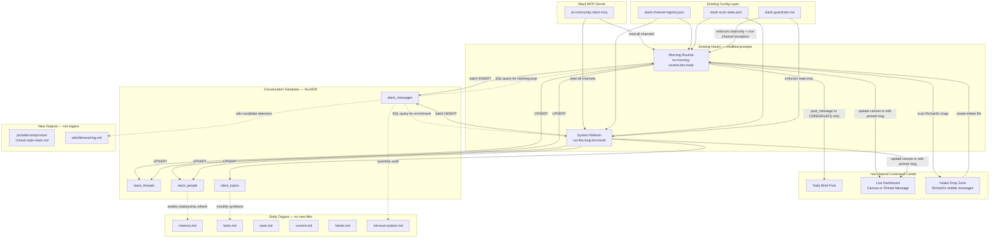
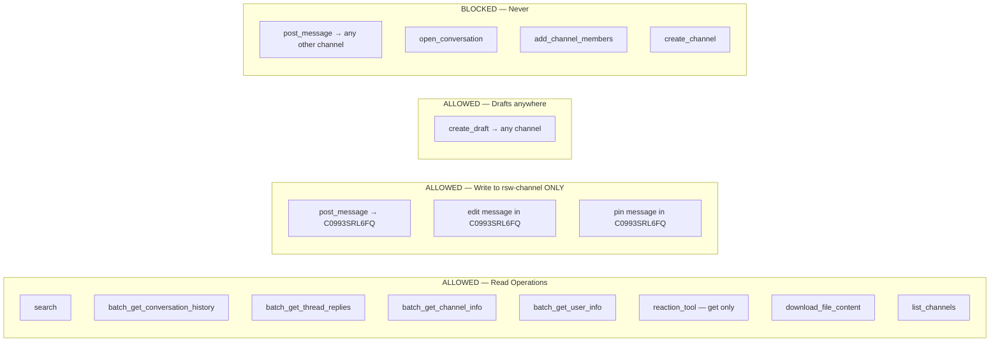
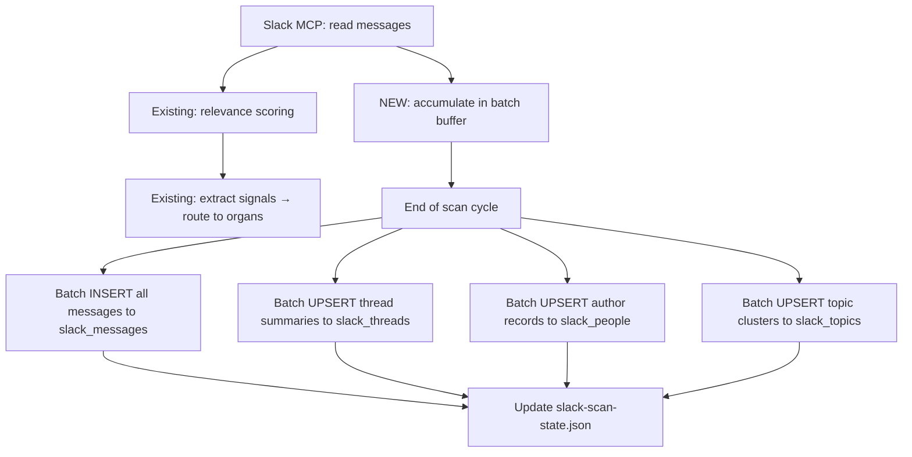
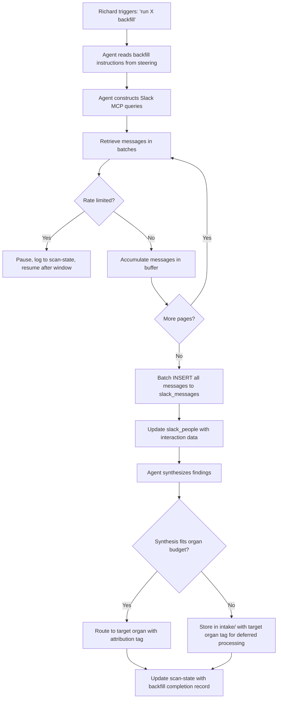
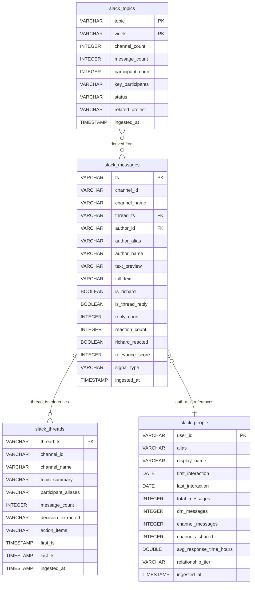

# Design Document — Slack Deep Context

> Extends the [Slack Context Ingestion](../slack-context-ingestion/design.md) system (v3, live since 4/1). That system reads Slack ephemerally — scan, extract signals, route to organs, discard. This feature makes Slack data persistent, queryable, and enriched over time.

## Overview

Slack Deep Context adds four capabilities to the existing ingestion infrastructure:

1. **rsw-channel Command Center** — Daily brief post + live dashboard + mobile intake in Richard's private channel
2. **Conversation Database** — Four new DuckDB tables making historical Slack data queryable via SQL
3. **Historical Backfill** — One-time deep scans filling knowledge gaps (DM history, voice corpus, decisions, timelines, stakeholder positions, meeting context)
4. **Ongoing Enrichment** — Weekly/monthly/quarterly processes keeping the knowledge graph fresh

All four are configuration-driven: SQL DDL, JSON config modifications, hook prompt additions, and steering rules. No application code. No new hooks. No new agents. No new organ files.

### Design Principles

| Principle | Application |
|-----------|-------------|
| Routine as liberation | rsw-channel daily brief eliminates "where do I look for status?" |
| Structural over cosmetic | Conversation DB changes what the system can answer, not how it looks |
| Subtraction before addition | Local SQL queries replace live Slack API calls |
| Reduce decisions, not options | Proactive draft suggestions make responding the easy path |
| Invisible over visible | Enrichment runs in background; Richard sees better outputs, not new processes |
| Portability | DuckDB is a single file. All outputs are plain text. No Slack MCP needed to read them. |

### Relationship to Existing System

```
Slack Context Ingestion (v3, live)     Slack Deep Context (this spec)
─────────────────────────────────      ──────────────────────────────
Ephemeral: read → extract → discard   Persistent: read → store → query
Signals → organs                       Messages → DuckDB + organs
Real-time only                         Historical backfill + ongoing enrichment
Read-only everywhere                   Read-only + post to rsw-channel only
No output to Slack                     Daily brief + dashboard + drafts → rsw-channel
```

### Implementation Pattern

This system follows the same pattern as the v1/v3 Slack Context Ingestion — entirely configuration-driven:

| Artifact Type | Examples | Location |
|---------------|----------|----------|
| SQL DDL | CREATE TABLE statements for 4 new tables | `~/shared/tools/data/schema.sql` |
| JSON config updates | Channel registry additions for rsw-channel intake behavior | `~/shared/context/active/slack-channel-registry.json` |
| Hook prompt modifications | Morning routine: add daily brief post + dashboard update steps | `.kiro/hooks/rw-morning-routine.kiro.hook` |
| Steering rules | Backfill scan instructions, enrichment cadence rules | `~/.kiro/steering/slack-deep-context.md` |
| Markdown outputs | Voice corpus, stakeholder summaries, timeline docs | Various organ files + `portable-body/voice/` |

No Python modules. No classes. No compiled code. The "implementation" is the agent following instructions in config/steering files during hook execution.

---

## Architecture

### System Context Diagram




### Data Flow — Four Phases

```mermaid
flowchart TD
    subgraph "Phase 1: rsw-channel Command Center"
        A1[Morning Routine completes daily brief] --> A2[Post condensed brief ≤300w to rsw-channel]
        A2 --> A3[Update live dashboard — canvas or pinned msg]
        A4[Scan rsw-channel for Richard's new messages] --> A5[Create intake file per message]
        A5 --> A6[Process through gut.md digestion]
    end

    subgraph "Phase 2: Conversation Database"
        B1[Existing ingestion reads messages from Slack API] --> B2[Existing: score + extract signals + route to organs]
        B1 --> B3[NEW: batch INSERT all messages to slack_messages]
        B3 --> B4[UPSERT thread summaries to slack_threads]
        B4 --> B5[UPSERT author records to slack_people]
        B5 --> B6[UPSERT topic clusters to slack_topics]
    end

    subgraph "Phase 3: Historical Backfill — one-time, agent-driven"
        C1[Richard triggers: 'run DM archaeology'] --> C2[Agent reads full DM history via Slack MCP]
        C2 --> C3[INSERT all messages to slack_messages]
        C3 --> C4[Synthesize findings]
        C4 --> C5[Route synthesis to target organ via intake/]
        C5 --> C6[Respect gut.md word budgets]
    end

    subgraph "Phase 4: Ongoing Enrichment"
        D1[Friday: query slack_people for 7-day interaction counts] --> D2[Update People Watch candidates + dormant flags]
        D3[Weekly: query slack_messages for Richard's long explanations] --> D4[Add to wiki/demand-log.md]
        D5[Monthly: query all tables for 30-day trends] --> D6[Route to brain + memory + eyes]
        D7[Quarterly: per-stakeholder communication audit] --> D8[Route to nervous-system.md]
        D9[Ongoing: detect unanswered messages 24h+] --> D10[Draft response → post to rsw-channel]
    end
```



### Guardrail Boundary Diagram



---

## Components and Interfaces

### 1. rsw-channel Command Center (Reqs 1–3, 21)

rsw-channel (C0993SRL6FQ) is the only channel where `post_message` is permitted per `~/.kiro/steering/slack-guardrails.md`. It serves three functions: daily brief post, live dashboard, and mobile intake drop zone.

#### 1a. Daily Brief Post (Req 1)

After the morning routine generates the daily brief email, it also posts a condensed version to rsw-channel.

**Integration point:** End of Step 3 (To-Do Refresh + Daily Brief) in `rw-morning-routine.kiro.hook`. Add to the hook prompt:

```
AFTER generating the daily brief email, ALSO:
1. Compose a condensed Slack version (≤300 words, Slack mrkdwn format)
2. Post to rsw-channel (C0993SRL6FQ) via post_message
3. Pin the new message
4. If post_message fails: log error to slack-scan-state.json, continue routine
```

**Post format (Slack mrkdwn, ≤300 words):**

```
📋 *Daily Brief — April 2, 2026*

*TOP 3*
1. JP OCI preflight with Adi — confirm ref tag setup
2. AU CPC trend data for Kate's review (due Thu)
3. Enhanced Match / LiveRamp EU scoping with Clara

*CALENDAR*
• 10:00 — Adi sync (JP OCI)
• 14:00 — Brandon 1:1
• 16:00 — WW Testing standup

*STATUS*
📊 Pending actions: 7 | 🔥 aMCC streak: Day 12 | 📦 Last artifact: 3 days ago

*HOT*
• OCI WW Launch (JP/EU3) — 4 channels, 6 signals
• Enhanced Match / LiveRamp EU — partnership channel
```

**Behavior rules:**
- New message each morning (not edit — Slack edit history creates confusion per Req 1.5)
- Pin the new message so latest brief is always accessible at top of rsw-channel (Req 1.4)
- If `post_message` fails: log error to `slack-scan-state.json → last_scan.errors`, continue remaining routine steps (Req 1.6)
- Content sourced from: hands.md (priorities, pending actions), calendar (today's meetings), amcc.md (streak), slack-scan-state.json (hot topics)

#### 1b. Live Dashboard (Reqs 2, 21)

A persistent status page in rsw-channel, updated by both morning routine and system refresh.

**Canvas vs. Pinned Message — technical validation (Req 21):**

Before implementation, the agent must test canvas support:
1. Attempt `canvas_create` on rsw-channel (C0993SRL6FQ)
2. If success: attempt `canvas_update` to modify content
3. Document result in `~/shared/context/active/slack-ingestion-README.md`

| Canvas supported? | Implementation | Update mechanism |
|-------------------|---------------|-----------------|
| Yes | Canvas pinned to rsw-channel | `canvas_update` with new content each cycle |
| No | Pinned message in rsw-channel | `edit_message` on the existing pinned message |

**Dashboard sections and data sources:**

| Section | Source File(s) | Content |
|---------|---------------|---------|
| Today | hands.md, calendar | Top 3 priorities, calendar highlights, pending action count |
| Streak | amcc.md | aMCC streak counter, hard thing status, days since last artifact |
| Markets | eyes.md | One-line status per market: AU, MX, US, EU5, JP, CA |
| Hot Topics | slack-scan-state.json → hot_topics.active | Trending topics with channel count and key participants |
| Pending Responses | hands.md + reaction checking results | Who's waiting on Richard (unreacted messages) |
| Five Levels | brain.md → Strategic Priorities | Current level position and gate status |

**Update triggers:**
- Morning routine completion → full dashboard refresh
- System refresh (autoresearch loop) completion → full dashboard refresh
- No real-time updates between hooks

**Dashboard format (Slack mrkdwn):**

```
🖥️ *System Dashboard* — Updated Apr 2, 2026 10:30 PT

━━━ *TODAY* ━━━
1. JP OCI preflight with Adi
2. AU CPC trend data for Kate (due Thu)
3. Enhanced Match scoping
📊 Pending: 7 | 📅 Meetings: 3

━━━ *STREAK* ━━━
🔥 aMCC: Day 12 | Hard thing: Testing doc draft | 📦 Last ship: 3d ago

━━━ *MARKETS* ━━━
🇦🇺 AU: $140 CPA, Polaris migration complete
🇲🇽 MX: +32% regs OP2, Lorena onboarding
🇺🇸 US: 32.9K regs, steady
🇪🇺 EU5: Weblab DE+FR Apr 7
🇯🇵 JP: OCI preflight, ref tags pending
🇨🇦 CA: +18.5% regs OP2, OCI live

━━━ *HOT TOPICS* ━━━
• OCI WW Launch — 4 channels, 6 participants
• Enhanced Match / LiveRamp EU — new

━━━ *WAITING ON RICHARD* ━━━
• Lena: AU LP URL analysis (2d)
• Lorena: Q2 spend for PO (5d)

━━━ *FIVE LEVELS* ━━━
L1 Sharpen ← active (struggling) | L2 Testing ← active
```

#### 1c. Intake Drop Zone (Req 3)

Richard drops notes, links, screenshots into rsw-channel from his phone. The system picks them up during the next scan cycle.

**Integration point:** During rsw-channel scan in morning routine / system refresh context load phase. The existing ingester already scans rsw-channel as a Tier 1 channel. The change is in how Richard's own messages are handled.

**Modified rsw-channel scan logic (add to hook prompt):**

```
WHEN scanning rsw-channel (C0993SRL6FQ):
1. Retrieve messages since last scan timestamp
2. For each message, check author_id:
   - If author_id == U040ECP305S (Richard): this is an intake message
   - If message contains known system markers ("Daily Brief —", "System Dashboard", "📋", "🖥️"): skip (system-posted)
   - Otherwise: create intake file
3. For each intake message:
   a. Create ~/shared/context/intake/rsw-intake-{YYYYMMDD-HHmm}.md
   b. Content: message text, any links, timestamp
   c. If message matches action patterns ("remind me to", "follow up with", "todo:", "TODO"): add [ACTION-RW] tag
   d. If message has file attachments: download_file_content and include content in intake file
4. Intake files processed through standard gut.md digestion in next cascade
```

**Intake file format:**

```markdown
# rsw-channel Intake — 2026-04-02 08:15 PT

Source: rsw-channel mobile drop
[ACTION-RW]

Remind me to follow up with Lena about the CPA methodology question — she asked about repeat visitor overstating on 4/1.

---
Captured: 2026-04-02T15:15:00Z
Route: hands.md (action item detected)
```


---

### 2. Conversation Database — DuckDB Schema (Reqs 4–6)

Four new tables added to `~/shared/data/duckdb/ps-analytics.duckdb`. Schema documented in `~/shared/tools/data/schema.sql` alongside the existing 15 tables.

#### 2a. DDL — CREATE TABLE Statements

```sql
-- ============================================================
-- Slack Deep Context: Conversation Database
-- Added to ps-analytics.duckdb alongside existing tables
-- Schema documented in: ~/shared/tools/data/schema.sql
-- ============================================================

-- Core message store — every message the ingester reads
-- Primary key is Slack's message timestamp (unique per workspace)
CREATE TABLE slack_messages (
    ts VARCHAR PRIMARY KEY,
    channel_id VARCHAR NOT NULL,
    channel_name VARCHAR,
    thread_ts VARCHAR,                   -- NULL if top-level message, parent ts if reply
    author_id VARCHAR NOT NULL,
    author_alias VARCHAR,
    author_name VARCHAR,
    text_preview VARCHAR,                -- First 200 chars for quick scans without loading full text
    full_text VARCHAR,                   -- Complete message text for keyword search
    is_richard BOOLEAN DEFAULT FALSE,    -- TRUE when author_id = U040ECP305S
    is_thread_reply BOOLEAN DEFAULT FALSE,
    reply_count INTEGER DEFAULT 0,       -- 0 for replies, N for parent messages
    reaction_count INTEGER DEFAULT 0,
    richard_reacted BOOLEAN DEFAULT FALSE,
    relevance_score INTEGER,             -- Score from the relevance filter (NULL for backfill msgs not scored)
    signal_type VARCHAR,                 -- decision, action-item, status-change, escalation, mention, topic-update, NULL
    ingested_at TIMESTAMP DEFAULT current_timestamp
);

-- slack_messages: 0 rows as of schema creation

-- Thread summaries — agent-synthesized, not raw message concatenation
-- One row per thread. Updated each scan cycle if thread has new replies.
CREATE TABLE slack_threads (
    thread_ts VARCHAR PRIMARY KEY,       -- Matches the parent message ts
    channel_id VARCHAR NOT NULL,
    channel_name VARCHAR,
    topic_summary VARCHAR,               -- 1-2 sentence agent synthesis of thread topic
    participant_aliases VARCHAR,          -- Comma-separated: "brandoxy,prichwil,alexieck"
    message_count INTEGER,
    decision_extracted VARCHAR,           -- Agent-extracted decision text, NULL if no decision
    action_items VARCHAR,                -- Agent-extracted action items, NULL if none
    first_ts TIMESTAMP,                  -- Timestamp of first message in thread
    last_ts TIMESTAMP,                   -- Timestamp of most recent reply
    ingested_at TIMESTAMP DEFAULT current_timestamp
);

-- slack_threads: 0 rows as of schema creation

-- People interaction tracking — one row per unique Slack user Richard interacts with
-- Updated incrementally each scan cycle
CREATE TABLE slack_people (
    user_id VARCHAR PRIMARY KEY,
    alias VARCHAR,
    display_name VARCHAR,
    first_interaction DATE,              -- Earliest message date in slack_messages involving this person
    last_interaction DATE,               -- Most recent message date
    total_messages INTEGER DEFAULT 0,    -- All messages from this person across all channels
    dm_messages INTEGER DEFAULT 0,       -- Messages in DM conversations with Richard
    channel_messages INTEGER DEFAULT 0,  -- Messages in shared channels
    channels_shared INTEGER DEFAULT 0,   -- Count of channels where both Richard and this person appear
    avg_response_time_hours DOUBLE,      -- Average time between Richard's message and this person's reply (and vice versa)
    relationship_tier VARCHAR,           -- always_high, boosted, candidate, dormant, none — synced from People Watch
    ingested_at TIMESTAMP DEFAULT current_timestamp
);

-- slack_people: 0 rows as of schema creation

-- Topic clusters over time — tracks how topics rise, persist, and cool across channels
-- Composite key: one row per topic per ISO week
CREATE TABLE slack_topics (
    topic VARCHAR,
    week VARCHAR,                        -- ISO week: '2026-W14'
    channel_count INTEGER,               -- How many distinct channels discussed this topic
    message_count INTEGER,               -- Total messages mentioning this topic
    participant_count INTEGER,           -- Unique people discussing this topic
    key_participants VARCHAR,            -- Comma-separated top contributors: "brandoxy,prichwil"
    status VARCHAR DEFAULT 'active',     -- active (discussed this week), cooled (no activity 2+ weeks), archived (no activity 8+ weeks)
    related_project VARCHAR,             -- Links to current.md project name if applicable
    ingested_at TIMESTAMP DEFAULT current_timestamp,
    PRIMARY KEY (topic, week)
);

-- slack_topics: 0 rows as of schema creation
```

#### 2b. Schema Integration

The DDL above gets appended to `~/shared/tools/data/schema.sql` after the existing table definitions. The schema file remains the single source of truth for the full database structure, matching the pattern established by the existing 15 tables.

**Existing tables in ps-analytics.duckdb (unchanged):**
- `daily_metrics` (10,502 rows), `weekly_metrics` (510), `monthly_metrics` (66)
- `ieccp` (9), `projections` (10), `callout_scores` (0)
- `experiments` (0), `change_log` (477), `anomalies` (0)
- `competitors` (14), `oci_status` (10), `ingest_log` (1)
- `agent_actions` (0), `agent_observations` (0), `decisions` (0), `task_queue` (0)

**New tables added by this spec:**
- `slack_messages`, `slack_threads`, `slack_people`, `slack_topics` — all start at 0 rows, populated by ingestion pipeline and backfill scans

#### 2c. Ingestion Pipeline Modification (Req 5)

The existing Slack ingester reads messages, scores them, extracts signals, and routes to organs. The conversation database adds a parallel write path — every message read gets stored, not just the ones passing the relevance filter.



**Key behaviors:**

- **All messages stored, not just relevant ones.** A message scoring 5 (noise) still goes into `slack_messages`. The DB is the complete record. Organs hold the compressed view. (Req 18.4)
- **Batch writes at end of cycle.** Accumulate all rows during the scan, execute as a single DuckDB transaction at the end. DuckDB handles bulk inserts in milliseconds — target <30 seconds added per cycle. (Req 5.7)
- **Upsert on primary key.** `INSERT OR REPLACE INTO slack_messages VALUES (...)` — edited messages get their `full_text` and `text_preview` updated, `ingested_at` refreshed. (Req 5.5)
- **Thread synthesis on upsert.** When a thread has new replies since last scan, the agent re-synthesizes the `topic_summary`, updates `message_count`, `participant_aliases`, `decision_extracted`, `action_items`, and `last_ts`. (Req 5.2)
- **People tracking is incremental.** New author → INSERT with initial counts. Existing author → UPDATE `last_interaction`, increment `total_messages`/`dm_messages`/`channel_messages`, recalculate `channels_shared`. (Reqs 5.3, 5.4)
- **Topic detection reuses hot topic logic.** When the existing hot topic detection (3+ channels, 24h window) fires, also UPSERT to `slack_topics`. (Req 5.6)

#### 2d. Query Interface (Req 6)

No new query tools needed. The conversation database is queryable through existing infrastructure:

| Interface | Tool | Example |
|-----------|------|---------|
| DuckDB MCP Server | `execute_query` | Any agent can run SQL directly |
| Python CLI | `~/shared/tools/data/query.py` | `from query import db; db("SELECT ...")` |
| Python helpers | `db_validate()`, `schema()`, `export_parquet()` | Existing utilities work on new tables |

**Example queries agents will construct:**

```sql
-- Meeting prep: what did this person say recently?
SELECT channel_name, text_preview, ts
FROM slack_messages
WHERE author_alias = 'lenazak'
  AND ts > '1743400000'
ORDER BY ts DESC LIMIT 20;

-- Wiki research: find threads with decisions about a topic
SELECT thread_ts, channel_name, topic_summary, decision_extracted
FROM slack_threads
WHERE decision_extracted IS NOT NULL
  AND topic_summary ILIKE '%polaris%'
ORDER BY last_ts DESC;

-- Relationship health: who has Richard been talking to?
SELECT alias, display_name, total_messages, dm_messages, last_interaction, relationship_tier
FROM slack_people
WHERE last_interaction >= current_date - INTERVAL 7 DAY
ORDER BY total_messages DESC;

-- Trend detection: what topics are rising?
SELECT topic, channel_count, message_count, status, related_project
FROM slack_topics
WHERE week = '2026-W14' AND status = 'active'
ORDER BY message_count DESC;
```

**Full-text search (Req 6.5):** DuckDB supports `LIKE`, `ILIKE`, and `contains()` on VARCHAR columns. At the expected scale (thousands to low tens of thousands of messages), these are sufficient. No full-text index needed. If scale grows significantly, DuckDB's `fts` extension can be enabled later.


---

### 3. Historical Backfill — One-Time Scans (Reqs 7–12)

Backfill scans are agent-driven, one-time operations. Richard triggers each one explicitly ("run DM archaeology", "mine decisions", etc.). The agent executes the scan using Slack MCP read operations, writes all raw messages to the conversation database, synthesizes findings, and routes synthesis to the appropriate organ via `intake/`.

#### 3a. Backfill Orchestration Model

All six backfill scans follow the same structural pattern:



**Progress tracking:** Each backfill scan logs its progress to `slack-scan-state.json` under a new `backfill_scans` key:

```json
{
  "backfill_scans": {
    "dm_archaeology": {
      "status": "completed",
      "triggered": "2026-04-05T10:00:00Z",
      "completed": "2026-04-05T11:30:00Z",
      "contacts_scanned": 15,
      "messages_ingested": 4200,
      "rate_limit_pauses": 2,
      "synthesis_routed_to": "memory.md"
    },
    "voice_corpus": {
      "status": "not_started"
    },
    "decision_mining": {
      "status": "not_started"
    },
    "project_timelines": {
      "status": "not_started"
    },
    "stakeholder_positions": {
      "status": "not_started"
    },
    "pre_meeting_context": {
      "status": "not_started"
    }
  }
}
```

**Rate limit handling (Req 19.5):** When the Slack API returns a rate limit response, the agent:
1. Logs the event to `slack-scan-state.json → tool_invocation_log`
2. Pauses for the duration specified in the `Retry-After` header (typically 30-60 seconds)
3. Resumes from where it left off (the batch buffer persists in the agent's context)
4. Does NOT fail the entire scan — partial progress is preserved in DuckDB

#### 3b. Backfill Scan Specifications

Each scan is defined by: what it searches for, what it writes to DuckDB, and where it routes synthesis.

**Scan 1: DM Archaeology (Req 7)**

| Aspect | Detail |
|--------|--------|
| Trigger | Richard says "run DM archaeology" |
| Slack queries | For each People Watch contact: `batch_get_conversation_history` on the DM channel, paginating to full history |
| DuckDB writes | All DM messages → `slack_messages` (with `is_richard` flag). Author records → `slack_people` (enriched: `dm_messages`, `avg_response_time_hours`, `first_interaction`, `last_interaction`) |
| Synthesis | Per-contact: communication frequency, tone patterns, topic distribution, response latency. People not in People Watch with high DM volume → flagged as candidates in `slack-scan-state.json → people_watch_candidates` |
| Route to | `memory.md` relationship graph entries (enriched tone notes, topic patterns). Respects gut.md word budget — overflow to `intake/` |
| Attribution | `[Slack Backfill: DM archaeology, full history, 2026-04-05]` |

**Scan 2: Richard's Slack Voice Corpus (Req 8)**

| Aspect | Detail |
|--------|--------|
| Trigger | Richard says "run voice corpus scan" |
| Slack queries | `search` with `from:@prichwil` across 12 months. Paginate through all results. |
| DuckDB writes | All Richard messages → `slack_messages` with `is_richard = TRUE` |
| Synthesis | Sentence length distribution, punctuation habits, emoji patterns, formality gradient (DM vs channel vs thread), opening/closing patterns, escalation/de-escalation language. Compare against `richard-writing-style.md` |
| Route to | New file: `~/shared/portable-body/voice/richard-style-slack.md` — structured by context (DM, channel, thread) and formality level |
| Attribution | `[Slack Backfill: voice corpus, 12 months, 2026-04-05]` |

**Scan 3: Decision Mining (Req 9)**

| Aspect | Detail |
|--------|--------|
| Trigger | Richard says "run decision mining" |
| Slack queries | `search` for decision language patterns: "decided", "going with", "confirmed", "approved", "let's do", "final call", "we're not going to" — across team channels, 12 months |
| DuckDB writes | Source messages → `slack_messages` with `signal_type = 'decision'`. Extracted decisions → `decisions` table (existing, currently 0 rows) with `decision_type`, `market`, `description`, `rationale`, `made_by`, `created_at` |
| Synthesis | High-impact decisions (multi-market or L7+ stakeholders) synthesized for brain.md. Map to existing decision principles where applicable. |
| Route to | `brain.md` decision log (highest-impact only, respecting word budget). Full set queryable in DuckDB `decisions` table. |
| Attribution | `[Slack Backfill: decision mining, 12 months, 2026-04-05]` |

**Scan 4: Project Timeline Reconstruction (Req 10)**

| Aspect | Detail |
|--------|--------|
| Trigger | Richard says "reconstruct timeline for [project name]" |
| Slack queries | `search` for project name across all channels, full lifecycle. Projects: OCI, Polaris, Baloo, F90, ad copy overhaul, Walmart response |
| DuckDB writes | All project-related messages → `slack_messages` with project tagged in `signal_type` |
| Synthesis | Structured timeline: key milestones, who drove each, decisions, blockers and resolutions. Source attribution per milestone. Cross-reference with existing wiki drafts — flag discrepancies. |
| Route to | `~/shared/context/intake/` for processing into wiki articles and `current.md` |
| Attribution | `[Slack Backfill: project timeline, {project}, full lifecycle, 2026-04-05]` |

**Scan 5: Stakeholder Position Mapping (Req 11)**

| Aspect | Detail |
|--------|--------|
| Trigger | Richard says "run stakeholder position mapping" |
| Slack queries | `search` for messages from key stakeholders (Kate Rundell, Brandon Munday, Lena Zak, Nick Georgijev) across all channels Richard is/was in, 6 months |
| DuckDB writes | All stakeholder messages → `slack_messages`. Author records → `slack_people` (enriched interaction data) |
| Synthesis | Per-stakeholder: topics raised most frequently, language when concerned vs satisfied, escalation triggers, priority shifts over time. Include specific examples with source attribution. |
| Route to | `memory.md` relationship graph entries + relevant meeting series files in `~/shared/context/meetings/`. Respects gut.md word budget — overflow to `intake/` |
| Attribution | `[Slack Backfill: stakeholder positions, 6 months, 2026-04-05]` |

**Scan 6: Pre-Meeting Context (Req 12)**

| Aspect | Detail |
|--------|--------|
| Trigger | Richard says "run pre-meeting context scan" |
| Slack queries | Cross-reference meeting times from calendar with Slack activity: `search` for messages within 2 hours before/after each recurring meeting time, 6 months |
| DuckDB writes | Meeting-adjacent messages → `slack_messages` with metadata linking to meeting series |
| Synthesis | Per-meeting-series: pre-meeting prep discussions, post-meeting follow-ups, action items discussed in Slack but never formalized in meeting notes |
| Route to | Corresponding meeting series files in `~/shared/context/meetings/` |
| Attribution | `[Slack Backfill: pre-meeting context, 6 months, 2026-04-05]` |

#### 3c. Backfill Steering Rules

All backfill instructions live in a single steering file: `~/.kiro/steering/slack-deep-context.md`. This file is manually included when Richard triggers a backfill or enrichment process.

The steering file contains:
- Backfill scan procedures (which queries to run, how to paginate, what to synthesize)
- Enrichment cadence rules (when weekly/monthly/quarterly processes trigger)
- Organ routing rules specific to deep context outputs
- Rate limit handling protocol
- Word budget compliance rules

This is the same pattern as `slack-knowledge-search.md` — a steering file the agent loads when needed, not an always-on configuration.


---

### 4. Ongoing Enrichment (Reqs 13–17)

Enrichment processes are periodic, not daily. They query the conversation database (not the Slack API) to produce synthesis, refresh relationship data, and generate content candidates. Each runs within existing hooks at the appropriate cadence.

#### 4a. Enrichment Schedule

| Process | Cadence | Trigger Point | Source | Target |
|---------|---------|---------------|--------|--------|
| Relationship Graph Refresh | Weekly (Friday) | System refresh hook | `slack_people` table | `memory.md`, `slack-scan-state.json` |
| Wiki Pipeline Candidates | Weekly | System refresh hook | `slack_messages` table | `wiki/demand-log.md` |
| Proactive Draft Suggestions | Each cycle | Morning routine + system refresh | `slack_messages` + reaction checking | `rsw-channel` post or `create_draft` |
| Monthly Synthesis | Monthly (1st of month) | System refresh hook | All 4 Slack tables | `brain.md`, `memory.md`, `eyes.md` |
| Quarterly Stakeholder Audit | Quarterly (QBR-aligned) | System refresh hook | `slack_people` + `slack_messages` | `nervous-system.md`, `memory.md` |

All enrichment processes are triggered by adding instructions to the existing hook prompts. No new hooks.

#### 4b. Weekly Relationship Graph Refresh (Req 13)

**When:** Friday system refresh, after Phase 1 maintenance.

**Add to `run-the-loop.kiro.hook` prompt:**

```
ON FRIDAY SYSTEM REFRESH — after Phase 1 maintenance:

RELATIONSHIP GRAPH REFRESH:
1. Query slack_people for interaction counts in trailing 7 days:
   SELECT alias, display_name, total_messages, last_interaction, relationship_tier
   FROM slack_people
   WHERE last_interaction >= current_date - INTERVAL 7 DAY
   ORDER BY total_messages DESC

2. Promotion check: any person NOT in People Watch with 3+ interactions → add to
   slack-scan-state.json → people_watch_candidates

3. Dormancy check: any People Watch contact with last_interaction 60+ days ago →
   flag for potential demotion to dormant in slack-scan-state.json

4. Update slack_people.relationship_tier values based on current People Watch status

5. IF changes detected (new candidates, dormant contacts, tier changes):
   → Produce brief relationship delta summary
   → Route to memory.md (respecting word budget)
6. IF no changes: skip memory.md update entirely
```

#### 4c. Slack-to-Wiki Pipeline (Req 16)

**When:** Weekly, during system refresh.

**Add to `run-the-loop.kiro.hook` prompt:**

```
WEEKLY — WIKI CANDIDATE DETECTION:
1. Query slack_messages for threads where Richard gave detailed explanations:
   SELECT DISTINCT thread_ts, channel_name, full_text
   FROM slack_messages
   WHERE is_richard = TRUE
     AND length(full_text) > 200
     AND is_thread_reply = TRUE
   — then check: did Richard send 3+ replies in the same thread?
   — and: does the language pattern suggest explanation (how-to, because, the reason, etc.)?

2. For each candidate thread:
   a. Extract: topic, Richard's explanation content, audience (who asked, who participated), thread link
   b. Check wiki/demand-log.md for existing entry on same topic → skip if duplicate
   c. Check wiki articles for existing coverage → note overlap if found
   d. Add new entry to ~/shared/context/wiki/demand-log.md with source attribution and one-sentence summary
```

#### 4d. Proactive Draft Suggestions (Req 17)

**When:** Each morning routine and system refresh cycle.

**Add to hook prompts (both morning routine and system refresh):**

```
PROACTIVE DRAFT DETECTION:
1. Query slack_messages for unanswered messages directed at Richard:
   — Messages where author_id != U040ECP305S (not Richard)
   — AND (text contains 'prichwil' OR '@Richard' OR is a DM to Richard)
   — AND richard_reacted = FALSE
   — AND no reply from Richard in the same thread
   — AND message is 24+ hours old

2. For each unanswered message:
   a. Load memory.md relationship graph tone notes for the sender
   b. Load richard-style-slack.md (if created) for Slack register
   c. Load thread context from slack_threads for full conversation
   d. Generate draft response matching tone + register + thread context

3. Post draft to rsw-channel (C0993SRL6FQ):
   Format: "[DRAFT for @{person} in #{channel}]: {draft text}"

4. If create_draft is available for the target channel: also create a Slack draft
   (fallback: rsw-channel post only)

5. SKIP messages where Richard has reacted with ANY emoji — a reaction IS a response
   per reaction_checking semantics in channel registry
```

#### 4e. Monthly Synthesis (Req 14)

**When:** First system refresh of each month.

**Add to `run-the-loop.kiro.hook` prompt:**

```
ON FIRST SYSTEM REFRESH OF MONTH:

MONTHLY SYNTHESIS (≤500 words total across all organ updates):
1. Query all 4 Slack tables for trailing 30 days
2. Produce synthesis covering:
   - Topic trends: rising, falling, new (from slack_topics)
   - New people in Richard's conversations (from slack_people WHERE first_interaction >= 30 days ago)
   - Channel activity shifts (from slack_messages GROUP BY channel_name)
   - Relationship graph changes (from slack_people tier changes)

3. Route:
   - Strategic shifts → brain.md
   - Relationship changes → memory.md
   - Market context shifts → eyes.md
   - Respect gut.md word budgets for each organ

4. If a topic trended for 3+ weeks: flag as wiki article candidate in wiki/demand-log.md

5. Total output ≤500 words across all organ updates
```

#### 4f. Quarterly Stakeholder Communication Audit (Req 15)

**When:** Quarterly, aligned with QBR prep.

**Add to `run-the-loop.kiro.hook` prompt:**

```
ON QUARTERLY SYSTEM REFRESH (QBR-aligned):

STAKEHOLDER COMMUNICATION AUDIT:
1. Query slack_people + slack_messages for per-stakeholder data, trailing 90 days
2. For each key stakeholder, produce:
   - Message volume (sent and received)
   - Average response time
   - Topics discussed
   - Channel overlap
   - Communication frequency trend

3. Compare current quarter vs previous quarter:
   - Flag: response time increased >50%
   - Flag: message volume dropped >30%

4. Calculate visibility gap metric: Richard's communication centrality vs peers

5. Route findings:
   - nervous-system.md (Loop 9 data)
   - memory.md (relationship graph updates)
   - Respect gut.md word budgets
```


---

### 5. Data Routing & Guardrail Compliance (Reqs 18–19)

#### 5a. Organ Routing Map — All Deep Context Outputs

Every output from this spec routes to an existing file. No new organ files.

| Output | Target File | Condition |
|--------|------------|-----------|
| DM archaeology synthesis | `memory.md` → relationship graph | Within word budget |
| DM archaeology overflow | `~/shared/context/intake/` | Over word budget — tagged `[target: memory.md]` |
| Voice corpus analysis | `~/shared/portable-body/voice/richard-style-slack.md` | New file, not an organ |
| Decision mining — high-impact | `brain.md` → decision log | Highest-impact only |
| Decision mining — full set | DuckDB `decisions` table | All extracted decisions |
| Project timelines | `~/shared/context/intake/` | For wiki processing |
| Stakeholder positions | `memory.md` + meeting series files | Within word budget |
| Pre-meeting context | Meeting series files in `~/shared/context/meetings/` | Per-series |
| Weekly relationship delta | `memory.md` | Only if changes detected |
| Wiki candidates | `~/shared/context/wiki/demand-log.md` | Deduplicated |
| Monthly synthesis | `brain.md`, `memory.md`, `eyes.md` | ≤500 words total |
| Quarterly audit | `nervous-system.md`, `memory.md` | Within word budget |
| Proactive drafts | `rsw-channel` post or `create_draft` | Per unanswered message |
| Daily brief post | `rsw-channel` post | ≤300 words |
| Live dashboard | `rsw-channel` canvas or pinned message | Updated each hook cycle |
| Intake drops | `~/shared/context/intake/` | Standard digestion |
| All raw messages | DuckDB `slack_messages` | Always — complete record |

#### 5b. Guardrail Enforcement

The existing `~/.kiro/steering/slack-guardrails.md` governs all Slack Deep Context operations. The key additions:

**Read operations (always allowed):** All backfill scans and enrichment queries use the same read-only tools already permitted: `search`, `batch_get_conversation_history`, `batch_get_thread_replies`, `batch_get_channel_info`, `batch_get_user_info`, `reaction_tool`, `download_file_content`, `list_channels`.

**Write operations (rsw-channel only):**
- `post_message` → C0993SRL6FQ: daily brief post, draft suggestions, intake acknowledgments
- Edit message in C0993SRL6FQ: live dashboard updates (pinned message fallback)
- Pin message in C0993SRL6FQ: daily brief pinning

**Draft operations (any channel):**
- `create_draft` → any channel: proactive draft suggestions when `create_draft` is available for the target

**Audit logging:** All tool invocations during backfill and enrichment operations logged to `slack-scan-state.json → tool_invocation_log` with timestamp, tool name, target, and result. Same pattern as existing ingestion logging.

---

### 6. Portability & Cold Start (Req 20)

#### 6a. Portability Design

The conversation database and all deep context outputs are designed for platform independence:

| Component | Portability Mechanism |
|-----------|----------------------|
| Conversation DB | Single DuckDB file (`ps-analytics.duckdb`). No server. Parquet export via `db_export_parquet()`. |
| Schema documentation | `~/shared/tools/data/schema.sql` — plain SQL DDL, readable by any system |
| Voice corpus | `~/shared/portable-body/voice/richard-style-slack.md` — plain markdown |
| All organ updates | Plain text with `[Slack Backfill: ...]` attribution tags — self-contained |
| Backfill progress | `slack-scan-state.json → backfill_scans` — plain JSON |
| Enrichment outputs | Routed to existing organs as plain text |

#### 6b. Cold Start Behavior

When the system starts without Slack MCP access:

1. **Conversation database available:** Agents query `slack_messages`, `slack_threads`, `slack_people`, `slack_topics` via DuckDB MCP Server for historical context. Meeting prep, wiki research, and relationship data all work from local SQL.
2. **Conversation database empty:** System operates as it did before this spec — no Slack historical context, but all other organs function normally.
3. **rsw-channel features degrade gracefully:** Daily brief post, live dashboard, and intake drop zone require Slack MCP. Without it, the morning routine still produces the email brief. No errors — just no Slack output.
4. **Enrichment processes degrade gracefully:** Weekly/monthly/quarterly enrichment queries run against DuckDB (local). Only the proactive draft suggestion feature requires Slack MCP (to check current reaction status). All other enrichment works offline.

---

## Data Models

### Entity Relationship Diagram



### Relationship to Existing Tables

The four new Slack tables join the existing 16 tables in `ps-analytics.duckdb`. Key cross-table relationships:

| New Table | Existing Table | Join Logic |
|-----------|---------------|------------|
| `slack_messages` (signal_type = 'decision') | `decisions` | Decision mining backfill populates both — `decisions.description` from `slack_messages.full_text` synthesis |
| `slack_people` | People Watch in `slack-channel-registry.json` | `relationship_tier` synced from People Watch status |
| `slack_topics` | Hot topics in `slack-scan-state.json` | Topic detection writes to both — scan state for real-time, DuckDB for historical |

### Config File Modifications

**`slack-channel-registry.json` additions:**

```json
{
  "rsw_channel_behavior": {
    "channel_id": "C0993SRL6FQ",
    "intake_scanning": true,
    "richard_user_id": "U040ECP305S",
    "system_message_markers": ["Daily Brief —", "System Dashboard", "📋", "🖥️", "[DRAFT for"],
    "action_patterns": ["remind me to", "follow up with", "todo:", "TODO", "need to", "don't forget"]
  }
}
```

**`slack-scan-state.json` additions:**

```json
{
  "backfill_scans": {
    "dm_archaeology": { "status": "not_started" },
    "voice_corpus": { "status": "not_started" },
    "decision_mining": { "status": "not_started" },
    "project_timelines": { "status": "not_started" },
    "stakeholder_positions": { "status": "not_started" },
    "pre_meeting_context": { "status": "not_started" }
  },
  "enrichment_state": {
    "last_relationship_refresh": null,
    "last_wiki_pipeline_run": null,
    "last_monthly_synthesis": null,
    "last_quarterly_audit": null
  },
  "dashboard": {
    "implementation": null,
    "canvas_supported": null,
    "message_ts": null,
    "last_updated": null
  }
}
```


---

## Error Handling

### Failure Modes and Recovery

| Failure | Impact | Recovery |
|---------|--------|----------|
| Slack MCP unavailable | No new messages ingested, no rsw-channel posts | Hooks continue without Slack. Enrichment queries still work against DuckDB. Log to scan-state errors. |
| Rate limit during backfill | Backfill pauses mid-scan | Pause for `Retry-After` duration, resume from last position. Progress preserved in DuckDB (already-inserted rows persist). Log to tool_invocation_log. |
| Rate limit during daily ingestion | Some channels not scanned this cycle | Log skipped channels to scan-state errors. Resume next cycle. Existing organ routing unaffected. |
| DuckDB write failure | Messages not persisted to conversation DB | Log error. Existing organ routing (signal extraction) continues independently — DB writes are additive, not blocking. Retry on next cycle. |
| `post_message` to rsw-channel fails | Daily brief not posted, dashboard not updated | Log error to scan-state. Morning routine continues — email brief still produced. Dashboard stale until next successful update. |
| Canvas operations not supported | Live dashboard can't use canvas | Fall back to pinned message approach. Document in `slack-ingestion-README.md`. |
| Organ word budget exceeded | Synthesis can't fit in target organ | Store in `~/shared/context/intake/` with `[target: organ_name]` tag. Process during next compression cycle. Raw data always persists in DuckDB regardless. |
| Backfill scan interrupted (agent context lost) | Partial scan — some messages ingested, some not | Messages already in DuckDB are safe (committed). Re-trigger the scan — upsert logic means duplicates are harmless. Scan-state shows `status: in_progress` so agent knows to resume. |
| `create_draft` not available for target channel | Proactive draft can't be created as Slack draft | Fall back to posting draft text in rsw-channel with `[DRAFT for @person in #channel]` label. |

### Error Logging

All errors logged to `slack-scan-state.json → last_scan.errors` (for cycle errors) and `tool_invocation_log` (for per-tool errors). Same pattern as existing v3 ingestion.

### Idempotency

All DuckDB operations use upsert semantics (`INSERT OR REPLACE`). Re-running any scan or backfill with the same data produces the same result. This makes recovery simple: if in doubt, re-run.

---

## Testing Strategy

This system is configuration-driven — no application code, no compiled modules, no functions to unit test. Testing follows the same approach as the original Slack Context Ingestion spec: manual validation through structured execution.

### Validation Approach

| What to Validate | How | When |
|-----------------|-----|------|
| DuckDB schema | Run CREATE TABLE statements against ps-analytics.duckdb, verify with `list_tables` and `list_columns` | Before first ingestion cycle |
| Ingestion pipeline writes | Run one morning routine cycle, then query each table to verify rows inserted | First cycle after schema creation |
| rsw-channel daily brief | Run morning routine, check rsw-channel for posted message with correct format | First morning routine after hook prompt update |
| Live dashboard | Test canvas support (Req 21), then verify dashboard appears in rsw-channel | After canvas validation |
| Intake drop zone | Richard drops a test message in rsw-channel, verify intake file created on next scan | After hook prompt update |
| Backfill scans | Trigger each scan individually, verify DuckDB row counts and synthesis output | On-demand, per scan |
| Enrichment processes | Wait for cadence trigger (Friday for weekly, 1st of month for monthly), verify outputs | At cadence |
| Guardrail compliance | Review tool_invocation_log after each cycle — verify no prohibited operations | Ongoing |
| Portability | Export Parquet, verify schema.sql matches live DB, verify cold start without Slack MCP | After initial population |

### Smoke Tests (run after each phase deployment)

1. **Schema smoke test:** `SELECT COUNT(*) FROM slack_messages` returns 0 (table exists, empty)
2. **Ingestion smoke test:** After one cycle, `SELECT COUNT(*) FROM slack_messages` > 0
3. **rsw-channel smoke test:** Check rsw-channel for daily brief post with ≤300 words
4. **Dashboard smoke test:** Check rsw-channel for pinned dashboard message/canvas with 6 sections
5. **Intake smoke test:** Drop test message in rsw-channel → verify intake file in `~/shared/context/intake/`
6. **Query smoke test:** Run example queries from section 2d against populated tables
7. **Backfill smoke test:** Trigger DM archaeology for one contact → verify `slack_messages` rows and `slack_people` update

### What NOT to Test

- No property-based testing — there is no application code, no functions, no modules
- No unit tests — the "implementation" is agent behavior following config/steering instructions
- No integration test suite — validation is manual observation of system behavior during hook execution
