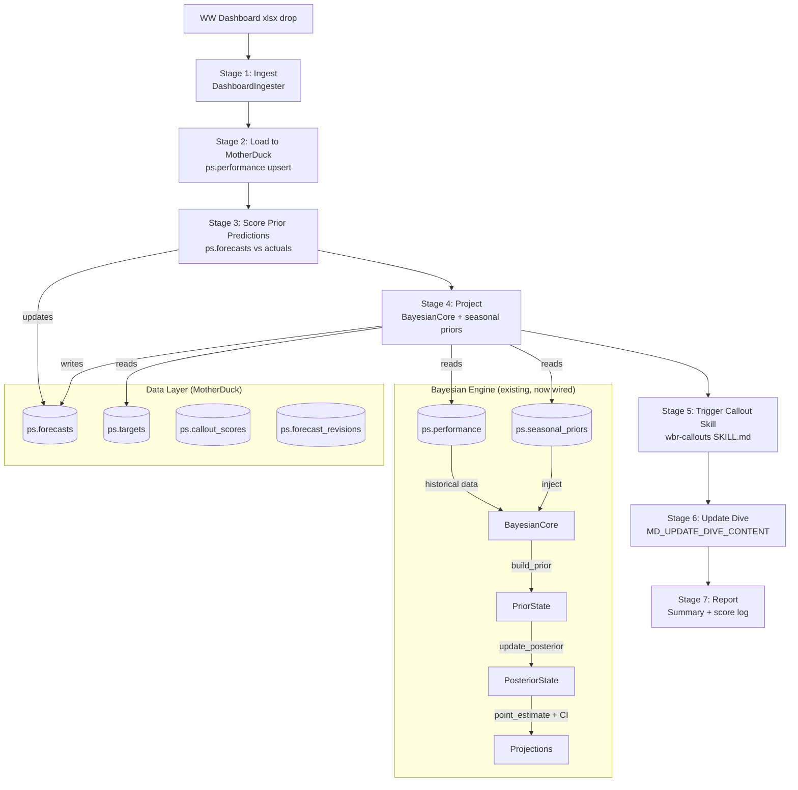
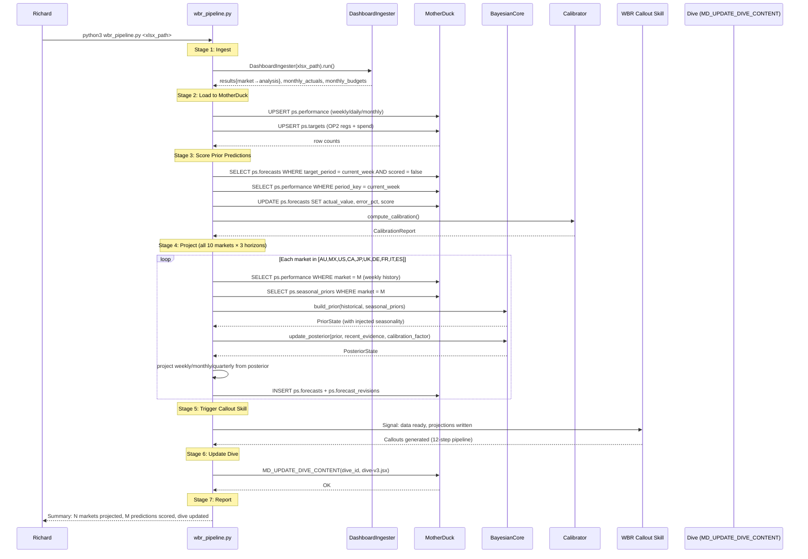
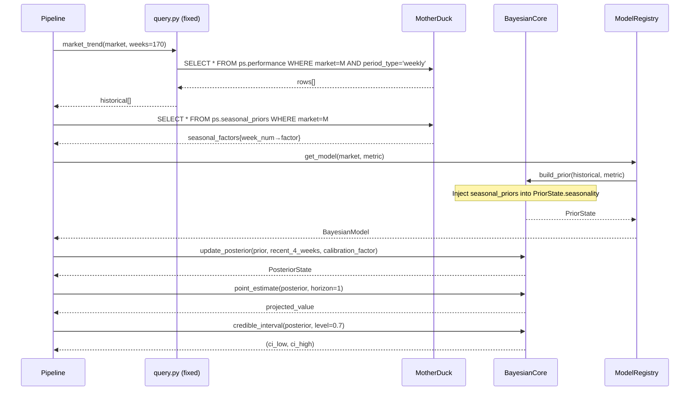

# Design Document: WBR Pipeline Consolidation

## Overview

The WBR pipeline consolidation replaces scattered ad-hoc scripts (project.py, project_full.py, inline median+IQR) with a single durable `wbr_pipeline.py` that runs end-to-end when Richard drops a WW Dashboard xlsx. The pipeline wires the existing Bayesian engine (`core.py`/`engine.py`/`calibrator.py`/`models.py`) as the sole projection engine, fixes 10 known issues (ingester schema mismatch, wrong table references in query.py, disconnected seasonal priors, missing OP2 reg targets), and produces callouts + projections + dive updates automatically.

The consolidated pipeline follows a strict 7-stage sequence: Ingest → Load → Score → Project → Callout → Dive Update → Report. Each stage is idempotent — re-running with the same xlsx produces the same result. The pipeline reads from `ps.performance` + `ps.seasonal_priors` in MotherDuck, writes projections to `ps.forecasts`, scores prior predictions, updates calibration, and pushes dive content via `MD_UPDATE_DIVE_CONTENT`.

This advances Level 5 (Agentic Orchestration) — one autonomous workflow triggered by a file drop, no hand-shaping.

## Architecture



## Sequence Diagrams

### Main Pipeline Flow (xlsx drop → report)



### Bayesian Projection Detail (per market)



## Components and Interfaces

### Component 1: WBRPipeline (new — the orchestrator)

**Purpose**: Single entry point that runs the full 7-stage pipeline end-to-end.

```python
class WBRPipeline:
    """Consolidated WBR pipeline. One file, one entry point, one run."""
    
    def __init__(self, xlsx_path: str, week_override: str = None):
        """
        Args:
            xlsx_path: Path to WW Dashboard xlsx file
            week_override: Force a specific ISO week (e.g. '2026-W15'), 
                          otherwise auto-detected from xlsx
        """
    
    def run(self) -> PipelineResult:
        """Execute all 7 stages sequentially. Idempotent."""
    
    def _stage_ingest(self) -> dict:
        """Stage 1: Run DashboardIngester, return {market→analysis}."""
    
    def _stage_load(self, results: dict) -> int:
        """Stage 2: Upsert to MotherDuck ps.performance + ps.targets. 
        Returns row count."""
    
    def _stage_score(self) -> ScoringResult:
        """Stage 3: Score prior predictions against new actuals."""
    
    def _stage_project(self, calibration_factor: float) -> list:
        """Stage 4: Run BayesianCore projections for all markets × horizons."""
    
    def _stage_callout_signal(self) -> None:
        """Stage 5: Write signal file for callout skill trigger."""
    
    def _stage_dive_update(self) -> None:
        """Stage 6: Update MotherDuck dive via MD_UPDATE_DIVE_CONTENT."""
    
    def _stage_report(self, results: PipelineResult) -> str:
        """Stage 7: Print summary, return formatted report."""
```

**Responsibilities**:
- Orchestrate all 7 stages in order
- Connect to MotherDuck once, pass connection through stages
- Handle errors per-stage without aborting the full pipeline
- Log timing and row counts for each stage
- Produce a final summary report

### Component 2: BayesianProjector (new — bridges engine to pipeline)

**Purpose**: Adapter that connects BayesianCore to MotherDuck data, injecting seasonal priors.

```python
class BayesianProjector:
    """Bridges BayesianCore to MotherDuck data with seasonal prior injection."""
    
    def __init__(self, con, calibration_factor: float = 1.0):
        """
        Args:
            con: MotherDuck DuckDB connection
            calibration_factor: From Calibrator.compute_calibration()
        """
    
    def project_market(self, market: str, target_week_num: int,
                       target_period_key: str) -> MarketProjection:
        """Full projection for one market: Brand + NB + Total, 
        with ie%CCP constraints and OP2 comparison."""
    
    def _fetch_history(self, market: str) -> list[dict]:
        """Pull from ps.performance (NOT weekly_metrics)."""
    
    def _fetch_seasonal_priors(self, market: str) -> dict:
        """Pull from ps.seasonal_priors, return {week_num→factor}."""
    
    def _inject_seasonality(self, prior: PriorState, 
                            seasonal: dict) -> PriorState:
        """Merge ps.seasonal_priors into PriorState.seasonality dict."""
    
    def _apply_ieccp_constraint(self, nb_forecast: SegmentForecast,
                                 market: str, ieccp: float) -> SegmentForecast:
        """Cap NB projections by ie%CCP bounds per market strategy."""
```

**Responsibilities**:
- Read historical data from `ps.performance` (the correct table)
- Read seasonal priors from `ps.seasonal_priors` and inject into `BayesianCore.build_prior()`
- Apply market-specific strategies (AU=efficiency, MX=ie%CCP bound, JP=brand-dominant)
- Produce `MarketProjection` dataclass compatible with existing `write_projections_to_db()`

### Component 3: query.py (fixed)

**Purpose**: Data access layer — fix table references from `weekly_metrics` → `ps.performance`.

```python
# BEFORE (broken):
def market_trend(market, weeks=8, db_path=None):
    return db(f"SELECT * FROM weekly_metrics WHERE market = '{market}' ...", db_path=db_path)

# AFTER (fixed):
def market_trend(market, weeks=8, db_path=None):
    return db(
        f"SELECT * FROM ps.performance WHERE market = '{market}' "
        f"AND period_type = 'weekly' ORDER BY period_start DESC LIMIT {int(weeks)}",
        db_path=db_path,
    )
```

### Component 4: DashboardIngester (fixed schema)

**Purpose**: Fix the projections table INSERT to match the actual schema — op2_regs columns must align.

```python
# BEFORE (schema mismatch — op2_regs silently fails):
con.execute("""
    INSERT OR REPLACE INTO projections
    (market, week, month, days_elapsed, total_days,
     projected_regs, projected_spend, projected_cpa,
     op2_regs, op2_spend, vs_op2_regs_pct, vs_op2_spend_pct, source)
    VALUES (?, ?, ?, ?, ?, ?, ?, ?, ?, ?, ?, ?, ?)
""", [...])

# AFTER (schema aligned, or write to ps.targets for OP2):
# Option: Write OP2 regs to ps.targets alongside OP2 spend
con.execute("""
    INSERT OR REPLACE INTO ps.targets
    (market, metric_name, period_key, target_value, source)
    VALUES (?, 'registrations', ?, ?, 'ww_dashboard')
""", [market, period_key, op2_regs])
```

## Data Models

### ps.performance (existing — wide table, source of truth)

```sql
-- 1511 weekly + 10572 daily + 40 monthly rows
-- This is what query.py should read from (NOT weekly_metrics)
CREATE TABLE ps.performance (
    market VARCHAR,
    period_type VARCHAR,      -- 'weekly', 'daily', 'monthly'
    period_key VARCHAR,       -- '2026-W14', '2026-04-01', '2026-M04'
    period_start DATE,
    registrations DOUBLE,
    cost DOUBLE,
    cpa DOUBLE,
    clicks BIGINT,
    impressions BIGINT,
    cpc DOUBLE,
    cvr DOUBLE,
    ctr DOUBLE,
    brand_registrations DOUBLE,
    brand_cost DOUBLE,
    brand_cpa DOUBLE,
    brand_clicks BIGINT,
    brand_cpc DOUBLE,
    brand_cvr DOUBLE,
    nb_registrations DOUBLE,
    nb_cost DOUBLE,
    nb_cpa DOUBLE,
    nb_clicks BIGINT,
    nb_cpc DOUBLE,
    nb_cvr DOUBLE,
    ieccp DOUBLE,
    source_file VARCHAR
);
```

### ps.seasonal_priors (existing — 520 rows)

```sql
-- 52 weeks × 10 markets, hierarchical Bayesian priors
CREATE TABLE ps.seasonal_priors (
    market VARCHAR,
    week_num INTEGER,         -- 1-52
    metric_name VARCHAR,      -- 'registrations', 'cost', 'cpa'
    seasonal_factor DOUBLE,   -- multiplier vs annual mean (1.0 = average)
    confidence DOUBLE,        -- weight of this prior (0-1)
    source VARCHAR,           -- 'own_data', 'ca_proxy', 'domain_knowledge', 'global_b2b'
    PRIMARY KEY (market, week_num, metric_name)
);
```

### ps.targets (existing — needs OP2 regs added)

```sql
-- Currently only has cost rows; pipeline adds registration targets
CREATE TABLE ps.targets (
    market VARCHAR,
    metric_name VARCHAR,      -- 'cost', 'registrations' (NEW)
    period_key VARCHAR,       -- 'Q2', 'M04', etc.
    target_value DOUBLE,
    source VARCHAR            -- 'op2', 'ww_dashboard'
);
```

### PipelineResult (new dataclass)

```python
@dataclass
class PipelineResult:
    """Summary of a full pipeline run."""
    week: str                          # '2026-W15'
    xlsx_path: str
    stages_completed: list[str]        # ['ingest','load','score','project',...]
    stages_failed: list[str]
    markets_processed: list[str]       # ['AU','MX','US',...]
    rows_loaded: int                   # total rows upserted to ps.performance
    predictions_scored: int            # prior predictions scored
    projections_written: int           # new forecast rows written
    calibration: CalibrationReport     # from Calibrator
    dive_updated: bool
    duration_seconds: float
    errors: list[str]                  # non-fatal errors
```

### ScoringResult (new dataclass)

```python
@dataclass
class ScoringResult:
    """Result of scoring prior predictions."""
    predictions_scored: int
    hits: int
    misses: int
    surprises: int
    mean_error_pct: float
    calibration: CalibrationReport
```


## Key Functions with Formal Specifications

### Function 1: WBRPipeline.run()

```python
def run(self) -> PipelineResult:
    """Execute all 7 stages. Idempotent — safe to re-run."""
```

**Preconditions:**
- `self.xlsx_path` exists and is a valid WW Dashboard xlsx
- MotherDuck connection is available (token in env or hardcoded)
- `ps.performance`, `ps.seasonal_priors`, `ps.forecasts`, `ps.targets` tables exist

**Postconditions:**
- `ps.performance` contains new weekly/daily/monthly rows from xlsx
- `ps.forecasts` contains new projections for all 10 markets × 3 horizons
- Prior predictions (from last week) are scored with `actual_value`, `error_pct`, `score`
- `PipelineResult.stages_completed` lists all stages that succeeded
- If a stage fails, subsequent stages still attempt (fail-forward)
- No side effects on input xlsx file

**Loop Invariants:**
- For market projection loop: all previously projected markets have valid forecasts in `ps.forecasts`
- Connection remains open throughout all stages

### Function 2: BayesianProjector.project_market()

```python
def project_market(self, market: str, target_week_num: int,
                   target_period_key: str) -> MarketProjection:
```

**Preconditions:**
- `market` is one of `['AU','MX','US','CA','JP','UK','DE','FR','IT','ES']`
- `target_week_num` is in range [1, 52]
- `ps.performance` has ≥3 weekly rows for this market
- `ps.seasonal_priors` has entries for this market (520 rows total across all markets)

**Postconditions:**
- Returns `MarketProjection` with Brand + NB + Total forecasts
- `ci_regs_low < total_regs < ci_regs_high` (point estimate within CI)
- If market has ie%CCP constraint (MX=100%, others=50-65%), NB forecast respects bound
- If OP2 target exists in `ps.targets`, `vs_op2_spend_pct` is populated
- Seasonal adjustment applied: `PriorState.seasonality[target_week_num]` reflects `ps.seasonal_priors`

**Loop Invariants:** N/A (single market, no loop)

### Function 3: BayesianProjector._inject_seasonality()

```python
def _inject_seasonality(self, prior: PriorState, 
                        seasonal: dict) -> PriorState:
```

**Preconditions:**
- `prior` is a valid PriorState from `BayesianCore.build_prior()`
- `seasonal` is `{week_num: factor}` from `ps.seasonal_priors`
- All factors are positive floats (typically 0.5–2.0)

**Postconditions:**
- Returns new PriorState with `seasonality` dict populated from `ps.seasonal_priors`
- If `prior.seasonality` already has entries (from ≥52 weeks of data), merge with weighted average: `0.7 * data_derived + 0.3 * stored_prior`
- If `prior.seasonality` is empty (< 52 weeks), use stored priors directly
- Original `prior` is not mutated

### Function 4: score_prior_predictions()

```python
def score_prior_predictions(con, current_week: str) -> ScoringResult:
```

**Preconditions:**
- `current_week` is a valid ISO week string (e.g., '2026-W15')
- `ps.performance` has actuals for `current_week`
- `ps.forecasts` has unscored predictions targeting `current_week`

**Postconditions:**
- All matching forecasts in `ps.forecasts` have `scored = true`
- `score` is 'HIT' if actual within CI, 'SURPRISE' if error > 20%, else 'MISS'
- `error_pct = abs(predicted - actual) / actual * 100`
- `ScoringResult.predictions_scored` equals count of updated rows
- `ScoringResult.calibration` reflects updated calibration from scored predictions

### Function 5: fix_query_table_refs()

```python
# In query.py — all functions that reference weekly_metrics or monthly_metrics
# must be updated to reference ps.performance with appropriate period_type filter

def market_week(market, week, db_path=None):
    """FIXED: reads ps.performance instead of weekly_metrics."""
    
def market_trend(market, weeks=8, db_path=None):
    """FIXED: reads ps.performance instead of weekly_metrics."""
    
def market_month(market, month, db_path=None):
    """FIXED: reads ps.performance instead of monthly_metrics."""
```

**Preconditions:**
- `ps.performance` table exists in MotherDuck with `period_type` column

**Postconditions:**
- `market_week()` returns data from `ps.performance WHERE period_type='weekly'`
- `market_trend()` returns data from `ps.performance WHERE period_type='weekly' ORDER BY period_start DESC`
- `market_month()` returns data from `ps.performance WHERE period_type='monthly'`
- No references to `weekly_metrics` or `monthly_metrics` remain in query.py

## Algorithmic Pseudocode

### Main Pipeline Algorithm

```python
ALGORITHM wbr_pipeline_run(xlsx_path, week_override=None)
INPUT: xlsx_path (path to WW Dashboard xlsx), optional week override
OUTPUT: PipelineResult

BEGIN
    con = connect_motherduck()
    result = PipelineResult(week=week_override or detect_week(xlsx_path))
    
    # Stage 1: Ingest
    try:
        ingester = DashboardIngester(xlsx_path)
        raw = ingester.run(target_week=result.week)
        result.stages_completed.append('ingest')
    except Exception as e:
        result.stages_failed.append('ingest')
        result.errors.append(str(e))
        return result  # Can't continue without data
    
    # Stage 2: Load to MotherDuck
    try:
        rows = load_to_motherduck(con, raw, result.week)
        result.rows_loaded = rows
        result.stages_completed.append('load')
    except Exception as e:
        result.stages_failed.append('load')
        result.errors.append(str(e))
    
    # Stage 3: Score prior predictions
    try:
        scoring = score_prior_predictions(con, result.week)
        result.predictions_scored = scoring.predictions_scored
        result.calibration = scoring.calibration
        result.stages_completed.append('score')
    except Exception as e:
        result.stages_failed.append('score')
        result.errors.append(str(e))
        result.calibration = CalibrationReport(calibration_factor=1.0)
    
    # Stage 4: Project all markets
    try:
        projector = BayesianProjector(con, result.calibration.confidence_adjustment)
        projections = []
        FOR market IN ALL_MARKETS:
            proj = projector.project_market(market, next_week_num, next_week_key)
            projections.append(proj)
        END FOR
        written = write_projections_to_db(con, projections)
        result.projections_written = written
        result.stages_completed.append('project')
    except Exception as e:
        result.stages_failed.append('project')
        result.errors.append(str(e))
    
    # Stage 5: Signal callout skill
    try:
        write_callout_signal(result.week, projections)
        result.stages_completed.append('callout_signal')
    except Exception as e:
        result.stages_failed.append('callout_signal')
    
    # Stage 6: Update dive
    try:
        con.execute(f"CALL MD_UPDATE_DIVE_CONTENT('{DIVE_ID}', $jsx)")
        result.dive_updated = True
        result.stages_completed.append('dive_update')
    except Exception as e:
        result.stages_failed.append('dive_update')
    
    # Stage 7: Report
    result.stages_completed.append('report')
    print_summary(result)
    
    con.close()
    RETURN result
END
```

### Bayesian Projection with Seasonal Prior Injection

```python
ALGORITHM project_market_bayesian(con, market, target_week_num, calibration_factor)
INPUT: MotherDuck connection, market code, target week number, calibration factor
OUTPUT: MarketProjection

BEGIN
    # 1. Fetch historical data from CORRECT table
    history = SELECT * FROM ps.performance 
              WHERE market = {market} AND period_type = 'weekly'
              ORDER BY period_start DESC LIMIT 170
    
    # 2. Fetch stored seasonal priors
    seasonal_rows = SELECT week_num, seasonal_factor 
                    FROM ps.seasonal_priors 
                    WHERE market = {market} AND metric_name = 'registrations'
    seasonal = {row.week_num: row.seasonal_factor FOR row IN seasonal_rows}
    
    # 3. Build prior via BayesianCore (existing math)
    core = BayesianCore()
    raw_prior = core.build_prior(history, 'registrations')
    
    # 4. Inject seasonal priors from ps.seasonal_priors
    IF raw_prior.seasonality is not empty:
        # Market has 52+ weeks — blend data-derived with stored
        FOR week_num IN seasonal:
            data_val = raw_prior.seasonality.get(week_num % 52, 1.0)
            raw_prior.seasonality[week_num % 52] = 0.7 * data_val + 0.3 * seasonal[week_num]
        END FOR
    ELSE:
        # Market has < 52 weeks — use stored priors directly
        raw_prior.seasonality = {(wn % 52): f FOR wn, f IN seasonal.items()}
    END IF
    
    # 5. Update posterior with recent evidence (last 4 weeks)
    recent = history[:4]
    posterior = core.update_posterior(raw_prior, recent, calibration_factor)
    
    # 6. Apply seasonal adjustment to point estimate
    seasonal_adj = posterior.seasonality.get(target_week_num % 52, 1.0)
    base_estimate = core.point_estimate(posterior, horizon=1)
    adjusted_estimate = base_estimate * seasonal_adj
    
    # 7. Compute CI (widened by seasonal uncertainty)
    ci_low, ci_high = core.credible_interval(posterior, level=0.7)
    ci_low = ci_low * seasonal_adj
    ci_high = ci_high * seasonal_adj
    
    # 8. Repeat for Brand/NB segments
    brand_proj = project_segment(history, 'brand', target_week_num, posterior)
    nb_proj = project_segment(history, 'nb', target_week_num, posterior)
    
    # 9. Apply ie%CCP constraint for NB (market-specific)
    strategy = MARKET_STRATEGY[market]
    IF strategy.ieccp_target is not None:
        nb_proj = apply_ieccp_constraint(nb_proj, market, ieccp_current, strategy)
    END IF
    
    # 10. Fetch OP2 targets for comparison
    op2_spend = SELECT target_value FROM ps.targets 
                WHERE market = {market} AND metric_name = 'cost'
    op2_regs = SELECT target_value FROM ps.targets 
               WHERE market = {market} AND metric_name = 'registrations'
    
    RETURN MarketProjection(
        market=market,
        brand=brand_proj, nb=nb_proj,
        total_regs=brand_proj.registrations + nb_proj.registrations,
        total_cost=brand_proj.cost + nb_proj.cost,
        ci_regs_low=ci_low, ci_regs_high=ci_high,
        vs_op2_spend_pct=compute_vs_op2(total_cost, op2_spend),
        method='bayesian_seasonal_brand_nb_split'
    )
END
```

### Prediction Scoring Algorithm

```python
ALGORITHM score_prior_predictions(con, current_week)
INPUT: MotherDuck connection, current ISO week string
OUTPUT: ScoringResult

BEGIN
    hits = 0; misses = 0; surprises = 0; errors = []
    
    FOR market IN ALL_MARKETS:
        # Get actuals for this week
        actuals = SELECT registrations, cost, cpa, brand_registrations, nb_registrations
                  FROM ps.performance
                  WHERE market = {market} AND period_type = 'weekly' 
                  AND period_key = {current_week}
        
        IF actuals is None:
            CONTINUE
        END IF
        
        # Get unscored forecasts targeting this week
        forecasts = SELECT * FROM ps.forecasts
                    WHERE market = {market} AND target_period = {current_week}
                    AND (scored IS NULL OR scored = false)
        
        FOR forecast IN forecasts:
            actual = actuals[forecast.metric_name]
            IF actual is None OR actual == 0:
                CONTINUE
            END IF
            
            error_pct = abs(forecast.predicted_value - actual) / actual * 100
            within_ci = forecast.ci_low <= actual <= forecast.ci_high
            
            IF within_ci:
                score = 'HIT'; hits += 1
            ELIF error_pct > 20:
                score = 'SURPRISE'; surprises += 1
            ELSE:
                score = 'MISS'; misses += 1
            END IF
            
            UPDATE ps.forecasts SET 
                actual_value = actual, error_pct = error_pct,
                scored = true, score = score
            WHERE forecast_id = forecast.id
        END FOR
    END FOR
    
    # Compute calibration from all scored predictions
    calibrator = Calibrator()
    calibration = calibrator.compute_calibration(lookback=100)
    
    RETURN ScoringResult(
        predictions_scored=hits + misses + surprises,
        hits=hits, misses=misses, surprises=surprises,
        mean_error_pct=mean(errors),
        calibration=calibration
    )
END
```

## Example Usage

```python
# Basic usage — Richard drops xlsx, runs pipeline
from wbr_pipeline import WBRPipeline

result = WBRPipeline('~/Downloads/WW_Dashboard_W15.xlsx').run()
print(f"Week {result.week}: {result.projections_written} projections, "
      f"{result.predictions_scored} scored, dive={'✓' if result.dive_updated else '✗'}")

# With week override (re-running for a past week)
result = WBRPipeline('~/data/WW_Dashboard_W14.xlsx', week_override='2026-W14').run()

# CLI usage (the primary interface)
# python3 ~/shared/tools/prediction/wbr_pipeline.py ~/Downloads/WW_Dashboard_W15.xlsx
# python3 ~/shared/tools/prediction/wbr_pipeline.py ~/Downloads/WW_Dashboard_W15.xlsx --week 2026-W15
```

## Correctness Properties

*A property is a characteristic or behavior that should hold true across all valid executions of a system — essentially, a formal statement about what the system should do. Properties serve as the bridge between human-readable specifications and machine-verifiable correctness guarantees.*

### Property 1: Pipeline fail-forward resilience

*For any* non-critical stage (Score, Callout Signal, Dive Update, Report) that throws an exception, the Pipeline SHALL still execute all subsequent stages and include the failed stage in `stages_failed` while subsequent stages appear in `stages_completed`.

**Validates: Requirement 1.3**

### Property 2: Pipeline idempotency

*For any* valid xlsx input, running the Pipeline twice with the same file and week_override SHALL produce identical row sets in `ps.performance`, `ps.forecasts`, and `ps.targets` after both runs (upsert semantics ensure no duplicates or state drift).

**Validates: Requirement 1.5**

### Property 3: Period type round-trip correctness

*For any* set of parsed rows from the DashboardIngester (daily, weekly, or monthly), after upserting to `ps.performance`, querying back with the corresponding `period_type` filter SHALL return all and only the rows of that type, with data values matching the original parsed values.

**Validates: Requirements 2.2, 2.3, 2.4**

### Property 4: OP2 target completeness

*For any* market where the DashboardIngester extracts OP2 data (either cost or registrations), after Stage 2 (Load), `ps.targets` SHALL contain both a `cost` row and a `registrations` row for that market.

**Validates: Requirement 2.5**

### Property 5: Seasonal prior injection correctness

*For any* market and valid PriorState, if the market has fewer than 52 weeks of historical data, `_inject_seasonality()` SHALL populate `PriorState.seasonality` directly from `ps.seasonal_priors` factors. If the market has 52 or more weeks, the resulting seasonality for each week SHALL equal `0.7 × data_derived + 0.3 × stored_prior` (within floating-point tolerance).

**Validates: Requirements 4.2, 4.3**

### Property 6: Seasonal injection immutability

*For any* PriorState and seasonal factor dict, calling `_inject_seasonality(prior, seasonal)` SHALL return a new PriorState and the original `prior` object's `seasonality`, `mean`, `variance`, and all other fields SHALL remain unchanged.

**Validates: Requirement 4.4**

### Property 7: Seasonal factor positivity invariant

*For any* set of seasonal factors from `ps.seasonal_priors` and any PriorState, all values in the resulting `PriorState.seasonality` dict after `_inject_seasonality()` SHALL be positive floats (> 0.0).

**Validates: Requirement 4.6**

### Property 8: Point estimate within credible interval

*For any* valid PosteriorState produced by `BayesianCore.update_posterior()`, the value returned by `point_estimate(posterior, horizon=1)` SHALL fall within the bounds returned by `credible_interval(posterior, level=0.7)`.

**Validates: Requirement 5.4**

### Property 9: ie%CCP constraint enforcement

*For any* NB registration projection and market with a defined ie%CCP constraint, after applying `_apply_ieccp_constraint()`, the resulting NB registration value SHALL not exceed the bound defined by the market's ie%CCP target.

**Validates: Requirement 5.5**

### Property 10: Scoring classification exhaustiveness and exclusivity

*For any* forecast-actual pair where `actual_value > 0`, exactly one of HIT, MISS, or SURPRISE SHALL be assigned: HIT when `ci_low ≤ actual ≤ ci_high`, SURPRISE when `error_pct > 20`, and MISS otherwise. The computed `error_pct` SHALL equal `abs(predicted - actual) / actual × 100` within floating-point tolerance.

**Validates: Requirements 6.2, 6.3, 6.4, 6.5**

### Property 11: Scoring closure

*For any* set of unscored forecasts in `ps.forecasts` targeting the current week, after `_stage_score()` completes, all forecasts with matching actuals in `ps.performance` SHALL have `scored = true`. No forecast with a matching actual SHALL remain unscored.

**Validates: Requirement 6.6**

### Property 12: New forecasts written unscored

*For any* set of MarketProjections written to `ps.forecasts` during Stage 4 (Project), all newly inserted rows SHALL have `scored = false`.

**Validates: Requirement 5.7**

## Error Handling

### Error Scenario 1: xlsx file not found or corrupt

**Condition**: `xlsx_path` doesn't exist or openpyxl can't parse it
**Response**: Pipeline aborts at Stage 1 with clear error message
**Recovery**: Richard provides correct path; pipeline re-runs from scratch

### Error Scenario 2: MotherDuck connection failure

**Condition**: Token expired, network issue, or MotherDuck service down
**Response**: Pipeline aborts at Stage 2 with connection error
**Recovery**: Refresh token, retry. Ingester output (Stage 1) is cached locally — no need to re-parse xlsx

### Error Scenario 3: Missing seasonal priors for a market

**Condition**: `ps.seasonal_priors` has no rows for a market
**Response**: `_inject_seasonality()` returns prior unchanged (flat seasonality)
**Recovery**: Non-fatal — projections still work, just without seasonal adjustment. Log warning.

### Error Scenario 4: No actuals for scoring (data lag)

**Condition**: `ps.performance` doesn't have the current week's actuals yet
**Response**: `_stage_score()` scores 0 predictions, returns empty ScoringResult
**Recovery**: Non-fatal — scoring happens next week when actuals arrive

### Error Scenario 5: Dive update fails

**Condition**: `MD_UPDATE_DIVE_CONTENT` SQL function fails
**Response**: `result.dive_updated = False`, error logged
**Recovery**: Non-fatal — dive can be updated manually. All other stages unaffected.

### Error Scenario 6: Single market projection failure

**Condition**: One market has insufficient data or anomalous values
**Response**: That market is skipped, error logged, other 9 markets proceed
**Recovery**: Non-fatal — partial results are better than no results

## Testing Strategy

### Unit Testing Approach

- Test `BayesianProjector._inject_seasonality()` with known priors and seasonal factors
- Test `score_prior_predictions()` with mock forecasts and actuals (HIT/MISS/SURPRISE cases)
- Test query.py fixes: verify SQL strings reference `ps.performance` not `weekly_metrics`
- Test `PipelineResult` aggregation: stages_completed/failed tracking
- Test ie%CCP constraint application per market strategy

### Property-Based Testing Approach

**Property Test Library**: hypothesis (Python)

- **Property 1 (Fail-forward)**: Inject random stage failures, verify subsequent stages still run
- **Property 2 (Idempotency)**: Run pipeline twice with same input, verify identical DB state
- **Property 3 (Period type round-trip)**: Generate random rows, upsert, query back by period_type
- **Property 5 (Seasonal injection)**: Generate random histories of varying length + seasonal priors, verify blending formula
- **Property 6 (Immutability)**: Generate random PriorState + seasonal dict, verify original unchanged
- **Property 7 (Positivity)**: Generate random seasonal factors, verify all results > 0
- **Property 8 (CI containment)**: Generate random posteriors, verify point_estimate within credible_interval(0.7)
- **Property 10 (Scoring classification)**: Generate random forecast+actual pairs, verify exactly one of HIT/MISS/SURPRISE
- **Property 11 (Scoring closure)**: Generate random unscored forecasts + actuals, verify all scored after stage

### Integration Testing Approach

- End-to-end test with a sample xlsx: verify all 7 stages complete
- Verify MotherDuck tables have expected row counts after pipeline run
- Verify dive component renders with new data (manual check)
- Verify callout signal file is written with correct week and market list

## Performance Considerations

- MotherDuck connection opened once, reused across all 7 stages (not per-market)
- Seasonal priors fetched once per market (10 queries), not per-metric
- Batch INSERT for projections where possible (reduce round-trips)
- Pipeline should complete in < 60 seconds for 10 markets (ingester is the bottleneck at ~30s for xlsx parsing)

## Security Considerations

- MotherDuck token stored in environment variable `MOTHERDUCK_TOKEN`, not hardcoded in pipeline
- xlsx files are read-only — pipeline never modifies the input
- No PII in pipeline data (market-level aggregates only)

## Dependencies

- **Existing**: `shared/tools/prediction/core.py` (BayesianCore), `engine.py`, `calibrator.py`, `models.py`, `ptypes.py`
- **Existing**: `shared/tools/dashboard-ingester/ingest.py` (DashboardIngester)
- **Existing**: `shared/tools/data/query.py` (data access layer — needs fixes)
- **Existing**: `shared/tools/dashboard-ingester/dive-v3.jsx` (dive component)
- **External**: `duckdb` (Python package), `openpyxl` (xlsx parsing), `pytz`
- **Infrastructure**: MotherDuck (ps_analytics database), Dive ID `68b308c1-97be-4c72-81ae-517318500de9`

## Known Issues Addressed

| # | Issue | Fix Location | Fix Description |
|---|-------|-------------|-----------------|
| 1 | Ingester schema mismatch — op2_regs not persisting | `ingest.py._write_to_duckdb()` | Align INSERT columns with table schema; write OP2 regs to `ps.targets` |
| 2 | Missing reg targets — OP2 regs not in ps.targets | `wbr_pipeline.py._stage_load()` | Extract OP2 regs from ingester output, INSERT into `ps.targets` |
| 3 | Stale wiki guide — wrong output path | Wiki file (out of scope) | Document correct paths in pipeline README |
| 4 | Circular callout-principles.md reference | `references/` directory | Remove circular ref, ensure single source |
| 5 | Old steering file examples | Steering file (out of scope) | Update examples post-pipeline |
| 6 | 8 markets' W14 callouts never reviewed | Callout skill (out of scope) | Pipeline ensures ALL markets get callouts |
| 7 | Bayesian engine never called | `wbr_pipeline.py` + `BayesianProjector` | Wire BayesianCore as sole projection engine |
| 8 | query.py reads wrong tables | `query.py` | Replace `weekly_metrics` → `ps.performance`, `monthly_metrics` → `ps.performance` |
| 9 | Seasonal priors disconnected | `BayesianProjector._inject_seasonality()` | Read `ps.seasonal_priors`, inject into `PriorState.seasonality` |
| 10 | wbr-pipeline.sh references project.py | `wbr_pipeline.py` | New consolidated script replaces both pipeline.sh and project.py |
