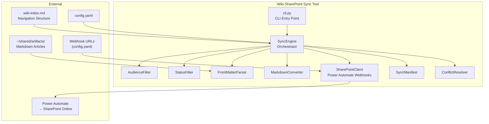
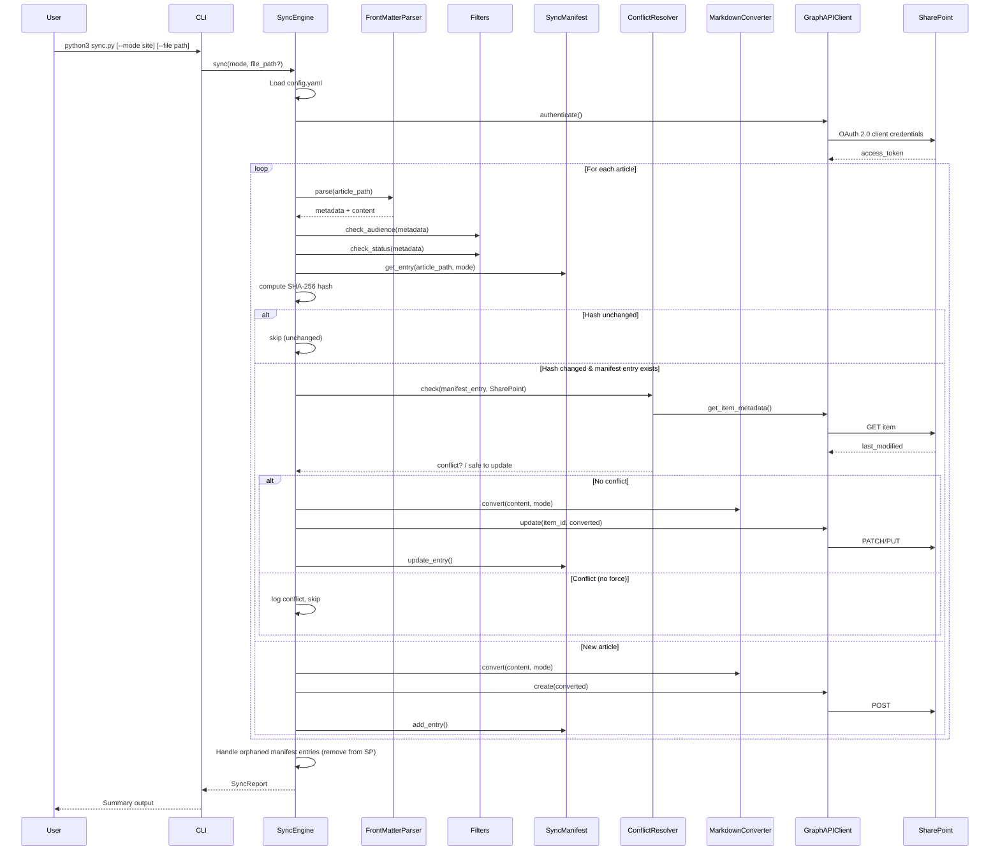

# Design Document: Wiki-SharePoint Sync

## Overview

The Wiki-SharePoint Sync tool pushes eligible wiki articles from `~/shared/artifacts/` to a corporate SharePoint environment via Power Automate HTTP webhooks. It supports two upload modes — site pages (browsable SharePoint site with navigation) and directory (.docx files in a document library) — with incremental sync, conflict detection, and audience/status filtering.

The tool follows the same architectural pattern as `bridge.py`: a single-module Python tool with a class-based API, importable for programmatic use and callable via CLI. It lives at `~/shared/tools/sharepoint-sync/` and integrates with the wiki pipeline's librarian step for automated publishing.

### Design Decisions

1. **Single-module core + CLI entry point**: `sync.py` contains the `SyncEngine` class (importable), `cli.py` provides the CLI wrapper. Mirrors the bridge.py pattern.
2. **Power Automate webhooks via `requests`**: No Azure AD app registration or Graph API credentials needed. Two Power Automate flows accept HTTP POST requests — one for site page operations, one for document library operations. Each flow handles create/update/delete/get-metadata actions. The webhook URLs are stored in config.yaml. This eliminates all OAuth complexity and works within corporate M365 licensing.
3. **`python-frontmatter`** for YAML front-matter parsing: Battle-tested library that handles the `---` delimited YAML block. Round-trip integrity is a core requirement.
4. **`python-docx`** for .docx generation in Directory Mode: Standard library for creating Word documents from markdown content.
5. **`markdown` + custom filters for HTML conversion** in Site Mode: Convert markdown to SharePoint-compatible HTML for site pages.
6. **JSON sync manifest**: Simple, human-readable, git-friendly. Stored at a configurable path (default: `~/shared/tools/sharepoint-sync/.sync-manifest.json`).
7. **YAML config file**: Consistent with the wiki ecosystem's use of YAML front-matter. Stored at `~/shared/tools/sharepoint-sync/config.yaml`.
8. **Webhook client replaces GraphAPIClient**: The `SharePointClient` class wraps HTTP POST calls to Power Automate webhook URLs. Each request sends a JSON payload with action, metadata, and content (HTML or base64-encoded .docx). The Power Automate flow handles the SharePoint operations server-side. Retry logic (429/503) still applies to the webhook calls.

## Architecture



### Sync Flow



## Components and Interfaces

### SyncEngine (Orchestrator)

The central class that coordinates the entire sync process.

```python
class SyncEngine:
    def __init__(self, config_path: str = None):
        """Load config, initialize components."""

    def sync(self, mode: str = None, file_path: str = None,
             force: bool = False) -> SyncReport:
        """
        Run sync. 
        - mode: 'site', 'directory', or 'both' (overrides config)
        - file_path: sync single article (optional)
        - force: overwrite conflicts
        Returns SyncReport with per-article actions.
        """

    def _discover_articles(self, file_path: str = None) -> list[Path]:
        """Walk ~/shared/artifacts/ or return single file."""

    def _process_article(self, path: Path, mode: str, 
                         force: bool) -> ArticleAction:
        """Filter, hash-check, conflict-check, convert, upload one article."""

    def _handle_orphans(self, mode: str) -> list[ArticleAction]:
        """Remove SP items for manifest entries with no eligible article."""
```

### FrontMatterParser / FrontMatterPrinter

```python
class FrontMatterParser:
    def parse(self, file_path: str) -> tuple[dict, str]:
        """
        Parse article file. Returns (metadata_dict, markdown_body).
        Raises FrontMatterError on malformed/missing front-matter.
        """

class FrontMatterPrinter:
    def print(self, metadata: dict) -> str:
        """Serialize metadata dict back to YAML front-matter string (with --- delimiters)."""
```

Uses `python-frontmatter` under the hood. The round-trip property (parse → print → parse = identity) is a core correctness requirement.

### AudienceFilter / StatusFilter

```python
class AudienceFilter:
    ELIGIBLE = {'amazon-internal'}

    def is_eligible(self, metadata: dict) -> tuple[bool, str]:
        """Returns (eligible, reason). Logs warning if audience field missing."""

class StatusFilter:
    def __init__(self, eligible_statuses: list[str] = None):
        """Default: ['REVIEW', 'FINAL']. Configurable."""

    def is_eligible(self, metadata: dict) -> tuple[bool, str]:
        """Returns (eligible, reason)."""
```

### MarkdownConverter

```python
class MarkdownConverter:
    def to_html(self, markdown_body: str) -> str:
        """Convert markdown to SharePoint-compatible HTML for site pages."""

    def to_docx(self, markdown_body: str, metadata: dict) -> bytes:
        """Convert markdown to .docx bytes. Includes title from metadata."""
```

### SharePointClient (Power Automate Webhooks)

```python
class SharePointClient:
    def __init__(self, site_webhook_url: str, directory_webhook_url: str):
        """Initialize with Power Automate webhook URLs for each mode."""

    # Site Mode operations (POST to site_webhook_url)
    def create_site_page(self, title: str, html: str, category: str,
                         properties: dict) -> dict:
        """Create a SharePoint site page via webhook. Returns {item_id, url, lastModifiedDateTime}."""

    def update_site_page(self, item_id: str, title: str, html: str,
                         properties: dict) -> dict:
        """Update existing site page via webhook."""

    def delete_site_page(self, item_id: str) -> None:
        """Delete a site page via webhook."""

    def get_site_page_metadata(self, item_id: str) -> dict:
        """Get page metadata including lastModifiedDateTime via webhook."""

    # Directory Mode operations (POST to directory_webhook_url)
    def upload_file(self, folder_path: str, filename: str,
                    content_base64: str, properties: dict) -> dict:
        """Upload/replace a .docx file via webhook. Returns {item_id, url, lastModifiedDateTime}."""

    def delete_file(self, item_id: str) -> None:
        """Delete a file via webhook."""

    def get_file_metadata(self, item_id: str) -> dict:
        """Get file metadata including lastModifiedDateTime via webhook."""

    def ensure_folder(self, folder_path: str) -> None:
        """Create folder if it doesn't exist via webhook."""

    # Shared
    def _post(self, webhook_url: str, payload: dict) -> dict:
        """POST JSON to webhook with retry logic (429/503)."""
```

Each webhook call sends a JSON payload:
```json
{
    "action": "create|update|delete|get_metadata|ensure_folder",
    "item_id": "...",
    "title": "...",
    "category": "testing",
    "folder_path": "testing/",
    "filename": "ai-max-test-design.docx",
    "content": "<html>...</html> or base64-encoded .docx",
    "content_type": "html|docx_base64",
    "properties": {"status": "REVIEW", "owner": "...", ...}
}
```

The Power Automate flow receives this, routes by action, and performs the SharePoint operation using the flow's connection (which runs under the flow creator's permissions — no separate app registration needed).

### SyncManifest

```python
class SyncManifest:
    def __init__(self, manifest_path: str):
        """Load or create manifest JSON file."""

    def get_entry(self, file_path: str, mode: str) -> dict | None:
        """Look up manifest entry by file path and mode."""

    def add_entry(self, file_path: str, mode: str, content_hash: str,
                  sp_item_id: str, sp_url: str) -> None:
        """Add new entry after successful upload."""

    def update_entry(self, file_path: str, mode: str, content_hash: str,
                     synced_at: str) -> None:
        """Update entry after successful update."""

    def remove_entry(self, file_path: str, mode: str) -> None:
        """Remove entry after deletion from SharePoint."""

    def all_entries(self, mode: str = None) -> list[dict]:
        """List all entries, optionally filtered by mode."""

    def save(self) -> None:
        """Persist manifest to disk."""
```

### ConflictResolver

```python
class ConflictResolver:
    def check(self, manifest_entry: dict, sp_metadata: dict,
              local_changed: bool) -> ConflictResult:
        """
        Compare SP last-modified vs manifest last-synced.
        Returns ConflictResult with is_conflict flag and details.
        Only flags conflict when BOTH sides changed since last sync.
        """
```

### SyncReport

```python
@dataclass
class SyncReport:
    created: list[ArticleAction]
    updated: list[ArticleAction]
    skipped_unchanged: list[ArticleAction]
    skipped_filtered: list[ArticleAction]
    conflicted: list[ArticleAction]
    removed: list[ArticleAction]
    failed: list[ArticleAction]

    @property
    def has_failures(self) -> bool: ...

    def summary(self) -> str:
        """Human-readable summary with counts and per-article details."""

@dataclass
class ArticleAction:
    file_path: str
    action: str  # created, updated, skipped, conflicted, removed, failed
    mode: str  # site, directory
    sp_url: str | None = None
    error: str | None = None
```


## Data Models

### Config File (`config.yaml`)

```yaml
# ~/shared/tools/sharepoint-sync/config.yaml
sharepoint:
  site_webhook_url: "${SP_SITE_WEBHOOK_URL}"           # Power Automate webhook for site page operations
  directory_webhook_url: "${SP_DIRECTORY_WEBHOOK_URL}"  # Power Automate webhook for document library operations
  site_url: "https://[tenant].sharepoint.com/sites/[site-name]"  # for display/reporting only

sync:
  mode: "both"                         # site | directory | both
  eligible_statuses:
    - REVIEW
    - FINAL
  articles_path: "~/shared/artifacts/"
  wiki_index_path: "~/shared/context/wiki/wiki-index.md"
  manifest_path: "~/shared/tools/sharepoint-sync/.sync-manifest.json"

# Webhook URLs can also be loaded from env vars:
# SP_SITE_WEBHOOK_URL, SP_DIRECTORY_WEBHOOK_URL
```

### Sync Manifest (`.sync-manifest.json`)

```json
{
  "version": 1,
  "last_sync": "2026-03-27T10:30:00Z",
  "entries": [
    {
      "file_path": "testing/2026-03-25-ai-max-test-design.md",
      "mode": "site",
      "content_hash": "sha256:a1b2c3d4...",
      "sp_item_id": "abc-123-def",
      "sp_url": "https://[tenant].sharepoint.com/sites/.../SitePages/ai-max-test-design.aspx",
      "synced_at": "2026-03-27T10:30:00Z"
    },
    {
      "file_path": "testing/2026-03-25-ai-max-test-design.md",
      "mode": "directory",
      "content_hash": "sha256:a1b2c3d4...",
      "sp_item_id": "xyz-789-ghi",
      "sp_url": "https://[tenant].sharepoint.com/sites/.../Shared Documents/testing/ai-max-test-design.docx",
      "synced_at": "2026-03-27T10:30:00Z"
    }
  ]
}
```

### Article Metadata (parsed from front-matter)

```python
@dataclass
class ArticleMetadata:
    title: str
    status: str           # DRAFT, REVIEW, FINAL
    audience: str         # amazon-internal, personal, agent-only
    level: str | int      # 1-5 or N/A
    owner: str
    created: str          # YYYY-MM-DD
    updated: str          # YYYY-MM-DD
    update_trigger: str
    slug: str | None = None  # from wiki-index, used for SP page naming
    tags: list[str] | None = None
```

### Front-Matter ↔ SharePoint Property Mapping

| Front-Matter Field | Site Mode (Page Property) | Directory Mode (Library Column) |
|---|---|---|
| title | Page title | Title column |
| status | Custom "Status" property | Status column |
| owner | Custom "Owner" property | Owner column |
| updated | Custom "LastUpdated" property | LastUpdated column |
| level | Custom "Level" property | Level column |
| tags | Custom "Tags" property | Tags column |
| audience | Not mapped (always amazon-internal) | Not mapped |
| slug | Used for page URL slug | Used for filename |

### File Structure

```
~/shared/tools/sharepoint-sync/
├── sync.py              # SyncEngine class (importable)
├── cli.py               # CLI entry point
├── config.yaml          # Configuration (webhook URLs, mode, filters)
├── .sync-manifest.json  # Sync state (gitignored)
├── models.py            # Dataclasses (ArticleMetadata, SyncReport, etc.)
├── filters.py           # AudienceFilter, StatusFilter
├── frontmatter_io.py    # FrontMatterParser, FrontMatterPrinter
├── converter.py         # MarkdownConverter (HTML + docx)
├── sp_client.py         # SharePointClient (Power Automate webhooks)
├── manifest.py          # SyncManifest
├── conflict.py          # ConflictResolver
└── requirements.txt     # Dependencies
```

### Dependencies (`requirements.txt`)

```
requests>=2.31.0
python-frontmatter>=1.1.0
python-docx>=1.1.0
markdown>=3.5.0
pyyaml>=6.0.1
```

Note: `msal` is no longer needed — Power Automate webhooks require no OAuth client library.


## Correctness Properties

*A property is a characteristic or behavior that should hold true across all valid executions of a system — essentially, a formal statement about what the system should do. Properties serve as the bridge between human-readable specifications and machine-verifiable correctness guarantees.*

### Property 1: Audience filter eligibility is determined solely by audience field value

*For any* article metadata with an audience field, the AudienceFilter returns eligible=True if and only if the audience value is "amazon-internal". All other values ("personal", "agent-only", or any unknown string) return eligible=False. Missing audience field returns eligible=False with a warning.

**Validates: Requirements 1.1, 1.2, 1.3, 1.4**

### Property 2: Status filter eligibility is determined by membership in the eligible statuses list

*For any* article metadata and any configured list of eligible statuses, the StatusFilter returns eligible=True if and only if the article's status value is contained in the eligible statuses list (case-insensitive comparison).

**Validates: Requirements 2.2, 2.3, 2.5**

### Property 3: Front-matter round-trip integrity

*For any* valid metadata dictionary, serializing it with FrontMatterPrinter and then parsing the result with FrontMatterParser produces a metadata dictionary equivalent to the original.

**Validates: Requirements 3.1, 3.3, 3.4**

### Property 4: Malformed front-matter produces descriptive errors

*For any* string that is not valid YAML front-matter (missing delimiters, invalid YAML syntax, empty content), the FrontMatterParser raises a FrontMatterError containing the file path and a description of the parsing failure.

**Validates: Requirements 3.2**

### Property 5: Hash-based sync decision tree

*For any* eligible article and sync manifest state, the sync action is determined by: (a) if the article has no manifest entry → action is "created"; (b) if the article's SHA-256 content hash matches the manifest entry → action is "skipped"; (c) if the hash differs and no conflict exists → action is "updated" and the manifest entry is updated.

**Validates: Requirements 6.2, 6.3, 6.4, 6.5**

### Property 6: Orphaned manifest entries are removed

*For any* sync manifest entry whose file path does not correspond to a currently eligible article (deleted, audience changed, status changed), the sync engine removes the item from SharePoint and removes the manifest entry.

**Validates: Requirements 1.5, 2.4, 6.6**

### Property 7: Conflict detection when both sides changed

*For any* article that exists in the manifest and on SharePoint, if the SharePoint item's lastModifiedDateTime is after the manifest's synced_at AND the local article's content hash differs from the manifest, the ConflictResolver flags it as a conflict. If only one side changed (local only or SharePoint only), no conflict is flagged.

**Validates: Requirements 7.1, 7.2, 7.3**

### Property 8: Force-overwrite bypasses conflict detection

*For any* article flagged as a conflict, when force=True is provided, the sync engine overwrites the SharePoint content and the action is "updated" rather than "conflicted".

**Validates: Requirements 7.5**

### Property 9: Error resilience — failures and conflicts do not halt processing

*For any* set of articles where some encounter upload failures or conflicts, all remaining articles in the set are still processed. The total number of actions in the SyncReport equals the total number of articles evaluated.

**Validates: Requirements 7.4, 9.3**

### Property 10: Sync report completeness

*For any* sync run, the SyncReport contains counts for all action categories (created, updated, skipped_unchanged, skipped_filtered, conflicted, removed, failed) and a per-article action list. The sum of all category counts equals the total number of articles plus orphaned manifest entries evaluated.

**Validates: Requirements 9.1, 9.2, 9.4**

### Property 11: Metadata-to-SharePoint field mapping preserves all required fields

*For any* article metadata, the property mapper produces a SharePoint fields dictionary that contains entries for title, status, owner, updated, and level. No required field is omitted.

**Validates: Requirements 4.5, 5.4**

### Property 12: Dual-mode produces independent manifest entries per mode

*For any* article synced with mode="both", the sync manifest contains two separate entries for that article — one with mode="site" and one with mode="directory" — each with independent content hashes, SharePoint item IDs, and synced_at timestamps.

**Validates: Requirements 10.2, 10.3**

### Property 13: Single-file sync applies the same filters as full sync

*For any* single article file path passed to the sync engine, the audience and status filters are applied before syncing. If the article does not pass filters, it is excluded (action is "skipped_filtered") even in single-file mode.

**Validates: Requirements 12.2, 12.3**

### Property 14: CLI arguments override config file values

*For any* configuration field that is set in both the config file and as a CLI argument, the CLI argument value takes precedence over the config file value.

**Validates: Requirements 11.4**

### Property 15: Invalid configuration produces descriptive errors

*For any* config file that is missing, contains invalid YAML, or is missing required fields, the SyncEngine raises a ConfigError with a message identifying the specific problem.

**Validates: Requirements 11.3**

## Error Handling

### Error Categories

| Error Type | Handling | Exit Behavior |
|---|---|---|
| **ConfigError** | Missing/invalid config file or fields | Fail fast, exit code 1, descriptive message |
| **AuthError** | Webhook URL missing or invalid | Fail fast, exit code 1, descriptive message |
| **FrontMatterError** | Malformed YAML in article | Log error with file path, skip article, continue |
| **GraphAPIError** | Power Automate webhook failure (HTTP errors, network) | Log error with file path + HTTP details, skip article, continue |
| **ConflictError** | Both local and SP modified since last sync | Log conflict details, skip article, continue |
| **ConversionError** | Markdown → HTML/docx conversion failure | Log error with file path, skip article, continue |

### Error Handling Principles

1. **Fail fast on infrastructure errors**: Config and webhook-URL-missing errors stop the entire run immediately — there's no point processing articles if the foundation is broken.
2. **Continue on per-article errors**: Front-matter parsing, conversion, upload, and conflict errors are logged and the article is skipped, but processing continues for remaining articles.
3. **Structured error reporting**: All errors include the article file path, error type, and actionable detail (HTTP status codes, field names, timestamps).
4. **Non-zero exit code on any failure**: If any article fails during sync, the CLI returns exit code 1 so that calling scripts/hooks can detect partial failures.

### Retry Strategy

- **HTTP 429 (rate limit)**: Wait for the duration in the `Retry-After` header, retry up to 3 times. If all retries fail, mark article as failed.
- **HTTP 503 (service unavailable)**: Exponential backoff (1s, 2s, 4s), retry up to 3 times. If all retries fail, mark article as failed.
- **All other errors**: No retry. Log and skip.
- **Power Automate timeouts**: Webhook calls have a 30-second timeout per request. If the flow takes longer, the request is retried once.

## Testing Strategy

### Property-Based Testing

Library: **Hypothesis** (Python) — already present in the environment (`.hypothesis/` directory exists).

Each correctness property from the design document maps to a single Hypothesis property test. Tests run with a minimum of 100 examples per property.

Tag format for each test: `# Feature: wiki-sharepoint-sync, Property {N}: {title}`

Property tests focus on:
- Filter logic (Properties 1, 2): Generate random metadata dicts with various audience/status values
- Front-matter round-trip (Property 3): Generate random metadata dicts, serialize, parse, compare
- Sync decision tree (Properties 5, 6): Generate random manifest states and article states, verify correct action
- Conflict detection (Properties 7, 8): Generate random timestamp combinations, verify conflict/no-conflict
- Report completeness (Properties 9, 10): Generate random article sets with mixed outcomes, verify report invariants
- Metadata mapping (Property 11): Generate random metadata, verify all required fields present in output
- Dual-mode manifest (Property 12): Generate random articles, verify two entries per article
- Single-file filtering (Property 13): Generate random single articles, verify filters applied
- Config override (Property 14): Generate random config + CLI args, verify precedence
- Config validation (Property 15): Generate random invalid configs, verify errors

### Unit Testing

Unit tests complement property tests for specific examples and edge cases:
- Navigation structure matches the 7 known category folders (Req 4.3)
- Parent/child relationships from wiki-index.md are preserved (Req 4.4)
- SharePoint site-not-found returns error with URL and permissions (Req 4.6)
- Folder creation before upload in directory mode (Req 5.5)
- Auth reads from env vars, then falls back to credentials file (Req 8.2)
- Auth failure includes HTTP status code (Req 8.3)
- Default config path is `~/shared/tools/sharepoint-sync/config.yaml` (Req 11.1)
- Config supports all required fields (Req 11.2)
- Module is importable: `from sync import SyncEngine` (Req 12.1)
- CLI entry point works: `python3 sync.py --help` (Req 12.4)
- Non-zero exit code on failure (Req 9.4)

### Integration Testing

Integration tests use mocked Graph API responses (via `unittest.mock` or `responses` library):
- Full sync flow: discover → filter → hash → convert → upload → manifest update
- Site mode: article → HTML → site page creation
- Directory mode: article → .docx → file upload with folder creation
- Both mode: single article produces both site page and .docx
- Conflict detection + force-overwrite flow
- Orphan cleanup flow

### Test File Structure

```
~/shared/tools/sharepoint-sync/
├── tests/
│   ├── test_filters.py          # Property tests for audience/status filters
│   ├── test_frontmatter.py      # Property tests for round-trip, error handling
│   ├── test_sync_decisions.py   # Property tests for hash-based sync logic
│   ├── test_conflict.py         # Property tests for conflict detection
│   ├── test_report.py           # Property tests for sync report
│   ├── test_metadata_mapping.py # Property tests for SP field mapping
│   ├── test_manifest.py         # Property tests for dual-mode manifest
│   ├── test_config.py           # Property tests for config loading/override
│   ├── test_converter.py        # Unit tests for markdown conversion
│   ├── test_graph_client.py     # Unit tests for auth, mocked API calls
│   └── test_integration.py      # Integration tests with mocked Graph API
```
