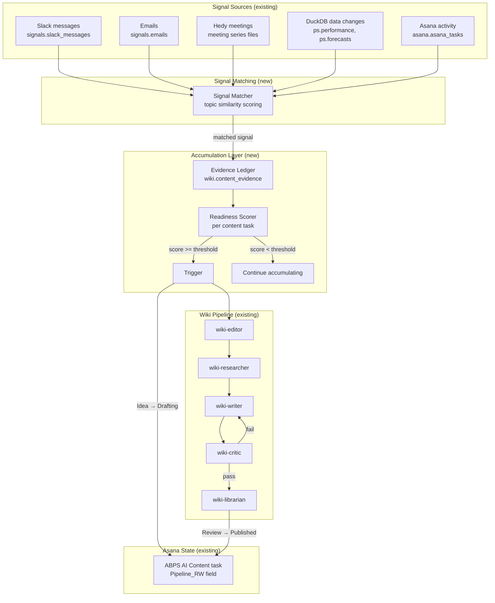
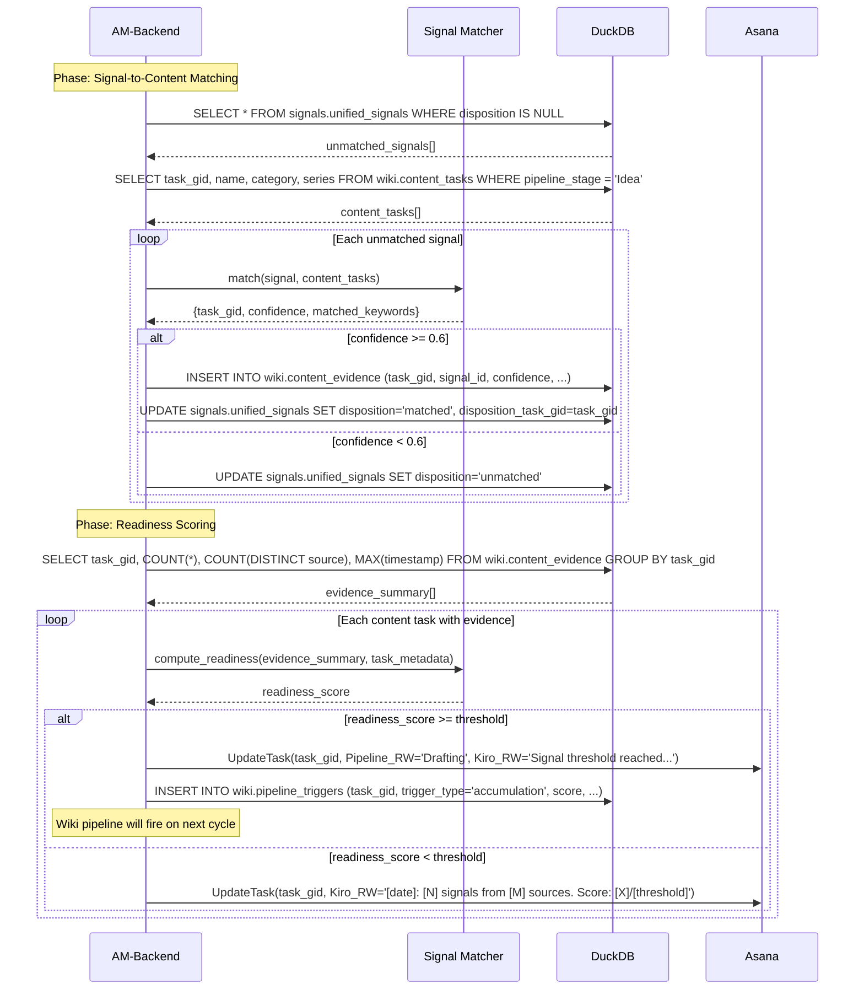
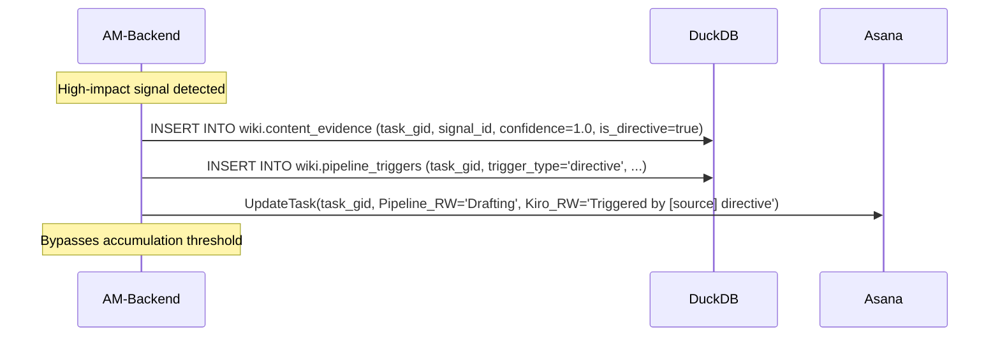

# Design Document: Wiki Signal Accumulation Pipeline

## Overview

Replace the manual "Richard says go" wiki pipeline trigger with a signal-accumulation model. Content tasks in ABPS AI Content passively collect context from daily signals (Slack, email, meetings, DuckDB data, Asana activity) until signal density crosses a threshold — then the wiki pipeline fires automatically.

The system has two modes:
1. **Accumulation mode** — signals match to content tasks by topic, get logged as evidence. No writing happens.
2. **Trigger mode** — when a task's accumulated evidence crosses the readiness threshold, Pipeline_RW advances from Idea → Drafting and the wiki-editor kicks off the research → write → review chain.

A third path exists for high-impact signals: a single directive from Brandon or Kate, or a deadline-driven event, can bypass accumulation and trigger immediately.

This advances Level 5 (Agentic Orchestration) — content creation driven by signal density, not human prompting.

## Architecture



## Sequence Diagram

### Signal Accumulation (runs during AM-Backend)



### Immediate Trigger (Brandon/Kate directive or deadline)



## Components and Interfaces

### Component 1: Signal Matcher

**Purpose**: Match incoming signals to ABPS AI Content tasks by topic similarity.

```python
class SignalMatcher:
    """Matches signals to content tasks using keyword overlap + semantic similarity."""
    
    def __init__(self, content_tasks: list[ContentTask]):
        """Load content task metadata (name, category, series, keywords)."""
    
    def match(self, signal: Signal) -> MatchResult | None:
        """Score signal against all content tasks. Return best match if confidence >= 0.6."""
    
    def _extract_keywords(self, text: str) -> set[str]:
        """Extract topic keywords from signal text."""
    
    def _compute_similarity(self, signal_keywords: set, task_keywords: set, 
                            task_name: str, task_category: str) -> float:
        """Weighted keyword overlap + name similarity. Returns 0.0-1.0."""
```

**Matching strategy** (simple, no ML):
- Extract keywords from signal text (stopword removal, lowercase, dedupe)
- Compare against task name tokens, Category_RW value, Series_RW value, and any keywords in the task description
- Weighted score: name match (0.4), category match (0.3), keyword overlap (0.3)
- Threshold: 0.6 confidence to count as a match
- If multiple tasks match, assign to highest-confidence task only

### Component 2: Evidence Ledger (DuckDB table)

**Purpose**: Append-only log of signals matched to content tasks.

```sql
CREATE TABLE wiki.content_evidence (
    evidence_id VARCHAR DEFAULT uuid(),
    task_gid VARCHAR NOT NULL,          -- ABPS AI Content task GID
    signal_id VARCHAR NOT NULL,         -- from signals.unified_signals
    source_type VARCHAR NOT NULL,       -- 'slack', 'email', 'meeting', 'data', 'asana'
    source_author VARCHAR,              -- who generated the signal
    source_preview VARCHAR,             -- first 200 chars of signal content
    confidence DOUBLE NOT NULL,         -- 0.0-1.0 match confidence
    matched_keywords VARCHAR,           -- comma-separated matched terms
    is_directive BOOLEAN DEFAULT false, -- true if from Brandon/Kate with action language
    is_data_change BOOLEAN DEFAULT false, -- true if from DuckDB data shift
    created_at TIMESTAMP DEFAULT now(),
    PRIMARY KEY (task_gid, signal_id)
);
```

### Component 3: Readiness Scorer

**Purpose**: Compute a readiness score per content task based on accumulated evidence.

```python
class ReadinessScorer:
    """Scores content task readiness based on accumulated evidence."""
    
    def compute_readiness(self, task_gid: str, evidence: list[Evidence],
                          task_metadata: ContentTask) -> ReadinessScore:
        """
        Score components (all contribute to a 0-100 scale):
        - Signal count: 0-25 points (5 signals = 25 pts, linear)
        - Source diversity: 0-25 points (3+ distinct sources = 25 pts)
        - Recency: 0-20 points (signal in last 7 days = 20 pts, decays)
        - Author weight: 0-15 points (Brandon/Kate signal = 15 pts)
        - Data availability: 0-15 points (DuckDB data exists for topic = 15 pts)
        
        Threshold: 60/100 triggers pipeline.
        Immediate trigger: any directive signal (is_directive=true) → score = 100.
        """
```

**Confidence-weighted signal count**: The signal_count component uses confidence-weighted counting, not raw count. A signal matched at 0.9 confidence contributes 0.9 to the weighted count; a signal at 0.6 contributes 0.6. This means 5 high-confidence (0.9) matches score 22.5/25, while 5 low-confidence (0.6) matches score only 15/25. Formula: `min(25, sum(confidence) * 5)`.

**Threshold rationale**:
- 5 signals from 3 sources at avg 0.8 confidence = 20 + 25 = 45 pts. Add one Brandon mention = 60 → triggers.
- 3 high-confidence signals from 2 sources + recent data change = 13.5 + 16 + 20 + 15 = 64.5 → triggers.
- 1 Brandon directive = 100 → immediate trigger.
- 2 old low-confidence signals from 1 source = 6 + 8 + 5 = 19 → keeps accumulating.

### Component 4: Content Task Sync (DuckDB mirror)

**Purpose**: Mirror ABPS AI Content tasks to DuckDB for efficient querying during matching.

```sql
CREATE TABLE wiki.content_tasks (
    task_gid VARCHAR PRIMARY KEY,
    name VARCHAR NOT NULL,
    pipeline_stage VARCHAR,             -- Idea, Drafting, Review, etc.
    category VARCHAR,                   -- from Category_RW
    audience VARCHAR,                   -- from Audience_RW
    series VARCHAR,                     -- from Series_RW
    frequency VARCHAR,                  -- from Frequency_RW
    levels VARCHAR,                     -- from Levels_RW
    keywords VARCHAR,                   -- extracted from name + description
    evidence_count INTEGER DEFAULT 0,
    readiness_score DOUBLE DEFAULT 0,
    last_evidence_at TIMESTAMP,
    last_published_at TIMESTAMP,        -- for frequency-based re-accumulation
    synced_at TIMESTAMP DEFAULT now()
);
```

### Component 5: Pipeline Trigger Log

**Purpose**: Record every pipeline trigger for audit and calibration.

```sql
CREATE TABLE wiki.pipeline_triggers (
    trigger_id VARCHAR DEFAULT uuid(),
    task_gid VARCHAR NOT NULL,
    trigger_type VARCHAR NOT NULL,      -- 'accumulation', 'directive', 'manual', 'deadline'
    readiness_score DOUBLE,
    evidence_count INTEGER,
    source_diversity INTEGER,
    trigger_signal_id VARCHAR,          -- the signal that pushed it over (if accumulation)
    triggered_at TIMESTAMP DEFAULT now()
);
```

## Data Models

### ReadinessScore (dataclass)

```python
@dataclass
class ReadinessScore:
    task_gid: str
    score: float                    # 0-100
    signal_count: int
    source_diversity: int           # distinct source types
    most_recent_signal: datetime
    has_directive: bool
    has_data: bool
    breakdown: dict                 # component scores for transparency
    triggered: bool                 # score >= threshold
```

### MatchResult (dataclass)

```python
@dataclass
class MatchResult:
    task_gid: str
    confidence: float               # 0.0-1.0
    matched_keywords: list[str]
    task_name: str
```

## Integration Points

### AM-Backend Integration

The signal accumulation runs as a new phase in AM-Backend, after signal ingestion but before brief generation:

1. **Existing**: Slack scan → email triage → Asana pull → activity monitor
2. **New**: Signal-to-content matching → evidence logging → readiness scoring → trigger check
3. **Existing**: Brief generation (now includes readiness updates)

### AM-Frontend Integration

The daily brief gains a new section showing content task readiness:

```
📝 CONTENT PIPELINE — Signal Accumulation:
  - OCI Execution Guide: 45/60 (3 signals, 2 sources) — needs 1 more source
  - AU Market Wiki: 62/60 ✅ TRIGGERED — advancing to Drafting
  - Enhanced Match: 12/60 (1 signal) — early accumulation
```

### EOD Integration

EOD-2 reconciliation checks for content tasks that were triggered during the day and verifies the wiki pipeline advanced them correctly.

### Frequency_RW Lifecycle

Content tasks behave differently based on their Frequency_RW value:

| Frequency | After Published | Re-accumulation |
|-----------|----------------|-----------------|
| One-time | Stays Published forever. No re-accumulation. | Never |
| Weekly | Pipeline_RW resets to Idea after 7 days. Evidence from prior cycle excluded (filter: `created_at > last_published_at`). | Automatic, weekly |
| Monthly | Pipeline_RW resets to Idea after 30 days. Evidence from prior cycle excluded. | Automatic, monthly |
| Quarterly | Pipeline_RW resets to Idea after 90 days. Evidence from prior cycle excluded. | Automatic, quarterly |

The reset is handled during AM-Backend: `wiki.content_tasks` tracks `last_published_at`. When `now() - last_published_at > frequency_interval`, the task's `pipeline_stage` resets to Idea and `readiness_score` resets to 0. The Asana Pipeline_RW field is updated accordingly. Previous evidence stays in the ledger for audit but the scorer only counts evidence with `created_at > last_published_at`.

### Wiki Pipeline Execution Model

When a content task reaches Pipeline_RW = Drafting, the wiki pipeline must execute. The orchestration model:

1. **Trigger detection**: AM-Backend's scoring phase identifies tasks that just crossed the threshold and sets Pipeline_RW = Drafting in Asana.
2. **Execution window**: Pipeline execution runs as a dedicated phase in AM-Backend, AFTER accumulation/scoring and BEFORE brief generation. It processes at most 1 task per AM cycle (to avoid context window exhaustion).
3. **Agent invocation**: The orchestrating agent (AM-Backend) invokes wiki agents via `kiro-cli` in sequence:
   - `wiki-editor`: reads `wiki.content_evidence` for the task, defines outline, assigns research scope
   - `wiki-researcher`: gathers context from body organs, shared files, DuckDB, meeting notes
   - `wiki-writer`: drafts the article per editor's outline + researcher's brief
   - `wiki-critic`: runs dual blind eval (Eval A + Eval B, separate invocations)
   - `wiki-librarian`: publishes if both evals pass, or routes back to writer
4. **State tracking**: Each pipeline stage updates Pipeline_RW in Asana and logs to `wiki.pipeline_triggers`. Kiro_RW tracks the current stage and any critic scores.
5. **Failure handling**: If any agent invocation fails (kiro-cli error, timeout, SSE failure), the task stays at its current Pipeline_RW stage and is retried on the next AM cycle. Max 2 retries before flagging to Richard.
6. **Capacity limit**: Only 1 task advances through the full pipeline per AM cycle. If multiple tasks trigger simultaneously, they queue by readiness score (highest first). The queue is visible in the daily brief.

### Existing Signal Infrastructure

The system leverages existing DuckDB tables:
- `signals.unified_signals` — cross-source signals with `disposition` and `disposition_task_gid` fields (already designed for this)
- `signals.signal_tracker` — topic-level tracking with reinforcement counts and decay
- `signals.wiki_candidates` — empty view, designed to surface pipeline-ready topics (we populate this)

## Key Functions with Formal Specifications

### Function 1: match_signals_to_content()

```python
def match_signals_to_content(con, content_tasks: list) -> list[MatchResult]:
```

**Preconditions:**
- `signals.unified_signals` has rows with `disposition IS NULL`
- `content_tasks` is a non-empty list of ABPS AI Content tasks at Pipeline_RW = Idea

**Postconditions:**
- Every processed signal has `disposition` set to either 'matched' or 'unmatched'
- Matched signals have `disposition_task_gid` pointing to the best-match content task
- `wiki.content_evidence` has one new row per matched signal
- No signal is matched to more than one content task

### Function 2: compute_readiness()

```python
def compute_readiness(evidence: list, task_metadata: dict) -> ReadinessScore:
```

**Preconditions:**
- `evidence` contains all rows from `wiki.content_evidence` for this task_gid
- `task_metadata` contains the task's Category_RW, Audience_RW, Frequency_RW

**Postconditions:**
- `ReadinessScore.score` is in range [0, 100]
- If any evidence has `is_directive = true`, score = 100 and `triggered = true`
- `ReadinessScore.triggered` is true iff score >= 60
- Component scores sum to `ReadinessScore.score`

### Function 3: trigger_pipeline()

```python
def trigger_pipeline(con, task_gid: str, score: ReadinessScore) -> None:
```

**Preconditions:**
- `score.triggered` is true
- Task exists in ABPS AI Content with Pipeline_RW = 'Idea'

**Postconditions:**
- Task's Pipeline_RW is set to 'Drafting' in Asana
- Task's Kiro_RW is updated with trigger context
- `wiki.pipeline_triggers` has a new row recording the trigger
- `wiki.content_tasks.pipeline_stage` is updated to 'Drafting'
- Audit log entry appended to `asana-audit-log.jsonl`

## Correctness Properties

### Property 1: Signal disposition completeness
*For any* signal processed by `match_signals_to_content()`, the signal's `disposition` field SHALL be set to exactly one of 'matched' or 'unmatched' after processing.

### Property 2: Evidence uniqueness
*For any* (task_gid, signal_id) pair, at most one row SHALL exist in `wiki.content_evidence`. Duplicate matches are prevented by the primary key.

### Property 3: Readiness score boundedness
*For any* call to `compute_readiness()`, the returned score SHALL be in the range [0, 100].

### Property 4: Directive bypass guarantee
*For any* evidence set containing at least one row with `is_directive = true`, `compute_readiness()` SHALL return `triggered = true` regardless of other evidence.

### Property 5: Trigger idempotency
*For any* content task already at Pipeline_RW = 'Drafting' or later, `trigger_pipeline()` SHALL be a no-op — it SHALL NOT re-trigger or overwrite existing pipeline state.

### Property 6: Accumulation monotonicity
*For any* content task, the evidence count in `wiki.content_evidence` SHALL only increase over time (append-only). Evidence is never deleted or modified.

### Property 7: Recurring task re-accumulation
*For any* content task with Frequency_RW = Monthly or Quarterly, after the task reaches Pipeline_RW = Published, the system SHALL reset the task's readiness_score to 0 and resume matching new signals against it. The task's Pipeline_RW returns to Idea, and previously matched evidence remains in the ledger but is excluded from the new scoring cycle (filtered by `created_at > last_published_at`).

### Property 8: Confidence-weighted signal count
*For any* set of evidence rows, the signal_count component of the readiness score SHALL equal `min(25, sum(confidence) * 5)`, not `min(25, count(*) * 5)`.

## Example Scenarios

### Scenario 1: Gradual accumulation (OCI Execution Guide)
- Week 1: Brandon mentions OCI rollout in #global → matched, confidence 0.7, evidence count = 1
- Week 1: Stacey emails about OCI tracking template → matched, confidence 0.8, evidence count = 2
- Week 2: Hedy captures OCI discussion in Deep Dive → matched, confidence 0.9, evidence count = 3
- Week 2: ps.performance shows JP OCI data arriving → data signal, evidence count = 4
- Score: 20 (signals) + 25 (4 sources) + 20 (recent) + 0 (no directive) + 15 (data) = 80 → TRIGGERED

### Scenario 2: Immediate directive (Kate asks for a doc)
- Kate emails: "Richard, can you put together a one-pager on our testing methodology?"
- Signal matched to "Testing Approach" content task with is_directive = true
- Score = 100 → TRIGGERED immediately, no accumulation needed

### Scenario 3: Slow burn (Enhanced Match / LiveRamp)
- Week 1: One Slack mention of LiveRamp → evidence count = 1, score = 5 + 8 + 20 = 33
- Week 3: No new signals, recency decays → score = 5 + 8 + 10 = 23
- Week 5: Brandon mentions Enhanced Match in 1:1 → evidence count = 2, score = 10 + 16 + 20 + 15 = 61 → TRIGGERED
