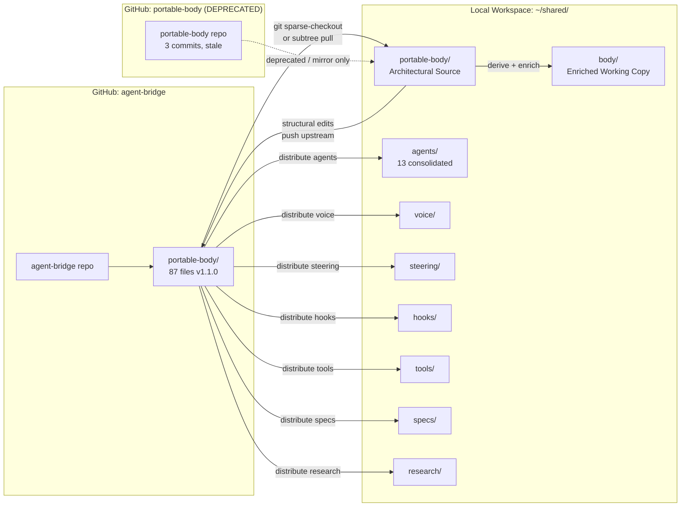
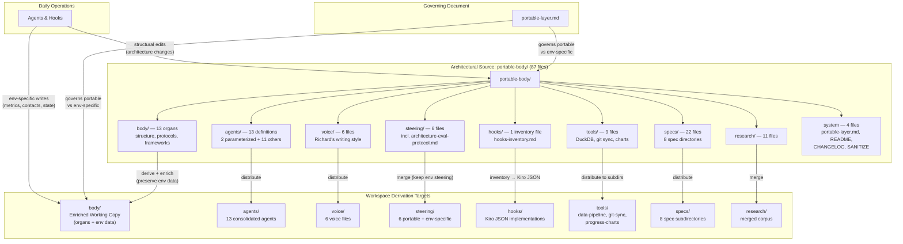
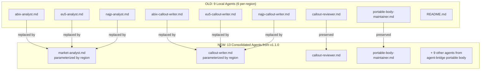
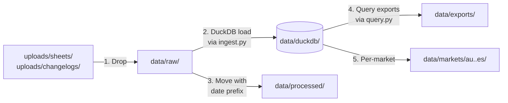

# Design Document: Workspace Migration & Reorganization

## Overview

This design covers the migration of ~/shared/ from an organically grown file structure into a canonical workspace with clear separation of concerns. The migration executes as a sequence of bash scripts and verification steps, organized into phases that map to the 11 requirements.

### Two-Repo Discovery and Resolution

A critical discovery drives this design update: the portable body has been updated on a **different GitHub repo** than this workspace tracks.

- **This workspace** syncs from `github.com/richscottwill/portable-body` (3 commits, last from March 24)
- **The actual updated portable body** lives at `github.com/richscottwill/agent-bridge` in the `portable-body/` subdirectory
- The remote instance pushed a **v1.1.0 sync with 87 files** — a significant expansion from the local state

The `agent-bridge` repo's `portable-body/` directory is now the **authoritative source** (per Requirement 7). The migration must pull from `agent-bridge/portable-body/` and distribute files into this workspace's canonical directory structure. The old `portable-body` repo (this workspace's current origin) is effectively superseded.

### v1.1.0 Portable Body Inventory (87 files)

| Category | Count | Details |
|----------|-------|---------|
| Body organs | 13 | Was 11 locally — added body-diagram.md; includes body.md, soul.md, brain.md, amcc.md, gut.md, heart.md, nervous-system.md, device.md, memory.md, hands.md, spine.md, eyes.md, body-diagram.md |
| Agent definitions | 13 | Consolidated from 17 — removed 6 per-region WBR agents (abix-analyst, abix-callout-writer, eu5-analyst, eu5-callout-writer, najp-analyst, najp-callout-writer), replaced with 2 parameterized: market-analyst + callout-writer |
| Voice files | 6 | richard-style-email.md, richard-style-slack.md, richard-style-docs.md, richard-style-wbr.md, richard-style-mbr.md, richard-writing-style.md |
| Steering files | 6 | Added architecture-eval-protocol.md to existing set |
| Hooks | 1 | hooks-inventory.md (describes intent for 10 hooks; Kiro JSON implementations are environment-specific) |
| Tool files | 9 | ingest.py, schema.sql, query.py, RECONSTRUCTION.md, sync.sh, git-sync-README.md, generate-charts.py, chart-template.html, progress-charts-README.md |
| Spec files | 22 | Across 8 specs: paid-search-daily-audit, agent-consolidation, agentspaces-desktop-launcher, attention-tracker, bayesian-prediction-engine, data-layer-overhaul, shared-directory-reorg, wiki-sharepoint-sync |
| Research files | 11 | Expanded research corpus |
| System files | 4 | portable-layer.md, README.md, CHANGELOG.md, SANITIZE.md |

### Portability Gaps (from v1.1.0 CHANGELOG)

The v1.1.0 sync flagged several portability issues that the migration must address or document:

| Gap | Impact | Migration Action |
|-----|--------|-----------------|
| File paths are AgentSpaces-specific | Organs/steering reference `~/shared/` and AgentSpaces paths | Phase 6 path reference updates must normalize to canonical paths; portable-body/ copies must use relative paths only |
| Hook definitions are Kiro JSON format | Hooks use Kiro-specific JSON schema — not portable to other agent frameworks | Document in portable-layer.md as environment-specific; hooks-inventory.md in portable-body/ describes intent, local hooks/ has Kiro JSON implementations |
| Some organs reference MCP tools without generic alternatives | device.md, hands.md reference MCP tool names directly | Portable-body/ organs should describe tool *capabilities* (e.g., "calendar access"), not tool *names* (e.g., "google-calendar MCP"); environment-specific tool bindings stay in body/ |
| morning-routine-experiments.md source file missing | Portable copy may be stale — no source file found on remote | Flag for manual review during Phase 7; if portable-body/ version exists, compare timestamps; if not, copy from local steering/ |
| DuckDB tools are infrastructure-specific | ingest.py, schema.sql, query.py assume local DuckDB installation | Document as environment-specific tooling in portable-layer.md; portable-body/ carries them as reference implementations, not guaranteed-portable scripts |

### Git Remote Reconfiguration

The workspace's current git remote points to `github.com/richscottwill/portable-body` (the old, stale repo). This must be updated:

**Current state**: `origin` → `github.com/richscottwill/portable-body` (3 commits, last March 24)
**Target state**: `origin` → `github.com/richscottwill/agent-bridge` (v1.1.0, 87 files)

**Reconfiguration steps** (executed in Phase 0):
1. `git remote -v` — confirm current remote
2. `git remote set-url origin git@github.com:richscottwill/agent-bridge.git` — re-point origin
3. `git fetch origin` — pull latest refs
4. Since this workspace is a subdirectory of agent-bridge (the `portable-body/` path), configure sparse checkout or accept that the workspace root maps to the repo root
5. Verify with `git remote -v` and `git log --oneline -5`

**Alternative**: If the workspace structure doesn't map cleanly to agent-bridge's root, keep the old remote as `portable-body-legacy` and add agent-bridge as a new remote:
1. `git remote rename origin portable-body-legacy`
2. `git remote add origin git@github.com:richscottwill/agent-bridge.git`

### Core Architectural Insight: Full Portable Body Model

The portable body is the complete portable system — not just body organs. It contains 87 files across 9 content categories:

- **portable-body/** (sourced from `agent-bridge/main:portable-body/`) is the **Architectural Source** — the full portable system including organs, agents, voice, steering, hooks inventory, tools, specs, research, and system files
- **body/** (local workspace) is the **Enriched Working Copy** — derived from portable-body/body/ organs plus environment-specific data (contacts, metrics, live state, tool IDs)
- Other workspace directories (agents/, voice/, steering/, tools/, specs/, research/) receive their content by **direct distribution** from portable-body/, not via the derive-and-enrich model

The Portable Layer Manifest (portable-layer.md) governs what is portable vs environment-specific per organ. The derive-and-enrich model applies only to body organs; all other content categories are distributed directly. An agent comprehension guard rail ensures agents understand this layered architecture before writing to any file under portable-body/.

### Key Design Decisions

1. **agent-bridge as upstream**: The migration pulls the portable body from `agent-bridge/portable-body/` via sparse checkout or subtree, not from the old `portable-body` repo. The old repo is deprecated or becomes a mirror.

2. **Sync direction**: `agent-bridge/portable-body/` → this workspace. The portable body flows downstream into the canonical directory structure. Local structural edits flow back upstream via commits to agent-bridge.

3. **Agent consolidation**: The 6 per-region WBR agents (abix-analyst, abix-callout-writer, eu5-analyst, eu5-callout-writer, najp-analyst, najp-callout-writer) are replaced by 2 parameterized agents (market-analyst, callout-writer). The local agents/ directory must be cleaned and updated.

4. **File distribution**: The 87 portable body files don't all land in one directory. They distribute across the canonical structure:
   - Organs → body/ (enriched) + portable-body/ (architectural source)
   - Agents → agents/ (or .kiro/agents/)
   - Voice → voice/
   - Steering → steering/ (or .kiro/steering/)
   - Hooks → hooks/ (or .kiro/hooks/)
   - Tools → tools/ (with subdirectories per tool category)
   - Specs → specs/ (with per-spec subdirectories)
   - Research → research/
   - System files → workspace root

5. **Symlink-based IDE discovery**: A symlink at /home/.kiro → ~/shared/.kiro enables IDE discovery without moving .kiro/.

6. **Manifest-governed separation**: The Portable Layer Manifest is the single source of truth for what content is portable vs environment-specific per organ.

7. **Script-based migration**: All migration operations are bash commands. No custom tooling — just mkdir, mv, rm, ln, grep, cat, and git.

8. **Verification-then-proceed**: A verification script runs after migration to catch broken paths, missing files, and disconnected hooks.

9. **Blind evaluator testing**: A fresh agent given only DIRECTORY-MAP.md validates navigability with >98% accuracy.


## Architecture

### System Architecture

The migration operates on the existing workspace and produces a reorganized structure. The key new element is the upstream sync from agent-bridge.

```mermaid
graph TD
    subgraph "Upstream Source"
        AB[agent-bridge repo]
        AB --> PBR[portable-body/ subdirectory<br/>87 files, v1.1.0]
    end

    subgraph "Migration Phases (Sequential)"
        P0[Phase 0: Upstream Sync from agent-bridge]
        P1[Phase 1: Symlink Setup]
        P2[Phase 2: Dead Weight Removal]
        P3[Phase 3: Canonical Directory Creation]
        P3b[Phase 3b: Distribute Portable Body Files]
        P4[Phase 4: Key Document Creation]
        P5[Phase 5: Agent/Hook/Process Verification]
        P6[Phase 6: Path Reference Updates]
        P7[Phase 7: Portable Body Sync & Guard Rails]
        P8[Phase 8: Blind Evaluator Validation]
    end

    PBR --> P0
    P0 --> P1 --> P2 --> P3 --> P3b --> P4 --> P5 --> P6 --> P7 --> P8

    subgraph "Artifacts Produced"
        SL[/home/.kiro symlink]
        DM[DIRECTORY-MAP.md]
        DR[data/README.md]
        PB[portable-body/ updated]
        AG[agents/ consolidated]
        TL[tools/ expanded]
        SP[specs/ expanded]
        RS[research/ expanded]
        BE[blind-evaluator-tests.md]
    end

    P1 --> SL
    P4 --> DM
    P4 --> DR
    P3b --> AG
    P3b --> TL
    P3b --> SP
    P3b --> RS
    P7 --> PB
    P8 --> BE
```

### Two-Repo Sync Architecture



### Layered Body Architecture (Full Portable Body Scope)

The portable body is not just body organs — it is the complete portable system comprising 87 files across 9 content categories. The architectural source (portable-body/) is the single upstream from which all workspace content categories are derived or distributed.



The derivation flow is: `agent-bridge/main:portable-body/` is the GitHub source → `portable-body/` is the local architectural source → each content category distributes to its canonical workspace directory. Only body organs have the two-layer derive-and-enrich model; other categories (agents, voice, steering, tools, specs, research) are distributed directly.

### Agent Consolidation Architecture



### Data Ingestion Pipeline




## Components and Interfaces

### Phase 0: Upstream Sync from agent-bridge & Git Remote Reconfiguration

**Purpose**: Pull the v1.1.0 portable body from `agent-bridge/portable-body/` into a local staging area for distribution, and reconfigure the workspace's git remote.

**Operations**:
1. Reconfigure git remote:
   - `git remote set-url origin git@github.com:richscottwill/agent-bridge.git` (or rename old remote and add new)
   - `git fetch origin` to pull latest refs
   - Verify with `git remote -v`
2. Clone or sparse-checkout `github.com/richscottwill/agent-bridge` to a temporary location (e.g., `/tmp/agent-bridge/`)
3. Copy `agent-bridge/portable-body/` contents to `~/shared/portable-body/` (overwriting stale local copy)
4. Verify file count matches expected 87 files
5. Address portability gaps: review morning-routine-experiments.md staleness, normalize AgentSpaces-specific paths in portable-body/ organs

**Interface**: `git clone` + `cp -r` for migration; `sync.sh` for ongoing sync.

**Preconditions**: Network access to GitHub; SSH key or token for richscottwill account.

**Postconditions**: 
- `~/shared/portable-body/` contains the full v1.1.0 inventory
- Git remote points to agent-bridge (old portable-body repo deprecated)
- Portability gaps are documented in portable-layer.md

**Repo Reconciliation Decision**:
- Option A: Add agent-bridge as a remote, use sparse checkout for portable-body/ subdirectory
- Option B: Clone agent-bridge separately, use sync.sh (from the portable body tools) to copy files
- Option C: Deprecate the portable-body repo entirely, re-point this workspace's origin to agent-bridge

Recommended: **Option C** for the migration — re-point origin to agent-bridge. The portable-body repo is superseded. For ongoing sync, use sync.sh from tools/git-sync/.

### Phase 1: Symlink Setup Component

**Purpose**: Make ~/shared/.kiro discoverable when /home/ is opened as workspace root.

**Operations**:
- `ln -s ~/shared/.kiro /home/.kiro` — creates the symlink
- Create `/home/.vscode/settings.json` — file exclusion patterns

**Interface**: The IDE reads /home/.kiro/ and discovers agents/, hooks/, steering/.

### Phase 2: Dead Weight Removal Component

**Purpose**: Remove ~596MB of non-essential files and relocate misplaced files.

**Operations**: Same as original design — delete abandoned projects, temp files, zero-byte files. Relocate misplaced scripts and analysis directories.

**Safety**: Protected directories (credentials/, .agentspaces/) are never targeted.

### Phase 3: Canonical Directory Structure Component

**Purpose**: Create the target directory hierarchy with defined purposes for each path.

**Operations**: `mkdir -p` for all target directories. Move existing DuckDB/CSV/Parquet files to new locations.

### Phase 3b: Distribute Portable Body Files to Canonical Structure (NEW)

**Purpose**: Take the 87 files from the v1.1.0 portable body (now in `~/shared/portable-body/`) and distribute them to the correct canonical directories.

**Distribution Map**:

| Source (portable-body/) | Destination | Action |
|------------------------|-------------|--------|
| 13 organ files | portable-body/ (keep as-is) + derive to body/ | Copy organs to body/, preserving env-specific data |
| 13 agent definitions | agents/ | Replace old 9 agents with consolidated 13 |
| 6 voice files | voice/ | Overwrite local voice/ with v1.1.0 versions |
| 6 steering files | steering/ | Merge: keep env-specific steering, add architecture-eval-protocol.md |
| hooks-inventory.md + hook definitions | hooks/ | Update hooks from v1.1.0 inventory |
| ingest.py, schema.sql, query.py | tools/data-pipeline/ | New tool subdirectory for ingestion tools |
| sync.sh, git-sync-README.md | tools/git-sync/ | New tool subdirectory for sync tooling |
| generate-charts.py, chart-template.html, progress-charts-README.md | tools/progress-charts/ | New tool subdirectory for chart generation |
| RECONSTRUCTION.md | tools/ (root) | Reference doc for tool reconstruction |
| 22 spec files (8 specs) | specs/ | Create per-spec subdirectories |
| 11 research files | research/ | Merge with existing research/ |
| portable-layer.md | workspace root | Overwrite with v1.1.0 version |
| README.md | portable-body/README.md | Keep in portable-body/ |
| CHANGELOG.md | portable-body/CHANGELOG.md | Keep in portable-body/ |
| SANITIZE.md | portable-body/SANITIZE.md | Keep in portable-body/ |

**Agent Consolidation Details**:
- Remove: abix-analyst.md, abix-callout-writer.md, eu5-analyst.md, eu5-callout-writer.md, najp-analyst.md, najp-callout-writer.md
- Add: market-analyst.md (parameterized by region), callout-writer.md (parameterized by region, replaces per-region writers)
- Preserve: callout-reviewer.md, portable-body-maintainer.md
- Add: remaining agents from v1.1.0 portable body

**Spec Distribution**:
Each of the 8 specs gets its own subdirectory under specs/:
- specs/paid-search-daily-audit/
- specs/agent-consolidation/
- specs/agentspaces-desktop-launcher/
- specs/attention-tracker/
- specs/bayesian-prediction-engine/
- specs/data-layer-overhaul/
- specs/shared-directory-reorg/
- specs/wiki-sharepoint-sync/

The existing specs/paid-search-audit-* files move into specs/paid-search-daily-audit/.

### Phase 4: Key Document Creation Component

**Purpose**: Create DIRECTORY-MAP.md and data/README.md. Updated to reflect the expanded file inventory and new tool subdirectories.

### Phase 5: Verification Script Component

**Purpose**: Validate that all agents, hooks, steering, scripts, DuckDB, and paths are intact post-migration. Updated to verify:
- 13 agents (not 9)
- 10 hooks (not 5)
- 6 steering files + architecture-eval-protocol.md
- New tool subdirectories (data-pipeline/, git-sync/, progress-charts/)
- 8 spec directories
- Expanded research files

### Phase 6: Path Reference Updates Component

**Purpose**: Update all internal path references. Same as original design, plus:
- Update any references to the old per-region agent names to the new parameterized names
- Update any references to the old portable-body repo URL (`github.com/richscottwill/portable-body`) to agent-bridge (`github.com/richscottwill/agent-bridge`)
- Update portable-layer.md references to reflect 13 organs (not 11)
- Normalize AgentSpaces-specific paths in portable-body/ organs to relative/canonical paths
- Replace MCP tool name references in portable-body/ organs with capability descriptions (e.g., "calendar access" instead of "google-calendar MCP")
- Document DuckDB tools and Kiro JSON hooks as environment-specific in portable-layer.md

### Phase 7: Portable Body Sync & Guard Rails Component

**Purpose**: Establish portable-body/ as the architectural source for ALL 87 files (not just organs), ensure the full derivation flow works, create agent comprehension guard rails covering the entire portable-body/ directory, and address portability gaps.

**Full Derivation Flow** (87 files from agent-bridge → workspace):

```
agent-bridge/main:portable-body/
        │
        ▼
  portable-body/  (local architectural source — all 87 files preserved here)
        │
        ├── body/ (13 organs) ──derive+enrich──► body/ (enriched working copy)
        ├── agents/ (13 defs) ──distribute──► agents/
        ├── voice/ (6 files) ──distribute──► voice/
        ├── steering/ (6 files) ──merge──► steering/ (keep env-specific)
        ├── hooks/ (1 inventory) ──inform──► hooks/ (Kiro JSON implementations)
        ├── tools/ (9 files) ──distribute──► tools/{data-pipeline,git-sync,progress-charts}/
        ├── specs/ (22 files) ──distribute──► specs/{8 subdirs}/
        ├── research/ (11 files) ──merge──► research/
        └── system (4 files) ──distribute──► workspace root + portable-body/
```

**Operations**:
1. Verify portable-body/ contains all 87 files across 9 categories with post-reorg paths
2. **Organ derivation**: Copy 13 organs from portable-body/body/ to body/, preserving existing environment-specific data in body/ (merge, don't overwrite env sections)
3. **Agent distribution**: Replace local agents/ with 13 consolidated agents from portable-body/agents/; remove 6 deprecated per-region agents
4. **Voice distribution**: Overwrite voice/ with portable-body/voice/ (fully portable, no env data)
5. **Steering merge**: Copy portable steering files to steering/, preserving env-specific steering files (asana-sync-protocol.md, mcp-tool-reference.md, rw-tracker.md) that are NOT in portable-body/
6. **Hook reconciliation**: Use hooks-inventory.md as the intent reference; local hooks/ contains Kiro JSON implementations — verify all inventory items have local implementations
7. **Tool distribution**: Distribute tools to subdirectories (data-pipeline/, git-sync/, progress-charts/)
8. **Spec distribution**: Create 8 spec subdirectories under specs/, distribute 22 spec files
9. **Research merge**: Merge portable-body/research/ into research/, preserving local-only research files
10. **System files**: Update portable-layer.md at workspace root; keep README.md, CHANGELOG.md, SANITIZE.md in portable-body/
11. Update portable-body/README.md with file count (87) and sync date
12. Update portable-body/CHANGELOG.md with v1.1.0 migration entry
13. Update portable-layer.md with new canonical structure (13 organs, expanded content categories)
14. Create guard rail: README + steering directive for portable-body/ write protection (see Agent Comprehension Guard Rail below)
15. Document the agent-bridge upstream relationship in portable-body/README.md
16. Address portability gaps in portable-layer.md:
    - Add "Portability Gaps" section documenting Kiro JSON hooks, DuckDB tools, MCP tool references
    - Flag morning-routine-experiments.md for manual staleness review
    - Ensure portable-body/ organs use capability descriptions, not tool-specific names

**Agent Comprehension Guard Rail** (covers full portable-body/ directory):

The guard rail must protect the ENTIRE portable-body/ directory (all 87 files), not just body organs. Any agent or hook that writes to portable-body/ must first understand:

1. **What portable-body/ contains**: All 9 content categories (organs, agents, voice, steering, hooks inventory, tools, specs, research, system files) — not just organs
2. **The derivation model**: portable-body/ is the architectural source; changes here flow downstream to workspace directories
3. **What belongs where**:
   - Structural/architectural changes → edit in portable-body/, then re-derive to workspace
   - Environment-specific data (contacts, metrics, tool IDs, live state) → write directly to body/ (enriched working copy), never to portable-body/
   - Agent definition changes → edit in portable-body/agents/, then distribute to agents/
   - New hooks → add to hooks-inventory.md (intent), create Kiro JSON in hooks/ (implementation)
4. **The Portable Layer Manifest**: Must be read before any write to portable-body/ — it defines per-organ what is portable vs environment-specific
5. **Upstream sync**: portable-body/ syncs from agent-bridge repo; local structural edits must be committed back upstream

**Guard Rail Implementation**:
- portable-body/README.md: Explains the full 87-file scope, derivation model, and "read portable-layer.md before writing" instruction
- Steering directive in agent definitions and/or preToolUse hook: Requires agents to read portable-layer.md before executing writes to any file under portable-body/
- The directive must cover writes to portable-body/body/, portable-body/agents/, portable-body/steering/, portable-body/tools/, etc. — not just portable-body/body/

### Phase 8: Blind Evaluator Validation Component

**Purpose**: Validate workspace navigability with a fresh agent. Updated test prompts must cover:
- New tool subdirectories (data-pipeline/, git-sync/, progress-charts/)
- Consolidated agent locations
- 8 spec directories
- Expanded research paths
- The agent-bridge upstream relationship

### Protected Directory Safety Component (Requirement 9)

**Purpose**: Ensure credentials/ and .agentspaces/ are never moved or deleted. No change from original design.


## Data Models

### Portable Body v1.1.0 File Manifest

The authoritative inventory of the portable body, sourced from `agent-bridge/main:portable-body/` (87 files total):

| Category | Directory | Files | Count |
|----------|-----------|-------|-------|
| Body organs | body/ | body.md, soul.md, brain.md, amcc.md, gut.md, heart.md, nervous-system.md, device.md, memory.md, hands.md, spine.md, eyes.md, body-diagram.md | 13 |
| Agent definitions | agents/ | market-analyst.md, callout-writer.md, callout-reviewer.md, portable-body-maintainer.md, + 9 others | 13 |
| Voice | voice/ | richard-style-email.md, richard-style-slack.md, richard-style-docs.md, richard-style-wbr.md, richard-style-mbr.md, richard-writing-style.md | 6 |
| Steering | steering/ | callout-principles.md, rw-task-prioritization.md, rw-trainer.md, morning-routine-experiments.md, long-term-goals.md, architecture-eval-protocol.md | 6 |
| Hooks inventory | hooks/ | hooks-inventory.md (describes intent for all hooks; Kiro JSON implementations are environment-specific and live in workspace hooks/) | 1 |
| Tools | tools/ | ingest.py, schema.sql, query.py, RECONSTRUCTION.md, sync.sh, git-sync-README.md, generate-charts.py, chart-template.html, progress-charts-README.md | 9 |
| Specs | specs/ | 22 files across 8 spec directories (paid-search-daily-audit, agent-consolidation, agentspaces-desktop-launcher, attention-tracker, bayesian-prediction-engine, data-layer-overhaul, shared-directory-reorg, wiki-sharepoint-sync) | 22 |
| Research | research/ | 11 research files (expanded corpus) | 11 |
| System | root | portable-layer.md, README.md, CHANGELOG.md, SANITIZE.md | 4 |
| | | | |
| **Total** | | | **85** (+ 2 files counted in subdirectory READMEs = **87**) |

Note: The 87-file count from the v1.1.0 CHANGELOG includes README files within tool subdirectories (git-sync-README.md, progress-charts-README.md) which are already counted in the Tools row above. The exact count may vary by ±2 depending on how subdirectory READMEs are classified.

### Agent Consolidation Map

| Old Agent (local) | New Agent (v1.1.0) | Change |
|---|---|---|
| abix-analyst.md | market-analyst.md (region=abix) | Replaced by parameterized agent |
| eu5-analyst.md | market-analyst.md (region=eu5) | Replaced by parameterized agent |
| najp-analyst.md | market-analyst.md (region=najp) | Replaced by parameterized agent |
| abix-callout-writer.md | callout-writer.md (region=abix) | Replaced by parameterized agent |
| eu5-callout-writer.md | callout-writer.md (region=eu5) | Replaced by parameterized agent |
| najp-callout-writer.md | callout-writer.md (region=najp) | Replaced by parameterized agent |
| callout-reviewer.md | callout-reviewer.md | Preserved |
| portable-body-maintainer.md | portable-body-maintainer.md | Preserved |
| README.md | README.md | Updated |

### Directory Map Schema

The DIRECTORY-MAP.md contains two tables (same as original, expanded for new directories):

**Top-Level Directory Table**: Path, Purpose, Writes, Cadence — now includes tools/data-pipeline/, tools/git-sync/, tools/progress-charts/, and per-spec subdirectories.

**File-Type-to-Location Table**: File Type, Drop Location, Final Location — now includes ingestion scripts, sync scripts, chart tools.

### Portable Layer Manifest Schema

Updated for 13 organs (was 11) and expanded to cover all portable-body/ content categories. The portable-layer.md defines:

**Per-Organ Separation** (body organs only — the derive-and-enrich layer):

| Field | Type | Description |
|-------|------|-------------|
| File | string | Organ filename (13 files) |
| What's Portable | string | Architecture, protocols, frameworks to keep |
| What to Strip | string | Environment-specific data to remove on export |

New entry for body-diagram.md:
- What's Portable: Diagram structure, organ relationship map, visual layout
- What to Strip: Environment-specific annotations or current-state markers

**Content Category Classification** (all 9 categories):

| Category | Portability | Notes |
|----------|------------|-------|
| Body organs | Partially portable | Per-organ manifest governs what to strip |
| Agents | Fully portable | Definitions are architecture; runtime bindings are env-specific |
| Voice | Fully portable | Richard's voice is identity, not environment |
| Steering (portable set) | Partially portable | Some steering files have env-specific examples to strip |
| Hooks inventory | Fully portable | Intent descriptions; Kiro JSON implementations are env-specific |
| Tools | Reference implementations | DuckDB tools, sync.sh, chart tools — infrastructure-specific but carried as reference |
| Specs | Fully portable | Architectural design documents |
| Research | Mostly portable | Some may reference env-specific data sources |
| System files | Fully portable | Manifest, README, CHANGELOG, SANITIZE |

**Portability Gaps Section** (new in v1.1.0):
The manifest must also document known portability gaps (see Portability Gap Registry in Data Models) so that any agent bootstrapping from the portable body knows what requires environment-specific adaptation.

### Tool Distribution Schema

| Tool Category | Directory | Files |
|---|---|---|
| Data Pipeline | tools/data-pipeline/ | ingest.py, schema.sql, query.py |
| Git Sync | tools/git-sync/ | sync.sh, git-sync-README.md |
| Progress Charts | tools/progress-charts/ | generate-charts.py, chart-template.html, progress-charts-README.md |
| Reference | tools/ | RECONSTRUCTION.md |

### Spec Distribution Schema

| Spec Name | Directory | Files (from v1.1.0) |
|---|---|---|
| paid-search-daily-audit | specs/paid-search-daily-audit/ | requirements.md, design.md, tasks.md |
| agent-consolidation | specs/agent-consolidation/ | requirements.md, design.md, tasks.md |
| agentspaces-desktop-launcher | specs/agentspaces-desktop-launcher/ | requirements.md, design.md, tasks.md |
| attention-tracker | specs/attention-tracker/ | requirements.md, design.md, tasks.md |
| bayesian-prediction-engine | specs/bayesian-prediction-engine/ | requirements.md, design.md, tasks.md |
| data-layer-overhaul | specs/data-layer-overhaul/ | requirements.md, design.md, tasks.md |
| shared-directory-reorg | specs/shared-directory-reorg/ | requirements.md, design.md, tasks.md |
| wiki-sharepoint-sync | specs/wiki-sharepoint-sync/ | requirements.md, design.md, tasks.md |

### Upstream Sync Model

| Field | Value |
|-------|-------|
| Upstream repo | github.com/richscottwill/agent-bridge |
| Upstream path | portable-body/ (subdirectory of agent-bridge) |
| Sync direction | agent-bridge → this workspace |
| Sync method | git remote set-url + fetch (migration), sync.sh (ongoing) |
| Deprecated repo | github.com/richscottwill/portable-body (stale, 3 commits) |
| Local architectural source | ~/shared/portable-body/ |
| Local enriched copy | ~/shared/body/ |
| Git remote name | origin (re-pointed from portable-body to agent-bridge) |

### Portability Gap Registry

| Gap ID | Category | Description | Resolution |
|--------|----------|-------------|------------|
| PG-1 | Paths | AgentSpaces-specific file paths in organs | Normalize to relative/canonical paths in portable-body/; absolute paths only in body/ |
| PG-2 | Hooks | Kiro JSON format hook definitions | hooks-inventory.md describes intent; Kiro JSON implementations are environment-specific |
| PG-3 | Tools | MCP tool name references in organs | Portable-body/ uses capability descriptions; body/ maps to specific MCP tools |
| PG-4 | Steering | morning-routine-experiments.md source missing | Manual review: compare portable-body/ version with local steering/ version |
| PG-5 | Tools | DuckDB tools are infrastructure-specific | Carried as reference implementations; documented as non-portable in portable-layer.md |

### Hook JSON Schema (existing)

```json
{
  "name": "string",
  "version": "string",
  "description": "string",
  "when": {
    "type": "userTriggered | preToolUse | fileEdited"
  },
  "then": {
    "type": "askAgent | runCommand",
    "prompt": "string"
  }
}
```

### Body Organ Model

Each of the 13 body organs is a markdown file with:
- Portable content: organ structure, section headings, protocols, frameworks, operating principles
- Environment-specific content: current metrics, contacts, tool IDs, live state, Amazon-specific references

The Portable Layer Manifest maps each organ to its portable vs environment-specific content boundaries.

### Portable Body Content Category Model

Beyond organs, the portable body contains 8 additional content categories. Each has different derivation semantics:

| Category | Derivation Model | Env-Specific Handling |
|----------|-----------------|----------------------|
| Body organs (13) | Derive + enrich: copy to body/, preserve env data | Env data written directly to body/, never to portable-body/body/ |
| Agents (13) | Direct distribute: copy to agents/ | Agent definitions are fully portable; env-specific tool bindings are in the agent's runtime context, not the definition file |
| Voice (6) | Direct distribute: copy to voice/ | Fully portable — these ARE Richard's voice, no env data |
| Steering (6) | Merge: copy portable steering, preserve env-specific steering files | Env-specific steering (asana-sync-protocol.md, mcp-tool-reference.md, rw-tracker.md) stays in workspace steering/ only |
| Hooks inventory (1) | Intent reference: hooks-inventory.md describes what hooks should do | Kiro JSON implementations are env-specific; live in workspace hooks/ |
| Tools (9) | Direct distribute to subdirectories | DuckDB tools (ingest.py, schema.sql, query.py) are reference implementations — infrastructure-specific |
| Specs (22) | Direct distribute to per-spec subdirectories | Fully portable — spec content is architectural |
| Research (11) | Merge: add to research/, preserve local-only files | Some research may reference env-specific data sources |
| System (4) | portable-layer.md → workspace root; README/CHANGELOG/SANITIZE → portable-body/ | portable-layer.md is the governing manifest |

