<!-- DOC-0218 | duck_id: organ-body-diagram -->
# Body System — Visual Architecture

```mermaid
graph TB
    %% ============================================
    %% EXTERNAL WORLD (inputs and outputs)
    %% ============================================
    subgraph WORLD["🌍 THE WORK"]
        EMAIL["📧 Email / Calendar"]
        ASANA["📋 Asana / To-Do"]
        STAKEHOLDERS["👥 Stakeholders<br/>Brandon, Kate, Lena,<br/>Alexis, Carlos, Yun"]
        GOOGLE["📊 Google Ads /<br/>Adobe Analytics"]
        ARTIFACTS["📄 Shipped Artifacts<br/>POVs, Frameworks,<br/>Test Designs"]
    end

    %% ============================================
    %% SOUL (steering — identity layer)
    %% ============================================
    subgraph SOUL["🔥 SOUL — Identity & Configuration"]
        direction LR
        IDENTITY["soul.md<br/>Who Richard is"]
        TRAINER["rw-trainer.md<br/>Coaching rules"]
        VOICE["writing-style.md<br/>How Richard sounds"]
        PRIORITIZATION["rw-task-prioritization.md<br/>7-layer framework"]
    end

    %% ============================================
    %% THE BODY
    %% ============================================
    subgraph BODY["🏛️ THE BODY — ~/shared/context/body/"]
        
        %% --- Perception Layer ---
        subgraph PERCEPTION["👁️ PERCEPTION"]
            EYES["eyes.md<br/>Markets, Competitors,<br/>OCI, Ad Copy, Predictions"]
        end

        %% --- Cognition Layer ---
        subgraph COGNITION["🧠 COGNITION"]
            BRAIN["brain.md<br/>Decisions, Principles,<br/>Five Levels, Leverage"]
            AMCC["amcc.md<br/>Willpower Engine<br/>Streak: see main.l1_streak<br/>Hard Thing: see main.hard_thing_now"]
        end

        %% --- Memory Layer ---
        subgraph RECALL["🧠💬 RECALL"]
            MEMORY["memory.md<br/>Compressed Context,<br/>Relationships,<br/>Meeting Briefs"]
        end

        %% --- Execution Layer ---
        subgraph EXECUTION["✋ EXECUTION"]
            HANDS["hands.md<br/>Action Tracker,<br/>Overdue Items,<br/>To-Do Lists"]
            DEVICE["device.md<br/>Automation, Delegation,<br/>Templates, Tool Factory"]
        end

        %% --- Infrastructure Layer ---
        subgraph INFRA["🦴 INFRASTRUCTURE"]
            SPINE["spine.md<br/>Bootstrap, IDs,<br/>Directory Map"]
            HEART["heart.md<br/>Loop Protocol,<br/>Experiments"]
        end

        %% --- Regulation Layer ---
        subgraph REGULATION["🧬 REGULATION"]
            NERVOUS["nervous-system.md<br/>Calibration Loops,<br/>Decision Audits,<br/>Pattern Tracking"]
            GUT["gut.md<br/>Compression,<br/>Word Budgets,<br/>Waste Removal"]
        end
    end

    %% ============================================
    %% INTAKE & ARCHIVE
    %% ============================================
    INTAKE["📥 intake/<br/>Raw material"]
    ARCHIVE["🗄️ archive/<br/>Cold storage"]
    GROUND["📋 active/<br/>current.md, org-chart.md,<br/>rw-tracker.md"]

    %% ============================================
    %% CONNECTIONS — Information Flow
    %% ============================================

    %% World → Body (inputs)
    EMAIL -->|"signals"| EYES
    EMAIL -->|"tasks"| HANDS
    EMAIL -->|"relationships"| MEMORY
    ASANA -->|"sync"| HANDS
    GOOGLE -->|"metrics"| EYES
    STAKEHOLDERS -->|"requests"| HANDS

    %% Body → World (outputs)
    HANDS -->|"actions"| EMAIL
    HANDS -->|"execution"| GOOGLE
    DEVICE -->|"delegation"| STAKEHOLDERS
    BRAIN -->|"strategy"| ARTIFACTS
    AMCC -->|"forces shipping"| ARTIFACTS

    %% Soul → Body (configuration)
    IDENTITY -.->|"identity"| BRAIN
    IDENTITY -.->|"values"| AMCC
    TRAINER -.->|"standards"| NERVOUS
    TRAINER -.->|"patterns"| AMCC
    VOICE -.->|"tone"| MEMORY
    PRIORITIZATION -.->|"framework"| HANDS

    %% Internal Body flows
    EYES -->|"context"| BRAIN
    BRAIN -->|"decisions"| HANDS
    BRAIN -->|"leverage"| AMCC
    AMCC -->|"intervention"| HANDS
    MEMORY -->|"prep"| HANDS
    MEMORY -->|"relationships"| DEVICE
    HANDS -->|"status"| NERVOUS
    HANDS -->|"overdue"| AMCC

    %% Heart loop (maintenance cycle)
    HEART -->|"Phase 1:<br/>refresh"| GROUND
    HEART -->|"Phase 2:<br/>cascade"| EYES
    HEART -->|"Phase 2:<br/>cascade"| MEMORY
    HEART -->|"Phase 2:<br/>cascade"| HANDS
    HEART -->|"Phase 2:<br/>cascade"| BRAIN

    %% Regulation flows
    NERVOUS -->|"calibrates"| BRAIN
    NERVOUS -->|"scores"| EYES
    NERVOUS -->|"tracks"| DEVICE
    GUT -->|"compresses"| EYES
    GUT -->|"compresses"| MEMORY
    GUT -->|"prunes"| HANDS

    %% Intake/Archive flows
    INTAKE -->|"digestion"| GUT
    GUT -->|"waste"| ARCHIVE
    GROUND -->|"truth"| HEART

    %% ============================================
    %% STYLING
    %% ============================================
    classDef soul fill:#ff6b35,stroke:#333,color:#fff
    classDef perception fill:#4ecdc4,stroke:#333,color:#fff
    classDef cognition fill:#6c5ce7,stroke:#333,color:#fff
    classDef recall fill:#a29bfe,stroke:#333,color:#fff
    classDef execution fill:#00b894,stroke:#333,color:#fff
    classDef infra fill:#636e72,stroke:#333,color:#fff
    classDef regulation fill:#fd79a8,stroke:#333,color:#fff
    classDef world fill:#dfe6e9,stroke:#333,color:#333
    classDef storage fill:#ffeaa7,stroke:#333,color:#333

    class IDENTITY,TRAINER,VOICE,PRIORITIZATION soul
    class EYES perception
    class BRAIN,AMCC cognition
    class MEMORY recall
    class HANDS,DEVICE execution
    class SPINE,HEART infra
    class NERVOUS,GUT regulation
    class EMAIL,ASANA,STAKEHOLDERS,GOOGLE,ARTIFACTS world
    class INTAKE,ARCHIVE,GROUND storage
```



## How to Read This Diagram

**Top → Bottom = Outside → Inside**
- The Work (top) is the external world: email, stakeholders, metrics, shipped artifacts
- The Soul (orange) configures how the body behaves — it's not part of the body, it shapes it
- The Body (center) is the 11-organ system that processes information and produces output
- Storage (bottom) is where raw material enters and waste exits

**Left → Right within the Body = Function layers**
- Perception (Eyes) — what's happening in the world
- Cognition (Brain + aMCC) — what to do about it and the willpower to do it
- Recall (Memory) — what we know and who we know
- Execution (Hands + Device) — what gets done, by Richard or by others
- Infrastructure (Spine + Heart) — the skeleton and the engine
- Regulation (Nervous System + Gut) — is it working? is it bloated?

**Arrow types:**
- Solid arrows = active information flow (data moves)
- Dashed arrows = configuration (soul shapes behavior, doesn't flow data)

**The critical path for shipping work:**
```
Eyes (sees deadline) → Brain (decides priority) → aMCC (forces action) → Hands (executes) → Artifacts (shipped)
```

If any link in that chain breaks, nothing ships. The aMCC is the link that was missing for 3 weeks.
