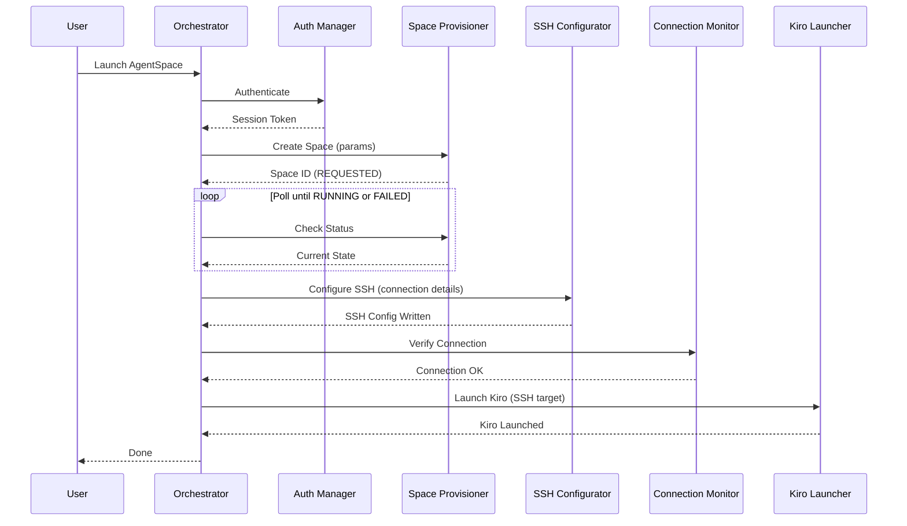

# Design Document: AgentSpaces Desktop Launcher

## Overview

The AgentSpaces Desktop Launcher is a desktop application that orchestrates the end-to-end workflow of creating an AgentSpace, configuring SSH connectivity, and launching Kiro Desktop IDE connected to the remote environment. It replaces a multi-step manual process (web console → create space → wait → configure SSH → open IDE) with a single-action flow.

The application is built as a native desktop app using Electron with a TypeScript backend. It communicates with the AgentSpaces API for space lifecycle management, manages local SSH configuration files, and launches Kiro Desktop as a subprocess. All user preferences and space profiles are persisted locally using a JSON-based configuration store.

### Key Design Decisions

1. **Electron + TypeScript**: Cross-platform desktop support (macOS, Linux, Windows) with a single codebase. Electron provides native OS integration for system tray, subprocess launching, and file system access.
2. **Polling-based provisioning**: The AgentSpaces API does not support WebSocket/push notifications, so the launcher polls for status updates at a configurable interval (default 5s).
3. **Local JSON config store**: Space profiles and user preferences are stored in a local JSON file rather than a database — simplicity over complexity for a single-user desktop app.
4. **Sequential pipeline architecture**: The launch workflow is modeled as a sequential pipeline (Auth → Create → Poll → SSH Config → SSH Verify → Launch Kiro) with error recovery hooks at each stage.

## Architecture

The application follows a layered architecture with clear separation between the UI layer, orchestration layer, and service layer.

```mermaid
graph TD
    UI[UI Layer - Electron Renderer]
    ORCH[Orchestrator - Launch Pipeline]
    AUTH[Auth Manager]
    PROV[Space Provisioner]
    SSHC[SSH Configurator]
    CONN[Connection Monitor]
    KIRO[Kiro Launcher]
    PROF[Profile Manager]
    CONF[Config Store]
    API[AgentSpaces API]
    FS[File System - SSH Config]
    PROC[OS Process - Kiro Desktop]

    UI --> ORCH
    ORCH --> AUTH
    ORCH --> PROV
    ORCH --> SSHC
    ORCH --> CONN
    ORCH --> KIRO
    UI --> PROF
    PROF --> CONF
    AUTH --> API
    PROV --> API
    SSHC --> FS
    CONN --> FS
    KIRO --> PROC
    CONF --> FS
end
```

### Pipeline Flow



## Components and Interfaces

### 1. Auth Manager

Handles Amazon SSO authentication and session token lifecycle.

```typescript
interface AuthManager {
  /** Check for existing valid session */
  checkSession(): Promise<AuthSession | null>;
  /** Initiate SSO login flow */
  authenticate(): Promise<AuthSession>;
  /** Refresh an expired session transparently */
  refreshSession(session: AuthSession): Promise<AuthSession>;
}

interface AuthSession {
  accessToken: string;
  expiresAt: number; // Unix timestamp
  region: string;
}
```

### 2. Space Provisioner

Manages AgentSpace creation and provisioning status polling.

```typescript
interface SpaceProvisioner {
  /** Create a new AgentSpace */
  createSpace(params: SpaceCreationParams): Promise<SpaceInfo>;
  /** Get current status of a space */
  getSpaceStatus(spaceId: string): Promise<SpaceInfo>;
  /** List all spaces for the authenticated user */
  listSpaces(): Promise<SpaceInfo[]>;
  /** Start a stopped space */
  startSpace(spaceId: string): Promise<void>;
  /** Stop a running space */
  stopSpace(spaceId: string): Promise<void>;
  /** Terminate a space */
  terminateSpace(spaceId: string): Promise<void>;
  /** Poll until space reaches target state or fails */
  pollUntilReady(spaceId: string, options: PollOptions): AsyncGenerator<SpaceInfo>;
}

interface SpaceCreationParams {
  instanceType: string;
  idleTimeout: number; // minutes
  repositories: RepositoryAttachment[];
  workspaceDir?: string;
}

interface SpaceInfo {
  spaceId: string;
  name: string;
  state: ProvisioningState;
  instanceType: string;
  createdAt: string;
  sshHost?: string;
  sshPort?: number;
  sshUser?: string;
  identityFile?: string;
}

type ProvisioningState = 'REQUESTED' | 'PROVISIONING' | 'RUNNING' | 'STOPPING' | 'STOPPED' | 'FAILED';

interface PollOptions {
  intervalMs: number;    // default 5000
  timeoutMs: number;     // default from user config
}
```

### 3. SSH Configurator

Manages SSH config file entries for AgentSpaces.

```typescript
interface SSHConfigurator {
  /** Add or update SSH config entry for a space */
  configureSpace(spaceId: string, details: SSHConnectionDetails): Promise<void>;
  /** Remove SSH config entry for a space */
  removeSpace(spaceId: string): Promise<void>;
  /** Parse existing SSH config file */
  parseConfig(): Promise<SSHConfigEntry[]>;
}

interface SSHConnectionDetails {
  host: string;
  port: number;
  user: string;
  identityFile: string;
}

interface SSHConfigEntry {
  hostAlias: string;
  hostname: string;
  port: number;
  user: string;
  identityFile: string;
  isAgentSpace: boolean; // marked with a comment tag
}
```

### 4. Connection Monitor

Verifies SSH connectivity with retry logic.

```typescript
interface ConnectionMonitor {
  /** Verify SSH connection to a space */
  verifyConnection(hostAlias: string, options: RetryOptions): Promise<ConnectionResult>;
}

interface RetryOptions {
  maxRetries: number;       // default from user config
  timeoutMs: number;        // per-attempt timeout
  backoffBaseMs: number;    // exponential backoff base (default 1000)
}

interface ConnectionResult {
  success: boolean;
  attempts: number;
  error?: string;
}
```

### 5. Kiro Launcher

Launches Kiro Desktop IDE as a subprocess.

```typescript
interface KiroLauncher {
  /** Check if Kiro Desktop is installed */
  isInstalled(): Promise<boolean>;
  /** Get the Kiro executable path */
  getExecutablePath(): string;
  /** Launch Kiro connected to a remote SSH target */
  launch(sshTarget: string, workspaceDir?: string): Promise<void>;
}
```

### 6. Profile Manager

Manages saved Space Profiles.

```typescript
interface ProfileManager {
  /** List all saved profiles */
  listProfiles(): SpaceProfile[];
  /** Get a profile by name */
  getProfile(name: string): SpaceProfile | null;
  /** Save a new or updated profile */
  saveProfile(profile: SpaceProfile): void;
  /** Delete a profile */
  deleteProfile(name: string): void;
  /** Get the default profile (single profile = default) */
  getDefaultProfile(): SpaceProfile | null;
}

interface SpaceProfile {
  name: string;
  instanceType: string;
  idleTimeout: number;
  repositories: RepositoryAttachment[];
  workspaceDir?: string;
}
```

### 7. Config Store

Persists user preferences.

```typescript
interface ConfigStore {
  get<T>(key: string): T | undefined;
  get<T>(key: string, defaultValue: T): T;
  set<T>(key: string, value: T): void;
  delete(key: string): void;
}

interface UserPreferences {
  defaultInstanceType: string;
  provisioningTimeoutMs: number;
  sshRetryCount: number;
  sshConnectionTimeoutMs: number;
  kiroExecutablePath: string;
  postLaunchBehavior: 'minimize' | 'close';
  pollIntervalMs: number;
}
```

### 8. Orchestrator

Coordinates the full launch pipeline with error recovery.

```typescript
interface Orchestrator {
  /** Execute the full launch pipeline */
  launch(params: SpaceCreationParams): AsyncGenerator<PipelineEvent>;
  /** Resume from SSH config step (skip provisioning) */
  reconnect(spaceId: string): AsyncGenerator<PipelineEvent>;
}

type PipelineStage = 'auth' | 'create' | 'provision' | 'ssh_config' | 'ssh_verify' | 'kiro_launch';

interface PipelineEvent {
  stage: PipelineStage;
  status: 'started' | 'progress' | 'completed' | 'failed';
  message: string;
  data?: any;
}
```

## Data Models

### Space Profile (persisted)

```json
{
  "profiles": [
    {
      "name": "default-dev",
      "instanceType": "m5.xlarge",
      "idleTimeout": 60,
      "repositories": [
        { "url": "https://github.com/org/repo", "branch": "main" }
      ],
      "workspaceDir": "/workspace"
    }
  ]
}
```

### User Preferences (persisted)

```json
{
  "defaultInstanceType": "m5.xlarge",
  "provisioningTimeoutMs": 600000,
  "sshRetryCount": 5,
  "sshConnectionTimeoutMs": 30000,
  "kiroExecutablePath": "/usr/local/bin/kiro",
  "postLaunchBehavior": "minimize",
  "pollIntervalMs": 5000
}
```

### SSH Config Entry Format

```
# BEGIN AgentSpace: my-space-id
Host agentspace-my-space-id
    HostName ec2-xx-xx-xx-xx.compute.amazonaws.com
    Port 22
    User ec2-user
    IdentityFile ~/.ssh/agentspace_key
    StrictHostKeyChecking no
# END AgentSpace: my-space-id
```

The `BEGIN`/`END` comment markers allow the SSH Configurator to identify and replace AgentSpace entries without disturbing other SSH config entries.

### Pipeline State

```typescript
interface PipelineState {
  currentStage: PipelineStage;
  spaceId?: string;
  spaceInfo?: SpaceInfo;
  sshConfigured: boolean;
  sshVerified: boolean;
  kiroLaunched: boolean;
  startedAt: number;
  errors: PipelineError[];
}

interface PipelineError {
  stage: PipelineStage;
  message: string;
  timestamp: number;
  retryable: boolean;
}
```

### Log Entry

```typescript
interface LogEntry {
  timestamp: string;
  level: 'info' | 'warn' | 'error';
  stage: PipelineStage | 'system';
  message: string;
  details?: Record<string, unknown>;
}
```
